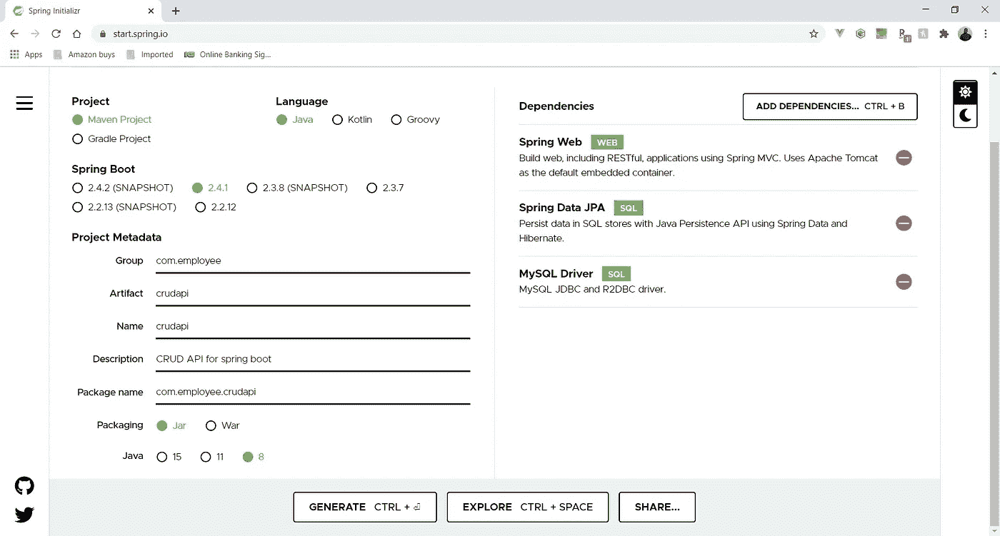
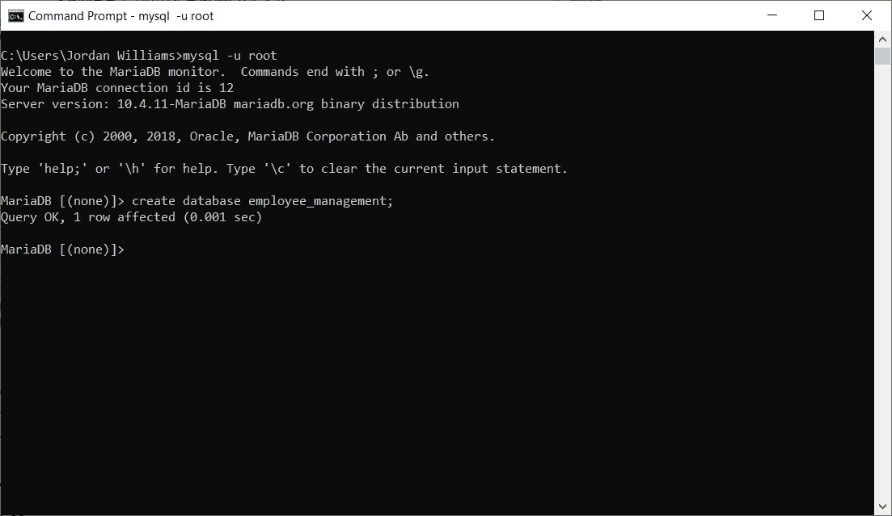
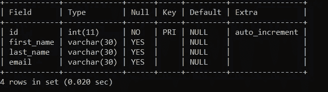
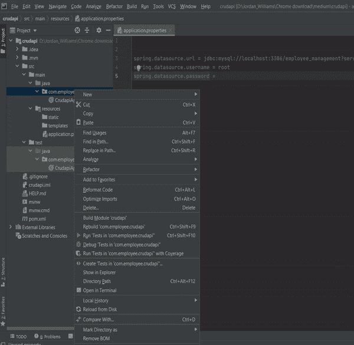
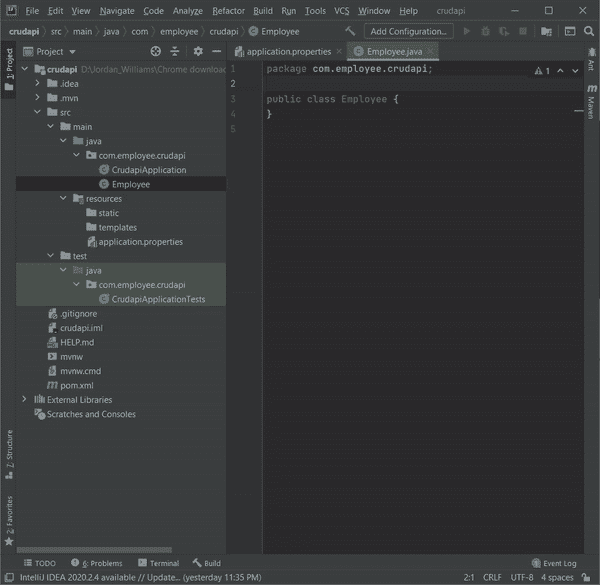
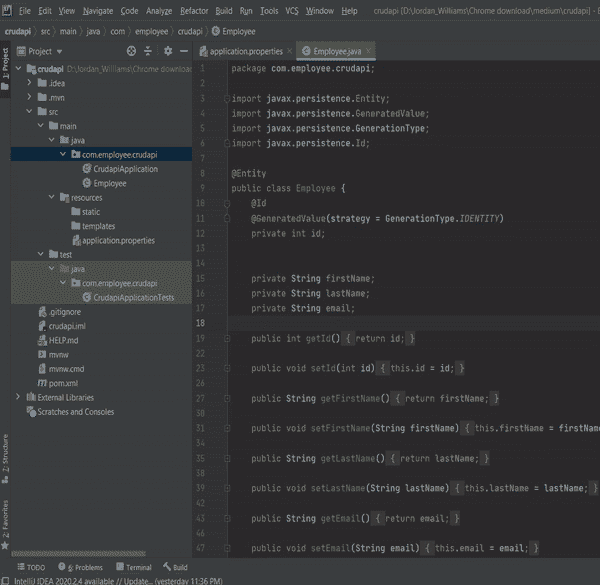
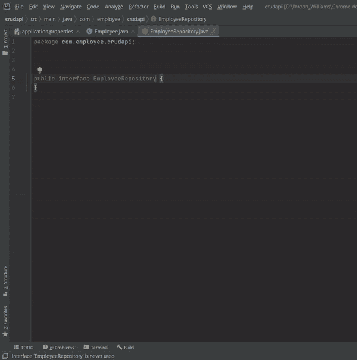
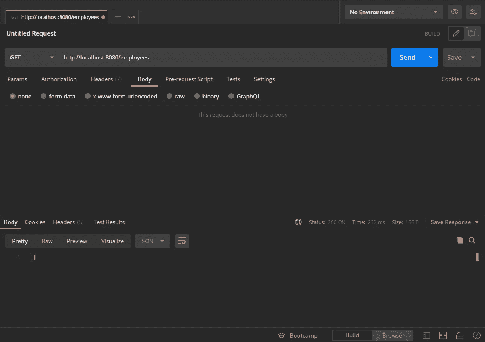

# 揭开 Spring Boot 的神秘面纱(下)

> 原文：<https://betterprogramming.pub/demystify-spring-boot-part-2-dc957069b584>

## 在 Spring 中构建一个连接到 MariaDB 数据库的 API


照片由 [Unsplash](https://unsplash.com?utm_source=medium&utm_medium=referral) 上的 [Jakub Kriz](https://unsplash.com/@jakubkriz?utm_source=medium&utm_medium=referral) 拍摄

Spring 是一个允许您创建企业级应用程序的框架。问题出现在启动一个初始应用程序需要许多配置的地方。这是 Spring Boot 出现的地方。

> “Spring Boot 允许你抽象(隐藏)这些配置。因此您可以获得一个预配置的模板应用程序。”— [来自本系列的第 1 部分](https://medium.com/better-programming/demystifying-spring-boot-245e71feffc0)

在本文中，您将看到如何在 Spring Boot 创建 Rest API。这个 API 将是一个 CRUD(创建、读取、更新、删除)应用程序，它连接到一个 SQL 数据库——在本例中是一个 MariaDB 数据库。

如果您是 Spring 的新手，或者您只是需要复习 Spring 及其概念，前一篇文章解释了基础知识。

[](https://medium.com/better-programming/demystifying-spring-boot-245e71feffc0) [## 揭秘 Spring Boot

### Spring Boot API 开发的基础

medium.com](https://medium.com/better-programming/demystifying-spring-boot-245e71feffc0) 

# 我们开始吧！

首先，我们将创建一个 Spring Boot 项目。我们将通过前往`[https://start.spring.io/](https://start.spring.io/)`来实现这一点。



配置。作者截图来自[https://start.spring.io/](https://start.spring.io/)。

以上是您的应用程序所需的配置。

请注意依赖性:

*   Spring Web:用于创建 Web 应用程序
*   Spring Data JPA:允许您使用对象与数据库进行交互
*   MySQL 驱动程序:为您的应用程序添加对 MySQL 数据库的支持

生成此项目。生成项目后，它会以 ZIP 文件的形式下载下来，您需要解压缩该文件。

我们现在将在 IntelliJ 中打开这个项目。IntelliJ 应该会自动安装您的依赖项。

# 连接到数据库

让我们首先将我们的应用程序连接到 Spring Boot。首先，我们必须创建我们的数据库。

让我们创建一个名为`employee_management`的数据库。

我将使用 XAMPP 附带的 MySQL 创建我的数据库。



作者截图

现在我们需要把这个数据库连接到 Spring Boot。我们只要进入我们的`application.properties`文件就可以做到这一点。在本项目中，它将位于`src` > `main` > `resources`。

`application.properties`文件是您向 Spring Boot 应用程序添加配置的地方。在这种情况下，我们将把数据库连接放在其中。

**注意:**许多配置可以包含在`application.properties`文件中。例如，您可以配置应用程序将要驻留的端口号。一个非详尽的列表可以在 [Spring 文档](https://docs.spring.io/spring-boot/docs/current/reference/html/appendix-application-properties.html)中找到。

连接数据库所需的配置来自`spring.datasource.*` 家族。

以上是需要放在`application.properties`文件中的配置信息。

1.  `spring.datasource.url`:包含数据库的 JDBC URL。格式为 `jdbc:mysql://<host>:<port>/<Database>?serverTimezone=<time zone>`。
2.  `spring.datasource.username` :数据库的用户名。
3.  `spring.datasource.password`:数据库的密码。

这样，我们现在有能力与数据库进行交互。

# 实体

有了 Spring Boot，我们能够用对象和类来操作我们的数据库。我们可以通过类和列的属性来表示我们的表。这种操作是通过使用 Spring 数据 JPA 来完成的。

我们将在这个应用程序中实现的第一个表是一个`employee` 表。

我们首先需要在之前创建的数据库中创建`employee` 表。

```
create table employee (id int primary key auto_increment, first_name varchar(30),last_name varchar(30),email varchar(30));
```

我们将使用上面的脚本来创建我们的`employee`表。

特别注意表的模式(名称和类型)。



作者截图

1.  `id`(主键):`int`
2.  `first_name` : `varchar`
3.  `last_name` : `varchar`
4.  `email` : `varchar`

当我们创建映射到该表的类时，将需要这些。

为了表示雇员表，我们将创建一个`Employee` 类。这些类被称为实体。



由作者生成的屏幕共享

默认情况下，该类不是一个实体。为了使它成为一个实体，需要将`@Entity`注释添加到类的声明中。



由作者生成的屏幕共享

我们现在需要在`Employee`类中表示`employee`表中的不同列。这可以通过在我们的`Employee`类中将每个列和类型表示为属性/特性来实现。

回忆一下我们的`employee`表的模式:

1.  `id`(主键):`int`
2.  `first_name` : `varchar`
3.  `last_name` : `varchar`
4.  `email` : `varchar`

这些列名将是我们的类属性的名称。我们将把列类型表示为它们的 Java 等价物。

`int`在 Java 中已经是一个类型。对于`varchar`，这将使用`String`来表示。

这是我们完成的`entity`类。注意，属性的名称与它们在`employee`表中对应的列名相匹配。

1.  `id` : `id`
2.  `first_name` : `firstName`
3.  `last_name` : `firstName`
4.  `email` : `email`

注意，camelCased 属性字段，比如`firstName`和`lastName`字段，分别与`first_name`和`last_name`列匹配。这是因为 SQL 是不区分大小写的，为了保持一般的 Java 惯例，Spring 本质上是在将字段连接到表时，将字段中的 camelCase 转换为下划线分隔的字段。

`@Id`表示什么属性代表主键。`@GeneratedValue`注释用于控制如何生成值。在这种情况下，我们希望 ID 属性不是输入的，而是自动生成的。为此，我们必须指定我们将使用什么策略来自动生成它。于是，`@GeneratedValue(strategy = GenerationType.*IDENTITY*)`。

# 仓库

在 Spring Boot，存储库是一种用于执行开箱即用的通用数据库操作的服务。这些存储库一旦配置到您的实体，就可以执行基本的 CRUD 操作。

存储库是由 Spring Data JPA 依赖项提供的。它为我们提供了一个名为`JpaRepository<T,ID>`的类。这个类为我们提供了这些通用的数据库操作。`T`是您想要对其执行操作的实体的类型。`ID`代表该实体的主键类型。在我们的例子中，我们的实体是类型`Employee`，我们的主键是类型`Integer`。

由于 Spring(甚至 Java)中的一些好的实践，我们将创建一个接口并从`JpaRepository<T,ID>`继承。这将允许我们对这个`JpaRepository<T,ID>`有多种不同的实现。如果有情况发生，我们可以随时更改我们的`JpaRepository<T,ID>`，这不会影响我们的申请。你现在还不需要理解这些。只要知道创建接口是最好的。

现在，让我们创建接口`EmployeeRepository`。



由作者生成的屏幕共享

正如我们之前所说的，我们将扩展`JpaRepository<T,ID>`。在这种情况下，它将是`JpaRepository<Employee,Integer>`。



由作者生成的屏幕共享

```
package com.employee.crudapi;

import org.springframework.data.jpa.repository.JpaRepository;

public interface EmployeeRepository **extends JpaRepository<Employee,Integer>** {
}
```

这实际上就是全部了！我们的存储库现在已经设置好了，我们现在可以执行 CRUD 操作了。

现在我们已经做好了开始创建 API 的一切准备。为此，我们将创建控制器来处理我们的请求。

让我们创建我们的`EmployeeController`类。

这个类将是一个 rest 控制器。rest 控制器由`@RestController`标注表示。

在我们的`EmployeeController`类中，我们将从添加我们之前创建的存储库开始。

```
package com.employee.crudapi;

import org.springframework.beans.factory.annotation.Autowired;
import org.springframework.web.bind.annotation.RestController;

@RestController
public class EmployeeController {

    **@Autowired
    EmployeeRepository employeeRepository;**

}
```

我们的代码现在应该看起来像上面的代码片段。这样，我们的存储库就完全实现了。

然而，如果您不习惯使用 Spring 语法，这可能看起来有点奇怪。注意，我们不必用类似于`EmployeeRepository employeeRepository = new EmployeeRepository(some argument);`的东西来实例化`EmployeeRepository`对象。这就是`@Autowired`注释的神奇之处。它会检查您的项目，找到与声明匹配的适当类型(类),并使用必要的参数(如果有)自动实例化该对象。这被称为*依赖注入*。

让我们创建第一个端点。这将是一个`/employees` GET 请求，获取我们的`employee`表中的所有雇员。

```
@GetMapping("/employees")
public List<Employee> findAll(){

    return employeeRepository.findAll();
}
```

注意，在我们的方法中，我们调用了`employeeRepository.`,正如我们之前所说的，我们有现成的 CRUD 操作。`.findAll()`返回所有的实体。在本例中，实体是雇员——这意味着它将返回所有雇员。

我们现在可以在 Postman 中测试这一点。



作者截图

显然，目前还没有数据，因为我们还没有添加任何员工记录。让我们添加一个端点，以便向数据库添加数据。

我们将创建一个`/employees`帖子请求。

```
@PostMapping("/employees")
public Employee addEmployee(@RequestBody Employee theEmployee) {

    employeeRepository.save(theEmployee);

    return theEmployee;
}
```

在我们的`/employees`端点中，我们调用`.save()`方法。这将给定的实体添加到我们的数据库中。该实体的类型为`Employee`。我们还应该注意到，如果数据库中的一个实体有相同的主键(`@ID`)，那么`.save()`方法将覆盖它。

现在让我们通过 Postman 添加我们的第一个员工。

**端点:** `/employees`

**请求:**发布

**正文:**

```
{"firstName": "Eren","lastName": "Yeager","email": "Erene@crudapi.com"}
```

让我们发出这个请求。注意，我们不必放置`id`,因为我们之前指定它将通过每次递增来自动生成。

```
{"id": 1,"firstName": "Eren","lastName": "Yeager","email": "Eren@crudapi.com"}
```

至于我们将如何设置端点，它将返回最近添加的雇员。这表明我们的请求是成功的。

让我们再这样做四次，直到我们的数据库中有五个雇员。

下面，我们有四个帖子请求。

```
{"firstName": "Mikasa","lastName": "Ackerman","email": "Mikasa@crudapi.com"}{"firstName": "Armin","lastName": "Arlert","email": "Armin@crudapi.com"}{"firstName": "Reiner","lastName": "Braun","email": "Reiner@crudapi.com"}{"firstName": "Erwin","lastName": "Smith","email": "Erwin@crudapi.com"}
```

添加完所有员工后，我们可以发出`/employees` GET 请求，查看应用程序中的所有员工。

**端点:** `/employees`

**请求:**得到

**回应:**

现在，我们所有的员工。

我们现在能够添加和查看我们所有的员工。然而，在实际的应用程序中，您可能希望搜索单个雇员。

让我们创建一个`/employees/{employeeId}` GET 方法来做这件事。里面是代表我们正在搜索的雇员的变量。

该方法希望我们的代码片段如下:

```
@GetMapping("/employees/{employeeId}")
public Employee getEmployee(@PathVariable(name ="employeeId" ) int employeeId  ) {

    Employee theEmployee = employeeRepository.findById(employeeId).get();
    return theEmployee;
}
```

注意，我们首先放置了一个`{employeeId}`，它是雇员 ID 的变量占位符。这个变量可以使用`@PathVariable`连接，它将您决定使用的变量的名称作为参数——在本例中，它是`employeeId`。

然而，类似于`.findAll()`，在这种情况下我们使用`.findById`，这里我们只需要提供指定的主键(`@ID`)。`.findById`返回一个名为`Optional<T>`的对象。要从中获取对象，请键入`.get()`方法。

现在让我们测试这个端点。

**端点:** `/employees/2`

**请求:**获取

**响应:**

```
{"id": 2,"firstName": "Mikasa","lastName": "Ackerman","email": "Mikasa@crudapi.com"}
```

如果我们愿意，现在可以在我们的系统中查找任何员工。

另一个有用的特性是能够删除任何员工。假设一名员工不再在那里工作。

让我们创建一个`/employees/{employeeId}` DELETE 方法来做这件事。

```
@DeleteMapping("/employees/{employeeId}")
public String deleteEmployee(@PathVariable(name ="employeeId" ) int employeeId) {

    employeeRepository.deleteById(employeeId);
    return "Delete employee id - "+ employeeId;
}
```

通过这种方法，我们使用`.findById`找到我们想要删除的员工，它只是用来显示我们想要删除的员工。为了实际删除一个雇员，我们使用了`.deleteById`方法，该方法只接受您想要删除的雇员的主键(`@ID`)。

我们将删除:

```
{"id": 2,"firstName": "Mikasa","lastName": "Ackerman","email": "Mikasa@crudapi.com"}
```

让我们尝试用下面的端点删除此记录。

**端点:** `/employees/2`

**请求:**删除

**回应:**

```
Delete employee id - 2
```

我们刚刚删除了一名`id`为`2`的员工。

现在，让我们检查一下该员工是否真的被删除了。

**终点:** `/employees`

**请求:**获取

**回应:**

该员工实际上已被删除！

我们更新后的代码如下所示:

# 结论

从上一篇文章中，你学习了 Spring Boot 的基本知识。现在，有了这些原则，您就可以创建一个连接到数据库的简单 CRUD 应用程序。

查看 [GitHub 库](https://github.com/jordan-medium/Employee-CRUD-API)。