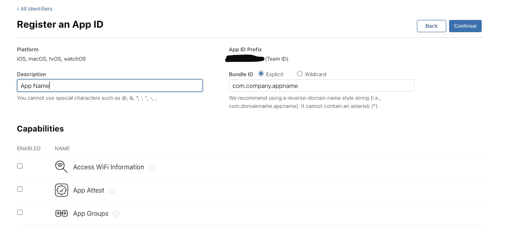
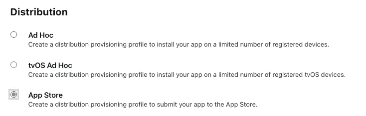
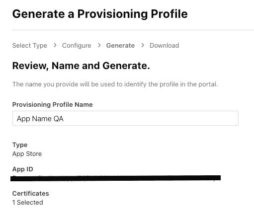
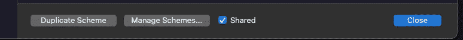
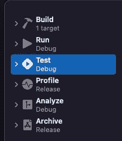

# 揭开 AppStore 应用创建和 iOS 应用方案的神秘面纱

> 原文：<https://betterprogramming.pub/demystifying-appstore-app-creation-and-ios-app-schemes-b9b5e5851a92>

## 在苹果的 AppStore 上创建一个新的应用程序并为你的 QA 方案配置 Xcode 配置的完整指南


亨利·阿斯克罗夫特在 [Unsplash](https://unsplash.com?utm_source=medium&utm_medium=referral) 上的照片

自从我开始作为一名跨平台移动应用程序开发人员工作以来，我一直害怕向 AppStore 发布 iOS 版本的应用程序。我不仅听到 iOS 开发者不断抱怨苹果复杂的发布流程，而且现在我需要亲自掌握它并处理应用程序开发周期的这一方面。

在 AppStore 中创建应用之前需要一些额外的步骤。让我们过一遍。

## 这个教程是针对谁的？

这是针对那些想在 AppStore 上发布应用的任何资历的移动开发者的。无论你写的是原生 iOS 应用还是跨平台应用，你都找对了地方。乍一看，这个流程似乎很可怕，但是如果我们仔细分析，就不难理解了。

## 我们想要完成什么？

我们想在 AppStore Connect 中创建一个应用程序。为此，我们需要来自苹果开发者平台的标识符、证书和预置描述文件。

教程的第二部分研究了在 Xcode 中应该做的配置，以便拥有同一个应用程序的两种风格:QA 和 Production。

我们开始吧！

# 证书、标识符和配置文件

前往 apple.developer.com[登录。在概述页面上，转到证书、标识符和配置文件。](https://developer.apple.com/)

这就是我们现在需要创造的:

*   **一个标识符:**唯一地标识你正在开发的应用程序
*   **证书**:证明你是这个应用的开发者
*   **配置文件:**将前两个放在一起，我们知道*正在开发什么*应用程序，以及*谁在开发它*

那么，我们如何创造所有这些呢？

# 创建标识符

我们感兴趣的第一个类别在标识符部分。标识符只是一个字符串，其目的是唯一地标识您的应用程序，当然，它应该对应于您的包标识符(例如，在 Xcode 中，在您的应用程序的目标通用标签中)。这里你将挑选一个类似于`com.organization.appName`的字符串。在完成新的标识符步骤后，您将得到一个形式为`ABCDEF1234.com.organization.appName`的字符串。不应该是这种情况，但是来自两个不同开发者的两个应用程序可能会意外地选择相同的包标识符。通过将团队 ID 作为前缀，Apple 确保这不会成为问题。

这里的步骤非常简单:


1.  点击添加图标，然后选择您要查找的内容。如果你正在阅读这篇教程，你可能会选择第一篇`App IDs`。
2.  然后，标识符的类型是一个`App`。
3.  在下一步中，您将插入对您的标识符的描述(它可以只是您的应用程序名称)、我刚才提到的包 ID(基于它您将创建标识符)以及您的应用程序的功能。这些功能也可以在以后编辑，但是在输入您的包 ID 时要小心。选中它们后，点击`Continue`。



4.检查您键入的内容并注册。

接下来，你需要一个类型分布的证书。

*简短声明:我们创建此类证书的最终目的是将 iOS 应用程序发布到 AppStore 和/或使用 Testflight 发行版。如果适合您的需要，您还可以创建一个开发证书。*

# 证书创建

证书的目的是向苹果公司证明你的开发者身份，以及应用程序的身份。我们如何创造一个？


1.  点击添加按钮后，选择**苹果分销**类型。如果有任何服务需要打勾，那就打勾。如果你不明白这一部分，那么你可能不需要勾选任何东西。
2.  在下一步中，您需要在 Mac 上创建证书签名请求。如果您已经有一个，您可以跳到步骤 7。
3.  启动钥匙串访问。
4.  在菜单中，选取“钥匙串访问”>“证书助理”>“向证书颁发机构申请证书”。
5.  输入您的电子邮件以及易于识别的证书名称(CA 电子邮件地址字段可以留空)。
6.  勾选`saved to disk`选项，创建您的证书。
7.  在开发人员门户上选择此文件并继续。
8.  下载 Apple 为您创建的证书并连按它，以便将其添加到您的钥匙串中(或者您可以将它拖放到那里)。

如果您计划为您的应用程序使用 CI/CD 工具，您也需要此证书。如果你不打算这么做，我的建议是你应该这么做。它节省了大量的时间，并且使你的生活，以及 QA 团队的生活变得更加容易。

但是，如果您确实在使用 CI/CD 工具，请注意您可能需要一个`.p12`文件。这种类型的文件将包含证书及其私钥。基本上，当您安装证书时，您会将它与私钥一起添加到您的钥匙串中。

*注意:* *只有在您准备使用 CI/CD 工具时，您才需要执行以下 3 个步骤。如果你不是，那么请随意跳到个人资料部分。*

为了基于这些生成一个`.p12`文件:

1.  前往 Mac 上的“钥匙串访问”
2.  选择您的证书和私钥。您可以转到`Keys`选项卡，识别私钥并使用箭头展开它。然后选择密钥及其证书，然后右键单击并选择`Export 2 items...`。


3.导出个人信息交换(`.p12`)文件并上传到您的 CI/CD 工具。

# 预配配置文件

在向 AppStore Connect 添加新应用程序之前，必须完成的最后一步是根据您刚刚创建的证书创建预置描述文件。预置描述文件包含关于请求权限的应用程序的信息(通过标识符)，以及关于开发者的信息(通过证书)。要创建预置描述文件:


1.  添加一个新的概要文件并勾选 **App Store 发行版**类型(前面的免责声明也适用于此:您可以创建一个具有开发目的的概要文件。然而，在我们目前的范围内，我们不需要。
2.  选择您刚刚创建的应用 ID(取决于标识符)。



3.选择您刚刚创建的证书。

4.添加预置描述文件名称，检查类型、应用 ID 和证书，然后单击`Generate`。



你都准备好了！现在我们可以创建我们的应用程序了。

# 在 AppStore 上创建应用

转到 [AppStore 连接](https://appstoreconnect.apple.com/)。选择我的应用程序部分。在这里，一切都很简单。

*   勾选 iOS 选项。
*   选择您的主要语言，然后选择您之前创建的包标识符。
*   SKU 可以只是您的应用程序的名称，但是它必须是唯一的！因此，如果您正在创建 QA 版本的应用程序，您可能希望您的 SKU 不同于生产应用程序版本(例如，AppName QA)。

恭喜你，你的应用已经设置好了，你现在可以使用 Testflight 并发布你的应用到 AppStore 了。

在 AppStore 门户网站上创建两个独立的应用程序是一个好主意:一个用于测试版(应用程序的测试版本)，另一个是正式的生产就绪应用程序。为此，您需要在 Xcode 中对您的项目进行一些额外的配置。

**注**:以下指南严格参照使用 React Native ≥0.60.0 的 React Native 应用。

# 配置 **iOS 构建配置**

1.  在 Xcode 中前往项目的“简介”标签。注意**配置**部分。在那里，您可以找到发布和调试配置。我们想复制这些(通过点击+按钮)，并将其重命名为 QA。发布和 QA.Debug


2.点击您当前方案的名称，然后选择`edit scheme`。



确保勾选了`Shared`选项(这样可以避免一些盲目的调试)，然后点击`Duplicate Scheme`。该方案的名称为“QA”。



然后，浏览菜单左侧的每个部分。

*   `Build, Run & Analyze` 应该使用您之前创建的`QA.Debug`配置。
*   `Profile & Archive` 将使用`QA.Release` 配置。

基本上，您是在指定应该用于 QA 方案的构建配置。

3.你可以同时在你的设备上安装两种风格的应用程序，所以你应该为它们使用不同的显示名称。为了使用不同的名称，请转到目标的`Build Settings` 部分。照看`Product Name`T34、然后将`QA.Debug`和`QA.Release`的`App Name`改为`AppName QA`。

4.转到您的 Podfile。在文件的顶层(在`target 'appname' do:`上方)插入以下内容:

```
project 'appname',
'QA.Debug' => :debug,
    'QA.Release' => :release, 
    'Prod.Debug' => :debug,
    'Prod.Release' => :releasetarget 'appname' do: 
...
```

5.为两种方案选择不同的包 id(`QA`和`AppName`)。为了做到这一点，请转到您的跑步者的构建设置选项卡。添加一个新的用户自定义设置，并将其命名为`BUNDLE_ID_SUFFIX`。

`QA.Debug`和`QA.Release`应该使用后缀`.beta`，所以在那里分别输入。

6.在 info.plist 文件中，将您的包标识符的名称设置为

```
*$(PRODUCT_BUNDLE_IDENTIFIER)$(BUNDLE_ID_SUFFIX)*
```

你都准备好了！现在，您可以再次按照 AppStore 的步骤为 QA 方案配置一个应用程序，如果这对您有用的话。

# 结论

这就是我今天想给你们展示的全部。任何任务，不管看起来有多困难，如果分成小步骤，都是可行的。

非常感谢我的队友(我们度过了愉快的一天来解决这些问题)，以及 Yee Wong 的[精彩文章](https://medium.com/@ywongcode/building-multiple-versions-of-a-react-native-app-4361252ddde5)，当谈到为 React 原生应用配置不同的环境时，这篇文章提供了更多的细节。

非常感谢您的阅读——我希望这对您有所帮助！