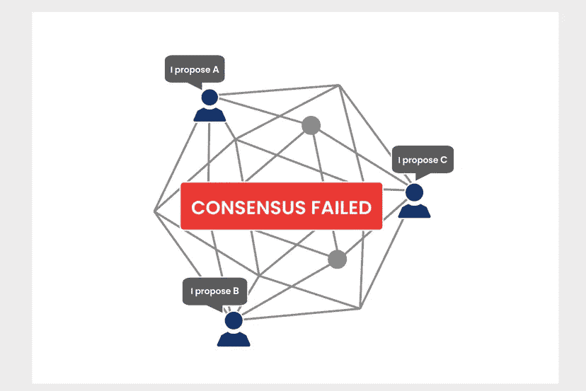
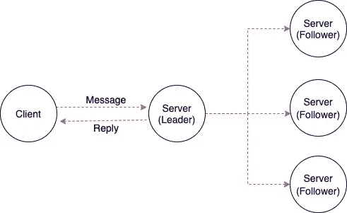
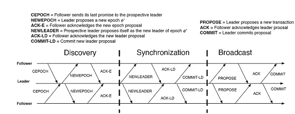
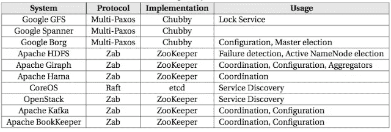
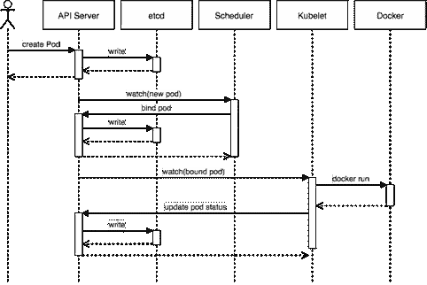
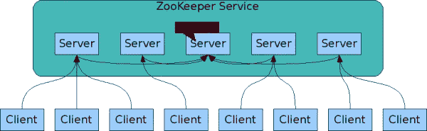

# 揭开共识算法及其实现的神秘面纱

> 原文：<https://betterprogramming.pub/demystifying-consensus-algorithms-and-their-implementations-c52f8aca3020>

## 深入探究共识算法和分布式计算的基础

图片来源:[印度分析杂志](https://analyticsindiamag.com/blockchain-consensus-algorithms/)(经允许使用)

*什么是共识算法？
什么是分布式数据库？
Kubernetes 和 ZooKeeper 是如何以容错方式存储数据的？*

这些是我们将在本文中尝试回答的一些问题。本文的 A 部分将尝试解释一些您在当前的分布式计算世界中会听到的常见术语。在第二部分，我们将探索共识算法的基本概念。C 部分将介绍两个著名的共识算法， [Raft](https://en.wikipedia.org/wiki/Raft_(algorithm)) 和 [Zab](https://zookeeper.apache.org/doc/r3.4.13/zookeeperInternals.html) ，在最后，我们将探索这些算法如何为 [ZooKeeper](https://zookeeper.apache.org/doc/r3.3.3/index.html) 和 [Kubernetes](https://kubernetes.io/) 的分布式特性提供动力。

这些概念可能看起来很新，但对它们的了解肯定会对你的工作或下一次面试有所帮助。大量的文本内容都是从马丁·克莱普曼写的名为[设计数据密集型应用](https://www.oreilly.com/library/view/designing-data-intensive-applications/9781491903063/)的优秀书籍中借来的。快乐学习！

# a 部分.与分布式数据库相关的术语

## **单个领导者，多个追随者(主从复制)**

在单领导者复制中，领导者(主节点)将数据复制到其所有追随者(读取副本、辅助节点)。这是最常用的复制模式。每当主节点收到新的写入时，它会将该写入保留在其本地存储中，并将相同的数据作为更改流或复制日志发送给其所有副本。然后，每个辅助节点按照在主节点上处理的顺序更新自己的本地数据副本。

## **裂脑问题**

在领导者-追随者的情况下，可能会发生两个节点都认为自己是领导者的情况。这种情况叫做*裂脑。*如果两位领导人都接受书面协议，这是很危险的，而且没有解决冲突的程序。数据可能会丢失或损坏。

但是为什么两个节点会认为自己是领导者呢？

让我们考虑一个有五个节点的情况。节点 A 是当前的领导者，其余的是追随者。现在假设我们的节点 A 关闭。其余的节点在它们之间做出决定，并将节点 B 提升为新的领导者。现在，节点 A 重新联机。该节点直到现在才知道发生了什么，并且仍然认为自己是领导者，这导致系统具有两个领导者节点。

## 线性化能力

线性化背后的基本思想是使系统看起来好像只有一个数据副本，并且其中的所有操作都是原子的。有了这种保证，即使可能有多个副本，实际上，应用程序也不需要担心它们。

线性化很重要，因为它解决了一些非常重要的用例，如锁和领导者选举、数据库唯一性保证(唯一性约束)和跨通道时序依赖。

您可能认为实现这一点的最简单方法是只使用数据的一个副本。然而，这种方法是不容错的。如果保存该副本的节点出现故障，数据将会丢失，或者至少在该节点重新启动之前无法访问。现在问题来了，如何在复制的数据库中实现线性化。

1.  我们稍后讨论的一致性算法可以安全地实现可线性化存储。
2.  单个领导者复制:这里领导者拥有用于写入的数据的主副本，而从者在其他节点上维护数据的备份副本。如果你从领导者，或者从同步更新的跟随者读取，那么他们有可能线性化。

## **总令广播**

单主节点复制通过选择一个节点作为主节点，并对主节点上单个 CPU 核心上的所有操作进行排序，来确定操作的总顺序。接下来的挑战是，如果吞吐量大于单个领导者可以处理的吞吐量，如何扩展系统，以及如果领导者出现故障，如何处理故障转移。在分布式系统中，这个问题被称为*总顺序广播*或*原子广播*。

全序广播通常被描述为节点间交换消息的协议。非正式地说，它要求始终满足两个安全属性:

1.  **可靠的交货。没有消息丢失。如果消息被传递到一个节点，它将被传递到所有节点。**
2.  **完全订购发货。**消息以相同的顺序传递到每个节点。

看待全订单广播的另一种方式是，它是一种创建日志(如在复制日志中)的方式，其中传递消息就像附加到日志。因为所有节点必须以相同的顺序传递相同的消息，所以所有节点都可以读取日志并看到相同的消息序列。

## 线性化与总订单广播

总订单广播是异步的。可以保证消息以固定的顺序可靠地传递，但是不能保证消息将在何时传递(因此一个接收者可能会落后于其他接收者)。相比之下，线性化是最近的保证。读操作保证看到最新写入的值。

## **纪元编号**

几乎所有的共识算法都在内部利用了领导者。这些协议利用纪元编号，并保证在每个纪元内，领导者是唯一的。

1.每当当前的领导者被认为是死了，节点之间开始投票选举新的领导者。

2.这个选举被赋予一个递增的纪元编号，因此纪元编号是完全有序且单调递增的。

3.如果两个不同时代的两个不同的领导者之间有冲突(也许是因为前一个领导者实际上并没有死)，那么具有更高纪元编号的领导者占上风。

4.在领导者被允许决定任何事情之前，它必须从法定人数的节点收集选票。只有当节点不知道任何其他具有更高纪元的领导者时，它才投票赞成提议。这防止了裂脑问题。

# **b 部分.容错共识**

图片来源:[Flickr 上的可持续经济法律中心](https://www.flickr.com/photos/theselc)

一致意味着多个服务器对相同的信息达成一致。通常，我们可以通过三个步骤来定义共识算法:

1.  **选举。**流程选出一个领导者来做决策。领导者建议下一个有效的输出值。
2.  **投票。**无故障流程听取领导者提议的值，验证该值，并将其提议为下一个有效值。
3.  **决定。**无故障流程必须对单个正确的输出值达成共识。

一致性算法必须满足以下属性:

1.  **统一协议。**没有两个节点决定不同。
2.  **诚信。**没有节点决定两次。
3.  **有效期。**如果某个节点决定值 *v* ，那么 *v* 是某个节点提出的。
4.  **终止。**每一个不崩溃的节点最终都决定了某个值。

共识算法是分布式系统的一个巨大突破。它们给系统带来了具体的安全属性(一致性、完整性和有效性),并且仍然保持容错。它们提供全序广播，因此它们也能以容错方式实现可线性化的原子操作。

## **假设**

1.  算法可以容忍的失败次数是有限的。任何一致性算法都要求至少大多数节点正确运行，以确保终止。
2.  大多数共识算法都假设不存在拜占庭错误。

## 限制

共识算法有一些相关的限制，这限制了它们在某些情况下的可用性。

1.  在决定提案之前，节点对提案进行投票的过程是一种同步复制，会导致性能问题。
2.  共识系统总是需要绝对多数才能运行。这意味着，在四个节点的仲裁中，您至少需要三个节点来运行。
3.  共识系统通常依靠超时来检测故障节点。在具有高度可变的网络延迟的环境中，经常会发生节点错误地认为领导者由于瞬时网络问题而失败的情况。在这种情况下频繁的领导者选举会导致糟糕的性能，因为系统最终会花更多的时间来选择领导者，而不是做任何有用的工作。

# **c 部分共识算法和实现**

最后，我们都在等待的部分:理解我们到目前为止读到的一切是如何形成各种共识算法的主干的。然后我们看看各种常用的协调服务的工作方式:ZooKeeper 和 [etcd](https://etcd.io/) 。

## **Raft 共识算法(2014)**

Raft 是一种单领袖算法。Raft 算法中的节点可以处于以下三种状态之一:

1.属下

2.候选人

3.领导者

Raft 一致性算法

领导者以心跳超时指定的规则间隔向所有追随者发送心跳。所有消息都通过这个心跳进行通信。Raft 算法遵循以下步骤。

1.  所有节点都从跟随状态开始。
2.  如果追随者听不到领导者的声音，那么他们可以成为候选人。*选举超时*是追随者等待成为候选人的时间。它被随机化为在 150 毫秒和 300 毫秒之间。
3.  然后，候选人开始新的选举任期。它为自己投票，并向其他节点发送*请求投票*消息。节点用它们的投票来回复。
4.  如果候选人获得大多数节点的投票，他就成为领导者。这个过程叫做*领袖选举* **。**所有变更都要经过领导，如上图所示。
5.  在领导人选举期间，请求投票还包含关于候选人日志的信息，以确定哪一个是最新的。如果请求投票的候选人的更新数据比请求投票的追随者的更新数据少，那么追随者就不会投票给所述候选人。
6.  每一个变化都作为一个条目添加到领导者的日志中。日志条目最初是未提交的。
7.  为了提交，领导者首先将该值复制到追随者节点。
8.  领导者等待，直到大多数节点已经写入条目。收到响应后，条目现在被提交。
9.  领导者然后更新追随者，值已经被提交。追随者节点然后分别提交该值。
10.  集群现在已经就系统状态达成共识。这个过程称为*日志复制*。
11.  裂脑问题得到了解决，因为在集群中，任何时候都只有一个节点可以获得多数。如果两个节点的票数相等，那么再次进行投票。

您一定已经意识到，这个算法使用了我们之前探索过的两阶段提交的概念。首先，由领导者发起一轮投票。在半数以上的投票被接受后，提交被启动。

它被用于各种系统，如 etcd 和[领事](https://www.consul.io/)(哈希公司)。MongoDB 的复制也受到 Raft 算法的广泛影响

## **ZAB 共识算法(2007)**

ZAB (ZooKeeper 原子广播)是在 ZooKeeper 中使用的一致协议。ZAB 是动物园管理员的专用协议，因此它的使用仅限于动物园管理员。ZAB 和动物园管理员一起出生于 2007 年。

ZAB 算法(来源:[阿里巴巴云](https://www.alibabacloud.com/)

1.  它基于领导者-追随者原则。
2.  纪元编号被称为 *zxid* 。
3.  它通过使用两阶段提交来启用日志复制，类似于 Raft 算法。
4.  如果领导者在提交阶段失败，并且该写操作已经在至少一个跟随者上提交，则该跟随者肯定会被选为领导者，因为其 zxid 是最大的。在被选为领导者后，该追随者让所有追随者提交该消息。
5.  与 Raft 不同，ZAB 日志只需要仅附加功能。
6.  它实现总订单广播。

# **共识算法—实现**

图片来源:“[在野共识](http://muratbuffalo.blogspot.com/2015/10/consensus-in-wild.html)”

从上面的图表中我们可以看到，我们迄今为止探索的共识算法已经有了广泛的实现，如 ZooKeeper、etcd 和 [Chubby](https://static.googleusercontent.com/media/research.google.com/en//archive/chubby-osdi06.pdf) 。它们被间接用于解决分布式系统中的各种问题，例如服务发现、协调、锁、故障检测和主选举。

## **etcd(筏)**

官网将其定义为

> "一种高度一致的分布式键值存储，它提供了一种可靠的方法来存储需要由分布式系统或计算机群集访问的数据。它优雅地处理网络分区期间的领导者选举，并且可以容忍机器故障，甚至在领导者节点中。etcd 机器之间的通信是通过 Raft 一致性算法处理的。

现在让我们来看看一些使用它的流行工具/软件。

**Kubernetes**

etcd 用作服务发现的后端，存储所有集群状态和配置，本质上是作为其数据库。

它使用 etcd 的*手表*功能来监控这两样东西的变化。如果它们出现分歧，Kubernetes 会进行修改，以协调实际状态和期望状态。

你从`kubectl get xyz`命令中读到的任何东西都存储在 etcd 中。

您通过`kubectl create`所做的任何更改都将导致 etcd 中的条目被更新。

任何节点崩溃或进程死亡都会导致 etcd 中的值发生变化。

Kubernetes pod 创建生命周期:"[核心 Kubernetes](https://blog.heptio.com/core-kubernetes-jazz-improv-over-orchestration-a7903ea92ca) "

动物园管理员

官网将其定义为

> "一种集中服务，用于维护配置信息、命名、提供分布式同步和提供组服务."

ZooKeeper 本身就是一个技术奇迹，所以我们不会对它进行深入的研究。

1.  ZooKeeper 维护集群中所有节点共享的集群配置信息。
2.  它可以通过使用锁、队列等来解决集群中的分布式同步问题。
3.  ZooKeeper 也在群体服务中帮助选择群体中的主要成员(领导者选举过程)。
4.  提供变更通知功能。客户端可以发现另一个客户端何时加入集群(基于它写入 ZooKeeper 的值)或者另一个客户端是否失败。
5.  它以两种模式工作:复制模式(领导者-追随者)和独立模式(单一 ZooKeeper 服务器)。

动物园管理员架构:[动物园管理员阿帕奇](https://zookeeper.apache.org/doc/r3.5.1-alpha/zookeeperOver.html)

作为应用程序开发人员，您很少需要直接使用 ZooKeeper，因为它实际上不太适合作为通用数据库。更有可能的是，你最终会通过其他项目间接地依赖它。比如 HBase，Hadoop YARN，OpenStack Nova，Akka，Kafka 都是依靠 ZooKeeper 在后台运行。

在 https://dzone.com/articles/an-introduction-to-zookeeper-1[探索更多](https://dzone.com/articles/an-introduction-to-zookeeper-1)

**卡夫卡**

> “Apache Kafka 是一个开源的分布式事件流平台，被数千家公司用于高性能数据管道、流分析、数据集成和任务关键型应用。”— [阿帕奇卡夫卡网站](https://kafka.apache.org/#:~:text=Apache%20Kafka%20is%20an%20open,%2C%20and%20mission-critical%20applications)

为什么《动物园管理员》对阿帕奇卡夫卡来说是必须的？

1.  控制器选举:控制器是 Kafka 生态系统中最重要的经纪实体之一，它也有责任维护所有分区之间的领导-追随者关系。
2.  主题的配置:它包括关于所有主题的配置，包括现有主题的列表，如每个主题的分区数量、所有副本的位置等。
3.  访问控制列表:所有主题的访问控制列表也在 ZooKeeper 中维护。
4.  集群的成员:ZooKeeper 还维护着一个所有代理的列表，这些代理在任何给定的时刻都在运行，并且是集群的一部分。

然而，Kafka 很快计划消除对 ZooKeeper 的依赖，以简化其架构。在 https://www.confluent.io/blog/category/apache-kafka[的博客上可以找到一些关于卡夫卡作品的精彩文章](https://www.confluent.io/blog/category/apache-kafka)

伙计们，这都是我的观点。我希望这篇文章对你有意义。请随时提供您的反馈。点击 https://www.aboutall.tech/查看更多此类文章

# **参考文献**

1.  设计数据密集型应用程序(Martin Kleppmann)
2.  [https://dzone . com/articles/a-brief-analysis-of-consensus-protocol-from-logica](https://dzone.com/articles/a-brief-analysis-of-consensus-protocol-from-logica)
3.  [https://link.medium.com/2uXLjLHlhab](https://link.medium.com/2uXLjLHlhab)
4.  [http://thesecretlivesofdata.com/raft/](http://thesecretlivesofdata.com/raft/)