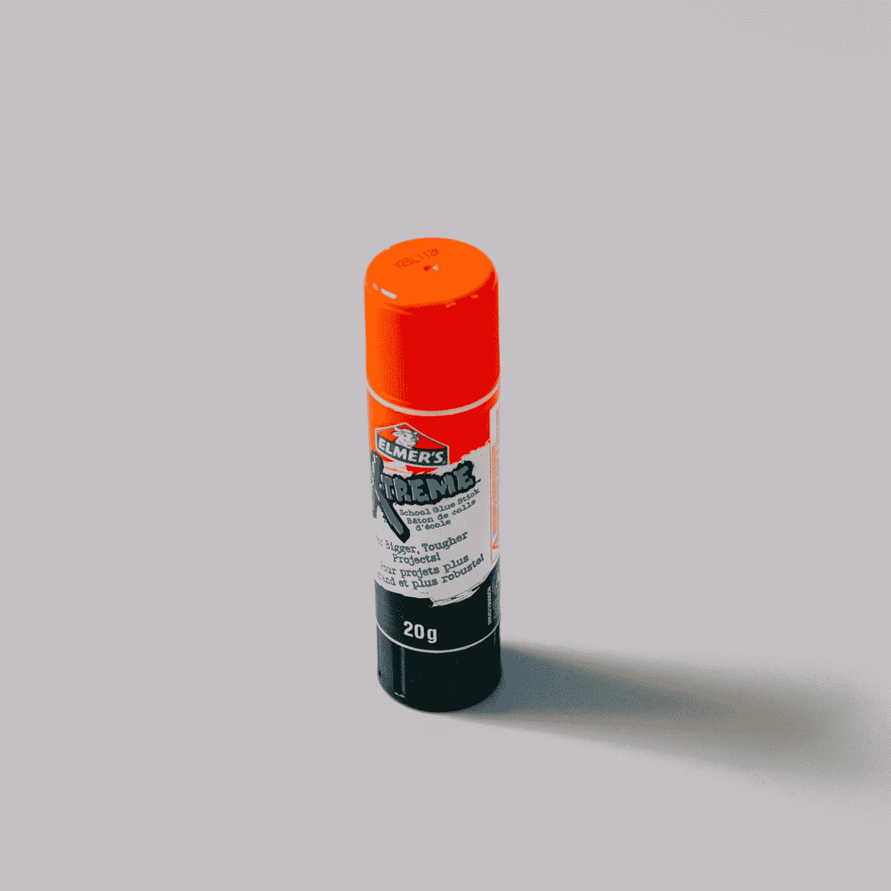

# 揭秘颤振绑定

> 原文：<https://betterprogramming.pub/demystifying-flutter-bindings-6a4ac9b64761>

## 代码和框架之间的粘合剂

由 [charlesdeluvio](https://unsplash.com/@charlesdeluvio?utm_source=medium&utm_medium=referral) 在 [Unsplash](https://unsplash.com?utm_source=medium&utm_medium=referral) 上拍摄的照片

如果要我猜的话，你已经在字里行间写了一些东西:

安排帧后回调

如你所知，以上通常是一个解决办法，可以在`context`还没有初始化的地方得到它——`initState`我正看着你呢！

你可能会想:

*   什么是`SchedulerBinding?`
*   什么是帧后回调？
*   这是怎么回事？

要回答这个问题，让我们从基础开始。

# 粘合剂

绑定是单例服务，有助于连接到 Flutter 引擎。它们被定义为`BaseBinding`类上的 mixins。

每个绑定 mixin 初始化其相关的单例服务，并可选地注册服务扩展。

应用程序的最顶层将提供一个继承了`BaseBinding`类的类。反过来还要看其他各种`BaseBinding`混音比如`SchedulerBinding``ServicesBinding`。

例如，小部件库引入了一个名为`WidgetsFlutterBinding`的具体`BindingBase`实现。这个类充当了将框架绑定到 Flutter 引擎的粘合剂。

WidgetsFlutterBinding 类签名

## 服务扩展

服务扩展是一组支持更高级调试功能的工具。它们通常从发布版本中剥离出来，这样它们就不会扩大二进制文件的大小。

下面两个代码片段展示了 Flutter 从发布版本中省略服务扩展的方式。

从发布版本中省略代码

一个基本的例子是注册`debugAllowBanner`服务扩展的`WidgetsBinding`。在对设备进行屏幕截图时，该扩展会暂时禁用调试标志。

您可以通过运行`flutter run`命令并按‘S’键来截图(保存在项目的根文件夹中)来尝试。您会注意到右上角的调试横幅在屏幕截图中看不到。

尽管绑定可以通过单例实例在全球范围内使用，但是它们中的大多数只在 Flutter 框架内部使用。

我们将重点关注在应用程序开发中直接使用的绑定——但是也可以随意探索其他绑定。

# WidgetsBinding

`WidgetsBinding`使您能够监听应用程序中发生的各种事件，例如`didChangePlatformBrightness`和`didChangeAppLifecycleState`。

为此，请考虑:

*   创建一个使用`WidgetsBindingObserver`的类
*   将新创建的类作为观察者添加到`WidgetsBinding`实例中
*   根据您感兴趣的事件，重载由`WidgetsBindingObserver`类提供的一个或多个方法

例如，如果您要实现一个当应用程序在后台时停止播放的视频播放器小部件，代码将如下所示:

视频播放器小部件监听应用程序生命周期

# 调度程序绑定

*一帧中发生了很多事情。*

而`SchedulerBinding`通过使用回调来完成大部分工作。尽管大多数回调是在内部设置的，但是您也可以插入这个机制来运行您自己的回调。

此绑定处理以下类型回调的调度:

*   短暂的
*   坚持的
*   后框架

## 短暂回调

瞬态回调在一帧开始时执行——更具体地说，是用系统的`PlatformDispatcher.onBeginFrame`回调。它们用于将应用程序行为与系统显示同步。

例如，瞬态回调用于在每个动画帧调度一次`Ticker`滴答。

您可以使用`scheduleFrameCallback`方法来调度您自己的瞬态回调。

## 持续回调

持久回调在短暂回调之后立即执行，与系统的`PlatformDispatcher.onDrawFrame`一起执行。它们用于驱动渲染管道。

与瞬时回调(调度时只触发一次)不同，持久回调是无限期注册的，并将在应用程序的生命周期内为每一帧触发。

您可以使用`addPersistentFrameCallback`方法注册持久帧回调。一旦注册，就不能注销。

## 帧后回调

最后，帧后回调在帧结束时执行，就在持久回调之后。

通常，它们用于清理工作和预计下一帧的工作调度。

如果当前帧中没有足够的时间来执行后帧回调，那么它们将在下一帧中执行。

不能取消注册框架后回调。它们用`addPostFrameCallback`方法注册，并且只被调用一次。

现在，文章介绍中的场景应该更加清晰了。当您执行后帧回调时，您有一个`context`,因为您在帧的末尾——当小部件已经插入到树中时。

# 服务绑定

`ServiceBinding`促进了本地平台和框架之间的双向通信。

它通过处理在`system`、`lifecycle`、`keyEvent`和`platform`频道上发送的消息来做到这一点。在另一个方向，它使用一个`BinaryMessenger`从应用程序向平台发送消息。

绑定提供了对`HardwareKeyboard`的全局单例实例的访问，该实例可用于查询键盘状态，并对用户与逻辑或物理键盘的交互做出反应。

服务绑定注册了一个名为`evict`的服务扩展。这在热重新加载时使用，以便从缓存中清除磁盘上已更改的任何图像。

# 结论

我们已经探索了一些在 Flutter 中提供的常用绑定。

即使您可能不会每天都遇到它们，但了解平台的内部工作方式总是有益的，以防您有低层次的需求或缺陷。

虽然在 Flutter 中还有很多可用的绑定，但是它们对开发人员来说几乎没有任何用处，所以我们没有在本文中介绍它们。

如果您希望自己深入研究其他绑定，绑定实现的完整列表如下:

*   `WidgetsBinding`
*   `SchedulerBinding`
*   `ServicesBinding`
*   `GesturesBinding`
*   `RendererBinding`
*   `SemanticsBinding`
*   `PaintingBinding`