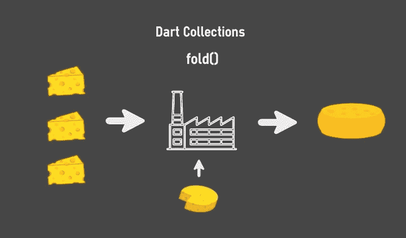

# 揭开省道中褶皱()的神秘面纱

> 原文：<https://betterprogramming.pub/demystifying-fold-in-dart-faacb3bd4efd>

## 对 fold()的概念性理解以及 fold()和 reduce()之间的主要区别



# **前言**

在我上一篇关于`map(),` `where()`和`reduce()`方法的文章中，我们探讨了 Dart 中三种最常用的收集方法。如果你错过了那篇文章，并且想知道更多关于那些方法，你可以在这里[阅读。](https://medium.com/@darsshanNair/map-filter-where-and-reduce-in-dart-key-concepts-and-practical-usages-e5441dbc5b7)

当我发表那篇文章时，开发社区中的许多人希望我把`fold()`包括进去。看到`fold()`如此广泛的应用和如此独特，我想写一篇专门关于它的文章。这一条的目的如下:

*   对`fold()`的概念性理解。
*   带代码示例的`fold()`和`reduce()`的显著区别。

# **概念理解**

与`reduce()`、`map()`或`where()`一样，`fold()`方法是 forEach()循环的扩展，能够接受条件并返回单个值或新集合，而不修改原始集合(是的，*不变性*)。由于我在上一篇文章中已经简要讨论了不变性的重要性，我将在这里省略对它的引用[。](https://medium.com/@darsshanNair/map-filter-where-and-reduce-in-dart-key-concepts-and-practical-usages-e5441dbc5b7#d690:~:text=Dart%20emphasises%20developers,in%20fact%20necessary.)

`fold()`方法的操作几乎与`[reduce()](https://medium.com/@darsshanNair/map-filter-where-and-reduce-in-dart-key-concepts-and-practical-usages-e5441dbc5b7#d690:~:text=it%20null%2Dsafe.-,reduce(),-The%20reduce()%20method)`完全一样，它是一个累加器功能。它根据提供给它的条件将当前值与前面的值进行比较，并返回一个值作为结果。作为操作的一部分，`fold()`方法需要输入一个初始值。这是它的方法签名的一部分，它是这样实现的:

```
T fold<T>(T initialValue, T combine(T previousValue, E element)) {var value = initialValue;
for (E element in this) value = combine(value, element);
return value;}
```

# **显著差异**

由于`fold()`和`reduce()`彼此相似，所以了解它们之间的差异对我们来说很重要。这使得我们可以做出明智的决定，决定何时使用前者或后者来解决我们的编程问题。

## **1。接受初始值**

`fold()`和`reduce()`的主要区别之一是`fold()`允许我们不仅给它提供一个条件，还提供一个初始值。

```
List<int> ages = [22, 28, 27, 19, 18];
```

`reduce()`方法假设索引 0 处的值为初始值:

```
int totalAge = ages.reduce((totalLength, element) => totalLength + element);
```

当我们打印出`totalAge`时，我们会得到一个值 114。

`fold()`方法将把提供给它的值作为初始值。这允许指示操作应该从哪个值开始，并影响整体结果:

```
int totalAge = ages.fold(10, (totalLength, element) => totalLength + element);print(totalAge); // 124
```

## **2。能够对空集合进行操作**

`reduce()`方法不能在空集合上操作。让我们看一个例子来进一步理解它。

```
List<String> ages = [];String totalAge = ages.reduce((value, element) => value + element);
```

当它试图遍历`names`集合时，会遇到一个错误:`Bad state: No element`

现在让我们看看使用 fold()时会发生什么。

```
List<String> ages = [];String totalAge = ages.fold(10, (value, element) => value + element);print(totalAge); // 10
```

`fold()`方法可以很好地处理这个问题。这主要是因为它有一个初始值作为后备。初始值成为最小支持度。

## **3。能够从集合中返回不同的值类型**

类似于`reduce()`方法，`fold()`也返回单个值，但是与 reduce()不同，reduce()需要将与集合相同类型的值返回回调，`fold()`可以返回完全不同类型的值，而不管集合的类型。

因此，如果您正在处理类型为`string`的集合，那么 reduce()将只返回一个字符串作为最终结果。

而`fold()`可以在需要时返回一个整数，即使它正在对`string`的列表进行操作。

现在，这可能有点令人困惑，所以请允许我给出一个相对较长的例子来解释这一点。

所以让我们来看一个问题，并弄清楚我们如何用`fold()`方法的独特特征来解决它。

背景:

命理计算器应用程序有四个输入字段。


这些字段的值被添加到字符串类型的`List`中。

```
List<String> names = ["John", "Doe", "Jane", "Doe"];
```

计算兼容性的算法主要依赖于`names`中名称的总长度。我们不能使用`reduce()`来计算`List`中所有字符串的总长度。

```
names.reduce((totalLength, element) => totalLength + element.length);
```

这样会产生一个错误说:`The argument type ‘int’ can’t be assigned to the parameter type ‘String’` *。*

这是因为，`reduce()`要求返回值在整个操作中是相同的类型。

在这些情况下，我们可以使用`fold()`来解决这个问题:

```
int totalNamesLength = names.fold(0, (totalLength, element) => totalLength + element.length);print(totalNamesLength); // 14
```

# **结论**

现在我们已经到了本文的结尾，以下是从中得到的启示:

*   `fold()`是一种累加器方法，类似于`reduce()`
*   `fold()`允许我们给操作一个初始值，而不是假设集合中的第一个值为初始值
*   `fold()`可以对空集合进行操作并优雅地处理它
*   `fold()`可以返回一个与它所操作的集合中的值类型不同的值。