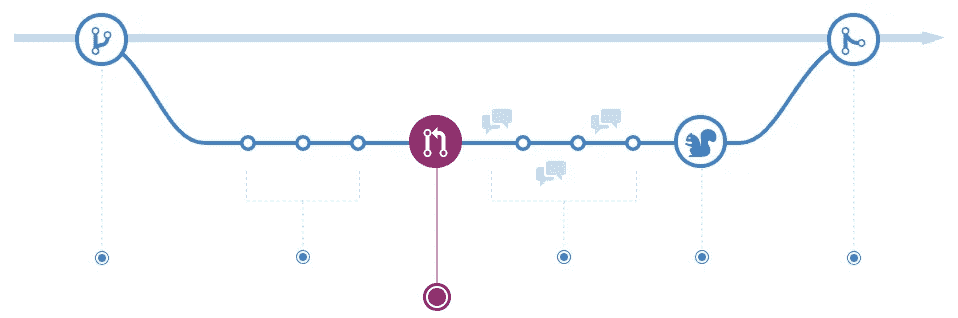
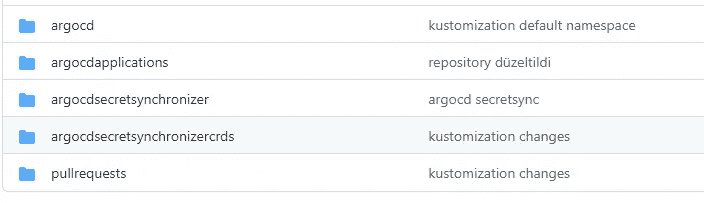
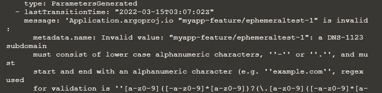
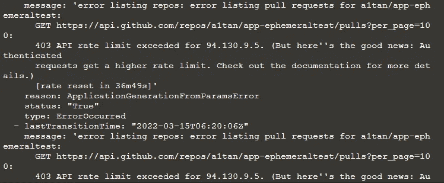

# 揭开数字版权管理的神秘面纱—短暂的请求请求环境

> 原文：<https://betterprogramming.pub/demystifying-gitops-ephemeral-pull-request-environments-5f1032f01299>

## 将短暂环境用于验收测试、渗透测试、端到端测试或负载测试


[罗曼·辛克维奇·🇺🇦](https://unsplash.com/@synkevych?utm_source=medium&utm_medium=referral)在 [Unsplash](https://unsplash.com?utm_source=medium&utm_medium=referral) 上的照片

在本文中，我想演示如何为在 GitHub 上创建的请求设置临时环境。这可以应用于 Argo CD 拉请求生成器支持的任何 SCM。没有一种方法和一套工具来实现这种特性。

我将使用两种不同的 Kubernetes 风格作为拉请求环境，第一种是 Kubernetes 名称空间，第二种是虚拟 Kubernetes 集群，它可以提供更好的隔离。



# **所用工具**

1.  Argo CD 拉取请求生成器:Argo CD 拉取请求生成器是其中一个应用程序生成器，用于监视 SCM 的新拉取请求，然后根据这些拉取请求生成必要的应用程序定义。
2.  Github 动作:Github 动作用于此功能的 CI 部分。每当生成新的拉取请求时，都会触发一个 Github 操作，为拉取请求的要素分支生成并推送容器映像。
3.  vccluster:vccluster 用于此功能的虚拟 Kubernetes 群集部分。这是 Loft Labs 在 K3S、K0S 或普通 K8S 的基础上开发的一款很棒的工具。对于这个演示，我尝试了 K3S 和 K0S。由于我在 K3S 安装过程中遇到的问题，最终版本依赖于 K0S。
4.  ArgoCD Secret Synchronizer:一个我为实验目的开发的自定义操作符，用于将 Vcluster 创建的机密与 Argo CD Cluster 的机密进行同步。通过使用该运营商，消除了手动干预要求，并且所创建的虚拟集群被自动添加到 Argo CD 管理集群的列表中。

除了上面这些之外，您还需要有一个具有管理权限的 Kubernetes 集群(可以使用 Killercoda，有关示例场景，请参见构件部分)，用于应用程序代码的 Github 存储库、helm charts、Argo CD CRDs 和 Argo CD 应用程序资源定义。

# **Github 存储库**

1.  `[**ephemeralenvironments**](https://github.com/a1tan/ephemeralenvironments)`:这个 git 存储库包含 Argo CD CRDs、拉请求`applicationset`定义和 Argo CD 秘密同步资源定义。所有这些资源都由 kustomization 管理。`kustomization.yaml`文件可以在每个文件夹中看到。



如果您想运行这个示例，克隆这个 git 存储库并执行下面的两个命令:

*   `kubectl apply -k ephemeralenvironments/managementstack/argocd`
*   `kubectl apply -k ephemeralenvironments/managementstack/argocdapplications`

第一个将 Argo CD CRDs 和资源应用到由`kubeconfig`文件指向的管理集群，第二个创建一个`applicationset`定义，该定义为上述五个文件夹生成 Argo CD 应用。[如果您愿意，我们构建了一个 Killecoda 场景](https://www.katacoda.com/a1tan/scenarios/ephemeralenvironments)来演示这些步骤。

2.`[ephemeralcluster](https://github.com/a1tan/ephemeralcluster)` : 这个 git 存储库包含以声明方式部署 Vcluster 的舵图。在上面的`ephemeralenvironments`仓库的`pullrequests`目录中有一个`applicationset`定义指向这个仓库。

3.`[app-ephemeraltest](https://github.com/a1tan/app-ephemeraltest)`:该库包含示例应用程序代码(一个简单的 dotnet api)、dockerfile、helm chart、GitHub actions 定义，用于为每个 pull 请求构建和推送图像，以及在示例场景中演示的示例 pull 请求。`[f-ephemeralpullrequest](https://github.com/a1tan/app-ephemeraltest/tree/f-ephemeralpullrequest)`分支用于该样本，并从该分支创建样本拉取请求，以合并到`main`分支。

# **拉取请求生成器**

拉请求生成器是 Argo CD 模板生成器之一，它使用 SCM APIs 来获取拉请求信息并生成必要的应用程序定义。默认情况下，`applicationset`控制器以 30 秒的时间间隔轮询 SCM APIs，如果需要可以更改。除此之外，如果需要，SCMs webhook 也可以配置为触发`applicationset`控制器以消除等待时间。

## **部署到虚拟集群**

下面给出了用于将示例应用程序部署到虚拟集群的拉请求生成器:

```
apiVersion: argoproj.io/v1alpha1
kind: ApplicationSet
metadata:
  name: sampleapps
  namespace: argocd
spec:
  generators:
  - pullRequest:
      github:
          owner: a1tan
          repo: app-ephemeraltest
      requeueAfterSeconds: 120
  template:
    metadata:
      name: 'sampleapp-{{branch}}-{{number}}'
    spec:
      source:
        repoURL: '[https://github.com/a1tan/app-ephemeraltest.git'](https://github.com/a1tan/app-ephemeraltest.git')
        targetRevision: '{{head_sha}}'
        path: charts/sampleapp
        helm:
          parameters:
          - name: "image.tag"
            value: "pull-{{head_sha}}"
          - name: "environment"
            value: "PR-Vcluster-Dev"
      project: default
      destination:
        server: [https://cluster-{{branch}}-{{number}}.cluster-{{branch}}-{{number}}-namespace.svc.cluster.local](https://cluster-{{branch}}-{{number}}.cluster-{{branch}}-{{number}}-namespace.svc.cluster.local)
        namespace: 'sampleapp-{{branch}}-{{number}}-namespace'
      syncPolicy:
          automated:
              allowEmpty: true
              prune: true
              selfHeal: true
```

这个拉请求生成器监听 Github 帐户“a1tan”和存储库`app-ephemeraltest`上的拉请求。

它还将轮询间隔更改为 120 秒，这在现实世界中可能很烦人。当它检测到一个新的拉请求时，它创建一个用`sampleapp-{{branch}}-{{number}}`模式命名的应用程序。它将在带有`targetRevision: ‘{{head_sha}}`的分支和带有`path: charts/sampleapp`的路径上执行最新的提交。它还将图像标签设置为`pull-{{head_sha}}`，该标签指向 Github Actions CI 管道构建的最新 pull 请求图像。还有另一个头盔参数来区分这个部署和下面的`namespace`版本。

对于目的地，该`applicationset`使用与主`kubernetes`集群不同的集群参考作为`server: [https://cluster-{{branch}}-{{number}}.cluster-{{branch}}-{{number}}-namespace.svc.cluster.local](https://cluster-{{branch}}-{{number}}.cluster-{{branch}}-{{number}}-namespace.svc.cluster.local)`。它将这个应用程序应用到一个新创建的临时虚拟集群实例。

下面的拉请求生成器也部署了此实例:

```
apiVersion: argoproj.io/v1alpha1
kind: ApplicationSet
metadata:
  name: ephemeralcluster
  namespace: argocd
spec:
  generators:
  - pullRequest:
      github:
          owner: a1tan
          repo: app-ephemeraltest
      requeueAfterSeconds: 120
  template:
    metadata:
      name: 'cluster-{{branch}}-{{number}}'
    spec:
      source:
        repoURL: '[https://github.com/a1tan/ephemeralcluster.git'](https://github.com/a1tan/ephemeralcluster.git')
        targetRevision: 'main'
        path: charts/vcluster
        helm:
          parameters:
          - name: "syncer.extraArgs[0]"
            value: "--out-kube-config-server=[https://cluster-{{branch}}-{{number}}.cluster-{{branch}}-{{number}}-namespace.svc.cluster.local](https://cluster-{{branch}}-{{number}}.cluster-{{branch}}-{{number}}-namespace.svc.cluster.local)"
          - name: "syncer.extraArgs[1]"
            value: "--tls-san=cluster-{{branch}}-{{number}}.cluster-{{branch}}-{{number}}-namespace.svc.cluster.local"
      project: default
      destination:
        server: [https://kubernetes.default.svc](https://kubernetes.default.svc)
        namespace: 'cluster-{{branch}}-{{number}}-namespace'
      syncPolicy:
          automated:
              allowEmpty: true
              prune: true
              selfHeal: true
```

在此`applicationset`定义服务器引用不同，`server: [https://kubernetes.default.svc](https://kubernetes.default.svc)`。Vcluster 部署到主群集中的命名空间。它还有两个 helm 参数`— out-kube-config-server`和`— tls-san`，使创建的 Vcluster 可以从 Argo CD 实例访问。

该应用程序在`main`群集的`cluster-{{branch}}-{{number}}-namespace`命名空间上创建所有 Vcluster 资源。在这个名称空间上还创建了一个包含用于访问这个虚拟集群实例的`kubeconfig`的密码。

`ArgoCDSecretSynchronizer`操作员利用此`kubeconfig`并创建必要的 Argo CD 簇秘密。这样，主集群上的 Argo CD 实例可以管理虚拟集群上的示例应用程序。

## **部署到名称空间**

还有第三个拉请求生成器定义，用于将示例应用程序部署到主集群上的名称空间。

如果您需要一个更简单的解决方案，并且不想为每个拉请求创建一个虚拟集群，那么您可以使用这个设置。

```
apiVersion: argoproj.io/v1alpha1
kind: ApplicationSet
metadata:
  name: sampleapps-ns
  namespace: argocd
spec:
  generators:
  - pullRequest:
      github:
          owner: a1tan
          repo: app-ephemeraltest
      requeueAfterSeconds: 120
  template:
    metadata:
      name: 'sampleapp-ns-{{branch}}-{{number}}'
      # namespace: 'myapp-{{branch}}-{{number}}-namespace'
    spec:
      source:
        repoURL: '[https://github.com/a1tan/app-ephemeraltest.git'](https://github.com/a1tan/app-ephemeraltest.git')
        targetRevision: '{{head_sha}}'
        path: charts/sampleapp
        helm:
          parameters:
          - name: "image.tag"
            value: "pull-{{head_sha}}"
          - name: "environment"
            value: "PR-Namespace-Dev"
      project: default
      destination:
        server: [https://kubernetes.default.svc](https://kubernetes.default.svc)
        namespace: 'sampleapp-ns-{{branch}}-{{number}}-namespace'
      syncPolicy:
          automated:
              allowEmpty: true
              prune: true
              selfHeal: true
```

与其他示例`applicationset`定义的唯一区别是服务器选择器`server: [https://kubernetes.default.svc](https://kubernetes.default.svc)`。通过这个服务器选择器，示例应用程序被部署到`main`集群上的`sampleapp-ns-{{branch}}-{{number}}-namespace`名称空间。Helm 环境参数的设置也有所不同，以验证应用程序的部署是否正确。

# **提示**

要记住的一点是，如果你在你的舵图中使用一个分支名称作为你的服务名称，要小心你的分支命名策略，它必须是一个有效的 DNS 名称。因此，您可以选择“f-blabla”类型的命名，而不是使用 feature/blabla 类型的命名。

你可以在下面找到我因为这个错误收到的错误。



Github 速率限制也是一个关键问题。对于这个示例的第一次运行，我使用了默认值 30 秒。在太多次不成功的同步尝试后，收到下面的速率限制错误，然后我将 requeue 周期增加到 120 秒。对于这些速率限制，Webhook 配置是更好的选择。



不要忘记在 github 动作上使用`${{ github.event.pull_request.head.sha }}`来请求提交 sha。使用此表达式标记您的图像，以成功获取 Argo CD 上的特定拉请求图像。

# **结论**

如果您希望您的特性在合并到主分支之前符合 done 的定义，那么创建拉请求环境是一个关键步骤。

您可以使用短暂的环境进行验收测试、渗透测试、端到端测试或负载测试。依赖性管理是本文中我们没有提到的另一个关键问题。

当然，将一个简单的应用程序部署到一个环境中是不够的。这个应用程序有很多依赖项，包括数据库、数据库表、分布式缓存服务、密钥库、身份提供者、消息代理，甚至根据我们想要测试的场景的其他服务。

所有这些都需要以一种适用于这种短暂环境的方式来定义。打包方法和工具也被确定来管理这样的需求。在后面的帖子中，我想详细阐述这个话题。

# **工件**

*   [杀手科达场景](https://killercoda.com/altanaltundemir/scenario/ephemeralenvironments)
*   [应用程序定义的 Github 存储库](https://github.com/a1tan/ephemeralenvironments)
*   [示例应用程序的 Github 存储库](https://github.com/a1tan/app-ephemeraltest)
*   【Vcluster 资源的 Github 存储库

# 参考

1.  [拉请求发生器](https://argocd-applicationset.readthedocs.io/en/stable/Generators-Pull-Request/)
2.  [Vcluster](https://www.vcluster.com/docs/getting-started/deployment)
3.  [Argo CD 秘密同步器](https://github.com/a1tan/argocdsecretsynchronizer)

# 以前的

*   [揭秘 GitOps-Bootstrapping Flux](https://medium.com/p/fbfee94f8188/edit)
*   [揭秘 GitOps-引导 Argo CD](https://medium.com/@aaltundemir/demystifying-gitops-bootstrapping-argo-cd-4a861284f273)
*   [揭秘 GitOps-简介](https://medium.com/@aaltundemir/demystifying-gitops-intro-2b9c3cbef404)