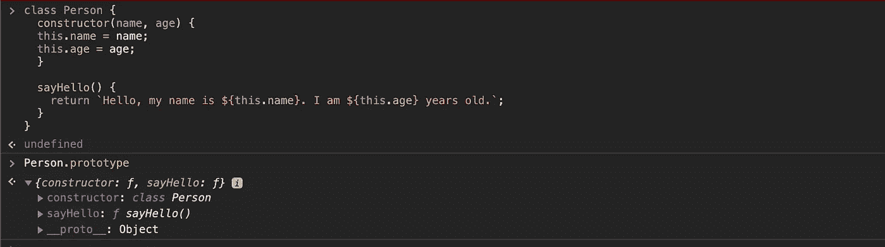
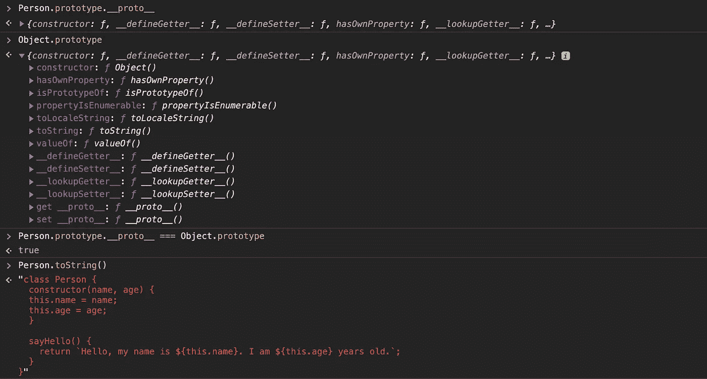
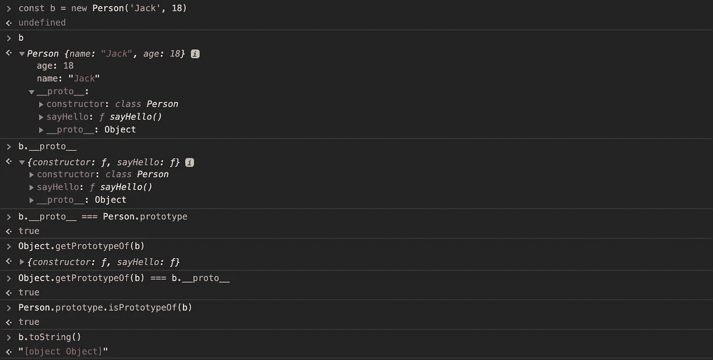
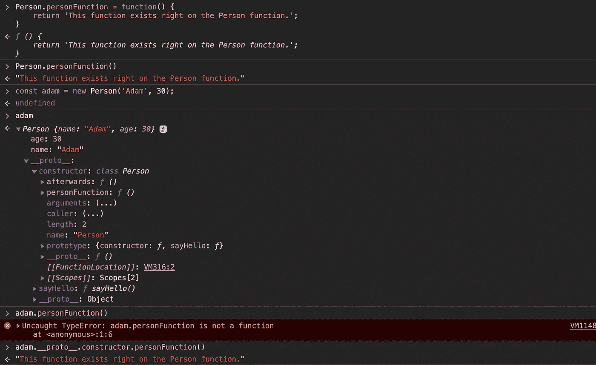

# 揭开 JavaScript 原型继承的神秘面纱

> 原文：<https://betterprogramming.pub/demystifying-javascripts-prototype-inheritance-6d91d4ee6256>

由 [Max Nelson](https://unsplash.com/@maxcodes?utm_source=unsplash&utm_medium=referral&utm_content=creditCopyText) 在 [Unsplash](https://unsplash.com/search/photos/javascript?utm_source=unsplash&utm_medium=referral&utm_content=creditCopyText) 上拍摄的照片

在某种程度上，每个学习 JavaScript 的学生都听说过 JavaScript 没有类。或者他们可能听说 JavaScript 没有“真正的”类。

然而，如果你看看下面的代码，或者打开你的浏览器控制台，键入“class ”,你会清楚地看到一些语法高亮显示。JavaScript 显然有一个类，那么到底什么是“真正的”类呢？

JavaScript 有类吗？是的，从某种意义上说，这个关键词确实存在，而且确实做了一些事情。然而，它与 Java 等语言中的 class 关键字意义不同。它唯一的目的是成为创建构造函数和设置其原型的语法糖。

这里有很多花哨的词语，所以让我们把它分解一下。当我们说某事是句法糖时，我们的意思是它作为一种更好、更干净、可能更容易阅读的方式来做某事。

语法糖不是一个功能！它没有给这种语言添加任何以前不存在的额外功能。如果 JavaScript 类是语法糖，这意味着已经存在一种方法来编写上面的代码。事实上，有，虽然它看起来不太好。

这里，在第一行，我们有 JavaScript 的普通旧函数关键字。我们接受两个参数，并使用`this`关键字动态设置`name`和`age`的值。

这是因为第十行的代码，我们实际上告诉 JavaScript 创建一个`PersonOldWay`函数的实例。

第六行是我们给这个`PersonOldWay`构造函数`sayHello`函数的地方。注意，为了这样做，我们访问了`PersonOldWay` prototype 属性。

注意 Person.prototype 计算出一个包含我们函数的对象。

实际上，我们在第一段代码中做了完全相同的事情。请记住，第一段代码只是第二段代码的一个更漂亮的版本。它实际上并没有实现任何以前做不到的事情。

在我们的`Person.prototype`中，我们看到了我们定义的`constructor`函数和`sayHello`函数。随着我们向类中添加越来越多的方法，prototype 属性将继续扩展，但是您可能也注意到了`__proto__`指向了`Object`。那到底是什么？

`__proto__`告诉我们`Person`继承了`Object.prototype`。如果我们看一下`Object.prototype`，我们可以看到那里定义了各种方法——例如`toString`方法。我们可以在`Person`类上调用`toString`方法，因为`Person`从原型链的更高层继承了这些方法。

注意:我使用 __proto__ 是为了说明，通常你会使用 Object.getPrototypeOf。

这是一件好事，因为它允许我们通过简单地编写一次方法来提高内存效率，然后让需要它的对象继承它。

当运行一段代码时，JavaScript 将首先检查有问题的对象是否具有该属性。如果有，它会询问是否会使用它。否则，它将查看该对象的 `__proto__`，在我们的例子中是`Person.prototype`，以查看该属性是否存在。

它将重复这个过程，直到找到它，或者到达链的末端并返回 null。

如果你熟悉一种使用经典继承的语言(比如 Java 或 Ruby)，有些可能听起来很熟悉。使用经典继承的语言也有一种重用代码的方式，那么到底有什么区别呢？

注意:b 仍然有 toString 方法，即使它返回[object Object]

在 JavasScript 中，一切都只是一个从另一个对象继承的对象。没有蓝图，只有原型。原型本身就是一段工作代码。我可以直接给`Person`函数赋予功能。在定义函数之后，我可以随时这样做。我所说的工作代码到底是什么意思？

人员刚刚接收了自己的人员功能。我们的 adam 实例不能直接访问它，但是我们可以通过自己的方式访问它。

这里，在`Person`上直接进行了一个新的函数调用`personFunction`。它没有做任何特别的事情；它只是返回一个字符串。对象`adam`继承自`Person`，也就是说`adam.__proto` *=* `Person.prototype` *。*

但是请注意，我们不能简单地调用`adam.personFunction()`，因为这个函数不存在于`adam`继承链中。相反，它直接存在于构造函数中。`Person`可以做的不仅仅是定义`adam`将如何表现，这意味着它可以*做工作*。

一个简单的 Java 类，带有 3 个参数的构造函数。

上面，我们定义了一个名为`Dog`的简单 Java 类，并给了它一个三参数构造函数。这个类将定义每个`Dog`实例的外观。`Dog`的每个实例都会有两个字符串对应名字和品种，一个整数对应年龄。类本身不做任何工作。

这里我们制作一个 Dog 的实例并打印出它的属性。

在传统的继承语言中，类作为创建对象(类的实例)的蓝图。除了定义其实例将继承的方法和属性之外，类本身没有任何用途。

换句话说，除了定义其实例的行为方式，您不能对 Java 类做任何实际的事情。Java 中的类将继承其他类，只要子类有一个潜在的更大、更健壮的蓝图。

然而，不管继承链有多长，类本身永远不会仅仅是一个蓝图。

# 来源

 [## 功能

### 函数构造器创建一个新的函数对象。直接调用构造函数可以创建函数…

developer.mozilla.org](https://developer.mozilla.org/en-US/docs/Web/JavaScript/Reference/Global_Objects/Function)  [## 继承和原型链

### 对于熟悉基于类的语言(如 Java 或 C++)的开发人员来说，JavaScript 有点令人困惑，因为它是动态的…

developer.mozilla.org](https://developer.mozilla.org/en-US/docs/Web/JavaScript/Inheritance_and_the_prototype_chain)