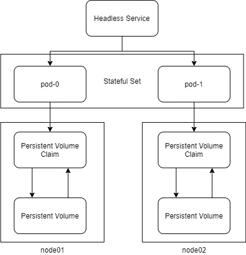
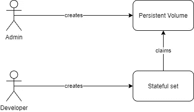
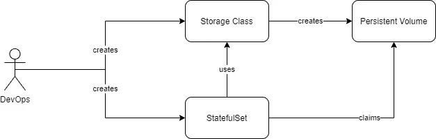
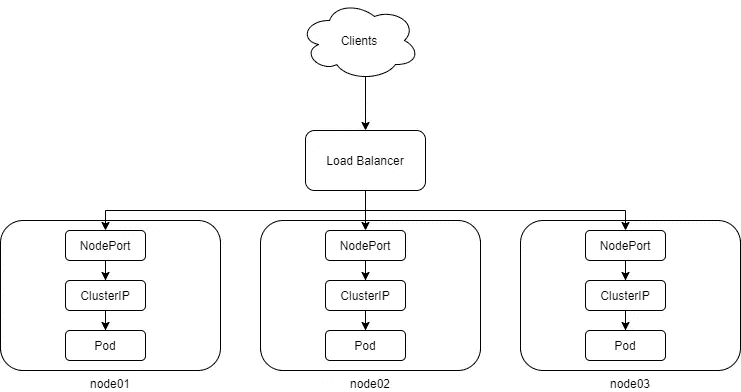
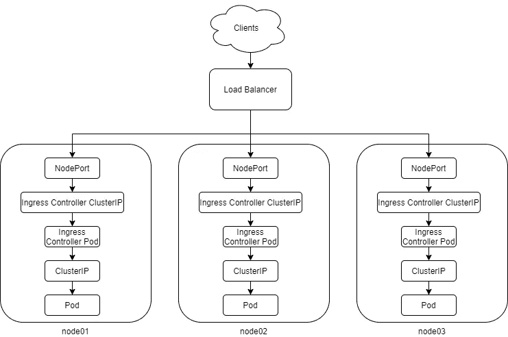

# 揭开 Kubernetes 物件的神秘面纱

> 原文：<https://betterprogramming.pub/demystifying-kubernetes-objects-understanding-the-what-why-and-how-18b42c9ca9c2>

## 理解什么、为什么和如何


[贾里德·阿兰戈](https://unsplash.com/@jaredrossarango?utm_source=unsplash&utm_medium=referral&utm_content=creditCopyText)在 [Unsplash](https://unsplash.com/s/photos/future?utm_source=unsplash&utm_medium=referral&utm_content=creditCopyText) 上的照片

Kubernetes 现在是容器编排事实上的标准。它受欢迎有很多原因。一个很好的理由是它自身带来的特性数量，因此有相当多的 Kubernetes 对象。

在 Kubernetes 中，有多种方法可以实现一个结果，这也给 DevOps 专业人员带来了很多困惑。本文试图解决一些常用的 Kubernetes 对象的内容、方式和原因。

这是一个面向 Kubernetes 从业者的高级主题。如果您想从 Kubernetes 开始，请查看这篇中型文章:

[](https://medium.com/better-programming/kubernetes-for-beginners-b3042e01ccff) [## 初学者的 Kubernetes

### Kubernetes，面向更普通的观众

medium.com](https://medium.com/better-programming/kubernetes-for-beginners-b3042e01ccff) 

# 了解 Kubernetes 如何工作

Kubernetes 使用一个简单的概念来管理容器。有控制和协调容器工作负载的主节点(控制平面),以及容器运行的工作节点。

Kubernetes:

*   与底层容器运行时对话。Kubernetes 不是一个容器平台，而是一个容器编排平台。它的 kubelet 组件作为服务在每个节点上运行，负责与底层容器平台通信以管理容器。例如，当您使用 kubectl 创建一个 pod，并且您的底层容器平台是 Docker 时，kubelet 会向所选 worker 节点中的 Docker 运行时发出一个 Docker run 命令。
*   存储预期配置的状态。当您使用 kubectl create/apply 命令应用 kubernetes 配置时，Kubernetes 会将其作为预期配置存储在其`etcd`数据存储中。
*   尝试维护基于预期配置的状态。Kubernetes 通过查看`etcd`数据存储中的预期配置，不断尝试维护集群的预期状态。
*   提供基于软件的抽象网络编排层。Kubernetes 提供的 pod 网络确保容器可以在容器运行时管理的覆盖或桥接网络(例如使用 docker 桥接网络)上通过内部或外部网络相互通信。当一个 pod 与另一个 pod 对话时，Kubernetes 会修改路由表，以确保连接到位。
*   提供内置的服务发现。Kubernetes 提供开箱即用容器的服务发现。您不需要外部应用程序来管理它。Kubernetes 服务在 DNS 上公开您的 Pod，它将服务名称映射到任何可用的 Pod IP，提供服务发现和多个 Pod 副本之间的负载平衡。正是因为这种服务发现，豆荚是短暂的。服务还可以通过在节点内创建监听器，以及通过请求云提供商提供指向您的 pod 的负载平衡器，将您的 pod 暴露给内部和外部客户端。
*   运行状况检查配置。Kubernetes 确保集群中运行的容器工作负载具有预期的健康状况，如果没有，它会销毁并重新创建容器。
*   与云提供商讨论对象。如果你在像 GCP 或 Azure 这样的云提供商中运行 Kubernetes，它可以使用云 API 来提供负载平衡器和存储等资源。这样，您就有了一个单一的控制平面来管理在容器中运行应用程序所需的一切。

# Kubernetes 对象

Kubernetes 配置由 Kubernetes 对象组成，如 pod、复制控制器、副本集、守护进程集、部署、状态集、服务、持久卷、持久卷声明等。我将逐一解开这些谜团。

# 豆荚

豆荚是 Kubernetes 的基本组成部分。它是一个或多个容器的集合。每当您需要运行一个应用程序时，您都需要创建一个 Pod。通常，一个 pod 只运行一个容器，但是有时您可能需要在 Pod 中运行多个容器。典型的使用案例包括但不限于以下内容:

*   初始化容器。有时，在启动容器之前，有必要满足某些先决条件，例如检查卷是否存在，如果存在，确保它具有正确的所有权和权限。
*   助手/内部容器。如果有一个辅助容器与主容器一起运行，并且满足一个共同的目标，那么在单个 pod 中运行它们是有意义的。在同一个 Pod 中运行 Helper 容器将确保它们在 localhost 中运行，因此比将它们保存在单独的 Pod 中更快，这可能会将它们分隔在两个 worker 节点中。Kubernetes 在同一个 worker 节点中运行一个 pod 的所有容器。

下面是一个只有一个集装箱的 pod 清单示例:

下面是一个带有`InitContainers`的 pod 清单示例:

上面的配置用一个`busybox` init 容器启动了一个`nginx`容器。当您应用这个清单时，Kubernetes 确保在它启动`nginx` pod 之前，`/etc/nginx`持久卷中的所有文件和目录都将`uid 101`和`gid 101`作为所有者(`101`是`nginx`用户的`uid`和`gid`)。

# 复制控制器

如果您单独部署一个 pod，则无法复制和扩展它。它独立存在，一旦你使用`kubectl`命令删除它，它就消失了。为了确保最小数量的 pod 始终运行，我们需要使用一个类似复制控制器的对象。复制控制器是 Kubernetes 中复制 pods 的遗留形式，现在已经被副本集所取代。然而，我仍然会展示一个例子。为了实现这一点，我们只需要将复制控制器规范包装在 pod 规范上:

复制控制器通过搜索 pod 标签来缩放 Pod。选择器标签与 pod 标签完全匹配。副本决定了在任何给定时间运行的 Pod 实例的数量。

# 副本集

副本集是复制控制器的较新版本。然而，需要记住的一点是，它不应该单独使用，而应该作为部署对象的后端。它们类似于复制控制器，唯一的区别是您可以使用基于集合的搜索符号来对 pod 进行分组，而不是使用基于命名键值对的匹配。在副本集的情况下，您有更多的动态选择器选项。例如，您可以这样编写上面的规范:

或者像这样:

# 部署

部署是部署 Kubernetes Pods 最广泛使用和推荐的方法之一。它们取代了复制控制器—您应该在大多数应用程序中使用它们。可以推出和回滚部署，这是最强大和最广泛使用的 Kubernetes 对象之一。采用`ReplicaSet`的部署管理单元。

## **何时使用部署**

*   如果您正在运行无状态应用程序(不需要将数据/状态保存在磁盘中的应用程序。与后端(如数据库)连接并且不在磁盘中保持状态的应用程序也属于这一类别。
*   当您需要扩展和自我修复 pod 时。
*   几乎所有没有状态的东西。

这是部署清单的一个示例:

如果你看一下清单，它和`ReplicaSet`是一样的，唯一的区别是对象的类型。

## **扩展部署**

有两种方法可以做到这一点:

*   修改清单文件的副本部分并运行`kubectl apply -f <manifest file>`。
*   跑`kubectl scale deployment nginx-deployment --replicas=10`。

我建议在生产场景中修改清单文件，并将清单文件存储在源代码存储库中，以确保环境与代码的一致性。

## **自动扩展部署**

如果 Kubernetes 可以在 Pod 的利用率超过限制时自动调整部署，那该有多好？Kubernetes 的一个名为水平 Pod Autoscaler 的对象就是这个问题的答案。该对象检查 pod 指标，如果它违反了定义的阈值，它会启动另一个 pod 来吸收负载。您需要指定 pod 的最小和最大数量、要检查的指标，然后就可以开始了。

# 水平吊舱自动缩放器

水平 Pod Autoscaler 确保您的 Kubernetes 部署可以基于一些预定义的指标水平扩展，并且 Kubernetes 可以基于这些指标管理 Pod 的创建和销毁。有两种方法可以实现这一点。

*   使用`kubectl`命令行功能。
*   使用`HorizontalPodAutoscaler`货单。


水平吊舱自动缩放器

在使用任何方法之前，我们需要修改我们的部署清单，以便对 pod 应用资源限制，这样水平 pod autoscaler 就可以知道何时需要扩展部署:

上述配置确保分配给容器的最大 CPU 限制是运行容器的工作节点的 500 毫核。

## **使用 kubectl 命令行函数**

```
kubectl autoscale deployment nginx --cpu-percent=50 --min=1 --max=10
```

以上命令确保`nginx`部署运行最少一个 pod，最多十个 pod，基于 CPU 百分比度量不超过 pod 清单中分配的核心的 50%。

一旦`nginx`容器开始在 worker 节点中使用超过 0.25 个核心，这将触发水平 pod 自动缩放器旋转一个复制 Pod，前提是我们不超过 10 个 Pod 的最大限制。相反，如果负载降低，使每个 pod 的利用率低于 0.25 个内核，则 pod 将被删除，直到它们达到所需的使用率或至少有一个 pod 正在运行。

## **在自动缩放/v2beta2 apiVersion 上使用 HorizontalPodAutoscaler 清单**

`kubectl`命令行只能帮助自动缩放 CPU 和内存利用率等指标。如果您需要扩展更高级的自定义指标，比如网络利用率，您需要创建一个`HorizontalPodAutoscaler`清单。这里有一个例子:

上述规范描述了三种度量标准:

*   资源指标。CPU 和内存等指标
*   Pod 指标。诸如每秒数据包数和 Pod 内其他形式的网络流量等指标
*   对象度量。其他 Kubernetes 对象(如 Ingresses)中的度量(如每秒请求数和不同类型的网络流量)。

您可以选择在所有三个选项中使用值和平均值。平均值带来了部署中运行的所有单元的平均值，而值只查看单个单元。

# 管理有状态应用程序

到目前为止，我们一直在讨论无状态应用程序，但是运行的应用程序中有很大一部分是有状态的。

有状态应用程序是那些需要知道它们的现有状态以便在重启后存活的应用程序。如果状态信息丢失，应用程序将无法正常运行。应用程序可能需要将应用程序数据或元数据保存在磁盘上。一个典型的例子包括数据库。

尽管业界对是否在容器中运行有状态应用程序存在争议，但是如果您正在运行 Kubernetes 集群作为标准，那么尽可能使用基于容器的方法来避免异构环境是有意义的。如果走这条路，您可以利用 Kubernetes 提供的高可用性、网络分段和其他有用的特性。

当前形式的 Kubernetes 提供了许多使用`StatefulSet`、`StorageClass`、`PersistentVolumeClaim`和`PersistentVolume`对象管理有状态应用程序的方法。

# 有状态集合

有状态集类似于部署，但有一个显著的区别，即它确保单元和卷是唯一且有序的。如果您使用动态卷供应来旋转一个`StatefulSet`的两个副本，Kubernetes 将确保作为卷安装到 Pod 的存储在被破坏时再次连接到同一个卷。有状态集中的两个 pod 不能互换。

`StatefulSet`清单包含一个 Kubernetes 服务，因为它需要确定它运行在什么服务上，以保持唯一性和稳定的网络身份。这就是为什么`serviceName`也出现在`StatefulSet`规格中的原因。

有状态集还需要一个`PersistentVolume`,可以手动提供，也可以通过存储类的自动提供程序提供。这就是为什么在一个`StatefulSet`清单中有`volumeClaimTemplates`特征的原因。我们稍后将讨论 PVC 和 PV。



Kubernetes StatefulSet

这里有一个`StatefulSet`清单的例子。

# 持久卷

永久卷是存储资源，如磁盘，由管理员手动配置或使用存储类动态配置。我们可以将这些磁盘安装到在 Pods 上运行的容器中，以确保有状态应用程序能够持久存储数据。

## **静态配置**

静态配置要求管理员在云提供商或内部手动创建卷，并在持久卷清单中为 Kubernetes 提供信息，以将卷声明为可用的 Kubernetes 资源。



静态供应

下面是一个使用现有 Azure 磁盘的静态供应的`PersistentVolume`清单示例。然后，我们将永久卷包括在卷声明模板中，如下所示:

## **动态预配置**

静态配置似乎是一个不错的选择，但是这里的问题是这个对象依赖于一个特定的云提供商，并且不可移植。如果我们需要将我们的工作负载转移到另一个云提供商，部分问题将是更改我们所有的清单，以反映新提供商中新创建的磁盘。修改一些清单似乎是一件容易的事情，但是运行数千个容器的大型组织会经历供应商锁定。

为了确保更加动态和独立于平台的方法，我们将创建一个存储类对象，该对象将定义需要配置的对象类型(磁盘、SSD、NFS、块存储等)。)和将要供应它的云提供商。存储类名需要独立于平台—标准、快速、数据块等。然后，持久卷声明将使用存储类别来告诉云提供商要么提供现有存储，要么根据存储类别提供新的存储。然后，Kubernetes 将 PVC 作为一个卷安装到 Pod。



动态供应

# 存储类

存储类对象定义了需要供应的对象类型(磁盘、SSD、NFS、块存储等)。)、云提供商(Azure、GCP 等)。)哪一个将配置它、卷回收策略等等。存储类名称需要独立于平台，例如标准、快速、磁盘或 SSD。

这是一个快速存储类的示例，它提供 azure premium 本地冗余管理 azure 磁盘:

# 持续量索赔

永久卷声明使用存储类根据请求动态配置磁盘。下面使用 fast storage 类来配置 5GB 的 azure 磁盘。然后，pod 模板可以使用`PersistentVolumeClaim`将磁盘安装到容器上:

# 将所有这些与动态资源调配一起放在一个有状态的集合上

下面是一个使用动态资源调配来定义使用 fast 存储类的有状态集的示例:

如果你仔细观察，你会发现规范中没有提到任何云提供商。这样，资源调配是可移植的，并且是最推荐的卷资源调配方法之一。

静态预配置适用于希望在开发和运营之间保持界限的组织，而对于对开发更友好的组织，动态预配置是一条可行之路。

# 运行守护程序

守护进程是在服务器中运行的后台进程，用于特定的管理相关活动，如收集日志、内务处理、监控等。在 Kubernetes 集群的情况下，可能有一些特殊的用例，比如监控节点健康状况、发送日志或启动集群存储守护进程。在这种情况下，`DameonSets`是满足要求的最佳 Kubernetes 对象。

# 达蒙塞特

`DaemonSet`是一个 Kubernetes 对象，它确保集合中定义的 pod 在 Kubernetes 集群的每个节点上运行。当我们向集群添加一个新节点时，`DaemonSet`会旋转一个新的 pod，当我们删除一个节点时，它会从该节点删除 Pod。

下面是在 Kubernetes 集群的所有节点中运行一个`fluentd`日志应用程序的`DaemonSet`的示例清单文件。

# 公开 Kubernetes 应用程序

到目前为止，我们已经讨论了部署和管理容器的方法。我现在想讨论通过 Kubernetes 服务和入口资源向内部或外部客户公开 Kubernetes 对象的多种方式。

# 服务

豆荚是短暂的物体。每个 pod 都有其 IP 地址，当一个 pod 不正常或死亡时，Kubernetes 会用一个具有不同 IP 地址的新 Pod 来替换它。这导致了一个问题，因为我们现在不能使用与旧地址相同的 IP 地址来访问 Pod。

Kubernetes 提供了服务对象来解决这个问题，并通过交付其内置的服务发现机制来抽象它。当您使用 Kubernetes 运行容器时，您不需要依赖外部服务发现应用程序。Kubernetes 拥有自己的 CoreDNS，它记录了正在运行的 pod 的 IP 地址，并根据服务名称提供内部负载平衡和 DNS 解析。根据服务的类型，您可以用三种方式公开您的应用程序:`ClusterIP`、`NodePort`和`LoadBalancers`。



Kubernetes 服务

# 集群 IP 服务

群集 IP 服务是默认的服务类型。我们用它来暴露 pods 作为 Kubernetes 前端 pods 的后端。

一个典型的例子包括在 Kubernetes 中作为容器运行的数据库。我们不需要在 Kubernetes 集群之外公开这些 pods，集群 IP 服务只能在 Kubernetes 集群中发现。集群中运行的任何 pod 都可以通过使用`serviceName:port`组合来调用另一个服务，这确保了无论您的 pod 运行在哪个 IP 上，请求都会通过动态服务发现被路由到正确的 pod。

以下是一个集群 IP 服务的示例:

# 节点端口服务

节点端口服务在一个称为节点端口的静态端口上向您的节点公开您的 pod，并且可以从您的任何 Kubernetes 节点上发现它。如果您的节点可以从互联网上访问，外部客户端将能够在任何`<NodeIP>:<NodePort>`上访问您的 Pod。节点端口范围为 30000–32767，这是非标准范围，通常不适合生产部署。

下面是一个节点端口服务的例子，展示了节点端口 31000 上的`nginx`部署。如果不指定节点端口，它会选择范围内的任何空闲端口。

# 负载平衡器服务

负载平衡器服务本质上创建了一个`NodePort`,并请求云提供商在所有节点前动态提供负载平衡器。

为了解释这一点，假设您有一个主节点和三个名为`master`、`node01`、`node02`和`node03`的工作节点，并且您有一个运行在端口 80 上的`NGINX` pod，您想要向外公开它。一个`LoadBalancer`服务将首先在`NodePort` 范围内的任意一个端口(比如 31000)上创建一个`NodePort`，然后创建一个在端口 80 上运行的`Load Balancer`作为前端，将`master:31000`、`node01:31000`、`node02:31000`和`node03:31000`作为后端。一个`Load balancer`可以是内部的，也可以是外部的，并且可以有多个用例。`Load Balancer`服务是在生产环境中向互联网或内部基础设施公开前端组件的方法之一。

以下示例公开了`Load Balancer`上的`NGINX`窗格:

还有其他服务，如`ExternalName`和`ExternalIP`，但它们很少被使用，不在本次讨论的范围内，如果你感兴趣，可以查看[在线 Kubernetes 文档](https://kubernetes.io/docs/concepts/services-networking/service)。

# 进入

负载平衡器是昂贵的资源，为每个外部公开的应用程序提供新的负载平衡器是一种浪费。当多个应用程序在一个集群中运行时，不要运行太多的外部负载平衡器是有意义的。

相反，依靠反向代理，根据 URI 路径、完全限定的域名或 HTTP 报头，将来自一个负载平衡器的外部流量映射到多个资源。入口资源是用于此目的的对象。入口资源通常仅用于管理 HTTP 和 HTTPS 流量——对于任何其他情况，`LoadBalancers`更合适。

典型的入口设置需要入口控制器。入口控制器是一个由`Ingress`清单配置的容器，用于将到达它的流量路由到正确的 ClusterIP 服务。下面是一个运行入口的典型简单链:



Kubernetes 入口

要在您的 Kubernetes 集群中设置入口控制器，请阅读[本指南](https://medium.com/swlh/how-to-secure-kubernetes-the-easy-way-f37052139280)并在需要时参考其他在线文档。

这里有一个使用基于 URI 的路由的入口清单示例。任何触及任何 FQDN 上的入口控制器但具有`/testpath` URI 的内容都会路由到端口 80 上的测试服务:

下面是使用基于主机的路由的入口示例。使用具有任何 URI 的完全限定域名`test.example.com`的所有流量将被路由到端口 80 上的服务测试:

下面显示了同时使用基于主机和基于路径的路由的扇出。任何来自 foo.bar.com 的带有 URI /foo 的请求都会被路由到端口 4200 上的服务 1，而带有 URL /bar 的请求会被路由到端口 8080 上的服务 2。

由此可以产生各种排列组合，您可以根据`Ingress`规则创建强大的动态路由。如果您正在管理基于 HTTP 和 HTTPS 的应用程序，那么`Ingress`资源是绝对必要的。

# 进一步阅读

感谢您的阅读。我希望你喜欢这个故事。如果您有兴趣了解更多信息，请查看以下文章，您可能会感兴趣:

 [## 在基于虚拟机的 K8S 集群中使用 Azure Kubernetes 提供程序

### 建立 kubernetes 集群有多种方式，一些组织希望从头开始…

medium.com](https://medium.com/@bharatmicrosystems/using-the-azure-kubernetes-provider-in-a-vm-based-k8s-cluster-fdf941b86d69) [](https://medium.com/better-programming/how-to-helm-with-sonatype-nexus-c49c98324a19) [## 如何用 Sonatype Nexus 掌舵

### 使用 Sonatype Nexus 作为 CI/CD 的导航库

medium.com](https://medium.com/better-programming/how-to-helm-with-sonatype-nexus-c49c98324a19)