# 揭开正则表达式中前瞻和后视的神秘面纱

> 原文：<https://betterprogramming.pub/demystifying-look-ahead-and-look-behind-in-regex-4a604f99fb8c>

## 使用易于理解的示例和动画 gif 简化正则表达式中的前视和后视

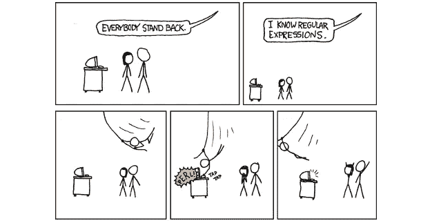

图片由[https://xkcd.com/](https://xkcd.com/)

正则表达式(Regex)中的一个概念是 look-arounds——它由前视和后视组成，我一直觉得难以理解。

虽然网上有大量的文章和教程解释这个概念，但很少有人用容易理解的方式来解释，至少我不满意。许多人使用诸如“消费群体”、“零宽度断言”等术语。，对正在学习这个高级话题的人没有什么帮助。

此外，在如何解释环视的名称方面缺乏明确性。例如，对于后视，相对于什么是“后面”?我们在“寻找”什么？前瞻也是如此。似乎它们还不够令人困惑，每种类型的环视都有两个子类型——积极的和消极的。

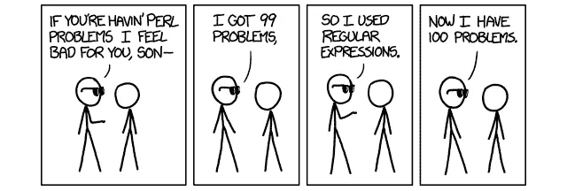

图片由 https://xkcd.com/的[提供](https://xkcd.com/)

在这篇文章中，我试图一劳永逸地揭开前瞻和后顾概念的神秘面纱。我将避免技术术语，而是用简单的术语解释，并辅以动画 gif。

*附言:为了更好地浏览 gif 动画，我建议使用桌面网络浏览器。*

我的解释将与编程语言无关，尽管我的代码片段将使用 Python。希望这篇文章对你有用。我们开始吧！

*本文展示的代码片段和动画 gif 可以在这个*[*GitHub repo*](https://github.com/zeyalt/My-Articles/tree/master/Python%20Tips/Demystifying%20Look-ahead%20and%20Look-behind%20in%20Regular%20Expressions)*找到。*

# 1.正则表达式查找入门

在我们深入探讨之前，让我们首先获得一些高层次的直觉，了解环视试图实现什么以及它们是如何工作的。让我们做一个简单的类比。

假设你是另一个国家的游客，你想参观当地的博物馆。你在步行，你迷路了。你向路人问路去博物馆。他们告诉你，“一直往前走，一旦你看到你左边的法国咖啡馆，你就会看到博物馆。”你跟着他们的指示走，瞧，你就找到博物馆了！


由[埃胡德·纽豪斯](https://unsplash.com/@paramir?utm_source=medium&utm_medium=referral)在 [Unsplash](https://unsplash.com?utm_source=medium&utm_medium=referral) 上拍摄的照片

在这里，你成功地找到了博物馆，因为你得到了一个路标(“法国咖啡馆”)，行走的方向(“直走”)，以及相对于运动方向在哪里找到路标(“在你的左边”)。环视以类似的方式工作——不是走过建筑物，而是“穿行”文本字符串。

在 look-around 中，您正在查找文本字符串的某些部分。要找到它/他们，你需要知道“地标”(也称为**模式**)，以及在哪里找到地标(要么是之前的**，要么是**模式之后的**)。**

“行走”的方向是固定的，因为文本字符串是从左向右读的，至少在英语中是这样。一旦该模式存在于文本字符串中，就会找到一个与匹配的**。**

# 2.我们的示例文本

为了保持有趣，我将引用蜘蛛侠电影中的一段话来解释回望的概念:

> “权力越大，责任越大。”


[公路旅行照片，Raj](https://unsplash.com/@roadtripwithraj?utm_source=medium&utm_medium=referral) 在 [Unsplash](https://unsplash.com?utm_source=medium&utm_medium=referral) 上

# 3.向前看

前瞻是一种环视类型，其中模式出现在所需匹配的前面。我们“向前看”以查看某个文本字符串前面是否有特定的模式。如果是，那么该文本字符串是匹配的。

## 3.1.积极的前瞻

在正向预测中，您希望找到一个后面有表达式`B`(即模式)的表达式`A`。它的语法是`A(?=B)`。

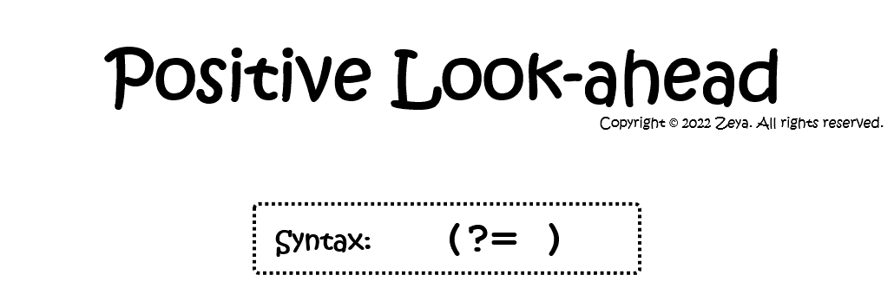

图 1:积极前瞻的定义(作者提供的 GIF)

让我们用示例文本来说明这一点。假设您想要找到任何一个后面带有模式`" great"`的完整单词。因为这是我们在本文中的第一个例子，所以让我们把它分解并一步一步地走完…非常准确地说。

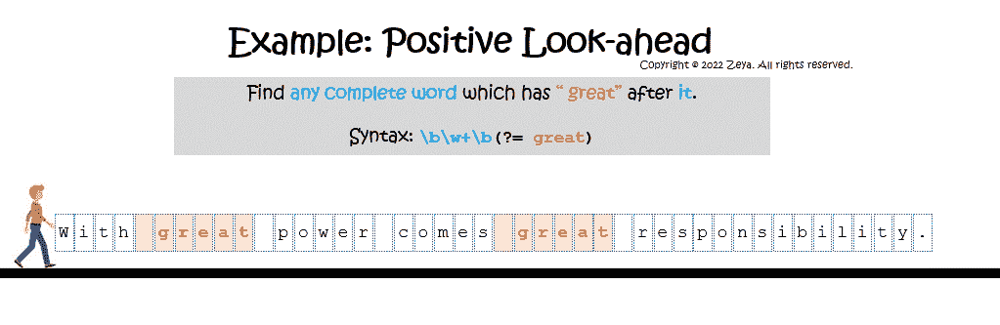

图 2:正面前瞻示例(作者提供的 GIF)

想象你是图 2 中的动画行走人。您首先站在示例文本的开头。然后，您开始一个字符一个字符地向文本的末尾移动。

当你行走时，你总是向前看寻找“地标”，在这种情况下，那就是模式`" great"`。

每次你在一个完整的单词后面找到`" great"`，这个单词就是一个匹配。

在这种情况下，成功的匹配是`"With"`和`"comes"`。Python 中相应的代码片段如下:

```
>>> import re>>> text = "With great power comes great responsibility."
>>> pattern = r'\b\w+\b(?= great)'
>>> matches = re.finditer(pattern, text)
>>> for match in matches:
...     print(f'Match: "{match.group()}" => Span: {match.span()}') Match: "With" => Span: (0, 4)
Match: "comes" => Span: (17, 22)
```

## 3.2.消极前瞻

另一方面，消极的前瞻是当你想找到一个后面没有表达式`B`(即模式)的表达式`A`时。它的语法是:`A(?!B)`。在某种程度上，这与积极的前瞻相反。

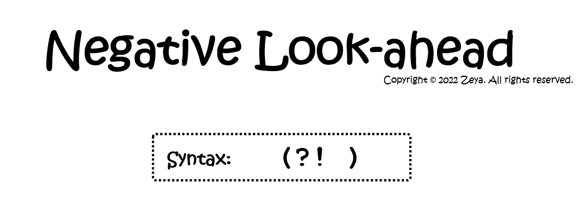

图 3:消极前瞻的定义(作者提供的 GIF)

现在，假设您想要查找任何后面没有模式`" great"`的完整单词。

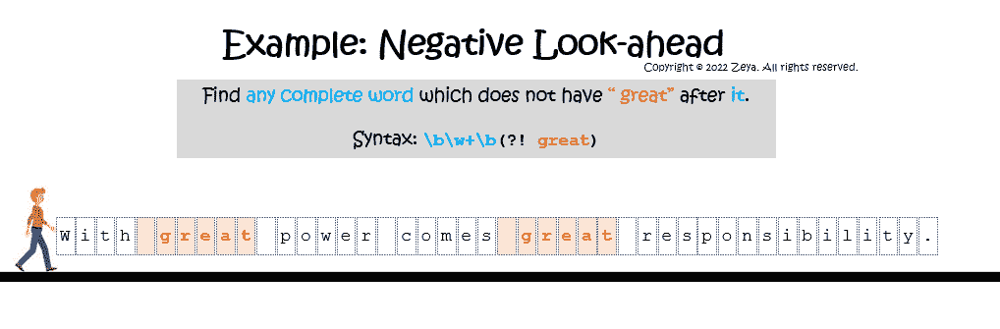

图 4:消极前瞻示例(作者提供的 GIF)

这一次，您将向前查找任何后面没有模式`" great"`的单词。

*   第一个单词`"With"`，后面有`" great"`，所以不匹配。
*   下一个单词`"great"`后面没有`" great"`，所以是匹配。
*   第三个字，`"power"`，后面也没有`" great"`，所以是匹配。
*   这种情况一直持续到字符串的末尾。因此，成功的匹配是`"great"`、`"power"`、`"great"`和`"responsibility"`。

让我们看看代码:

```
>>> text = "With great power comes great responsibility."
>>> pattern = r'\b\w+\b(?! great)'
>>> matches = re.finditer(pattern, text)
>>> for match in matches:
...     print(f'Match: "{match.group()}" => Span: {match.span()}') Match: "great" => Span: (5, 10)
Match: "power" => Span: (11, 16)
Match: "great" => Span: (23, 28)
Match: "responsibility" => Span: (29, 43)
```

# 4.向后看

现在让我们把注意力转向后顾。与前瞻不同，后视用于模式出现在所需匹配之前的情况。您正在“向后看”以查看某个文本字符串背后是否有想要的模式。如果是，那么该文本字符串是匹配的。

## 4.1.积极的回顾

在正面回顾中，您希望找到前面有表达式`B`(即模式)的表达式`A`。它的语法是`(?<=B)A`。

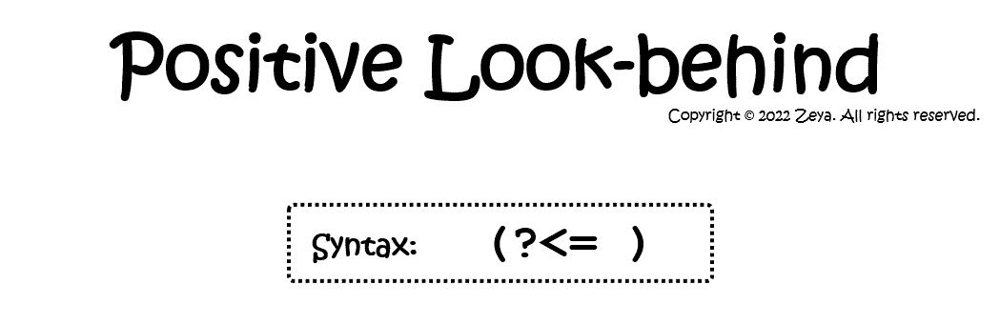

图 5:正面回顾的定义(作者的动画 GIF)

让我们通过示例文本更好地理解这一点。假设您现在想要查找任何前面有模式`"great "`的完整单词。

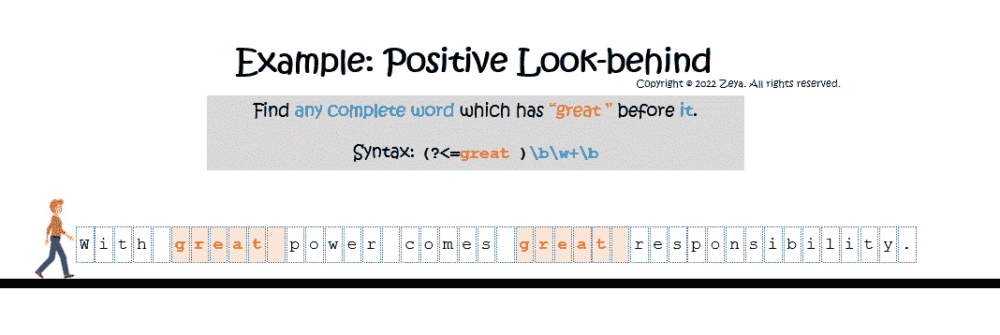

图 6:正面回顾示例(作者制作的动画 GIF)

再一次，您从文本字符串的开头走到结尾。现在的区别是，你走路的时候“转身”是为了“向后看”，而不是只看前方。请注意，图 6 中的动画人总是把头转来转去！

您“向后看”以找到任何前面有模式`"great "`的单词。

*   第一个单词`"With"`前面没有字符，因此不匹配。
*   第二个单词`"great"`前面有`"With "`，不匹配。
*   第三个单词`"power"`前面有`"great "`并且是匹配的。
*   最后，成功匹配的是`"power"`和`"responsibility"`。下面是代码片段:

```
>>> text = "With great power comes great responsibility."
>>> pattern = r'(?<=great )\b\w+\b'
>>> matches = re.finditer(pattern, text)
>>> for match in matches:
...     print(f'Match: "{match.group()}" => Span: {match.span()}') Match: "power" => Span: (11, 16)
Match: "responsibility" => Span: (29, 43)
```

## 4.2.消极的回顾

最后，在消极回顾中，您感兴趣的是找到一个前面没有表达式`B` (即模式)的表达式`A`。它的语法是:`(?<!B)A`。这与积极的回顾相反。

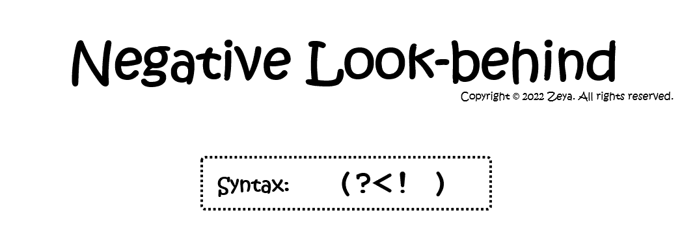

图 7:负面回顾的定义(作者的动画 GIF)

现在，假设您想要在我们的示例文本字符串中找到前面没有模式`"great "`的任何完整单词。这一次，当您从字符串的开头走到结尾时，您正在“向后看”前面没有`"great "`的单词。

通过类似的“遍历”过程，您发现成功的匹配是`"With"`、`"great"`、`"comes"`和`"great"`。

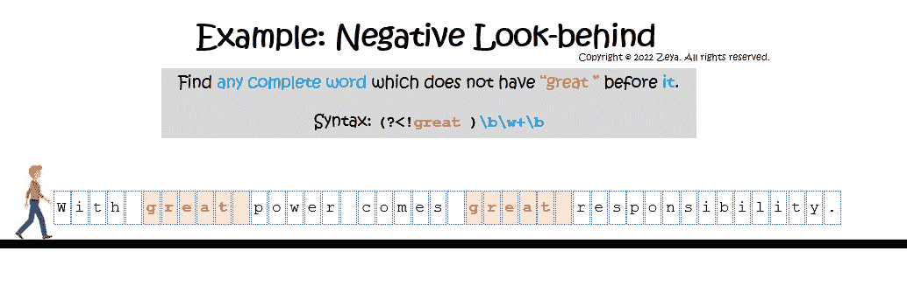

图 8:负面回顾示例(作者的动画 GIF)

代码如下:

```
>>> text = "With great power comes great responsibility."
>>> pattern = r'(?<!great )\b\w+\b'
>>> matches = re.finditer(pattern, text)
>>> for match in matches:
...     print(f'Match: "{match.group()}" => Span: {match.span()}') Match: "With" => Span: (0, 4)
Match: "great" => Span: (5, 10)
Match: "comes" => Span: (17, 22)
Match: "great" => Span: (23, 28)
```

# 5.结合前视和后视

您可能会遇到这样的情况:您希望在一个文本字符串中查找在一个模式之后开始、在另一个模式之前结束的匹配项。在这种情况下，您可以将向前看和向后看结合起来。

例如，如果您想在示例文本中查找两个“great”单词之间的任何字符，您可以通过以下方式组合一个正面回顾`(?<=great).*`和一个正面前瞻`.*(?=great)`:

```
>>> text = "With great power comes great responsibility."
>>> pattern = r'(?<=great).*(?=great)'
>>> matches = re.finditer(pattern, text)
>>> for match in matches:
...     print(f'Match: "{match.group()}" => Span: {match.span()}') Match: " power comes " => Span: (10, 23)
```

# 6.包装它

我们缩小一点，在你走之前把东西收拾好。我们已经讨论了 Regex 中四种类型的查找。这里有一个备忘单，总结了它们的定义和语法。请随意保存一份副本以供将来参考。

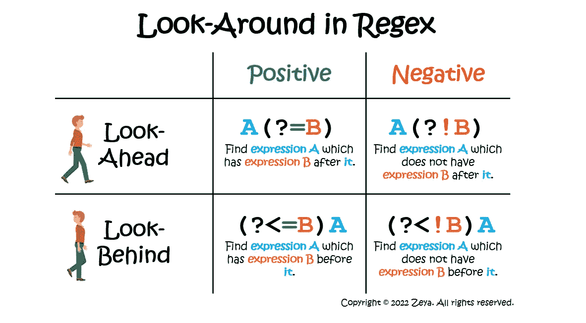

图 9:Regex Look-around 的备忘单(图片由作者提供)

以下是一些需要注意的观察，以进一步巩固你的理解:

*   两种类型的肯定回看的语法与等号相关联，`=`
*   两种否定回望的语法都与一个感叹号`!`相关联
*   前瞻与介词“after”相关联——寻找一个在它之后有特定模式的匹配
*   Look-behinds 与介词“before”相关联，即寻找前面有特定模式的匹配。

# 7.结论

恭喜你！我希望这篇文章能够帮助您更好地理解 Regex 中的 look-around。如果你仍然难以理解这些概念，不要担心——它们一开始就令人困惑。请随意收藏这篇文章，如果您需要复习，请回到这里。

我的解释也很简单，使用了通俗易懂的语言，但是如果你需要让你的理解更上一层楼，这里有一些资源你应该看看:

*   [控制前视和后视](https://www.rexegg.com/regex-lookarounds.html)
*   [Python Regex:look arounds【YouTube】](https://youtu.be/xQoP_rNmPvI)
*   [前视和后视零长度断言](https://www.regular-expressions.info/lookaround.html)

暂时就这样了。祝您愉快！

```
**Let's connect!**Reach out to me via [LinkedIn](https://www.linkedin.com/in/zeyalt/) or [Twitter](https://twitter.com/zeyalt_).
```