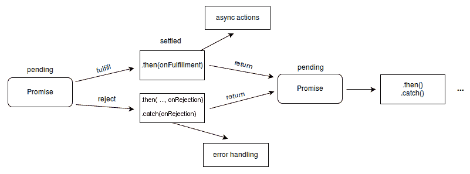

# 揭开 JavaScript 中承诺的神秘面纱:它们是如何工作的？

> 原文：<https://betterprogramming.pub/demystifying-promises-in-javascript-how-do-they-work-a6b8c5dcb85f>

## 了解承诺的含义，以及如何在 JavaScript 中使用它们


如果您阅读 ECMAScript 6 文档，您会发现在 Promises 下面有一句话。*“一个值的第一类表示，它可能是异步的，并且在将来是可用的。”*你想知道这意味着什么吗？

是啊，我也是。可能是这个原因，以及其他许多关于 JavaScript 如何执行代码的误解，导致了围绕 JavaScript 中 Promise 特性的混乱。

在这篇博客文章中，我们的目标是揭开这个特性是如何工作的，这样你就可以像专家一样在你的代码中实现承诺。为了到达应许之地(抱歉，不是抱歉)，我们首先需要理解 JavaScript 如何处理同步和异步代码。然后，我们将深入了解什么是承诺，它们如何有帮助，以及如果您还没有在代码中使用它们，为什么您可能想要开始使用它们。

# 【JavaScript 如何处理同步和异步代码

JavaScript 是一种单线程编程语言，这意味着它有一个单一的调用堆栈，可以在其上推送新的函数执行上下文。换句话说，它一次只能做一件事。

不仅如此，它完全不考虑前面的代码是否已经执行完。js 文件，使其同步。*“好吧，”*你惊呼，*“但是如果这是真的，我怎么能在等待其他代码加载的同时，同时点击浏览器上的按钮呢？为什么我可以做许多动作，其中一些动作看起来同时具有阻塞功能，而其他代码正在运行？”*。很好的问题，谢谢提问。

简而言之，是浏览器或任何其他运行 JavaScript 的高级运行时允许你做这些事情。这些更高层次的抽象为我们提供了类似于调用堆栈的其他数据结构，允许我们存储代码以便稍后或在不同时间运行。

在底层，浏览器使用这些抽象来管理放入调用堆栈的内容。与我们的调用堆栈结合使用的这些其他数据结构的两个例子是`setTimeout()`,它在执行回调时应用输入时间约束，或者在处理下一行代码之前等待接收来自服务器的响应的获取请求。

两者都与 JavaScript 的基本单线程不兼容，但是抽象给了我们额外的能力，允许非单线程的行为。在 Chromium 中，这些工具称为 WebAPIs，在 Node c++ API 中称为 WebAPIs。他们异步处理代码——确保它不会中断在主执行线程中执行的代码。在这个阶段，你可能会想，*“好吧，这意味着这是在另一个线程中执行的”*。

但这取决于执行 JavaScript 的引擎。对于 Chromium，这只是看起来像多线程并发执行代码的错觉。我们不会对此进行更详细的讨论，因为它本身有自己的一组帖子，但是这应该给我们足够的上下文来理解这些更高级别的抽象在 JavaScript 中能够做什么！

好了，现在我们已经理解了异步，让我们回到节目的主角，承诺。

# **承诺算什么？**

承诺是一种表示“承诺”未来结果的 JavaScript 对象。就是这样。虽然这不是一个非常清晰的描述——特别是如果你只是拼凑你的承诺的心理模型，让我们把注意力集中在 JavaScript 对象上，这是我刚刚分享的定义的一部分。在最基本的层次上，它是一系列(或一串)对象，其中有回调。链，因为它们是相连的，如果一个环节打破了整个承诺。实际上，它允许您做一些事情，让我们来看看这些:

首先，您可以设置依赖于以分步或阻塞方式执行和完成其他回调的代码。

这是非常强大的，因为它使您能够密切控制执行流，这在您希望与服务器交互、在成功接收数据时执行代码或创建节流功能以避免服务器被 pwned 时非常有用。

这方面的例子可能包括在页面加载后在 Instagram 上呈现你的 feed 项目，或者在足够的数据下载到你的客户端后让网飞播放视频。

将异步任务设置为一个接一个地运行被称为承诺链，通常在实践中使用`.then`语法。是的，这里有具体的语法需要学习，但是请相信我，当选择是嵌套回调和访问回调地狱时，这是一个很小的代价。

承诺链还允许您在承诺链中的回调之间向下传递返回值。在 Fetch 请求的例子中，这意味着向您的服务器发送一个请求，等待响应，然后在响应返回到我们的客户机时处理该响应。

请参见下面的代码块，了解 Promise 语法以及 Promise 是如何操作的。我试图使用非常冗长的函数名来让您了解正在发生的事情:

```
 new Promise(function doThisFirst(resolve, reject) {
  console.log('Hey, I just met you')
  resolve()})
 .then(function doThisSecond() {
  console.log('and this is crazy')
 }).then(function doThisThird() {
  console.log('But here\'s my number')
 }).then(function doThisFourth() {
  console.log('so call me, maybe')
 }).catch(() => {
  console.error('Number engaged');
 });
```

第二，除了我的第一点之外，因为我们可以在运行我们的主执行线程的同时运行对用户来说是阻塞的任务，所以我们可以灵活地执行其他代码。这意味着用户体验得到了保留，因为他们可以在浏览器中执行其他任务，而不会受到承诺逻辑的阻碍。

在 Chromium 中，这是通过浏览器使用事件循环以类似并发的方式运行我们的代码来完成的。要更详细地理解这一点，请查看【Phillip Roberts 在 2014 年 JSConf 上的精彩演讲，其中解释了这是如何工作的。

第三，承诺让您能够灵活地绑定错误处理逻辑。这是因为承诺是如何执行的。承诺对象将功能链接在一起，可以是待定、已解决(已履行)或已拒绝。通过添加`.catch` Promise 语法，您可以让您的 Promise 在 Promise 链中调用的某个函数失败时执行一个`console.log`错误。概念上相似的 JavaScript 概念是 try-catch 块。在上面的代码块中，如果 Promise 中的其他链由于某种原因失败了，我们将记录“Number engaged”。Promise 错误处理有助于调试，因为错误包含在与 Promise 工作流相关的工作块中。当您发出网络请求并对无法从给定 API 端点获得数据的原因进行故障诊断时，这尤其有用。



承诺状态流

作为一个提醒，当你玩弄承诺时，可能会遇到一个主要的限制。正如我在开始时所说的，它们是 JavaScript 对象，但却是特殊的对象，所以你不能像处理数组或常规对象那样简单地处理它们。如果你兑现你的承诺，你可能会明白我的意思。退回的内容难以辨认，无法使用。大概是这样的:

```
Promise { <pending> }
```

相反，在处理承诺时，一定要让回调利用闭包来获取承诺中被操纵的任何数据，并在父执行上下文的词法范围内更新相关的数据类型，从而确保您既可以从承诺中获得最大收益，又不会在编码时遇到任何可用性错误。

希望到现在为止，您会比在本文开始时更加了解 JavaScript 如何工作，反过来，在您编码时，承诺会如何帮助您。当然，关于承诺的话题还有很多要说的，但是作为出发点，我们现在知道它们可以给我们灵活性来编写阻塞异步和优雅的错误处理代码。