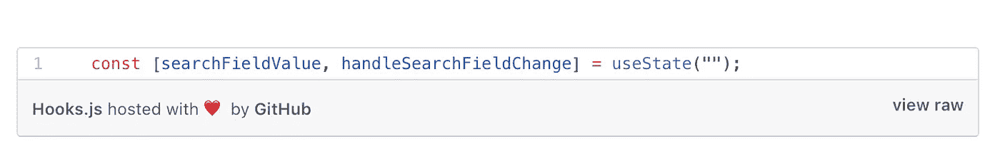

# 揭秘 React 挂钩

> 原文：<https://betterprogramming.pub/demystifying-react-hooks-a0b56a6254c2>

## 钩子如何节省你的时间并提高你代码库的质量

照片由[安纳亚·卡特莱戈](https://unsplash.com/@anaya_katlego?utm_source=medium&utm_medium=referral)在 [Unsplash](https://unsplash.com?utm_source=medium&utm_medium=referral) 上拍摄

你可能听说过 React 的最新功能:钩子。React 版本 16.8 中发布了钩子，它们让我们不用使用类语法就能编写有状态的组件。

如果你想了解更多关于钩子的知识，这个指南是一个温和的介绍。

React 钩子是什么样子的(后面解码)

简而言之，很难在类组件之间重用状态、逻辑和功能。你要么传递道具，要么使用渲染道具，这就导致了 *(a)* 巨大的组件、 *(b)* 组件间重复的代码，或者 *(c)* 像高阶组件这样的复杂模式的问题。

> 如果你是 React 新手，我建议你阅读“[*React 学习之路:你掌握简单而实用 React.js*](https://amzn.to/2GAxiBW) ”来开始使用 React。

钩子在组件内部应用 React 哲学(显式数据流和组合)*，而不仅仅是在组件之间。*

# 将 React 组件从类重构为钩子

请记住，钩子仍然是相对较新的东西，没有人希望你只使用钩子来重构你的应用程序。但是尝试一些新的东西并改善代码库的整体结构和质量并没有坏处。

以下面的 React 类组件为例。

该组件有三个职责:

*   保存搜索状态
*   更改搜索状态
*   呈现搜索用户界面

这个组件没有什么令人兴奋的地方，但是总有改进的方法。你如何通过使用钩子来改进组件？

# 钩子来拯救

让我们把同一个类组件变成基于钩子的组件。我们不会改变搜索本身的任何功能，只是将代码从类重构为钩子语法。

哇哦。我们从 29 行代码变成了 17 行代码。如果我的数学没有让我不及格，那我们要写的代码量就大大减少了 41.3%。

如果我们可以为每个组件节省 41.3%的时间，在纸上，我们可以用几乎一半的时间编写我们的应用程序。将我们编写应用程序所需的时间减少一半过于乐观，但这是可能发生的。只有时间能证明一切。

变化是生活中唯一不变的东西，所以让我们来揭开钩子如何工作的神秘面纱。

我们需要做的第一件事是从 React 包中导入`useState`。

用钩子定义我们的状态如下:

这可能会让你一时糊涂。我知道这让我很困惑。数组括号在那里做什么？

数组括号语法称为[数组解构赋值](https://developer.mozilla.org/en-US/docs/Web/JavaScript/Reference/Operators/Destructuring_assignment)。

析构赋值语法是一个 JavaScript 表达式，它可以将数组中的值(或对象中的属性)解包到不同的变量中。

析构赋值使用赋值的左边来定义从源变量中解包什么值。这里有一个例子来说明:

`searchFieldValue`是第一个值，是初始状态。

第二个参数`handleSearchFieldChange`，只是一个函数，允许我们根据作为参数传递的内容来改变`searchFieldValue`状态。

为了让大家明白这一点。

所以我们开始吧。每当我们拥有有状态组件时，我们不再有义务使用基于类的语法。

下面是如何用 React 钩子创建搜索组件:

# 我应该使用钩子、类还是两者的混合？

官方反应文件很好地解决了这个问题。

当你准备好了，我会鼓励你开始尝试你写的新组件。确保团队中的每个人都在使用它们，并且熟悉这些文档。我不建议把你现有的类重写到钩子上，除非你打算重写它们(比如修复 bug)。

举个例子，我们有一个开关。通过点击标签，我们触发了相对于当前状态的从假到真，或从真到假的状态变化。

请注意如何将任何值或类型传递给`useState()`——我们传递一个布尔值作为初始状态。你甚至可以传递一个对象、数组或数字，就像使用`setState({})`一样。

现在去玩 React 钩子吧！从小处着手，用钩子创建几个组件。

玩现场版[这里](https://bhgyo.codesandbox.io/)。

 [## 用钩子做出反应

### 与 Indrek Lasn bhgyo.codesandbox.io 挂钩](https://bhgyo.codesandbox.io/) 

# 从这里去哪里

我建议阅读 React 官方文档。还有很多 React 钩子等着被发现。在学习 React 方面，也有一些有用的书籍。我建议通读“ [*学习 React 之路:你掌握简单而实用 React.js*](https://amzn.to/2Yz8Lr5) ”来了解更多关于 React 的知识。

 [## 钩子 API 参考-反应

### 钩子是 React 16.8 中的新增功能。它们允许您使用状态和其他 React 特性，而无需编写类。这个…

reactjs.org](https://reactjs.org/docs/hooks-reference.html)