# 揭秘 Spring Boot

> 原文：<https://betterprogramming.pub/demystifying-spring-boot-245e71feffc0>

## Spring Boot API 开发的基础


图片来源:Sprint Boot

后端框架的世界比前端框架的世界要罕见得多。你总是听说 JavaScript 和它的风格，比如 React、Vue 和 Angular ( *咳咳*)。在 YouTube 上，前端视频的数量以秒为单位成倍增长，对于包括我在内的许多人来说，我们可能听到的第一种后端语言是 PHP。我花了一段时间才意识到 Python 可以做类似 Flask 和 Django 的事情。但是，我没有看到这些像 JavaScript 和一般的 Python 和 Java 语言一样淹没我的通知。

当浏览职位描述时，尤其是在我的国家，雇主要求的最常见的后端框架之一是 [Spring Boot](https://spring.io/projects/spring-boot) 。到这个时候，当我决定学习这个看似流行的框架时，我已经习惯了 Flask 和 Express 这样的框架。根据我的经验，我可以说这次旅行并不有趣。

我遇到的问题:

1.  春天和 Spring Boot——到底有什么区别？
2.  春天是古老的，这些年发行了相当多的版本。大多数代码片段不是被否决就是过时了。
3.  要完成在 Express 或 Flask 中可以轻松完成的简单任务，需要做大量的工作。这一切的意义何在？
4.  Java 语法可能会变得复杂。
5.  创建复杂程度不同的 Spring 项目有很多方法。
6.  对为什么使用某些语法的解释过于复杂。

如果你和我一样，有这些问题，甚至是第一次学习 Spring，这篇文章肯定会在你的编程之旅中帮助你。

# 什么是 Spring Boot？

要回答这个问题，你需要知道什么是[弹簧](https://spring.io/)。Spring 是一个用于企业级应用程序的 Java 框架。它附带了许多工具，可以针对这种类型的开发进行配置。Spring 允许的最常见的开发类型之一是创建 web 应用程序——尤其是 API 开发。当它变成配置地狱时，问题就出现了！启动任何类型的应用程序都需要大量的配置。

然后 Spring Boot 来了。Spring 团队意识到他们的开发人员运行如此多的配置是多么乏味。有了所有这些配置，甚至在开发开始之前就很容易出错。Spring Boot 允许你抽象(隐藏)这些配置。因此，您可以获得一个预配置的模板应用程序。这将是你的起点。您可能想知道，“如果我想改变这些配置呢？”嗯，这就是 Spring Boot 的魅力所在——你可以随时更改它们，但大多数时候默认模板就是你所需要的，你可以在那里添加或删除你认为合适的任何内容。您甚至可以组合不同的模板(例如，Spring Web 和 Spring Security)。

让我们开始吧。这篇文章将集中在获得 Spring Boot 的基础下来。主要的焦点是 web 应用程序，尤其是 RESTful 应用程序(API 开发)。

# 什么是 API？

一个*应用程序编程接口*或 *API* 是一个软件中介，允许两个应用程序相互对话。它们促进了程序之间的交流。它本质上是一个对特定服务的请求。这项服务理解您的请求，并根据您的要求做出适当的回应。

想象一下，一个服务员接受你的订单，并根据你的要求给你一顿饭。

对于这个项目，我们将创建一个 REST API。

# 创建一个 Spring Boot 项目

由于 Spring 需要大量的配置，Spring 团队创建了一个工具，您可以在其中生成多种配置。这些配置可以叠加起来创建您的起始项目。

让我们访问[https://start.spring.io/](https://start.spring.io/)产生我们的 Spring Boot 项目。

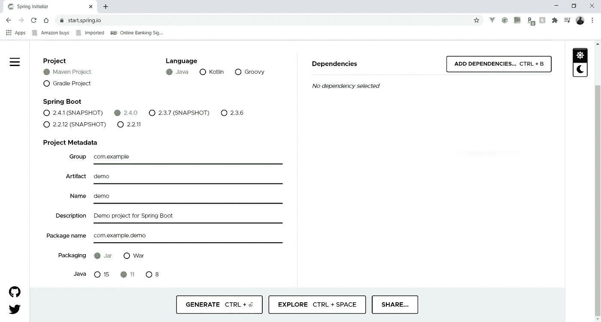

打开页面。作者截图来自[https://start.spring.io/](https://start.spring.io/)

这一页上面是我们将设立我们的 Spring Boot 项目。默认情况下，它附带了设置示例。我们将主要坚持默认设置。对于这个项目，我们将修改元数据并向项目添加依赖项。

## 该项目

Java 有两个包管理器， [Maven](https://maven.apache.org/what-is-maven.html) 和 [Gradle](https://gradle.org/) 。

*   maven——这是 Java 的行业标准包管理器。
*   Gradle——Gradle 比 Maven 更新，构建时间也更快。这在原生 Android 开发中使用。

对于这个项目，我们将使用Maven。

## 项目元数据关键术语

*   **Group** —这是我们的项目将被放置的包的名称。惯例是给它一个你所代表的组织的反向域名。默认显示 *com.example* ，这将是*example.com*的反向域名。如果你为一家公司工作，你会使用他们的反向域名，例如 *com.google* 。我们将把我们的小组命名为 *com.starting* 。
*   **工件** —这是我们组中的包的名称，它将包含我们应用程序的主要代码。这就是`public static void main`所在的位置。这个项目的工件是*基础*。
*   **包名** —当组和工件字段被填充时，该字段将被自动填充。这是最初的包装。将它命名为组加工件是惯例。因此，这个项目被命名为 *com.starting.basics* 。

选择您的计算机系统支持的 Java 版本。较新的 Java 版本向后兼容旧版本。就我而言，在撰写本文时，我已经安装了最新版本的 Java。但是为了简单起见，我将使用 Java 8。

## 属国

依赖关系是那些默认配置。对于这个项目，我们将只使用一个依赖项:Spring Web 依赖项。

*   Spring Web——包含构建 Web 应用程序所需的一切。在这种情况下，这是一个 RESTful 服务。它自带内置服务器。这个服务器是 Apache Tomcat。

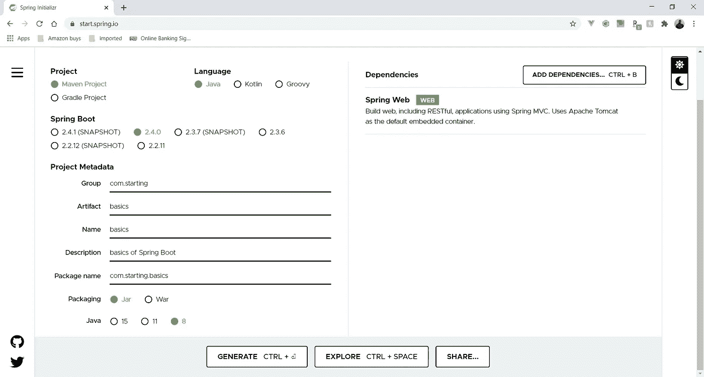

最终配置。作者截图来自 https://start.spring.io/

您的配置应该看起来如上图所示。

我们现在已经生成了我们的 Spring Boot 项目。这应该以. zip 文件的形式出现。提取文件。记住地点——这非常重要。

我可能忘记了包括一些将在本文中用到的软件:

1.  IntelliJ —我的 Java 集成开发环境。其他的也可以使用，但是我将要展示的过程主要是针对 IntelliJ 的。
2.  [邮递员](https://www.postman.com/downloads/) —用于测试 API

IntelliJ 来了，我们将使用它进行开发。我们将在 IntelliJ 中打开之前提取的项目。

为此，我们将:

转到文件>打开。然后选择并打开先前提取的包含项目的文件夹。

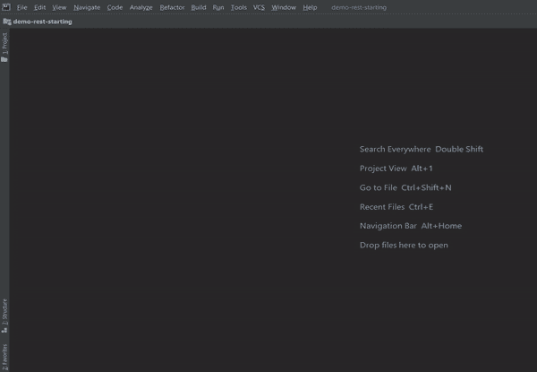

由作者生成的屏幕共享

在打开时，它应该自动开始安装我们在 Spring Initialzr 中决定的依赖项。这些依赖项都存储在一个`pom.xml`文件中。

# 项目结构

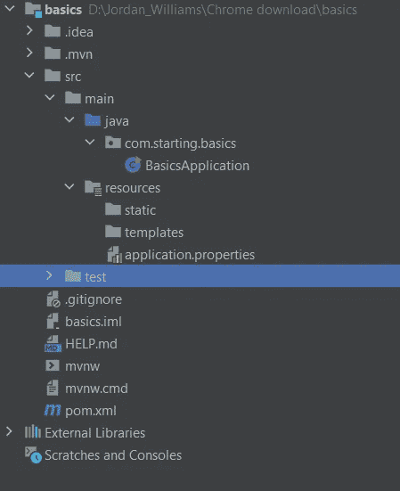

作者截图

以上是一个 Spring Boot 项目的结构。我们的代码存储在`src`文件夹中，它带有存储在`test`文件夹中的内置测试。`mvnw.cmd`本质上是这个本地包的 Maven。记住 Maven 是我们在这个项目中使用的包管理器。你可以把它想象成一个 npm (Node.js 包管理器)或 pip (Python 包管理器),但只是本地安装——如果你愿意，你也可以全局安装。

让我们来看看`pom.xml`。它位于项目的根目录中。如前所述，这是我们所有依赖项的存储位置，类似于 Node 中的`package.json`。这个文件还存储了关于我们项目的一般配置和信息。你的`pom.xml`看起来应该和下面的类似。

如您所见，它是 XML 格式的。在 XML 文件内部，您可以看到我们之前给出的相同的`groupId`、`artifactId`和`description`。在父标记中，我们有一个项目模板，我们从它那里继承，在这个项目中使用。

我们所有的依赖关系都可以在`dependencies`标签中找到。也可以在这里添加新的依赖项。

让我们导航到我们的`src`文件夹(我们的源代码所在)并进入`com.starting.basics`。这个包和我们在 Spring Initalzr 中创建的包是一样的。在这个包中，我们应该有我们的主文件，`BasicApplication.java`。

这是一个带有 main 方法的基本 Java 类。这是我们应用程序的入口点。`@SpringBootApplication`正是这个 Spring Boot 应用程序。这是一个为类提供一些功能的注释。Spring Boot 有很多注解。这个特定的注释是对三个常规 Spring 注释的抽象，这三个注释合并成了一个。正如我之前强调的，Spring Boot 是为了简化 Spring 开发而设计的。以前，您必须用`@Configuration`、`@EnableAutoConfiguration`和`@ComponentScan`来注释这个类(本文或项目不需要这些知识)。

# 创建静止控制器

所有这些的目的是创建一些 API。为此，我们需要创建一个控制器。控制器只是处理传入请求并对该请求执行一些操作的服务。为此，我们将创建另一个类。

在`com.starting.basics`内部，创建一个`RestApiController`类。这个类将会在我们的`com.starting.basics`包中。

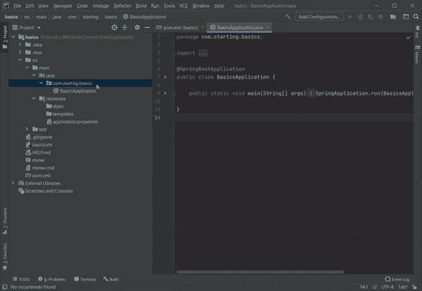

由作者生成的屏幕共享

我们需要首先告诉 Spring 它是一个 REST 控制器。这是通过将`@RestController`添加到`RestApiController`类来实现的。

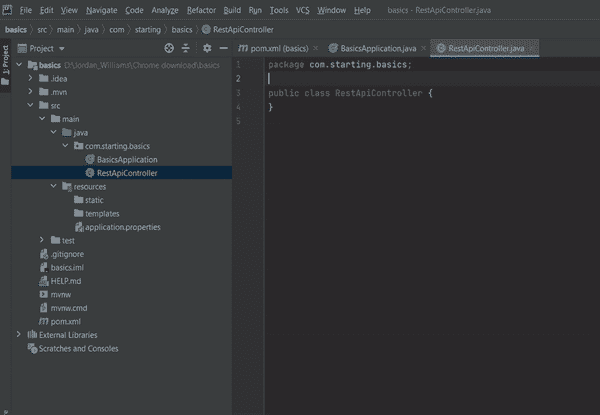

由作者生成的屏幕共享

**注意:** IntelliJ 应该处理自动完成和自动包导入，如上所示。

Spring Boot 的使用需要大量的包装进口。

现在我们需要添加第一个端点。这将是一个`GET`请求。

```
@RequestMapping(value = "/home",method = RequestMethod.*GET*)
public String index(){
    return "hello world";
}
```

这个方法可以添加到我们的`RestApiController`类中。`@RequestMapping`注释告诉 Spring 我们正在创建一个端点。该值指示附加到根 URL 的路径(<根 url > + <值>)。`RequestMethod.*GET*`添加到方法参数中，告诉它我们正在进行的请求的类型。同样，你也可以用`POST`、`PUT`、`PATCH`或`DELETE`、*、*来代替`GET`、*。如果没有指定方法，默认情况下，它将接受所有方法请求。*

我们的代码现在应该看起来像上面的代码片段。

让我们最终运行我们的代码。

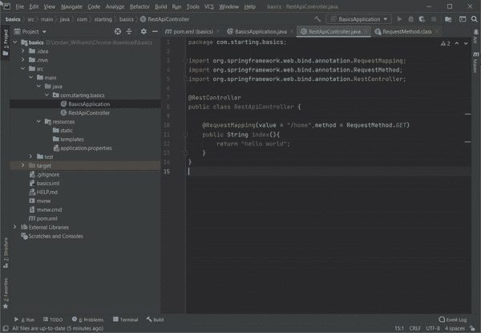

由作者生成的屏幕共享

当您运行这段代码时，它将在 [http://localhost:8080/](http://localhost:8080/) 上启动 Tomcat Apache 服务器。这将是我们的根 URL。然而，因为我们有了那个`@RequestMapping`值，所以我们访问端点的 URL 是[http://localhost:8080/home](http://localhost:8080/home)。

让我们在浏览器中导航到 http://localhost:8080/home。

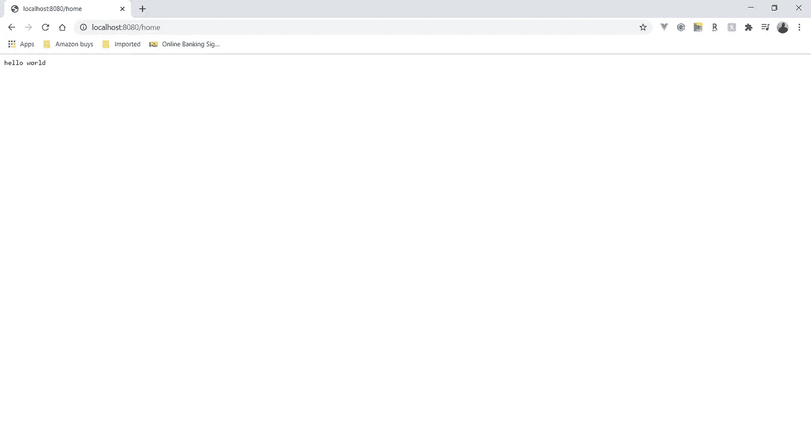

作者截图

# 基础知识

之前，我们使用请求映射来创建一个`GET`请求。但是有一些速记语法可以达到同样的效果。除了使用`@RequestMapping`，我们还可以使用`@GetMapping`。

```
@GetMapping("/home2")
public String index2(){
    return "hello world 2";
}
```

让我们将上面的代码添加到控制器中。这是我们之前所做的简写语法。其他请求类型也有类似的方法，例如`@PostMapping`。将它添加到我们的代码中之后，让我们重新运行我们的应用程序。

如果我们转到[http://localhost:8080/home 2](http://localhost:8080/home2)，我们将看到以下输出:

```
hello world 2
```

我们现在要做一个`POST`请求。这需要一个邮递员。

要在 Spring Boot 创建一个`POST`请求，我们必须决定我们希望在请求体中包含什么。假设我们想要将一个雇员添加到一个假设的数据库中。我们希望我们的员工有一个ID、名、姓和电子邮件地址。

请求正文示例如下所示:

```
{"eid": 1,"firstName":"jordan","lastName": "williams","email": "test@gmail.com"}
```

让我们创建将被添加到控制器中的方法。

```
@PostMapping("/employee")
public Employee addEmpoyee(@RequestBody Employee employee){
    return employee;
}
```

我们使用`@PostMapping`是因为它是一个`POST`请求。我们通过`@RequestBody`注释指定一个参数将出现在主体中。在这里我们有一个`employee`对象。我们必须创建一个`Employee`类。这个类将拥有与请求体中需要传递的属性相同的所有属性。同样的`Employee`类是这个方法的返回类型。在 Spring 中，对象在返回时被转换成 JSON。这个过程被称为材料化。

在`com.starting.basics`包中，创建`Employee`类，如下面的代码片段所示:

这是我们的`Employee`班。

```
private int eid;
private String firstName;
private String lastName;
private String email;
```

这些属性构成了我们请求主体的蓝图。您的请求体需要与这些属性具有相同的名称，否则它不会附加到其特定的属性。来自发送的请求的 JSON 被序列化过程转换成`employee`对象。

设置器是必需的，因为这是将主体中传递的值绑定到`employee`对象的原因。吸气剂只是在必要时便于使用。

让我们进入邮差和发送它的请求。

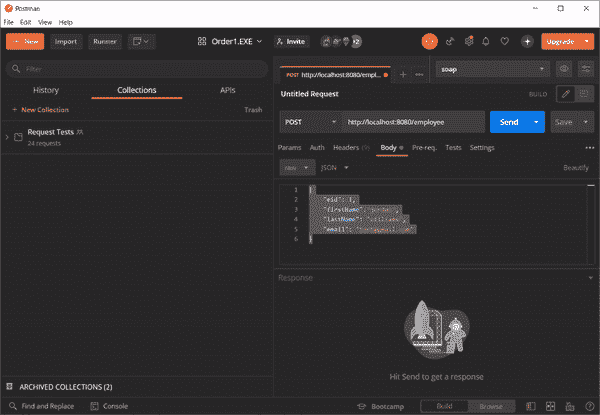

由作者生成的屏幕共享

在 Postman 中，我们必须提供在`Employee`类中指定的所有字段。它获取所有这些字段并将它们存储在一个`employee`对象中。如果一个字段拼写错误，它将不会被正确绑定到`employee`对象的属性，JSON 中的那个键将显示`null`。

创建 API 的另一个重要部分是使用状态代码。状态代码是普遍接受的代码，代表服务器上发生的操作。

我们可以使用`ResponseEntity`类在 Spring Boot 创建状态代码。这个类有静态和非静态声明。两者都将被显示。

让我们创建另一个`get`端点`/restresponsecodes`。

```
@GetMapping("/restresponsecodes")
public ResponseEntity responses(){

    return new ResponseEntity("created response code ", HttpStatus.*OK*);
}
```

为此，我们返回了一个响应实体。该对象将显示在响应正文中的响应消息作为其第一个参数。在这个例子中，我放置了一个字符串。它很可能是一个已经被序列化为 JSON 的对象。第二个参数包含状态代码，由 enum 类`HttpStatus`表示。在本例中，我们在该枚举下使用了`OK`常量。如果您知道您的 HTTP 状态代码，您会知道`OK`由状态代码 201 表示。还有其他几个常量可以使用，如`NOT_FOUND`、`BAD_REQUEST`、`UNAUTHORIZED`等。，它们都有各自代表的状态码*。*它是一个包含所有 HTTP 状态码的 enum。

输出:

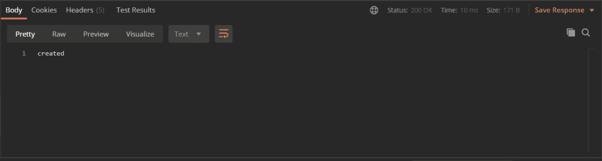

作者截图

另一种实现方法是使用`ResponseEntity`类的静态方法。

我们将用`/restresponsecodes2`创建这个替代端点。

```
@GetMapping("/restresponsecodes2")
public ResponseEntity responses2(){

    return ResponseEntity.*ok*("created");
}
```

我们使用静态方法`.ok`。这相当于我们在前面的例子中所做的，但是我们使用了`.ok`方法。这与放置`HttpStatus.*OK*`和*是一样的。我们现在需要做的就是声明在响应体中输出什么消息。在这种情况下，消息是`“created”`。*

在这些静态的`ResponseEntity`方法中，有一些要求你显式地给方法附加一个主体。

让我们看看下面的端点。

```
@GetMapping("/restresponsecodes3")
public ResponseEntity responses3(){

    return ResponseEntity.*badRequest*().body("something went wrong");
}
```

对于一个不好的请求，您必须在 JSON 中显式地为它放置一个包含您想要返回的消息的主体。

输出:

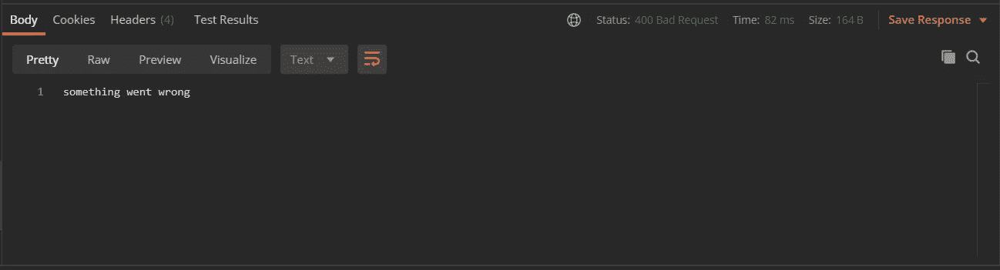

# 结论

现在你知道了。你刚刚为 Spring Boot 打下了基础！这些是关于如何创建 REST API 的一些要点。接下来，我们将学习创建一个连接到数据库的 CRUD 应用程序。

[](https://medium.com/better-programming/demystify-spring-boot-part-2-dc957069b584) [## 揭开 Spring Boot 的神秘面纱(下)

### 在 Spring 中构建一个连接到 MariaDB 数据库的 API

medium.com](https://medium.com/better-programming/demystify-spring-boot-part-2-dc957069b584)