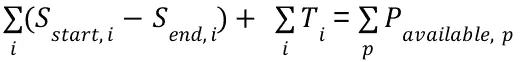
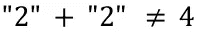

# 揭开 t 恤尺寸项目估算的神秘面纱

> 原文：<https://betterprogramming.pub/demystifying-t-shirt-size-estimations-6484d92ebe61>

## 我们提高短跑可预测性的第一个方法


帕克·伯奇菲尔德在 [Unsplash](https://unsplash.com?utm_source=medium&utm_medium=referral) 上的照片

# 序言

这篇文章在虚拟抽屉里放了几个月。起初，我只给我们的团队阅读，然后我想在这里发表，但后来决定，如果第二个团队的整体方法证明是成功的，那么以后再发表。

圣诞节前不久，我们做了第二次实验，证明是成功的，所以终于是时候打开抽屉，发表…

周三，我们有机会对 t 恤尺寸与个人工作日的关系进行了首次测量。我们花了 5 次冲刺(总共 10 周)才达到这种状态。有什么大惊小怪的？为什么花了这么长时间？那给了我们什么？

# 博士，请说重点

## 它给了我们什么？

我们能够大大提高我们的冲刺可预测性。我们从最初估计导致大约 150%超负荷冲刺的状态开始。

由于没有实现承诺的 sprint 目标，这导致了开发团队和业务团队之间的紧张关系。

在大约七次冲刺的过程中，我们的团队能够达到稳定的工作状态，减少了与合作团队的紧张关系，并为计划的交付提供了可预测性。

# 说来话长

## 有什么大惊小怪的？

敏捷方法试图在原型世界之间架起一座桥梁(开发者们好！)，其中“*的不确定性很大，当*时会做什么，与生产的世界(你好经理！)，在那里明确的预言是日常生活，在那里人们问“*到什么时候才能准备好？*”。

由于原型处理大量的未知，软件开发人员通常无法预测他们什么时候可以发布产品。

可能会出现错误，可能会出现额外的困难，不可预见的相互依赖可能会使手头的任务变得复杂。预测完成一项任务需要多少个工作日类似于占卜。

然而，人类有一个非常方便而且实际上令人困惑的锦囊妙计——他们仍然可以很好地估计手头任务的复杂性。其中一种方法是基于“t 恤尺寸”——这样任务就被分成“非常复杂、复杂、常规、简单、非常简单”的类别:分别是 XL、L、M、S、XS。

知道人类可以很好地估计任务的复杂性，人们可以说"*如果有一种方法可以将这些转化为人的天数……"*事实上，确实有！

## 如何从 t 恤尺寸转换到 PDs？

公平地说，现在你们中的一些人可能在想"*为什么要浪费五次冲刺来测量这个？只需用 1 秒的故事点斐波纳契数列来完成一个简单的任务，只需要半天时间，你就完成了…”。*

这实际上是我们第一个假设的基础。也就是说—“*对复杂性类的努力不一定要遵循斐波纳契标度*”。如果不这样做，就会导致估计误差。
我们想确保万无一失，所以我们为我们的团队进行了测量。

如果你还记得中学时代，解简单的线性方程组(是的，这些**终究会派上用场！**)，那么这正是这样一种情况。
求解`A+B = 5`和`A - B = 3`可以通过将‘第 2 行’加到‘第 1 行’来进行，以消除 *B* 并计算`2A = 8`，最终得到
`A = 4, B = 1`的解。
同样的逻辑可以应用于稍微复杂一点的关于 XL，L，M，S，XS 的方程组。
如果你还记得条件的话，当这样一组方程组可解的时候——你至少需要 5 个方程，矩阵的行列式必须定义且非零(这个我就不解释了，保持冷静)。这就是为什么我们需要收集 5 次冲刺的数据来验证这个假设。

我们的方程组是:

```
L + 2M + S = 79
XL - L + 2M - S = 65
2L + S = 64
M + 3S + XS = 65
L + M + S - XS = 53
```

最终的解决方案是([见此处](https://www.wolframalpha.com/input/?i=solve+B%2B2C%2BD%3D%3D79+and+A-B%2B2C-D%3D%3D65+and+2B%2BD%3D%3D64+and+C%2B3D%2BE%3D%3D65+and+B%2BC%2BD-E%3D%3D53)):

```
XL = 63, L = 51/2, M = 81/4, S = 13, XS = 23/4,
```

或者用更通俗易懂的说法:

```
XL = 63, L = 25.50, M = 20.25, S = 13, XS = 5.75
```

## 我们怎么估计的？

在每个 sprint 规划阶段，我们坐下来和整个团队一起“玩”sprint poker，以评估手头任务的复杂性。这个关于如何计算自动售货机中口香糖数量的短片很好地解释了我们为什么要这么做。尽管这看起来很荒谬，但它有着非常深厚的科学基础，尽管它只是从“直觉”开始的。

## 每个等式对应什么？

因此，在我们的案例中，sprint #1 允许我们交付一个大的、两个中等的和一个小的复杂的故事，花费了团队 79 个人-天的努力。导致等式:

```
L + 2M + S = 79
```

## 负面术语从何而来？

你很可能已经注意到了等式 2 中的`- L` 和`- S`项，并且可能想知道“*究竟什么是负的大故事？*”。这些来自于对进展的测量和重复的评估。

估计并不总是正确的，现实也不允许我们随心所欲地交付一切。有时，我们只提供了我们承诺要做的事情的一部分。

如果我们以一个`XL`大小的故事开始冲刺，以一个 **L** 大小的剩余故事结束冲刺，我们使用一个类似于(`XL - L`的术语来考虑它。

## 为什么我们要重复评估？

由于一些先验估计可能是错误的，我们在最后重复了估计过程，以便用在冲刺中获得的所有知识来纠正它们。举例来说，这导致了一些最初`L`大小的故事被重新标注为它们噩梦般的、完全应得的`XL`大小。

有了这种后验知识和更新的估计，我们能够改进我们的方程组，给我们更准确的结果。

## 这些数字是什么意思？

因为等式的左边显然对应于簿记 sprint 可交付成果的进度，我们需要看看等式的右边。

这对应于团队工作和可用性的簿记部分:团队成员由于任何原因不可用的时间，如生病、休假或调查 bug 票(即使这些是 sprint 计划的一部分，但同样无法估计，因为它们通常相当于做大量的实验)。

这些估计的精确度高达 1 人-天(后来缩写为 PD)，并被引入如下等式:
假设在一个给定的 sprint 期间，一个 PD 被花费在调查一个 bug-ticket 上，并且整个团队的可用性是 80 个 PD，等式看起来像`L + 2M + S + 1 = 80`，然后被简化为`L+2M +S = 79`。

## 如何建立方程？

左侧包含所有故事的复杂性总和——在 sprint 中处理的票证和在所有时间盒票证上花费的 PD 总和(峰值、错误等):



短跑方程式

其中 *S* 项表示在冲刺*开始*和*结束*时估计的第 *i-* 个故事复杂度。简而言之——在冲刺阶段，一个给定的故事取得了多少进展。

*T* 项表示花在限时项目上的 PDs 金额。右侧包含与团队能够提供的总人日数相对应的条款 *P* 。

# 为什么这么努力？

## 假设陷阱…

经典的敏捷计划通常依赖于如下假设:

> 故事复杂度-大小算术遵循斐波纳契数列:1，2，3，5，8
> 来说明当小任务被整合到更大的故事和史诗中时出现的复杂度。翻译成:`*XS + S = M, S + M = L, M + L = XL*`。

和

> 一个复杂的故事`*XS*`需要大约一天，`*S*`需要两天，结果导致`*M*`需要半个工作周，`L`需要一整周，`XL`需要将近两周。

然而，正如经常发生的那样，这些假设可能就像一个坏了的时钟，每天显示两次正确的时间。他们有时可能是正确的，但不能保证他们对每个团队都有效。
为了让假设起作用——使用该方法的团队必须*偶然地*让他们对复杂性的直觉估计首先真正符合假设。

如果不是这样，团队就会陷入一个陷阱，试图使用数字的字符串表示来做算术:



“2”加“2”并不总是等于 4

## …通过测量解决

**陷阱 1:斐波纳契复杂度。**
为了避免这一缺陷，我们的团队选择测量并验证:

> 我们的估计真的符合斐波纳契数列的假设吗？

并且发现答案是:**没有**。

正如你很容易看到的，我们的结果: **63，25，20，13，6，**与对应的斐波纳契数列: **51，32，19，13，6** 相差甚远。
因此，如果我们决定首先使用斐波纳契数列——因为前三个最低的复杂性大小确实非常适合这个序列——大型和超大的故事将极大地增加我们估计的误差。

这个结果的另一个收获是理解了一条经验法则:*不要把 XL 的故事带入冲刺阶段，而是把它们分开*。

陷阱 2:假设一个 XS 的故事需要一个 PD。
另一个被避免的陷阱是，验证假设:

> 一个额外的小任务平均需要一个 PD 吗？

又带来了答案:**号
号**在我们的测量中，**对于我们团队**来说竟然是大约**6**PDs。

想象一下把这个假设作为公理的后果…
假设值和实际值之间的巨大差异只会导致我们的计划越来越偏离。现在，有了这种认识，我们可以调整我们的计划并改进结果。

# 结果

> 我们可以更精确地计划！

这并不意味着工作已经完成，我们现在可以永远使用这些数字。规划精度仍可进一步提高，这仍是我们的目标。幸运的是，现在我们不需要再投资 10 周来改进。现在每一次冲刺都会增加我们预测的准确性。

需要记住的是，这里涉及到一些错综复杂的问题:

*   团队学会更好地估计，这应该会改善我们的结果，但也意味着我们使用的方程描述了一个动态和变化的系统，
*   团队不断自我发展——人们加入，人们离开，人们相互影响，影响他们生活中发生的事情。这些方程大大简化了我们的工作。
*   团队环境在发展——我们尽最大努力提高系统的质量。我们在上面工作的时间越长，我们作为一个团队一起工作的时间越长，我们与其他团队的合作越好，我们的效率就应该越高。

# 尾声——冲刺之后

很容易想象团队对结果的最初反应是怀疑的。毕竟，几乎每个开发人员都已经在使用敏捷了，这肯定是错误的，它只是不同于人们通常不检查它就使用的东西…

我们又进行了两次冲刺，让车队相信结果是正确的。在接下来的冲刺中,“数学”得到了解决，冲刺的可预测性得到了提高。

这篇文章的最初版本，使用我们的电子表格进行估算，作为概念验证提供给第二个团队。
有了第二个团队，我们能够更快地提高可预测性。
结果将在另一篇文章中描述([，你现在可以在这里找到](https://medium.com/@bchmura/improving-sprint-predictability-in-agile-scrum-611e2d1081ad))。