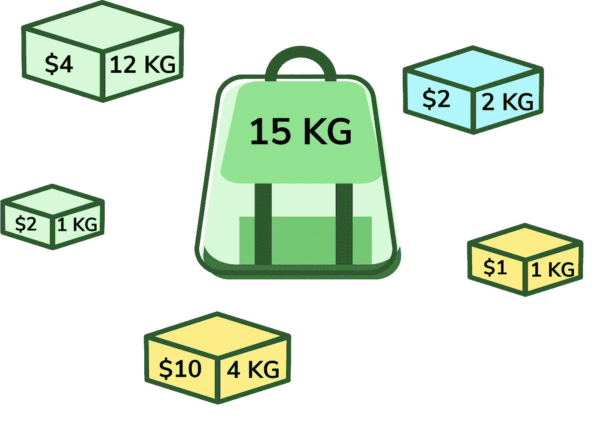
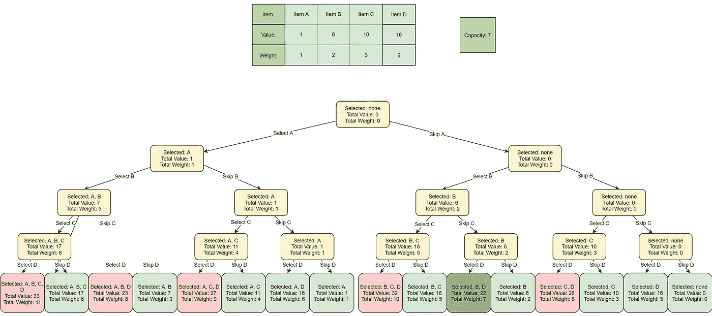
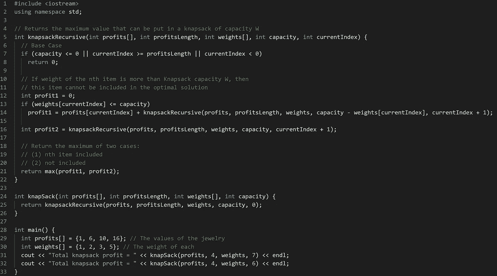
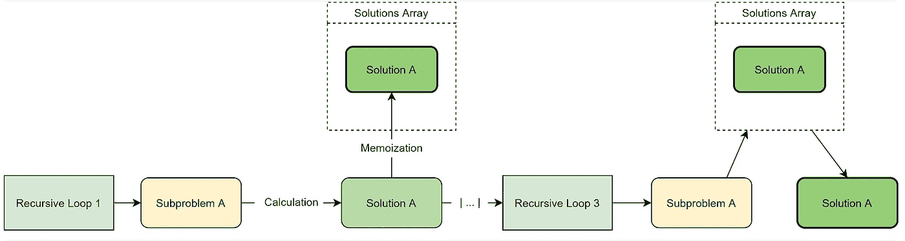
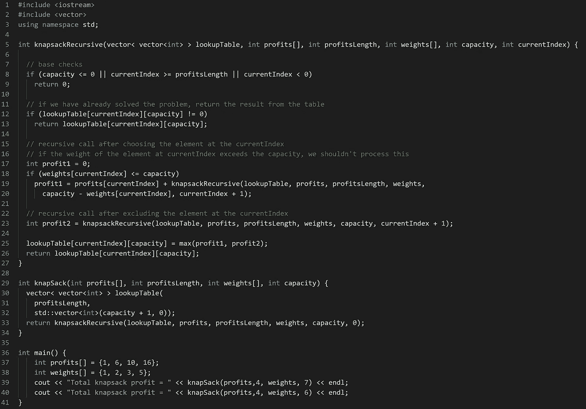

# 揭秘 0-1 背包问题

> 原文：<https://betterprogramming.pub/demystifying-the-0-1-knapsack-problem-56e7ac4dfcf7>

## 顶级解决方案，解释


图片来源:作者

在你参加的任何动态编程编码面试中，你都可能会遇到*背包问题。*由于解决方案的复杂性和问题变体的数量，这个问题经常让受访者感到焦虑。

今天，我们将通过探索两种流行的解决方案，让您熟悉多种语言的背包问题:递归解决方案*和自顶向下动态编程算法解决方案*和*。到本文结束时，您将拥有自信地解决背包问题所需的经验。*

## **这是我们今天要讲的内容**

```
1\. [What's the knapsack problem?](#f51c)
2\. [Brute-force recursive solution](#a374)
3\. [Optimized dynamic programming solution](#bf21)
4\. [What to learn next](#88fc)
```

# 背包问题是什么？

背包问题是计算机科学领域最热门的动态规划面试问题之一。

问题陈述是:



图片来源:作者

你是一名窃贼，带着一个总重量为`capacity`的背包。您有一组项目(`n`项目)，每个项目都有固定的重量容量和值。权重和值以整数数组表示。创建一个函数，`knapsack()`，找到这些物品的一个子集或数量，使价值最大化，但其总重量不超过给定的数量`capacity`。

# 背包问题变体

这个问题有两个主要的变体:*小数*或者 *0-1。*分数变体允许您将物品分开，以最大化包装中的价值。0-1 变体不允许您拆分项目。

另一个常见的变种是*约束*背包问题，它限制你的程序，所以你不能选择任何项目超过一次。当一个元素被选中时，程序必须决定是把它放入包中还是把它留下。

在高层面试中，你会遇到将音量作为约束属性的变体。在这种情况下，每个物品也有固定的体积，背包有体积限制。

# 它考什么技能？

这个问题之所以如此流行，是因为它同时测试了许多想要的技能，并且可以改变，让面试者失去平衡。换句话说，你必须真正理解问题和代码的逻辑。简单的记忆不会让你走得太远。

背包问题的最优解总是一个动态规划解。面试官可以用这个问题来测试你的动态编程技能，看看你是否在为一个优化的解决方案而工作。

背包问题的另一个流行的解决方案是使用递归。如果面试官重视这两种技能，他们可能会要求你给出一个递归和动态的解决方案。这是一个受欢迎的选择，因为面试官可以看到你从递归到动态解决方案的转变有多好。

背包问题也测试你如何处理组合优化问题。这在工作场所有许多实际应用，因为所有组合优化问题都在约束条件下寻求最大利益。

例如，组合优化用于以下解决方案:

*   确定在有限资源云系统上运行的最佳程序
*   优化固定管网中的水分配
*   自动规划最佳包裹递送路线
*   优化公司的供应链

任何管理或创建自动化优化软件的角色都会被问到这个问题。

# 强力递归解决方案

这个问题最明显的解决方案是强力递归。这种解决方案是蛮力的，因为它评估所有可能子集的总权重和值，然后选择仍低于权重限制的具有最高值的子集。

虽然这是一个有效的解决方案，但它不是最优的，因为时间复杂度是指数级的。如果要求您使用递归方法，请使用这个解决方案。它也可以是动态解决方案的良好起点。

**时间复杂度:**o(2^{n})*o*(2*n*)，由于子呼叫重叠的呼叫数量

**辅助空间:** O(1) *O* (1)，不需要额外存储

# 解决办法

这是我们算法的可视化表示。

**注意:**所有红色项目子集超过我们包的容量；浅绿色在容量范围内，但不是最高值。



背包暴力递归



# 说明

在第 14 行，我们从重量数组的开头开始，检查该物品是否在最大容量内。如果是，我们用这个项目递归调用`knapsack()`函数，并将结果保存在`profit1`中。

然后我们递归调用函数，排除该项，并将结果保存在`profit2`变量中。在第 21 行，我们返回了`profit1`和`profit2`中较大的一个。

## **伪代码**

下面是这个程序如何运行的伪代码解释。

```
for each item 'i' starting from the end
  create a new set which INCLUDES item 'i' if the total weight does not exceed the capacity, and recursively process the remaining capacity and items
  create a new set WITHOUT item 'i', and recursively process the remaining items 

return the set from the above two sets with higher profit
```

这个程序包含许多重叠的子问题，但是它们每次都被计算，而不是被存储。重复计算大大增加了运行时间。为了避免重新计算，我们可以使用动态编程来记忆子问题的解决方案以便重用。

# 优化的动态规划解决方案

现在，我们将通过添加自顶向下的动态编程来处理重叠的子问题，从而优化我们的递归解决方案。

因为我们的递归函数`knapsackRecursive()`中有两个变化的值(`capacity`和`currentIndex`)，所以我们可以使用一个二维数组来存储所有已解决子问题的结果。如上所述，我们需要存储每个子数组(即，每个可能的索引`i`)和每个可能的容量`c`的结果。

这是背包问题在时间和空间复杂度上的最优解。

## **时间复杂度**

O(N * C)*O*(*N*∫*C*):我们的记忆表存储所有子问题的结果，最多有 N * C*N*∫*C*个子问题。

## **辅助空间**

O(N * C+N)*O*(*N*∫*C*+*N*)，O(N * C)*O*(*N*∫*C*)内存化表空间和 O(N) *O* ( *N* )递归调用栈空间

**小贴士:**在面试中，确保和面试官谈谈你的思考过程，这样他们就能看到你解决问题的能力。

# 解决办法



记忆化动态规划的可视化



# 说明

实现动态编程，只需要改五行。

在第 9 行，我们创建了一个二维数组`dp`，用来保存任何已解决子问题的结果。这允许我们以后使用这些记忆解决方案，而不是重新计算答案。

在第 22 行和第 23 行，我们创建了一个案例来检查`dp`是否已经找到了当前子问题的解决方案。如果我们有了它，我们返回记忆解，然后继续下一个子问题。

在第 38 行，如果我们在`profit1`中包含当前物品，我们将计算行李的最大可能价值，如果我们在`profit2`中排除当前物品，我们将计算行李的最大价值。然后，我们将其中较高的值保存在我们的二维数组中，`dp`。

在第 39 行，我们返回背包值最高的物品。这是在下一个递归调用开始之前结束一个递归调用的部分结果。一旦所有可能的组合都出现这种情况，第一次调用将返回实际结果。

# 接下来学什么

感谢您完成对 0-1 背包问题的深入研究。对动态编程编码面试问题的信心来自实践和对流行问题变体的接触。

当你准备下一次编码面试时，这里有一些你想研究的 DP 问题:

*   最长公共子串问题
*   回文子序列问题
*   斐波那契数问题
*   楼梯问题
*   硬币兑换问题

面试愉快！