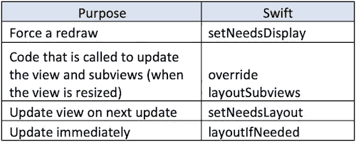
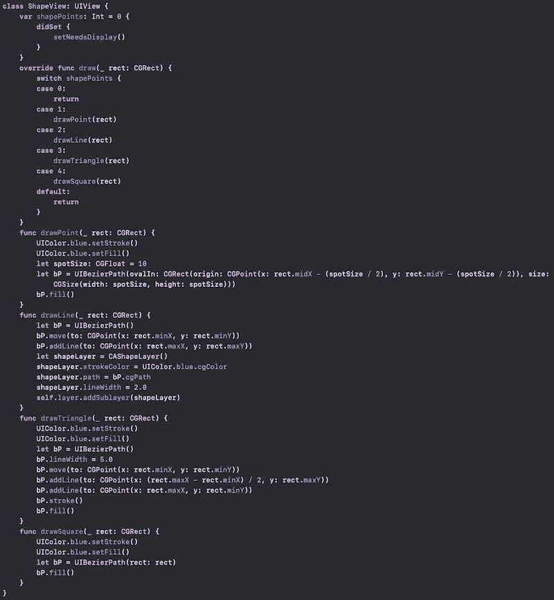
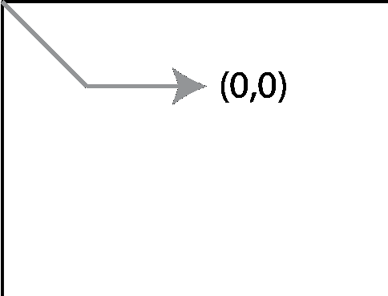

# iOS 视图绘制周期揭秘

> 原文：<https://betterprogramming.pub/demystifying-the-view-drawing-cycle-fb1f7ac519f1>

## 理解为了表达我们的观点而调用的方法

照片由 [Neven Krcmarek](https://unsplash.com/@nevenkrcmarek?utm_source=medium&utm_medium=referral) 在 [Unsplash](https://unsplash.com?utm_source=medium&utm_medium=referral) 上拍摄

难度:初学者| **简单** |普通|挑战

# 先决条件

*   对面向对象的一些理解将是有益的。

# iOS 应用程序的主运行循环

苹果已经启用 iOS SDK 来处理用户事件，并通过使用事件队列来触发应用程序内的响应。

当用户与应用程序交互时，事件被添加到事件队列中，然后可以由应用程序处理，并可能被分派给应用程序中的其他对象。一旦事件被处理，它们就将控制返回到主运行循环，并开始更新周期，该周期负责布局和绘制视图。

# 更新周期

一旦控制返回到主运行循环，系统根据视图实例上的约束渲染布局。

当视图被标记为需要在下一个更新周期中进行更改时，系统会执行所有更改。

系统通过运行循环工作，然后在延迟布局通过之前进行约束。

## 延迟布局传递

约束通常会在创建视图控制器的过程中创建(可能在`viewDidLoad()`函数中)。

然而，在运行时，系统不会立即对约束的动态变化采取行动。不幸的是，更改将处于陈旧状态，等待下一次延迟的布局传递——实际上，这可能永远不会发生。用户正在查看过时的视图。糟糕透了。

同样，对对象的其他更改(如更改控件的属性)也会更改对其他对象的约束，从而可能导致相同的问题。

对此的解决方案是通过在相关视图上调用`setNeedsLayout()`(或`setNeedsUpdateConstraints()`)来请求一个延迟的布局传递。

从技术上讲，延迟布局走刀([根据文件](https://developer.apple.com/library/archive/documentation/UserExperience/Conceptual/AutolayoutPG/ModifyingConstraints.html#//apple_ref/doc/uid/TP40010853-CH29-SW2))包括两次走刀:

1.  更新过程会根据需要更新约束。这将调用所有视图控制器上的`updateViewConstraints`方法和所有视图上的`updateConstraints`方法。
2.  布局过程根据需要重新定位视图的框架。这将调用所有视图控制器上的`viewWillLayoutSubviews`和每个视图上的`layoutSubviews`。

相关方法？它们就在下面，但在文章的后面会有更深入的探讨。

# 无限循环的风险

我们将视图放在一个列表上，以请求对延迟的布局传递进行更新。这样做的风险在于，通过每一次传递，都会产生另一个延迟布局传递的请求。

*   当重写方法时，总是调用超类。
*   不要在`layoutSubviews`里面叫`setNeedsLayout()`。
*   不要在`updateConstraints()`内呼叫`setNeedsUpdateConstraints()`。

# 使用 setNeedsDisplay 强制重绘

`setNeedsDisplay()`强制重绘特定视图。因为你永远不应该直接调用`draw(_ rect: CGRect)`，你可以把`setNeedsDisplay()` 想象成一个向 UIKit 请求重绘的方法。另一种思考方式是，调用`setNeedsDisplay()`将视图标记为脏视图；也就是说，在下一个更新周期，视图将通过延迟的布局过程重新绘制。

由于传递被延迟，它将发生在下一个更新周期，在此期间将在所有这样的视图上调用`func draw(**_**:)`。

对于初学者来说，这似乎有点令人困惑，因为大多数 UI 组件已经为我们解决了这个问题。但是，可能有一个属性不直接绑定到 UI 组件，我们需要通知 Swift 我们的调用是什么。

[点击查看要点](https://gist.github.com/stevencurtis/8ec7ca6596d3c9a16a04d900e0d17587)

# 使用 setNeedsLayout 触发布局刷新

当视图改变时，布局也会改变，这需要通过自动布局进行重新计算。

通常，布局会自动更新。也就是说，当调整视图大小时，它被添加到视图层次结构中，约束被更新，设备被旋转或用户滚动。

有些情况下，我们需要强制重新计算特定视图实例的布局。这些将在接下来的几个方法中讨论。

## setNeedsLayout()

`setNeedsLayout()`要求更新特定视图的布局。这将发生在下一个更新周期，由于 iOS 设备屏幕的快速刷新，应该足够快，用户不会遇到任何延迟。

## layoutIfNeeded()

这与`layoutIfNeeded()`相似，因为它强制立即更新布局。使用它的一个特殊例子是约束的[动画，由于动画的原因，它需要立即更新。](https://medium.com/@stevenpcurtis.sc/how-to-animate-auto-layout-constraints-fd114ab483c0)

## 布局子视图

当视图调整大小时，包括第一次设置时，调用`layoutSubview`方法。这意味着覆盖这将是一个合适的位置来设置一个 UIView，或类似的圆角半径。

这不是直接调用，而是由系统在视图第一次布局(即第一次绘图)和旋转时触发。可通过`setNeedsLayout()`请求下一次图纸更新，或通过`layoutIfNeeded()`立即强制更新。

如果你在一个视图控制器`[viewDidLayoutSubviews()](https://developer.apple.com/documentation/uikit/uiviewcontroller/1621398-viewdidlayoutsubviews)`中工作，这里是你的类似方法。

# 更新约束

当视图被更新时，调用`func draw(**_** rect: CGRect)`方法(如果有的话)。

不要使用`updateConstraints()`进行视图的初始设置。当您需要在单个布局过程中添加、修改或删除大量约束时，使用它可以获得最佳性能。但是在实践中，无论如何，在适当的位置改变它们通常是有意义的。因此，使用这种方法可能有性能方面的原因，但通常情况下，您不应该这样做。

`UpdateConstraints`还有一个`viewController`、`updateViewConstraints()`的兄弟函数，可能会有用。

# 理解坐标

作为一名专注于 Swift 的开发人员，了解一个视图如何更新以及它如何与 UIView 中的方法相关对于您的旅程至关重要。

任何特定 UIView 的坐标都从左上角开始，如下图所示:

0，0 坐标

# 结论

在 UIKit 中，使用视图极其重要。有相当多的东西需要理解和习惯，但是掌握这些概念对您作为开发人员的旅程有所帮助是很重要的。

# 扩展你的知识

*   阅读[苹果关于绘图概念的文档](https://developer.apple.com/library/archive/documentation/2DDrawing/Conceptual/DrawingPrintingiOS/GraphicsDrawingOverview/GraphicsDrawingOverview.html)。
*   苹果有关于延期布局的文档。