# 揭开 Vuex 的神秘面纱 Vue 的状态容器

> 原文：<https://betterprogramming.pub/demystifying-vuex-the-state-container-for-vue-fde82662ca8c>

[Vuex](https://vuex.vuejs.org/) 是 [Vue.js](https://vuejs.org/) 的事实状态管理模式库。Vuex 让我们编写干净的、可维护的和可伸缩的代码。如果你想了解 Vuex 背后的概念，请继续阅读。

Vuex、 [Redux](https://redux.js.org/introduction/getting-started) 和其他状态容器对于构建可扩展的应用程序至关重要。简而言之，状态容器迫使我们以特定的方式来写干净的代码。

# 我如何知道我是否需要一个状态容器？

> 通量库就像眼镜:当你需要它们的时候你会知道的 Redux》的作者丹·阿布拉莫夫。

# 入门指南

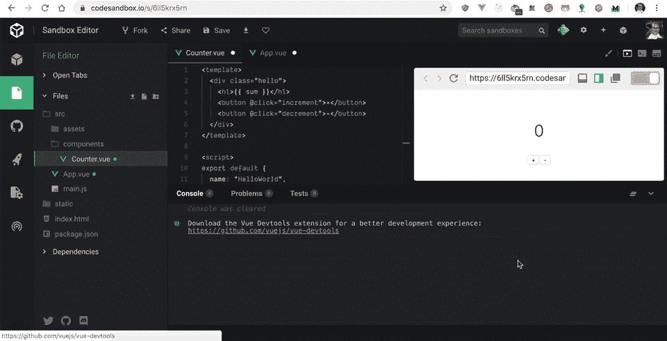

简单的计数器——https://codesandbox.io/s/6ll5krx5rn[的](https://codesandbox.io/s/6ll5krx5rn)

我们有一个带有简单计数器的 Vue 项目。计数器由三部分组成:

*   当前总和的状态。
*   减量按钮。
*   增量按钮。

用 Vuex 术语来说:

*   `sum`是状态。
*   `decrement`和`increment`是改变状态的动作。

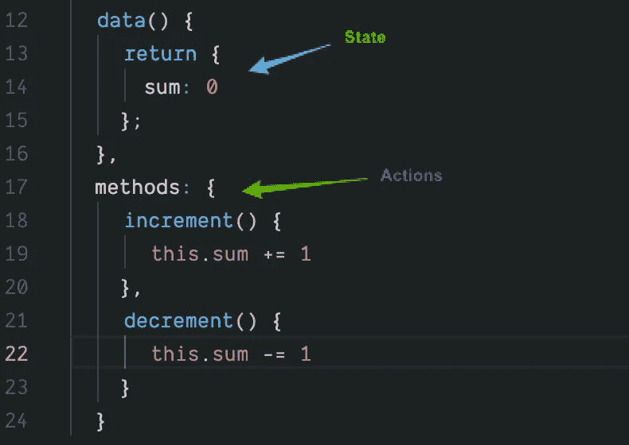

经典 Vue 组件

让我们将 Vue 组件重构为 Vuex 组件。每个 Vuex 应用程序都有一个保存状态的存储:

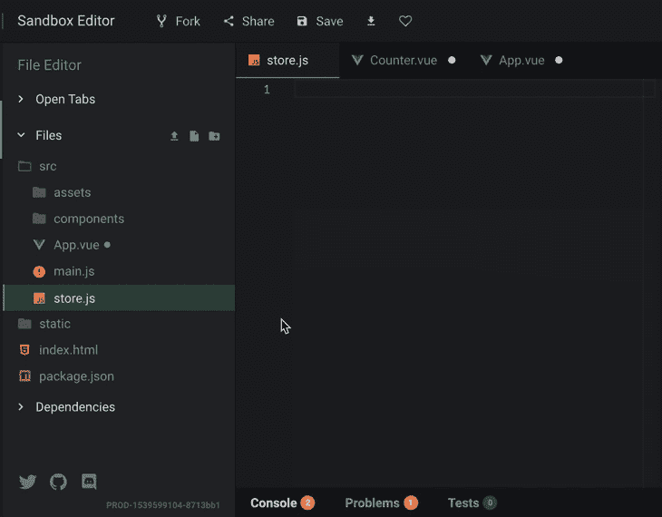

添加 Vuex 依赖项

我们需要做的第一件事是创建一个 Vuex 商店。

# 创建商店

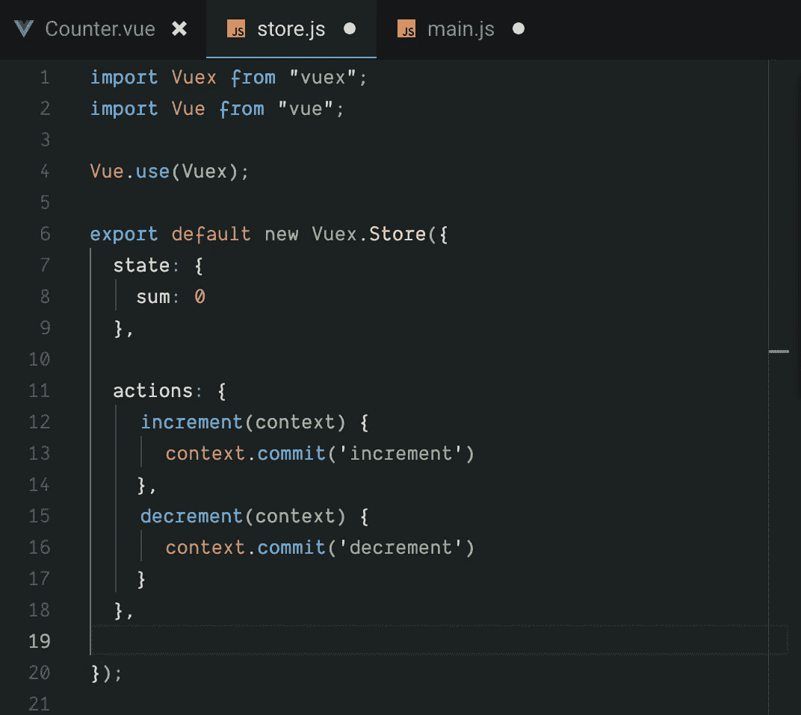

创建 Vuex 操作

眼熟吗？动作和状态与 Vue 组件中的类似。

商店是由四个对象组成的`Vuex.store`对象的实例。这四个对象是`state`、`actions`、`mutations`和`getters`。他们都有一个关键的角色，一切都配合得很好。

`state`记录一切。`Actions`照顾所有的逻辑和条件，把最终结果传递给突变。`Mutations`修改/写修改，最后，`getters`意为从状态中读取。

# 将 Vuex 存储传递给 Vue 实例

每个 Vue 实例都有一个`store`属性。让我们将我们的存储传递给 Vue 实例。

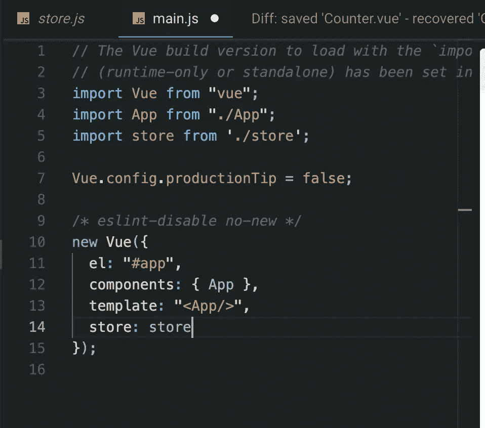

将商店属性传递给 Vue

实际上，我们可以通过只编写一次存储来简化这一点，因为它们的名称相同，而且 [JavaScript 足够聪明，可以简化这个](https://alligator.io/js/object-property-shorthand-es6/)。只有当它们相同(区分大小写)时，才能这样做。

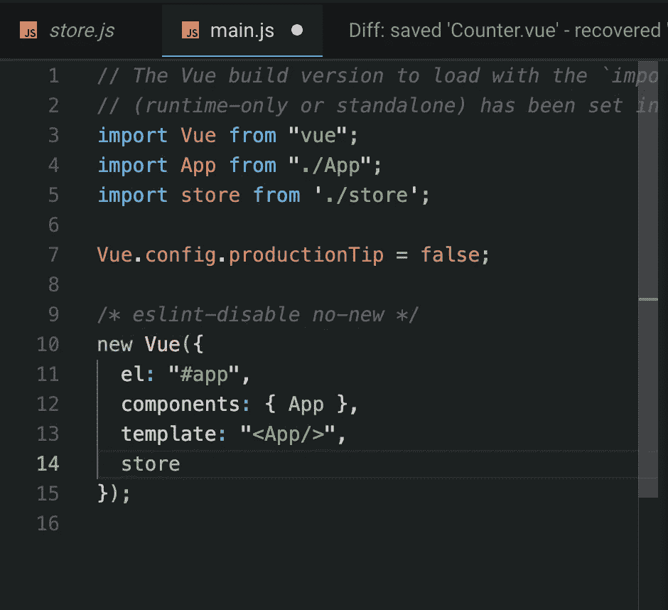

# 在 Vue 内部调用减量和增量操作

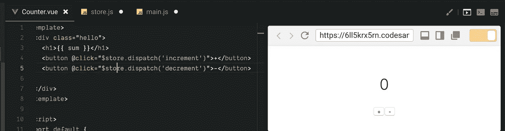

在 Vue 组件中调用操作

`$store`是一个全局对象，包含所有的`actions`、`states`、`getters`、`mutations`以及更多的功能。`$store`对象被注入到每个 Vue 组件中——非常方便。

# 使用 Vuex 总和状态而不是本地数据状态

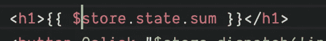

请注意我们是如何让 Vuex 而不是 Vue 跟踪我们的状态和动作的。Vue 只呈现标记和样式。你要做的事情越少，结果越好。一次做一件事，但要做得真正好。

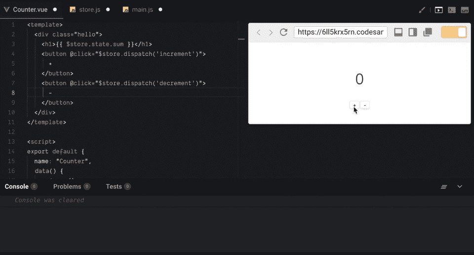

我们的应用程序的当前状态

当你点击计数器时，什么也没有发生——为什么？到目前为止，我们从 Vuex 读取状态，告诉 Vuex 下一个状态是什么，但我们实际上并没有“改变”状态。动作提交新的状态改变；突变改变了状态。

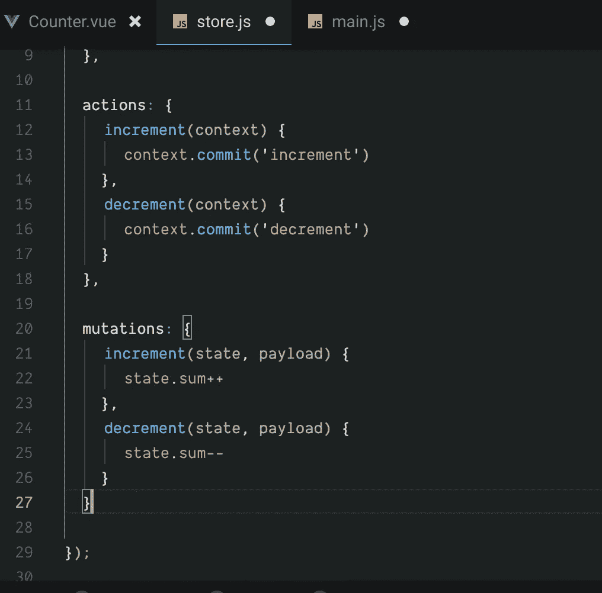

创造突变

现在我们得到了想要的结果。

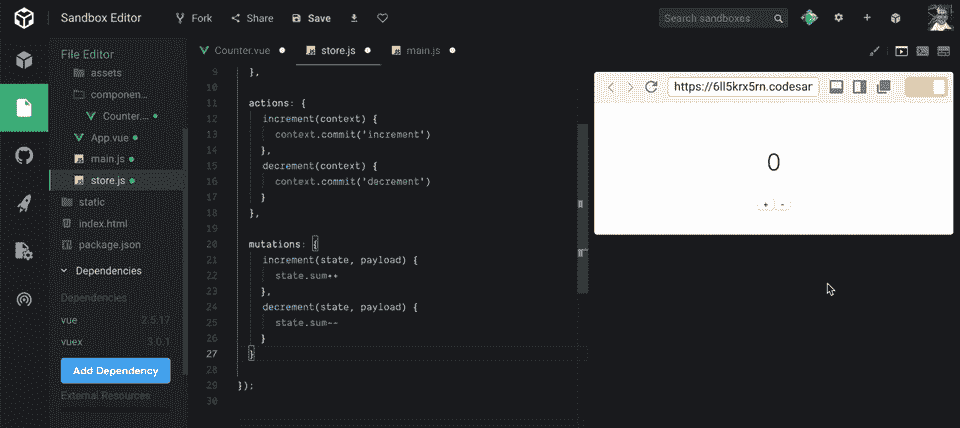

调用 Vuex 动作和改变 Vuex 状态

# 用 Getters 读取状态

想象一下，如果我们的状态更复杂一点——想象两个或三个物体的深度——这在表单中很常见。

我们可以获取计算出的状态并将其传递给模板，而不是在模板中编写`$store.state.form.username.pet[2]`。这极大地清理了代码。Vue 模板应该尽可能少地呈现标记和处理外部逻辑。

ES6(首选)，下面 ES5。

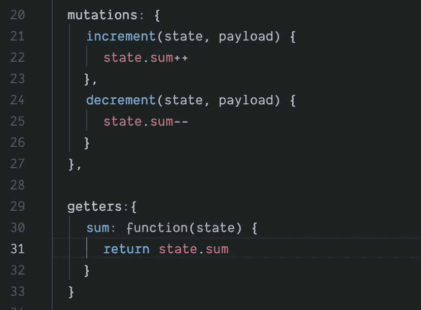

ES5

简单来说，我们将一个函数映射到一个键，并返回函数内部的期望状态。如果你来自 React 世界，就把 getters 想象成选择器。

回到我们的 Vue 组件，我们已经创建了一个 computed 属性，并将我们的 Vuex getter 映射到它。

创建计算的 getters

请注意，标记再次变得非常干净——这就是关键所在。

下面是借助于`mapGetters`函数的计算 getter 的简写。

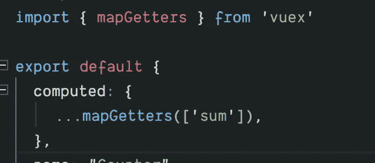

mapGetters 辅助函数

任何状态容器的关键特性之一是惊人的状态检查工具。 [Vue.js 开发工具](https://chrome.google.com/webstore/detail/vuejs-devtools/nhdogjmejiglipccpnnnanhbledajbpd?hl=en)有一个现成的 Vuex 检查器。

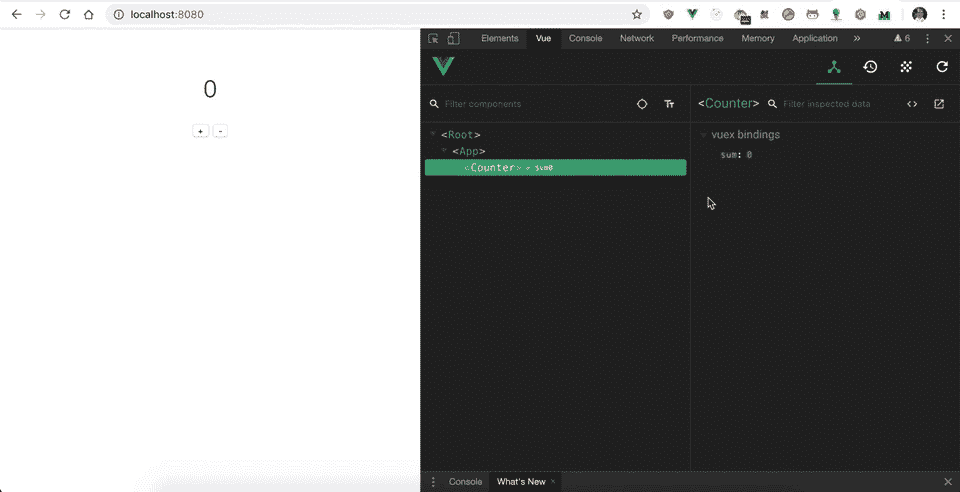

使用 Vue 开发工具检查 Vuex 状态

太神奇了！调试条件再好不过了！

如果你喜欢使用 Vue 并想更深入地学习它，[这里有一本关于全栈 Vue 的好书](https://amzn.to/2LQBPo3)。

# 这是项目

 [## CodeSandbox

### CodeSandbox 是一个为 web 应用程序量身定制的在线编辑器。

codesandbox.io](https://codesandbox.io/embed/6ll5krx5rn) 

这就对了，这是 Vuex 能做到的最简单的事情。这应该是在您的 Vue 应用中采用 Vuex 的良好起点。

感谢阅读！