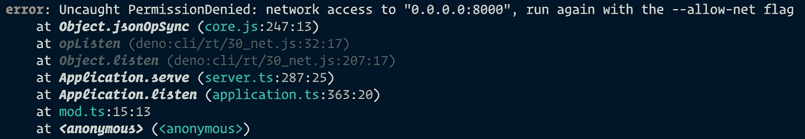

# Deno:在 Oak 中创建您的第一个 Web 应用程序

> 原文：<https://betterprogramming.pub/deno-create-your-first-web-application-in-oak-884868f8b30e>

## 了解 Deno 中的静态文件服务、路由和错误处理


作者照片。

看起来，在大肆宣传之后，现在是一片寂静。然而， [Deno](https://deno.land/) 社区仍在快速发展，所以如果你有兴趣学习 Deno 的后端，现在正是时候。

Deno 出现在 Node.js 之后，node . js 是 Ryan Dahl 创建的另一个 JavaScript 运行时。它内置于 Rust 中，支持 TypeScript，默认情况下是安全的。

你想知道达尔为什么创建另一个图书馆吗？查看 Deno 和 Node.js 之间的[关键区别。](https://medium.com/better-programming/deno-vs-node-js-key-differences-8b2f4f63e2c7)

总之，在这篇文章中，你将学习如何用 GitHub 最流行的 Deno 框架 [Oak](https://github.com/oakserver/oak) 来设置和创建一个 web 应用程序。由于 Deno 是面向服务器端的，我们将创建一个能够提供静态文件、提供 API 和处理错误的 web 应用。

为了跟随和编码，你需要在你的计算机上安装 Deno。查看官方文件中的[安装指南，并遵循说明。](https://deno.land/#installation)

这是我们将要构建的 GitHub repo 的完整版本。

# 设置环境

所以首先在你的工作目录中，创建名为`src`和`public`的新文件夹。在`src`中，让我们创建一个名为`mod.ts`的新文件，它将是我们的主文件。

我们使用 TypeScript 扩展的原因是 Deno 支持现成的 TypeScript。这也是 Node 的主要优势之一。现在到编码部分。

根据 Oak 的文档，我们可以通过编写几行代码来创建一个非常简单的 Hello World 应用程序:

*   我们通过使用 URL 作为来源从 Oak 导入`Application`。这是 Deno 中的标准实现。
*   您也可以通过用`oak@v.6.3.0`替换 Oak 来使用特定版本的包。通过这种方式，您可以确保所有的依赖项都是兼容的，并且不包含任何重大更改。
*   导入后，我们创建一个`Application`的引用。
*   请记住，Oak 的架构是基于中间件概念的。但稍后会详细介绍。
*   现在，当我们使用`app.use()`时，它期望`ctx`作为第一个参数。`ctx`代表上下文，你可以在 [Oak 的文档](https://github.com/oakserver/oak)中了解更多。
*   上下文可以有不同的属性，比如`ctx.response`，其中我们可以在响应中发送一些东西(文本或静态文件)。
*   如果文件作为程序使用`app.listen()`方法运行，我们使用来自 Deno 标准库的`log`记录文本并监听给定的地址和端口。
*   当在本地机器上导航到`http://localhost:8000/`时，您应该在浏览器中看到`Hello world!`消息。

现在，回到核心问题。什么是中间件？

# 解释中间件概念

中间件只是一种特殊类型的功能，它运行在进入 API 的请求和从 API 出来的响应的中间。

当然，您的链中可以有多个中间件，但是它们应该以可预测的顺序执行。它们每个看起来都像这样:

```
app.use(async (ctx, next) => {})
```

*   中间件总是返回一个承诺，所以它是异步的。
*   作为第一个参数，`ctx`是一个对象，它包括具有适当属性和方法的请求和响应对象。
*   作为第二个参数(可选)，`next()`指示应用程序应该继续执行链中的其他中间件。

# 服务静态文件

当然，在我们的应用程序中只显示“Hello World”文本是很无聊的。我们也可以提供 HTML。

让我们创建一个你自己的或者从 GitHub repo 中复制一个并保存在文件夹中。命名为`index.html`。

为了提供静态文件，我们可以创建一个中间件:

在中间件中，我们通过[允许实体列表](https://en.wikipedia.org/wiki/Whitelisting)的原则来提高安全性，这样就没有人能够使用其他恶意文件。Deno 将只接受`fileWhiteList`数组中的文件。再往后，应该还有 CSS，JavaScript 文件，favicon 等。

如果文件存在于数组中，我们将使用 Oak 的`send()`函数，该函数需要上下文、文件的文件路径和具有`root`属性的对象。

现在，这应该可以了。让我们通过运行`deno run src/mod.ts`命令来测试它。

哎呦！之后，您将在控制台中看到以下权限错误:



那是因为 Deno 牢记安全因素。您需要使用`--allow-net`标志授予应用程序网络访问权限，使用`--allow-read`标志授予文件系统读取权限:

```
deno run --allow-net --allow-read src/mod.ts
```

# 使用路由器中间件进行路由

在每个后端应用程序中，我们应该根据前端的请求应用端点来提供各种数据。现在，如果我们想将“Hello World”文本保留在主`/`路线上，该怎么办呢？

为此，我们可以使用`Router`中间件。

首先，让我们在`src`文件夹中创建一个名为`api.ts`的新文件。顾名思义，您可以在那里存储所有的 API:

在我们的路由中，我们使用了一个`GET`方法，并返回一个文本作为响应。简单吧？

现在，回到我们的`mod.ts`文件，我们需要导入我们的 API 并使用路由器中间件:

`app.use(api.routes())`告诉 Deno 通过我们的路由器包含所有路由(目前，我们只有一个)。下一行告诉 Deno 允许该路径的所有方法，比如`GET`、`POST`、`PUT`和`DELETE`。

现在，如果您尝试运行应用程序(不要忘记权限)，您应该会在`/`端点上看到文本。但是坚持住。如果服务器出了问题，我们得到一个错误，该怎么办？我们如何处理这样的错误？

# 错误处理

在 Oak 中，实现起来非常简单。我们需要:

1.  添加用于处理错误的事件侦听器。
2.  创建一个中间件，用于在发生错误时向客户端发送响应。

因此，在`mod.ts`中，让我们在文件的开头编写以下代码:

在中间件本身，`await next()`是说如果没有错误发生，继续按顺序执行另一个中间件。否则，它将记录一条错误消息。

当然，如果您愿意，可以根据错误代码随意定制处理方式。

# 摘要

构建一个 web 应用程序非常简单，对吗？

只需几分钟，您就可以构建一个简单的 web 应用程序，并在此基础上进行改进和开发。

我真的很喜欢 Oak 框架，因为它有一个适中的学习曲线，易于使用，默认情况下是安全的。虽然 Deno 社区有点小，而且到目前为止没有公司在使用 Deno，但是每项技术都需要时间在市场上立足。

感谢阅读！