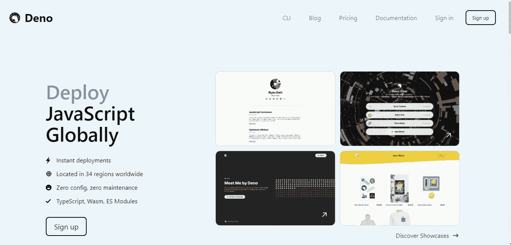

# 使用 MVC 模式和 MySQL 构建一个 REST API

> 原文：<https://betterprogramming.pub/deno-rest-api-with-mvc-pattern-using-mysql-212af5c6306>

## 利用新的简单、现代和快速的 JavaScript/TypeScript 运行时


天龙🦕

您可以在 GitHub 资源库中查看本文中开发的全部代码。

# 先决条件

我喜欢 Deno 的一点是，它不需要你安装这么多的依赖项来开始。你只需要在你的机器上安装 Deno。要做到这一点，你只需按照这里的指示。我推荐你直接用 PowerShell (Windows) 安装就可以了。

如您所知，我们将使用 MVC 模式构建 REST API。如果你不熟悉 MVC 模式，我建议你[阅读这篇文章](https://dev.to/software_writer/introduction-to-the-mvc-pattern-in-asp-net-58c8)来稍微了解一下 MVC。基本上，MVC 代表模型-视图-控制器，这是我们将要用来构建我们的 REST API 的结构，但是因为我们只构建没有任何用户界面(UI)的 API，所以我们将省略视图。

我们项目的文件夹结构如下所示:

```
- data
- controllers
- routes
```

`Data`是模型文件夹。`Controllers`是我们的控制器，`routes`是路由器，负责将传入的浏览器请求映射到指定的 MVC 控制器动作。

# 构建 REST API(编码时间)💻

现在您已经知道了先决条件和结构，是时候开始构建应用程序了。你应该做的第一件事是在你的数据库上做一个新表，哦，对了，我们要做一个众所周知的待办事项应用程序(为什么不呢)。我们将使用 MySQL 作为我们的 RDBMS，这是表模式:

之后，我们将制作数据库配置文件，如下所示:

您可以看到我使用`environment`来存储所有的数据库连接字符串。您可以很容易地创建`.env`文件，并用您需要的环境变量填充它。

接下来，我们首先创建接口，或者我想称它为数据传输对象(对不起，我以前用。网)。我们的界面应该是这样的:

只是简单的三个属性。在我们有了接口之后，现在是时候从底部开始构建第一个门了，也就是存储库，也就是模型，也就是任何与数据库直接交互的东西，也就是你可以称之为编写数据库查询的地方。

如你所见，我导入了`db.ts`和我们之前已经做好的接口。在这个存储库中，定义了五个函数来通过 SQL 查询执行我们的 CRUD 应用程序。你可以在这里看到 Deno MySQL 驱动[的完整文档。](https://github.com/denodrivers/mysql)

在我们定义了存储库/数据文件夹之后，现在我们将让控制器负责控制应用程序逻辑，并充当 HTTPS 请求和数据门之间的协调。我们的控制器应该是这样的:

此时，您实际上可以看到 MVC 结构在这个应用程序上是如何工作的，对吗？这很简单，因为我们要做的下一件事是制定路线，这是来自用户的每个请求的大门。

每条路线都有自己的服务方式。我们有一些路线，包括一条我特意加在这个文件上的主要路线。我们几乎完成了所有的工作，除了最后一件事——运行整个系统/服务器的主文件。

我们的主文件如下所示:

现在，我们已经拥有了运行服务器所需的所有*要素*，您可以使用以下命令进入终端并运行应用程序:

```
deno run --allow-read --allow-env --allow-net server.ts
```

不要忘记打开您的本地 SQL server。之后，您可以尝试使用 Postman 访问我们创建的端点。

# 部署

不用说，Deno 是一个构建服务器应用程序的快速简单的 JS/TS 运行时。

不仅如此，当我们谈论部署时，Deno 也派上了用场，因为 Deno 使用[dash.deno.com](https://dash.deno.com/)提供了 CI/CD 部署系统。

如果你熟悉 Netlify、Vercel、Heroku 等平台，那么在使用 [Deno Deploy](https://dash.deno.com/) 时你不会感到任何麻烦。



Deno 部署

# 也许有所改善

我已经包含了一个测试文件，其中包含了每个控制器/端点的单元测试。如你所知，这个项目只是我周末愉快学习的一部分，在我使用的原则模式上肯定有许多小错误或者可能是错误的实现，所以我不建议你在生产基础上使用这个项目，因为你需要真正考虑应用程序的安全性和可靠性。

源代码这里是[这里是](https://github.com/jerichosiahaya/deno-crud)。

```
**Want to Connect?**If you have any recommendations about better implementation, how to improve my code or anything, please just hit me up on [Twitter](http://twitter.com/jerichosiahaya) or [LinkedIn](http://linkedin.com/in/jerichosiahaya).
```