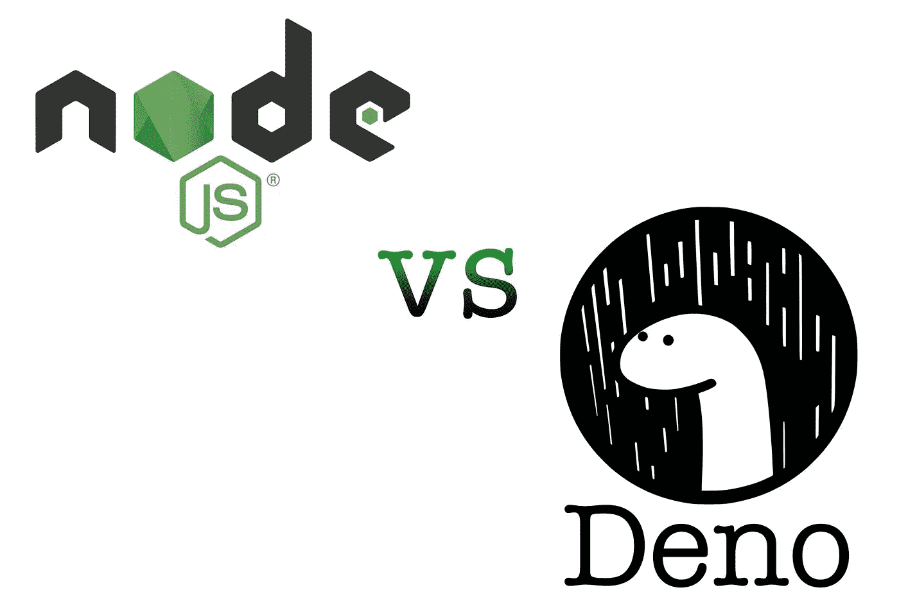

# Deno 与 Node.js —主要区别

> 原文：<https://betterprogramming.pub/deno-vs-node-js-key-differences-8b2f4f63e2c7>

## 每个人都在谈论的新 JavaScript 库，来自 Node 的创建者



图片来源:作者

*该不该学 Deno？使用 Deno 胜过 Node 的主要好处是什么？*

读完这个故事后，你会知道 [Deno](https://deno.land/) 如何工作的关键原理，谁是幕后黑手，以及为什么有这么多关于它的讨论。我将把它与 Node.js 进行比较，因为它是目前为止最流行的 JavaScript 运行时。

[节点](https://nodejs.org/en/)与德诺的创作者相同，瑞安·达尔。正确的问题是，“如果 Node 已经在市场上站稳脚跟并受到许多公司的青睐，他为什么还要创建另一个库？”

# 幕后的支持

[官方文件](https://deno.land/)说:

> Deno 是一个简单、现代、安全的 JavaScript 和 TypeScript 运行时，使用 V8 引擎，内置于 Rust 中

这也是 Deno 能够非常成功的主要原因。背后有大公司:

*   由 Mozilla 创建的 Rust
*   来自微软的 TypeScript
*   来自谷歌的 V8 引擎

另一方面，Node 是用 C 和 C++构建的，与 Rust 相比，它们往往不太安全。它没有内置 TypeScript 编译器，所以为了使用它，您需要用 npm 安装它。

它们的共同点是引擎盖下的谷歌 V8 引擎——与驱动 Chrome 浏览器的引擎相同。

# ES 模块与 CommonJS

2009 年，Node 创建的时候，JavaScript 还没有自己的模块系统。因此，默认情况下，在 Node:

```
const bcrypt = require('bcrypt');
```

问题是这并不是真正的 JavaScript *。这是一种包含来自第三方库的不同代码的非标准方式。*

幸运的是，2015 年 ES6 推出了自己的 JavaScript 模块系统，所以现在你可以这样做:

```
import bcrypt from 'bcrypt'
```

与 Deno 相比，ES 模块在 Deno 中是开箱即用的。这意味着您实际上可以导入 URL，而无需通过 npm 进行安装:

```
import '[https://deno.land/std/examples/chat/server.ts](https://deno.land/std/examples/chat/server.ts)'
```

有了这种能力，你基本上可以导入任何一段程序，并在你的代码中使用它。然而，如果你这样做，你会得到一个权限错误。

原因是 Deno 也是把安全放在心上。

# 安全第一

尽管 Node 越来越受欢迎，但许多公司都倾向于绕过它。其中一个很重要的原因就是它在安全性上有缺陷。

问题是节点使用 npm 来安装应用程序的外部模块。因为 npm 对社区开放，每个人都可以创建一个，所以有可能注入恶意的东西。

并且节点将毫无怨言地信任该模块。

另一方面，Deno 正在使用最小特权原则和允许实体列表。您可以单独授予每个模块权限。这本身解决了开发服务器时许多潜在的安全问题。

# 内置工具

要开始用 Node 开发一个 app，首先要决定用什么工具。

你要用 TypeScript 吗？然后安装 [ts 节点](https://github.com/TypeStrong/ts-node)。测试呢？我们用 [Jest](https://jestjs.io/) 吧。格式化呢？捆绑销售？等等。

使用 Deno，您不必解决这些问题，因为它已经预装了这些工具。因为它是 Deno 的标准，所以你可以确信这些工具有完全的支持。真的很酷。

# 浏览器兼容的 API

我认为这是 Node 和 Deno 最大的区别之一。

你可能已经知道，浏览器有`window`作为全局对象，它有很多属性和方法，比如`addEventListener`、`setTimeout`、`setInterval`等。

浏览器也使用`fetch`向给定的 URL 发送请求并返回承诺。

在 Deno 中，所有这些都是内置的。这是完美的，特别是对于前端开发人员，他们每天都在使用这些方法。

## Node 呢？

在节点中，`fetch`不存在。如果要用的话，需要安装 [node-fetch](https://www.npmjs.com/package/node-fetch) 或者 [node-fetch-npm](https://github.com/npm/node-fetch-npm) 之类的东西。*但是哪一个是正确的呢？这在我的项目中行得通吗？*

节点也使用`global`作为主对象，它不是浏览器的一部分。所以它不是真正的 JavaScript。

# 单一可执行文件

使用 Deno 时，您总是有一个单独的可执行文件，例如`deno.exe`，您可以双击它并运行 Deno 运行时。所以基本上你可以使用 JavaScript 编写程序，然后轻松地与其他计算机共享。

在 Node 中，没有单个可执行文件这样的选项，因为应用程序需要在`node-modules`文件夹下运行所有必要的包。

# 异步退货承诺

Deno 中的异步代码总是返回 Promise。在 Node 中，情况并非总是如此。

节点是在我们有基于承诺的语法之前创建的。尽管在许多情况下异步代码会返回承诺，但有时您必须使用像`[util.promisify](https://nodejs.org/dist/latest-v8.x/docs/api/util.html#util_util_promisify_original)`这样的构造函数来解决问题。

事实上，每当 JavaScript 中引入新特性时，Node 都需要做一些变通，以使它们兼容。相比之下，Deno 支持最新的 JavaScript 特性。

它的后端是用 Rust 编写的，用一种叫做*期货*的东西来处理异步代码。在幕后，它将异步代码转化为承诺。

这意味着在 Deno 中你可以毫无问题地使用`async await`。

# 总结一下

*那么，我应该立即开始使用 Deno 吗？*

我会说，“不尽然。”

我的意思是，当然，它看起来很有前途，当看所有的功能和它是如何建立的。它基本上解决了 Node 的很多核心问题。

Deno 有大公司支持，使用最新的 JavaScript，安全性很高。当然，每种技术都有其缺陷。

而且到目前为止，Deno 最大的缺陷就是还只是在前期。这个社区刚刚开始成长。因此，只有时间会告诉我们它是否会赶上 Node、Java 或 PHP 等语言——或者它是否只是最初的炒作。

如果你喜欢阅读，你可能会对我的其他一些故事感兴趣:

[](https://levelup.gitconnected.com/what-you-should-know-about-npm-2b198dab6e9d) [## 关于 NPM 你应该知道什么

### 你应该毫无疑问地掌握的命令和核心原则。

levelup.gitconnected.com](https://levelup.gitconnected.com/what-you-should-know-about-npm-2b198dab6e9d) [](https://levelup.gitconnected.com/learn-gatsby-by-building-your-own-blog-website-ff5aaa8e90b8) [## 通过建立自己的博客网站来学习盖茨比

### 静态渲染方法介绍。

levelup.gitconnected.com](https://levelup.gitconnected.com/learn-gatsby-by-building-your-own-blog-website-ff5aaa8e90b8) 

感谢阅读！