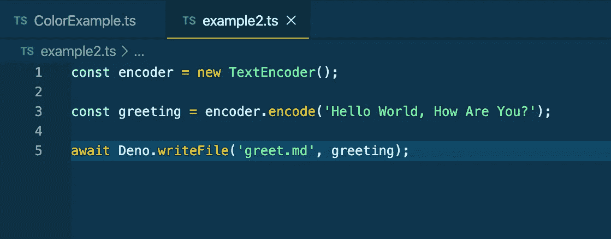
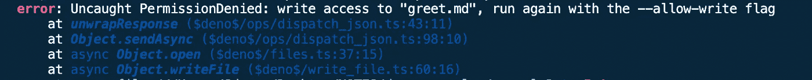
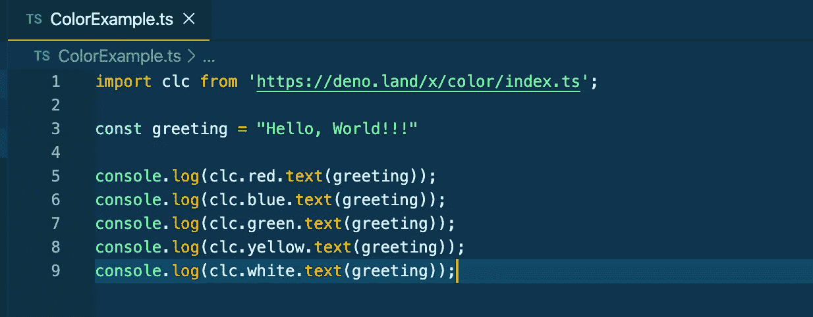
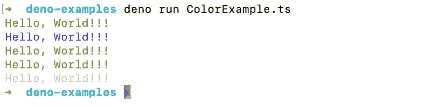
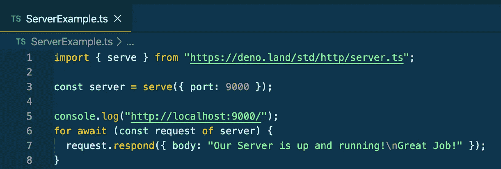
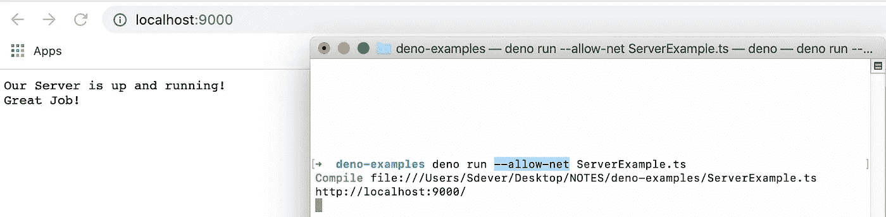

# Deno 会改变我们所知的 JavaScript 的未来吗？

> 原文：<https://betterprogramming.pub/deno-will-it-change-the-future-of-javascript-as-we-know-it-81ce59a0cd3d>

## 没有人知道未来会怎样——但是 Deno 看起来很有希望


高分辨率 logo 由 [@kevinkassimo](https://github.com/kevinkassimo)

# Deno 到底是什么？

Deno 是运行在 V8 引擎上的 JavaScript 命令行运行时，用 Rust 编程语言编写。

它的工作方式与 Node.js 类似，但当 Node 在 2009 年发布时，它是根据当前版本的 JavaScript 创建的。JavaScript 在 2009 年的基础上有了很大的发展，现在我们所知道的 JavaScript 有了更多的便利。

Deno 希望解决 Node 的许多问题——安全性、模块系统(那个巨大的`node_modules`文件夹)以及兼容浏览器的 API。

让我们回顾一下它的一些很酷的功能！

# 以打字打的文件

开箱即用，Deno 内置了 JavaScript 扩展 TypeScript。对于那些不熟悉 TypeScript 的人，可以在这里查看文档。但是能够在我们的项目中使用编译器、静态检查和类型脚本模块是一个巨大的优势！

# 去中心化的包管理

就像 npm 现在的情况一样，它是一个集中的存储库，这意味着您需要与服务器通信才能获得节点模块。有了 Deno，那个`node_modules`文件夹中庞大的文件列表和管理依赖关系的`package.json`都将成为过去！现在可以从 URL 导入包:

```
import clc from 'https://deno.land/x/color/index.ts'
```

一旦我们从网上导入了我们的模块并运行了我们的程序，它们就会在加载后被缓存到硬盘上。

# 安全性

Deno 比 Node 做得更好的一点是安全性。每当你运行一个访问你的文件系统或互联网的应用程序时，当你运行这个程序时，首先需要允许你做这些事情。例如，假设我们正在编写一个程序，该程序为我们创建了一个新文件，该文件的内容是一个问候语的文本:



我们通过执行`deno run example2.ts`在控制台中运行代码:



我们遇到了一个`PermissionDenied`错误。这是 Deno 实施的安全措施。为了解决这个错误，我们需要使用`--allow-write`标志再次运行它，允许我们写一个新文件。虽然这可能一开始看起来很乏味，需要时间来适应，但这是一个很好的安全措施，可以防止损坏的文件损害您的设备。

# ES 模块

回到 Deno 如何处理模块。假设我们想使用一个很酷的第三方模块来改变我们的控制台文本的颜色。不再需要运行 npm install 了，只需简单地运行你的代码，Deno 的工作很神奇，就是这样，模块已经实现了！



导入可以更改控制台中文本颜色的第三方模块



# 顶级等待

因为 Deno 脱离了 V8 引擎，所以我们可以使用顶级的`await`。通常，我们在异步函数中使用 await:

```
async function foo() {
 const bar = await Promise.resolve(console.log('Success!'))
}
```

但是有了顶级的`await`，我们可以在全球范围内利用`await`:

```
import { readJson } from 'https://deno.land/std/fs/mod.ts'; const foo = await readJson('./foo.json');
```

欲了解更多关于顶级`await`的信息，请点击查看文档[。](https://v8.dev/features/top-level-await)

# 测试

Deno 还自带内置的测试运行器，可用于测试 JavaScript 或 TypeScript 代码。要设置测试，您可以使用`Deno.test`语法:

```
//example_test.tsDeno.test("test example", () => {
  const x = 5 + 5;
  if (x !== 10) {
    throw Error("x should be equal to 10");
  }
});
```

这里我们创建一个测试，如果`x`等于除`10`之外的任何值，它会给出一个错误，指出`x`应该等于`10`。为了运行这个测试，我们将`deno test example_test.ts`输入到控制台。

# 标准程序库

在第三方模块之上，Deno 有一些非常漂亮的标准库模块。你可以在这里查看它们。

现在让我们使用其中一个来启动服务器！因此，在我们的标准库列表中，我们希望接入 HTTP 库(`[deno.land](https://deno.land/) /[std](https://deno.land/std) /[http](https://deno.land/std/http)`)并导入服务器 URL。



我们将我们的服务器分配到端口 9000，console.log 以确认我们的服务器正在运行，然后使用`for await`语法获取请求对象并添加响应。让我们在终端中运行我们的文件(不要忘记添加许可)，看看我们得到了什么。



我们运行我们的代码，通过访问 localhost:9000 检查我们的服务器，棒极了，它工作了！

# Deno 看起来很棒，我应该学习如何使用 Node 吗？

*绝对！*需要注意的一点是 Node.js 不会很快消失。Node 拥有一个稳定、完善的生态系统，将用于数百万个项目。

Deno 是一个非常强大的工具，但它仍然只处于 1.0 版本阶段。我敢肯定还有很多问题和功能需要解决。毫无疑问，在未来几年，Deno 可能会成为 JavaScript 的下一个大事件。

如果你有一些空闲时间，我绝对推荐你和 Deno 一起玩，学习它是如何工作的。如果它真的起飞了，你将是一个早期采用者，将会比其他人更有优势！