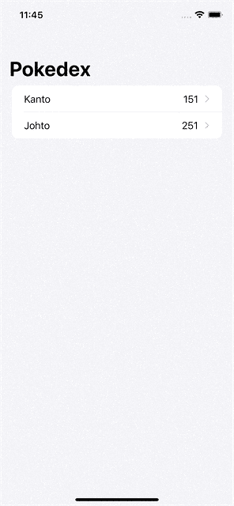

# MVVM 在模块化 SwiftUI 应用中的依赖注入

> 原文：<https://betterprogramming.pub/dependencies-injection-in-a-modularized-swiftui-app-with-mvvm-e72ae6d898ef>

## 如何在干净的 MVVM 架构中注入依赖关系和传递数据

[Jerry Zhang](https://unsplash.com/@z734923105?utm_source=medium&utm_medium=referral) 在 [Unsplash](https://unsplash.com?utm_source=medium&utm_medium=referral) 上的照片

写完[作曲 SwiftUI 导航](/composing-swiftui-navigation-3d67198b6acb)的文章后，有人用非常亲切的话语和几个问题联系我。困扰他们的主要问题是如何将数据和依赖关系从一个模块传递到另一个模块。

有两个棘手的问题让这变得更加困难:

1.  我们希望保持所有模块的模块化。传递数据和依赖关系可能会将一个模块与另一个模块耦合起来。
2.  导航可以很深。我们可能不得不将依赖关系从主视图传递到一个非常嵌套的视图。这可能导致嵌套闭包和难以阅读的代码。

今天，我想探讨我们如何在一个高度模块化的应用程序中设计依赖注入，保持它的简单和可读性。

# 该应用程序

我们今天使用的应用程序是一个简单的 [Pokedex](https://pokemon.fandom.com/wiki/Pok%C3%A9dex) 应用程序:

1.  第一个屏幕包含各种口袋妖怪游戏的 Pokedex 列表。
2.  第二个屏幕显示该游戏的口袋妖怪列表。
3.  第三个屏幕呈现特定口袋妖怪的细节。

多亏了 Pokemon PokeAPI，pokemon 的数据和 API 可以公开获得。

所有屏幕必须隔离在各自的模块中，它们将在`CompositionRoot`中组合。

# 构建模块

我们将在一个 Swift 包中编写我们所有的代码:我们称之为`PokedexKit`。它被组织成不同的`Targets`:每一个都代表一个独立的模块，有自己的公共接口。

这些`Target`是:

*   `CompositionRoot`:唯一依赖于所有其他模块的模块，因为它是将它们结合在一起的粘合剂。
*   `PokedexPkg`:实现第一屏。我们需要添加`Pkg`后缀，以避免与应用程序名称冲突。
*   实现了口袋妖怪的列表。
*   `PokemonDetails`:实现细节画面。

这个包的`Package.swift`文件如下所示。

在文件的第一部分，我们定义了一些常量和`enum`以使包描述不容易出错并且更具可重用性。我们可以定义一个`allButRoot`属性来获取所有可用目标的列表，不包括`CompositionRoot`。该属性用于创建`Root`模块的依赖关系，该模块需要知道应用程序的所有其他模块。

swift 包强调了我们想要实施的需求:所有不是`CompositionRoot`的`.target`的`dependencies`数组都是空的。这意味着他们是独立的，他们不依赖于其他任何东西。

## PokedexPkg

对于第一个模块，我们将逐步实现所有部分并定义所有接口。其他屏幕与此非常相似:我们将加快它们的速度，只突出不同之处。

## **创建脚手架**

让我们从创建 SwiftUI 视图的支架开始，遵循 MVVM 模式。

我们有默认的 SwiftUI 视图，它拥有一个作为`ViewModel`的`@StateObject`。为了避免污染模块名称空间，在 SwiftUI 视图的扩展中定义了`ViewModel`。

## **创建数据模型**

我们要展示的数据是 Pokedex 名称和其中包含的口袋妖怪数量。让我们从定义数据结构开始:

模型是`Identifiable`，因为我们将在`List`中渲染它。`id`是一个简单的`Int`，因为 PokeAPI 使用整数来标识 Pokedexes。

## **添加 PokedexService**

然后，我们需要一种方法来检索 Pokedexes 列表。这个模块的职责是只呈现 Pokedex 数据:我们不关心检索是如何实现的。因此，我们只需要为服务指定我们想要的接口。

对于第一个模块，我们决定使用标准回调模型。但是，没有必要强制使用单一的方法来检索某些数据。为了加强这种模块独立性的思想，我们可以对三个不同模块中的服务使用三种不同的方法。

现在，我们可以将服务注入到`ViewModel`中。

`ViewModel`的`init`请求一个符合`PokedexService`协议的组件，利用[构造器注入](https://freecontent.manning.com/understanding-constructor-injection/)技术。我们将`pokedexes`数组声明为一个`@Published`变量，这样 SwiftUI 就可以对它做出反应。`ViewModel`的最后一部分是使用服务的`loadPokedex`方法。当服务完成检索时，我们更新`pokedexes`属性。

之前的更改更新了`ViewModel.init`方法。SwiftUI `View` 需要使用那个`init`创建`ViewModel`，所以模块停止构建。为了让它重新构建，我们还需要更新它:

MVVM 模式的`public` init 可能看起来太复杂了，但是我们必须这样写的原因是因为`@StateObject`属性包装器。我们不能将`ViewModel`的实例直接分配给`viewModel`属性，因为属性包装器使该属性成为 get-only 属性。为了解决这个问题，我们可以使用`_viewModel`:这个属性由编译器合成，让我们设置实际的属性包装器类型，将初始包装值注入其中。

## **添加导航提供商**

最后，当用户点击 Pokedex 时，我们希望导航到口袋妖怪列表。为了实现这一点，我们利用了[撰写 SwiftUI 导航](/composing-swiftui-navigation-3d67198b6acb)文章中描述的原则。

首先，我们定义一个接受一些参数并返回 SwiftUI `View`的闭包。多亏了泛型，我们不在乎实际返回的是哪个视图。

闭包将 Pokedex 标识符及其名称作为参数传递给`Details`视图。`typealias`关键字支持通用语法:`Details`类型的唯一要求是符合`View`协议。

现在，我们可以用这个新的提供者更新`ViewModel`:它在`DetailsView`中变成通用的，并在`init`中接受提供者。

`ViewModel`初始化又改变了，所以我们也必须更新`PokedexList`初始化。

我们还需要将`PokedexList`更新为泛型，以适应新的泛型类型。

## **实现视图体**

为了完成这个模块，我们需要实现`body`属性。这是标准的 SwiftUI 代码，看起来像这样:

让我们探索一下视图是如何使用`ViewModel`的。在`destination`闭包中，我们使用`detailsProvider`闭包来检索`Details`视图，独立于其实际类型。在`onAppear`视图修改器中，我们要求`viewModel`加载 Pokedex 数据。

这就完成了 Pokedex 模块。所有的特性都实现了，尽管视图不知道逻辑将如何实际实现。

## 口袋妖怪列表

其他模块与 Pokedex 非常相似。它们的变化主要是因为:

*   数据模型
*   一些实体的名称。

让我们看一下代码的完整性，但让我们把重点放在差异上。

## **数据模型**

第一个区别依赖于数据模型。

一个口袋妖怪是`Identifiable`，这样我们就可以渲染成一个`List`。`id`也是一个`Int`。然后，每个口袋妖怪都有一个名字和一个精灵。

## **依赖签名**

为了取回口袋妖怪，我们需要一个`PokemonService`。该服务需要 Pokedex id 来只检索属于它的口袋妖怪。另一个依赖项是口袋妖怪细节的提供者。

我们决定使用`Combine`来实现口袋妖怪列表的检索:`PokemonService.getPokemons`方法返回一个`[Pokemon]`的`AnyPublisher`。

`PokemonList`的`ViewModel`是这样实现的:

大部分代码都非常类似于 Pokedex' `ViewModel`。主要区别在于`loadPokemons`的实现。它订阅`service`的`publisher`来检索所需的数据。因此，`ViewModel`需要一个`cancellables`属性来存储订阅。

## **视图**

最后，视图与 Pokedex 非常相似。

这个`View`的`init`比上一个略大。它需要接受更多的参数传递给`ViewModel`。

在这个例子中，我们还使用了一个新的 SwiftUI 视图:`AsyncImage`。该组件已随 iOS 15 发布，它让我们可以从远程`URL`自动加载图像。它还让我们定制加载和失败状态。

就这样，我们完成了小应用程序的第二个模块。

# 口袋妖怪的细节

最后一个模块是详细信息屏幕。用户不能从这里导航到任何其他地方，所以这个模块比其他模块稍微简单一些。

## **数据模型**

数据模型描述了一个口袋妖怪。

与其他型号不同的是，这款型号不是`Identifiable`。我们就不放入`List`了。我们仍然在追踪口袋妖怪的`id`，它的名字，艺术作品和味道文本。

## **依赖关系**

唯一的模块依赖是一个检索口袋妖怪细节的服务。

对于这种依赖性，我们决定使用新的`async-await`语法。

## **ViewModel**

`PokemonDetails`的`ViewModel`如下:

在第一部分中，我们定义了所有属性和带有参数的`init`。这个`ViewModel`不是通用的:我们不必导航到任何其他视图。

使用`async-await`实现`loadPokemon`方法。该方法将在接受非异步闭包的`onAppear`视图修饰符中使用。为了在 not `async`方法中使用`async`函数，我们可以创建一个在后台线程中移动上下文的`Task`。该任务调用服务来检索口袋妖怪的详细信息。

然后它调用一个`setPokemon`方法，用`@MainActor`注释进行注释。`@MainActor`注释确保函数将在主线程中执行。我们需要这样做，因为我们要更新一个触发 UI 更新的`@Published`属性。UI 更新必须发生在主线程中。

**视图**

最后，我们可以将`PokemonDetails`视图中的`ViewModel`连接起来:

`init`接收所有的参数来构建`ViewModel`。

`body`创建一个带有`AsyncImage`和描述的`VStack`，而口袋妖怪的名字被用作导航标题。

在`onAppear`视图修改器中，我们检索口袋妖怪细节来更新视图。

# 组合根

我们独立地实现了三个屏幕。现在，我们可以把它们放在一起，形成我们的应用程序。`CompositionRoot`是将所有东西粘合在一起的组件，它依赖于所有其他模块。

## **调整依赖关系**

在每个模块的`**Dependencies**`部分，我们定义了服务的接口。在实际的应用程序中，我们会有一个`Networking`模块，它实现一个组件来执行一般的网络请求。然后，在`Composition Root`中，我们使这个组件适应特定于模块的接口。

在这个例子中，我们将实现一些服务的假版本。这篇文章的重点不是如何创建，而是如何用复杂的依赖关系构建我们的应用程序。

因此，让我们创建三个假服务:

`MockedPokedexService`立即调用带有前两个口袋妖怪游戏区域的 pokedexes 数据的回调。

`MockedPokemonService`返回一个`Just`发布者，该发布者在收到订阅时立即完成。它返回 pokedex 的前三个口袋妖怪:妙蛙种子，妙蛙草和 Venusaur。注意`Just`发布者有一个`Never`的`FailureType`:我们需要将其设置为正确的`Error`类型，然后才能用`eraseToAnyPublisher()`删除其特定类型。

最后，使用 async await 的`MockedPokemonDetailsService`直接返回妙蛙种子的数据。

## **将所有内容组合在一起**

有了所有的要素，我们现在可以为`CompositionRoot`编写最终代码了。代码将位于一个名为`CompositionRoot`的`enum`中，作为模块属性和功能的名称空间。

唯一的`public`房产是`composeApp`房产。这将返回整个应用程序的入口点。该属性将`PokedexList`封装成一个`NavigationView`。`PokedexList`在`PokemonList`中是通用的，这意味着我们可以从`PokedexList`导航到`PokemonList`。传递参数有:

*   如上所述的`PokedexService`；
*   `detailsProvider`关闭。这由共享闭包的相同签名的`goToPokemonList`函数填充。

`goToPokemonList`的主体与`composeApp`属性非常相似。它返回`PokemonList`视图，将`pokedexId`和`pokedexName`作为参数传递。其他参数是`PokemonService`和最后一个功能:`goToPokemonDetails`。

最后，`goToPokemonDetails`函数通过`pokemonId`、`pokemonName`和`PokemonDetailsService`参数返回`PokemonDetails`视图。

# 将包与应用程序连接

到目前为止，我们只在`PokedexKit`包中写了代码，但还不能运行应用程序。我们仍然需要在`PokedexApp`中导入包并连接它。

幸运的是，我们需要编写的代码只有几行:

这是整个应用程序代码。我们只在`WindowGroup`组件中导入`Root`模块并调用`CompositionRoot.composeApp`属性。

# 结论

在本文中，我们在 Swift 中创建了一个非常小的模块化应用程序。我们将所有代码打包在一个 Swift 包中:这有助于我们保持模块的分离和隔离。

我们探索了三种不同的方法来定义网络依赖，而不实际实现它。

最后，我们在`CompositionRoot`中编写了整个应用程序。这种方法非常灵活:

*   我们可以通过交换实现来改变模块的行为。
*   我们可以通过提供不同的视图来改变导航。
*   我们可以注入其他功能来修饰闭包或服务实现。例如，在加载视图或执行网络调用之前，我们可以轻松地添加一些分析跟踪代码。

我们在本文中开发的全部代码可以在[这个库](https://github.com/cipolleschi/PokedexApp)中找到。

预先设计和思考你的应用程序的结构可以帮助分离关注点，提高可测试性，并且它使得更新、维护和改变你的应用程序的行为变得非常容易。