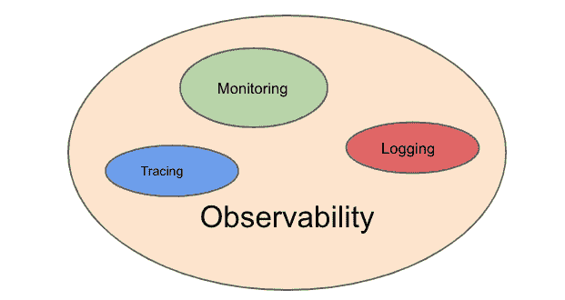
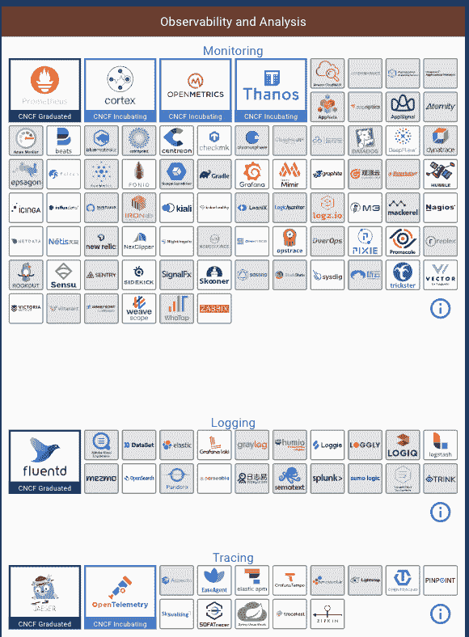
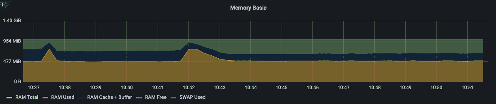
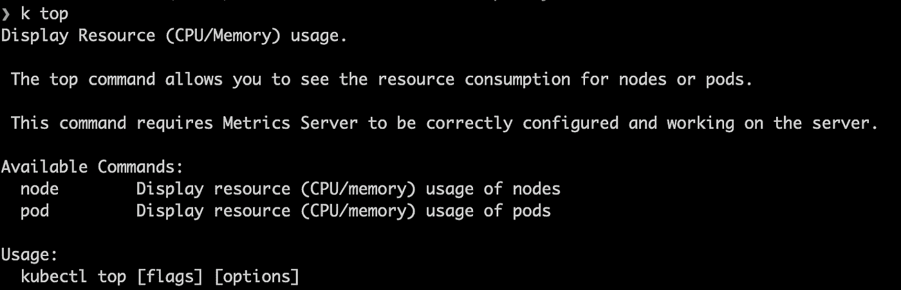
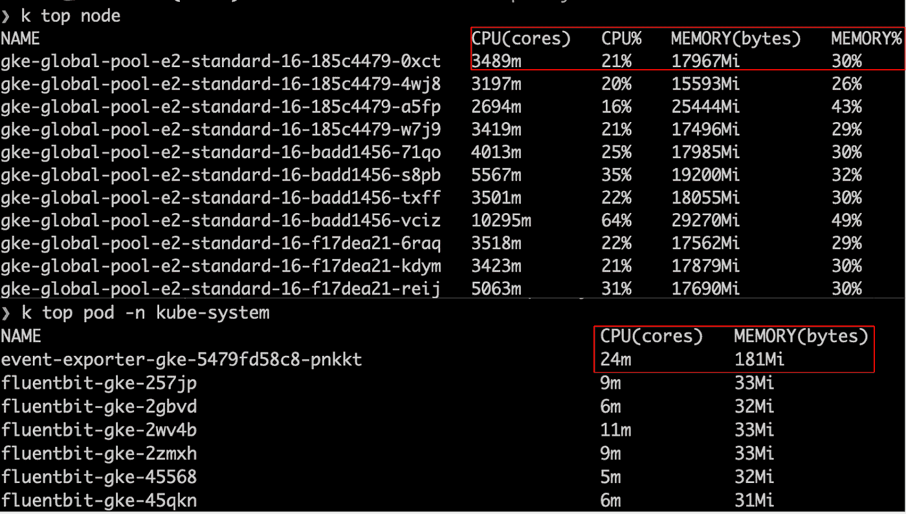
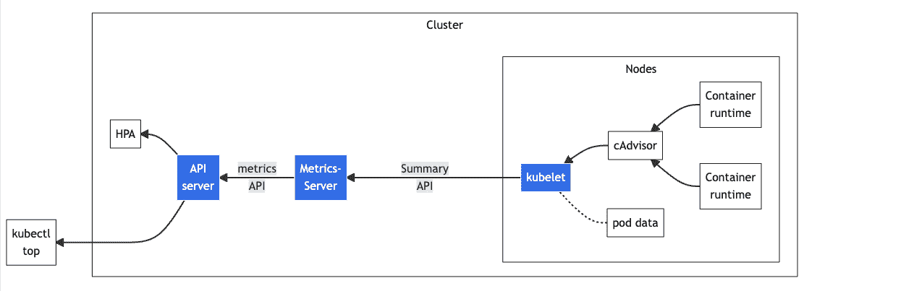
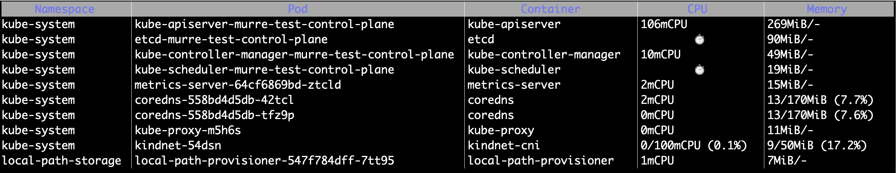
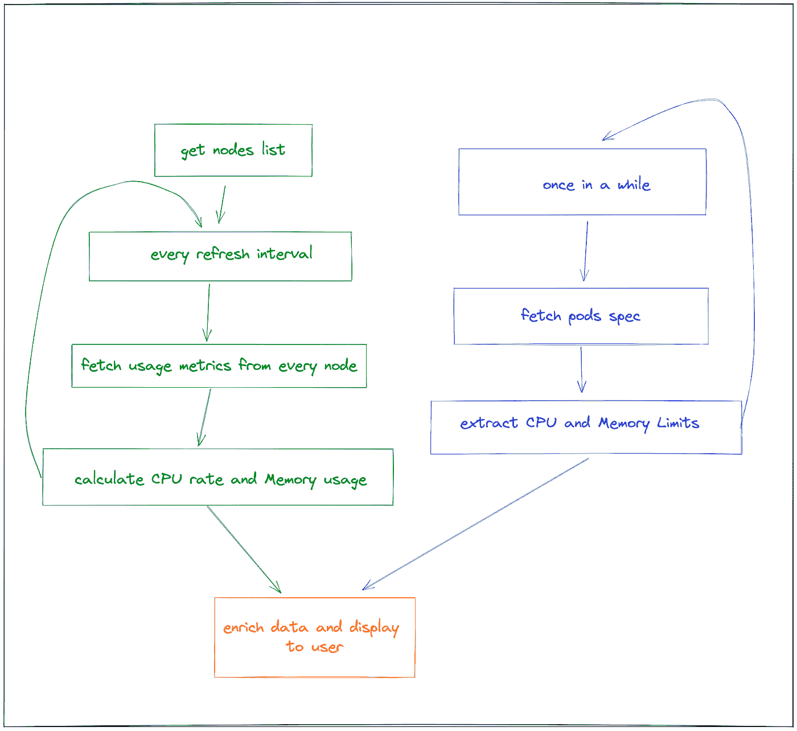

# 无依赖性 Kubernetes 集群监控

> 原文：<https://betterprogramming.pub/dependency-free-kubernetes-cluster-monitoring-5f7aa2f038d9>

## 引入 Murre 对 Kubernetes 集装箱进行持续监控


[照片](https://unsplash.com/photos/6EnTPvPPL6I)由 [Isaac Smith](https://unsplash.com/@isaacmsmith) 在 Unsplash 上拍摄

现在部署应用程序的首选平台是 Kubernetes。首先，它的集群可能包括数百个资源，如 pod 和部署，它由几个组件和用户定义的操作符组成。

资源中封装的各种服务、应用程序和网络使得用户很难理解 Kubernetes 是如何工作的。有很多不同的部分，比如容器内部发生了什么，哪个 pod 执行了特定的请求，为什么请求没有成功执行。因此，云管理团队需要保持可观察性并监控资源的健康状态。

可观察性包括三个方面:日志记录、跟踪和度量。通过日志记录，我们可以了解应用程序的操作。跟踪使我们能够知道问题发生在哪里。最后，指标显示集群的资源使用情况和整体运行状况。



按作者

它也是 CNCF 社区投资最多的地区之一。下图列出了 CNCF 所有关于可观测性的项目，其中许多我以前从未使用过或知道。



[来源](https://landscape.cncf.io/?category=monitoring&grouping=category)

监控工具通常侧重于收集和汇总指标。但是对于获取集群中节点、pod 和容器的 CPU 和 MEM 使用情况，开源的无依赖性监控 Go 工具 [Murre](https://github.com/groundcover-com/murre) 比这个列表中的工具做得更好。

在我们探索 Murre 之前，让我们以`Prometheus + Grafana`和`kubectl Top`命令为例，看看非无依赖性监控工具是如何工作的，以及 Murre 的优势是什么。

# 非依赖型监控工具

## 普罗米修斯+格拉法纳

作为最流行的 Kubernetes 监控解决方案，它帮助我们获得相应节点的 CPU 和 MEM 使用情况，例如`node_memory_Buffers_bytes`，如下所示:



[来源](https://play.grafana.org/d/rYdddlPWk/node-exporter-full?orgId=1&refresh=1m&viewPanel=78)

但是 Prometheus 的度量需要一一映射每个 pod/container/node，CPU 和 MEM 的度量键不同，无法直观的看到 pod 和 container 的关系。

例如，为了观察容器的 MEM 和 CPU，您需要分别配置`container_memory_working_set_bytes`和`container_cpu_usage_seconds_total`。Prometheus 的学习曲线也非常陡峭，因为它要求用户熟悉其度量键和聚合函数(`sum`、`rate`等)。).

除了需要安装和配置之外，Prometheus 和 Grafana 太大太复杂，无法监控资源使用情况。

## Kubectl Top

经典的`kubuctl top`命令允许我们查看节点/pod 的资源使用情况。



> 此命令要求正确配置 metrics-server 并在服务器上运行。​

首先，我们需要安装 Kubernetes 没有的 [metrics-server](https://github.com/kubernetes-sigs/metrics-server) 。但是大多数云提供商已经默认拥有它，因为[水平 Pod 自动缩放器](https://kubernetes.io/docs/tasks/run-application/horizontal-%20pod-autoscale/)和[垂直 Pod 自动缩放器](https://github.com/kubernetes/autoscaler/tree/master/vertical-pod-autoscaler/)都需要它才能工作。但是，如果手动设置 Kubernetes 集群，您仍然需要安装一个 metrics-server。

现在我们可以分别用`kubectl top node`和`kubectl top pod`得到单独的资源使用情况。



关于缺陷，一个是它依赖于 metrics-server，或者命令抛出了`Metrics API not available`错误。默认的 100 兆 CPU 和 200 兆内存设置只能在集群少于 100 个节点和每个节点 70 个 pod 时才能正常工作。另一个是它不显示容器资源的使用情况；它每次只显示最新的 pod 和节点资源使用情况，不能持续更新。

# 如何收集指标

普罗米修斯和`kubectl top`都能在一定程度上满足我们的需求。但是如果你再深入一点，你会发现 Prometheus 依赖于 [kube-state-metrics](https://github.com/kubernetes/kube-state-metrics) ，top 依赖于 metrics-server，两者都使用了 metrics API。至于它们的区别，metrics-server 侧重于读取集群级别的数据，而 kube-state-metrics 侧重于读取不同资源类型的数据，例如部署和副本。



[来源](https://kubernetes.io/docs/tasks/debug/debug-cluster/resource-metrics-pipeline/https://kubernetes.io/docs/tasks/debug/debug-cluster/resource-metrics-pipeline/)

# 使用开源 Murre 进行无依赖性监控

在我找到 Murre 之前，我使用 top 命令来调试节点和 pod 资源的使用，Murre 是一个无依赖性的开源工具，肯定更有效。



按作者

Murre 显示每个名称空间下的 pod 和容器的资源使用情况，并实时更新它们。它还支持按 CPU/MEM 排序。​

唯一需要的是在集群中安装 Murre，而不是任何依赖项。因为它不依赖于 APIServer，而是通过 client-go 实时获取 pod/container 信息，所以它会在终端中格式化并显示它所获取的内容(就像 kubectl 插件是如何实现的一样)。安装非常简单:

```
go install github.com/groundcover-com/murre@latest
```



[来源](https://www.groundcover.com/blog/murre)

代码很容易咀嚼和消化:获取指标的逻辑在于 fetcher.go 中的 [GetContainers](https://github.com/groundcover-com/murre/blob/ddaf8fa3a3e295be72f7b697af6491924eb83964/fetcher.go#L68) 函数，获取 PodList 并遍历容器。​

常规更新是使用 Go `timer.Ticker + select`完成[的](https://github.com/groundcover-com/murre/blob/ddaf8fa3a3e295be72f7b697af6491924eb83964/murre.go#L72)，并且可以使用`--interval`参数进行配置。​

# 结论

在这篇文章中，我们讨论了非无依赖性 K8s 监控，以及它与无依赖性监控的比较。Murre 是一个有效的工具，用于观察 pod 和容器的资源使用情况，而无需在集群中安装任何依赖项。虽然它还处于初级阶段，有待完善，但我可以想象，当增加更多功能时，它会变得更加强大，例如显示部署、副本、APIServer 等的指标。​

感谢阅读！敬请关注更多内容。