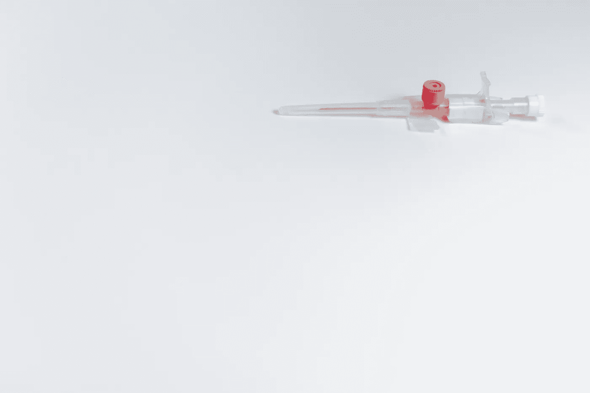

# 什么是依赖注入设计模式？

> 原文：<https://betterprogramming.pub/dependency-injection-8f09a93ec995>

## 依赖注入确保我们的代码尽可能灵活、可测试、易于修改

由[paweczerwiński](https://unsplash.com/@pawel_czerwinski?utm_source=unsplash&utm_medium=referral&utm_content=creditCopyText)在 [Unsplash](https://unsplash.com/s/photos/injection?utm_source=unsplash&utm_medium=referral&utm_content=creditCopyText) 上拍摄的照片

我们正在开发处理用户注册的应用程序的一部分。我们创建了一个负责与数据库通信的类。

另一个处理与用户注册相关的逻辑。

乍一看，一切似乎都很好。但是随着应用程序开始增长，我们将面临许多问题:

*   `User`与`UserStorage`耦合非常严格。`UserStorage`实施过程中的任何变化都可能直接影响`User`。我们的代码打破了依赖倒置原则(来自 [SOLID](http://butunclebob.com/ArticleS.UncleBob.PrinciplesOfOod) )。
*   如果`UserStorage`的初始化需要任何额外的工作或依赖，那么`User`将负责提供。这样我们就违反了单一责任原则。
*   编写测试将变得更加困难。

为这样一个类编写单元测试并非不可能，但是我们真的很难在`register`方法中模仿`User`的初始化。

如果我们不模仿它，每次运行测试时，它都会连接并向数据库中插入一些东西。这不是一个好的做法。

另一种方法是在构造函数中传递`User`实例。在这种情况下，嘲讽真的很容易，我们的代码可以更加独立于`UserStorage`中的变化。

让我们创建一个极简界面，这样`User`现在将依赖于抽象(`Storage`)而不是具体的实现(`UserStorage`)。

`User`变得更加独立，不需要关心`UserStorage`中的实现细节。

编写单元测试现在是一种真正的乐趣。

依赖注入是对一项非常简单的工作的一种奇特表达。我们只是传递对象，而不是直接初始化它。最简单的方法是将其放入构造函数中，但也有其他流行的解决方案:

*   通过 setter 方法传递具体的实现
*   为依赖关系使用外部[容器](https://stackoverflow.com/questions/50718586/what-is-a-di-container)
*   使用[服务定位器模式](https://en.wikipedia.org/wiki/Service_locator_pattern)(不推荐)

最流行的 PHP 框架也有自己的依赖注入实现(例如 [Larvel](https://laravel.com/docs/5.8/container) ， [Yii 2](https://www.yiiframework.com/doc/guide/2.0/en/concept-di-container) )。 [PHP-DI](http://php-di.org) 也是一个很有意思的项目。

# 优势

*   使代码更易测试
*   使代码更加灵活，耦合度更低

# 源代码

完整的源代码和其他一些模式可以在这里找到:

 [## jkapuscik 2/设计-模式-php

### 这个项目是一组在现实世界中使用不同设计模式的简单例子。每个人都有一个…

github.com](https://github.com/jkapuscik2/design-patterns-php) 

如果您想了解一些更有用的设计模式，您可以在以下文章中找到它们:

*   [工厂方法](https://medium.com/@j.kapuscik2/getting-started-with-design-patterns-in-php-4d451ccdfb71)
*   [创作模式](https://medium.com/@j.kapuscik2/creational-design-patterns-in-php-db365d3245ce)
*   [观察者](https://medium.com/@j.kapuscik2/observer-pattern-in-php-2ba240f89fb2)
*   [迭代器](https://medium.com/@j.kapuscik2/iterator-pattern-in-php-b7624f6bdbcf)
*   [状态&策略](https://medium.com/@j.kapuscik2/state-strategy-design-patterns-by-example-f57ebd7b6211)
*   [模板法](https://medium.com/@j.kapuscik2/template-method-pattern-in-php-6116fd7e8ccc?source=friends_link&sk=ac4c483446bd5a5323c09a662bd54116)
*   [飞锤](https://medium.com/swlh/flyweight-design-pattern-in-php-edcda0486fb0?source=friends_link&sk=a0fa3083d5afd7e41af8a4f7a1df05f1)
*   [代理](https://medium.com/better-programming/proxy-design-pattern-and-how-to-use-it-acd0f11e5330)
*   [装饰工](https://medium.com/better-programming/decorator-c04fae63dfff)
*   [复合](https://medium.com/swlh/composite-908878748d0e)
*   [适配器](https://medium.com/swlh/building-cloud-storage-application-with-adapter-design-pattern-8b0105a1bda7)
*   [立面](https://medium.com/better-programming/what-is-facade-design-pattern-67cb09ce35d4)
*   [桥](https://medium.com/better-programming/what-is-bridge-design-pattern-89bfa581fbd3)
*   [责任链](https://medium.com/@j.kapuscik2/what-is-chain-of-responsibility-design-pattern-ff4d22abd124)
*   [访客](https://medium.com/@j.kapuscik2/what-is-visitor-design-pattern-8451fb75876)
*   [命令](https://medium.com/@j.kapuscik2/what-is-cqrs-command-design-pattern-5d400fd9f93a)
*   [空对象](https://medium.com/@j.kapuscik2/what-is-null-object-design-pattern-f3b4d3d28636)
*   [流畅的界面](https://medium.com/@j.kapuscik2/what-is-the-fluent-interface-design-pattern-2797645b2a2e)
*   [规格](https://medium.com/@j.kapuscik2/what-is-the-specification-design-pattern-4051dd9e71c3)