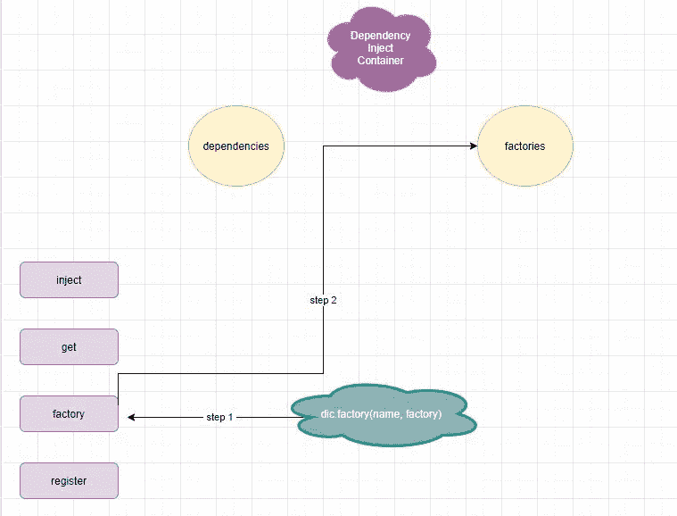
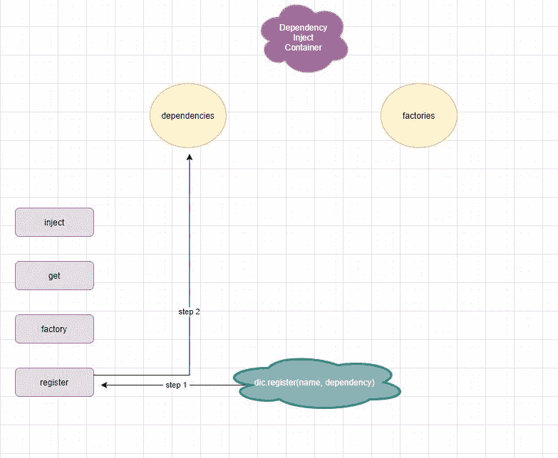
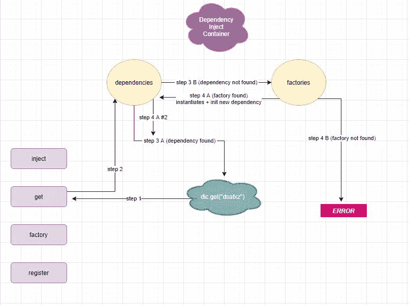
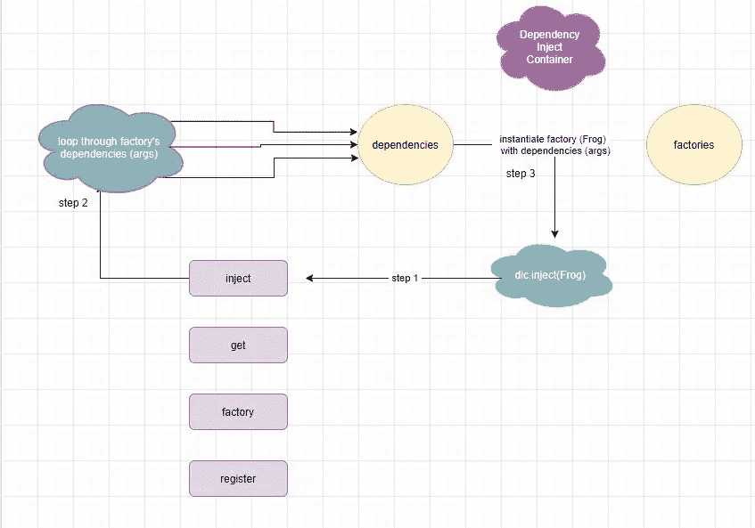

# JavaScript 中的依赖注入容器

> 原文：<https://betterprogramming.pub/dependency-injection-containers-in-javascript-5fd2c2b4be30>

## 在这里，注射是控制的逆过程

照片由 [Ayooluwa Isaiah](https://unsplash.com/@ayoisaiah?utm_source=unsplash&utm_medium=referral&utm_content=creditCopyText) 在 [Unsplash](https://unsplash.com/s/photos/toad?utm_source=unsplash&utm_medium=referral&utm_content=creditCopyText) 拍摄

由于其灵活性的本质，JavaScript 能够使用许多技术。在这篇文章中，我们将讨论依赖注入容器。

这种模式实际上提供了与依赖注入相同的目标，但是以一种更灵活和更强大的方式，充当容纳函数(或类)的依赖项的容器，这些函数(或类)在需要时需要它们，例如在它们的初始化阶段。

# 没有容器的依赖注入

让我们快速回顾一下什么是依赖注入，它在代码中是什么样子，它解决了什么问题，以及它遭受了什么问题。

依赖注入是一种模式，有助于避免模块中的硬编码依赖，使调用者能够改变它们，并在一个地方提供他们自己的依赖。

这些依赖关系可以注入到构造函数(实例化)阶段，也可以在以后用 setter 方法设置:

这有一些问题。

## **问题#1**

如果我们需要改变`Toad`的构造方式，并且它需要一些脆弱的东西，比如参数的定位或它们的数据结构，我们将不得不手动改变代码，因为它是被*硬编码到他们的代码块中的。*

这种场景的一个例子是在`Frog`类中有一个突破性的变化。

首先，如果`Frog`像`weight`一样在其构造函数中添加了第三个参数:

然后我们的`Toad` *必须*被更新，因为这个新的依赖项被添加到我们的`Frog`实例化中:

那么，如果我们保持这种方式，如果你在某个青蛙创业公司，并且那是你开始的第一批代码之一，你认为你会有多少次不得不改变`Toad`？

## 第二期

你必须知道每次对`Toad`使用什么依赖关系。

我们*有*知道`Toad`现在需要*完全相同顺序的四个参数*来正确初始化`Frog`的实例，甚至是它们的数据类型，否则很容易出现 bug。

如果你知道`Toad`本质上是一只青蛙，这看起来会很尴尬，所以知道了这一点，你可能会意外地认为`Toad`会扩展`Frog`。

所以，然后你意识到`Frog`的一个实例正在`Toad`内部被创建，现在你变得很困惑，因为你是一个聪明的人，代码只是把你扔了出去——意识到代码与现实世界不一致。

## **问题#3**

不必要地包含更多代码。

使用依赖注入模式，这些问题可以通过反转依赖实例化方式的控制来解决:

好吧，那很简单。现在，当`Frog`有另一个突破性的变化时(比如参数被放入一个 JavaScript 对象)，我们甚至不需要接触`Toad`或者浪费脑细胞去读取`Toad`，然后`Frog`，然后回到`Toad`，等等。

这是因为我们现在可以只改变我们创建一个`Toad`实例的部分(这比不得不在`Toad`实现中改变内容要好，这是一种糟糕的做法！

它不应该担心 frog 是如何构造的，它应该只知道它将一个 frog 作为参数，并将其存储在它的`.frog`属性中以备后用。*你*现在掌管它的属地。

因此，我们只是通过从`Toad`构造函数中抽象出`Frog`的实现细节来实践一些干净的代码实践。有道理:难道`Toad`连*都要关心* `Frog`是怎么构造的？如果有的话，它应该只是延长它！

# 依赖注入容器(DIC)模式

既然我们已经对依赖注入有了新的认识，那么让我们来谈谈依赖注入容器吧！

那么，为什么我们需要 DIC 模式，为什么没有容器的依赖注入在困难的情况下还不够？

问题是:它就是不可扩展。你的项目变得越大，你就越开始对长期维护你的代码失去信心，因为这样，随着时间的推移，它就会变得一团糟。

此外，你还必须以正确的顺序获得注入依赖项的顺序，这样当你实例化某个东西时，你就不会陷入某个东西被`undefined`的问题。

所以，本质上，六个月后，我们的代码可以进化成这样:

当调用来自`FrogAdoptionFacility`的`setAdoption`时，整个采用过程结束。

让我们假设您开始使用这些类开发代码，并以如下所示的工作版本结束:

如果我们运行代码，它将工作并创建一个新的收养对象，如下所示:

我们有一个非常好的应用程序——一个青蛙收养设施，客户可以来收养一只青蛙。但是收养过程不是简单的给钱/收钱交易。

我们假装有一条法律要求每个收养青蛙的机构都要进行这个过程，把青蛙交给它们的新主人。

因此，它要求工厂(青蛙天堂)生成一份需要客户签名的合同。

然后，还会在现场创建一个许可证，客户需要将它放在上面以获得法律保护。最后，完成所有工作后，领养也就完成了。

看一看`FrogOwner`级:

它有三个依赖关系:`frogOwner`、`frogOwnerLicense`和`frog`。

让我们假设有一个对`frogOwner`(一个`Person`的实例)的更新，它变成了一个`Client`的实例:

现在，需要更新对初始化`FrogParadiseOwner`的调用。

但是如果我们已经在代码的几个位置初始化了`FrogParadiseOwner`会怎么样呢？如果我们的代码越来越长，这些实例的数量越来越多，维护就越来越成问题。

这就是依赖注入容器可以发挥作用的地方，因为您只需要在一个位置更改代码。

依赖注入容器可能是这样的:

有了这些，更新更改就变得如此简单:

现在，不是像以前那样直接初始化它，而是必须更改代码的所有其他实例:

相反，您可以使用 DIC 来更新它*一次*，并且您不需要更改代码的任何其他部分，因为我们颠倒了流向容器的方向:

让我们解释一下驾驶员信息中心正在做什么:

您可以通过将任何您希望由 DIC 解析的类或函数传递给`.factory()`方法来插入它们，该方法存储在`.factory`属性中。

对于传递给`.factory`的每一个函数，您必须使用`.register()`注册它们的参数，这样当容器初始化被请求的函数时，它们就可以被获取。

他们从`.dependencies`地产被接走。您可以使用`.dependencies()`方法向依赖项添加内容。

当你想找回某样东西时，你用`.get`和一些`key`。它使用`key`来查看它的`dependencies`，如果它在那里发现了什么，它将返回它。

否则，它将继续查看它的`factories`,如果它发现了什么，它将把它当作一个你希望它解决的函数。

然后，它将调用传递给`.inject`，在其中读取函数依赖项(参数)的名称，并从其`.dependencies`属性中获取它们，调用函数并注入其参数，返回结果。

在我们的代码示例中，我使用了`parse-function`来允许`inject`方法获取函数参数的名称。

要在没有库的情况下做到这一点，您可以向`.get`添加一个额外的参数，并让它像这样传递给它的`.inject`:

尽管如此，我们仍然得到相同的结果:

# 结论

这篇文章到此结束！我希望你发现这是有价值的，并期待在未来更多！