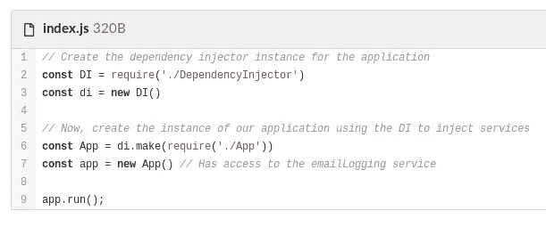

# 不到 100 行纯 JavaScript 代码中的依赖注入

> 原文：<https://betterprogramming.pub/dependency-injection-in-less-than-100-lines-of-pure-javascript-9f349c9c6b47>

## 使用 Agular 令人敬畏的依赖注入



如果你曾经使用过 Angular 很长时间，你可能已经注意到它的依赖注入有多棒。只需调用[injectible decorator](https://angular.io/api/core/Injectable)，您就可以在应用程序中引入任何服务的可重用实例，只需引用类型:

```
import {Injectable} from '@angular/core';
import {BackendService} from './backend.service';

@Injectable()
export class AuthService {
  constructor(
      private backend: BackendService,
  ) {
     this.backend.somethingAwesome();
  }
}
```

注意，我不需要在任何地方实例化`BackendService`,因为 Angular 已经为我处理了它。这有一个额外的好处，确保在运行时只创建一个`BackendService`实例，这对内存有好处！

# 背景—过滤器

在过去一年左右的时间里，我一直在创建一个名为 [Flitter](https://flitter.garrettmills.dev/) 的 Express 支持的 JavaScript 网络应用框架。Flitter 的主要哲学之一是一切都应该是一个类。因此，虽然 Flitter 合并了许多传统的 ES5 库——Express、Mongoose、Agenda.js 等——但它提供了一个使用 ES6+类定义资源的系统。这就是为什么在 Flitter 中你永远看不到，例如，基于模式的模型定义:

```
// Mongoose - from the getting started guide
var kittySchema = new mongoose.Schema({
  name: String
});

kittySchema.methods.speak = function () {
  var greeting = this.name
    ? "Meow name is " + this.name
    : "I don't have a name";
  console.log(greeting);
}
```

相反，我们定义适当的类:

```
// Using Flitter classes
const Model = require('libflitter/database/Model')
class Kitty extends Model {
  static get __context() {
    return {
      name: String
    }
  }

  speak() {
    const greeting = this.name
      ? `Meow name is ${this.name}` : `I don't have a name`
    console.log(greeting)
  }
}
```

将我们所有的资源定义在标准类中，从主观上来说，比大量不同的模式格式和函数调用更容易维护和推理。此外，它还有一个额外的好处，那就是能够继承我们所有现成的资源。然而，它提出了一个有趣的问题。

# 更高级服务的问题是

如果一切都是一个类，我们如何从我们的应用程序中访问可重用的方法？如果我们使用对象，这将很容易:

```
// logHelpers.js
module.exports = exports = {
  loggingLevel: 2,
  out(what, level) {
    if ( !Array.isArray(what) ) what = [what]
    if ( level >= this.loggingLevel ) console.log(...what)
  },
  error(what, level = 0) { this.out(what, level) },
  warn(what, level = 1) { this.out(what, level) },
  info(what, level = 2) { this.out(what, level) },
  debug(what, level = 3) { this.out(what, level) },
}
```

这个好像很好用。我们只需导入模块，一切就绪:

```
const logging = require('./logHelpers')
const someFunction = () => {
  logging.info('someFunction has executed!')
}
```

但是，如果我们想要创建一个不同的助手“类”来在记录错误时发送电子邮件，会发生什么情况呢？嗯，我们*可能*只是从头再写一遍整个事情，但是那不是很[干](https://en.wikipedia.org/wiki/Don't_repeat_yourself)。因此，我们替代了原始助手的特定属性:

```
// emailLogHelpers.js
const logHelpers = require('./logHelpers')
module.exports = exports = Object.assign(logHelpers, {
  emailOut(what, level) {
    sendAnImaginaryEmailSomewhere(what);
    this.out(what, level);
  },
  error(what, level = 0) {  this.emailOut(what, level) },
})
```

但是这引入了模糊性。`error()`中的`this`指的是什么？在`emailOut()`怎么样？你能发现这个错误吗？从 OOP 的角度来看，这是正确的。然而，如果我们在 email helpers 对象上调用`error()`，我们会得到以下错误:

```
ReferenceError: out is not defined
  at Object.emailLogHelpers (emailLogHelpers.js:6:4)
```

为什么？因为`emailOut`函数中的`this`实际上并不是指组合对象，而是指创建时的原始对象。也就是右边的`Object.assign`称呼。

这可以通过定义一个`LogHelper`类并创建一个子类`EmailLogHelper`来轻松解决。然后，在`EmailLogHelper`类中，`this`将明确地引用实例本身，它已经有了所有的`LogHelper`方法。例如:

```
// EmailLogHelper.js
const LogHelper = require('./LogHelper')
class EmailLogHelper extends LogHelper {
  out(what, level) {
    sendAnImaginaryEmailSomewhere(what);
    super.out(what, level);
  }
}
```

但是这给我们留下了基于类的服务的根本问题:

> 服务类必须先实例化，然后才能使用。

为什么这是一个问题？那么，如果有一些配置服务`LogHelper`依赖于(或依赖于)获得日志记录级别呢？在这种情况下，要在任何地方使用该服务，我们还必须实例化配置服务并将其传递给日志助手。但是接下来我们有 20 个几乎相同的相同类的实例在做同样的事情。有什么解决办法？

## ES6 中的依赖注入:比你想象的容易！

以上所有问题的解决方案是让某个依赖注入器管理器类在应用程序启动时创建所有相关服务的实例。然后，每当一个类需要访问服务时，它就从 DI 获取共享实例。这节省了内存并防止了上面的手动依赖链接问题。

事实证明，由于 ES6 类语法的好处，用普通的 JavaScript 实现基本的 DI 非常容易！我们将从多个方面着手。

# 服务类别

服务(对于我们的基本目的来说)只是一个类，在第一次需要它的时候应该实例化一次，然后在后续调用中重用。所以服务类现在可以完全空出来:

```
class Service {

}
```

最终，您可以通过跟踪服务状态或者甚至使服务本身可注入来使这个系统更加高级！也许在以后的文章中，我们会探讨这个问题。

# 注射类

这个类将是每个可以使用自动 DI 的类的父类。在我们的角度类比中，这类似于可注射的装饰。它应该做两件事:指定我们想要访问的服务，并提供访问它们的机制。这里有一个基于 [Flitter 的可注入类](https://git.garrettmills.dev/flitter/libflitter/src/branch/master/di/Injectable.js)的例子:

```
// Injectable.js
class Injectable {
  static services = []
  static __inject(container) {
    this.services.forEach(serviceName => {
      this.prototype[serviceName] = container.getService(serviceName)
    }
  }
}
```

显然，这缺少了一些细节和类型检查，但是基本的功能还是有的。静态地，我们定义一个服务名数组供实例访问，然后，在类被实例化之前的某个时刻，调用`__inject`方法。该方法将服务实例注入到类'`prototype`，这是为该类的每个实例复制的底层函数。它从一个不可思议的`container`那里获得这些服务实例，我们很快就会谈到。

这使得类访问服务变得非常容易。例如:

```
// DarkSideHelpers.js
const Injectable = require('./Injectable')
class DarkSideHelpers extends Injectable {
  static services = ['logging']
  doItAnakin() {
    try {
      somethingDangerous()
    } catch (error) {
      this.logging.error('It\'s not the Jedi way!')
    }
  }
}
```

不需要实例化`LogHelper`类！这不是很棒吗？

# 服务容器

但是如果没有服务注入，花哨的静态对我们来说毫无用处。我们需要为他们创造一个生活的地方。因为我们希望尽可能多地重用实例，所以我们需要一个容器来为我们创建和管理那些实例。这个容器应该包含服务名到服务类的映射，如果请求的服务还不存在，实例化它们，并根据请求返回这些实例。让我们试一个:

```
// ServiceContainer.js
const LogHelper = require('./LogHelper')
const EmailLogHelper = require('./EmailLogHelper')

class ServiceContainer {
  constructor() {
    // We define the service classes here, but we won't
    // instantiate them until they're needed.
    this.definitions = {
      logging: LogHelper,
      emailLogging: EmailLogHelper,
    }

    // This is where the container will store service instances
    // so they can be reused when requested.
    this.instances = {}
  }

  getService(serviceName) {
    // Create a service instance if one doesn't already exist.
    if ( !this.instances[serviceName] ) {
      const ServiceClass = this.definitions[serviceName]
      this.instances[serviceName] = new ServiceClass()
    }
    return this.instances[serviceName]
  }
}
```

我们的基本服务容器包含服务定义列表和检索服务实例的方法。它满足了我们的需求，因为它不会在需要时实例化服务，而是重用现有的实例。因此，我们有了服务的容器，但现在我们是使所有三个部分一起工作的最后一块。

# 依赖注入器主机

DI 主机是整个操作的老板。它负责创建容器的一个实例(甚至多个不同的实例)并跟踪它们。它还负责在类被实例化之前调用神奇的`__inject`方法。有几种不同的策略可以做到这一点。根据具体情况，每种方法都有自己的优点，但是我们将会看到一种适用于独立应用程序的方法:

```
// DependencyInjector.js
const ServiceContainer = require('./ServiceContainer.js')
class DependencyInjector {
  constructor() {
    this.container = new ServiceContainer()
  }

  // Injects the dependencies into an uninstantiated class
  make(Class) {
    return Class.__inject(this.container)
  }
}
```

像我们其余的类一样，这个非常简单。构造时，它创建一个新的服务容器。然后我们可以将类传递给`make`方法，它会将容器中的依赖注入到类中。

DI 实例应该在整个应用程序中共享。这将有助于尽可能多地重用服务实例。这里有一个愚蠢的例子。

## 一个产生垃圾邮件的示例应用程序

作为如何使用这个系统的例子，让我们创建一个非常基本的应用程序。这个应用程序应该反复发送垃圾邮件给它的所有者。为此，我们将使用我们奇特的依赖注入器。

```
// App.js
const Injectable = require('./Injectable')
class App extends Injectable {
  static services = ['emailLogging']
  run() {
    setInterval(() => {
      this.emailLogging.error('Haha made ya\' look!')
    }, 5000)
  }
}
```

我们将其与 DI 结合在一起，并运行应用程序:

```
// index.js
// Create the dependency injector instance for the application
const DI = require('./DependencyInjector')
const di = new DI()

// Now, create the instance of our application using the DI to inject services
const App = di.make(require('./App'))
const app = new App() // Has access to the emailLogging service

app.run();
```

# 结论

> 依赖注入是一个强大的工具……用于降低代码的复杂性，并适当地将代码细分为纯粹的、可维护的部分。

我们在 vanilla ES6 中构建了一个具有可注入依赖关系的基本应用程序。显然，这里可以进行许多增强和改进。例如，对服务和容器进行类型检查，使服务本身成为可注入的，将`Injectable`基类移动到 [ES7 装饰器](https://www.martin-brennan.com/es7-decorators/)中，这样它就可以应用到有其他父类的类中，等等。也许将来我会做一个后续。但是我希望这篇文章很好地展示了 DI 在使代码变得更好方面的威力。

依赖注入是一个强大的工具，不仅可以降低内存负载，还可以降低代码复杂性，并适当地将代码细分为纯粹的、可维护的部分。谢谢你能走到这一步。

如果有问题，一定要在下面评论。

加勒特（m.）

*附注——你可以在这里* *找到本例中使用的代码* [*。*](https://git.garrettmills.dev/garrettmills/es6-di)