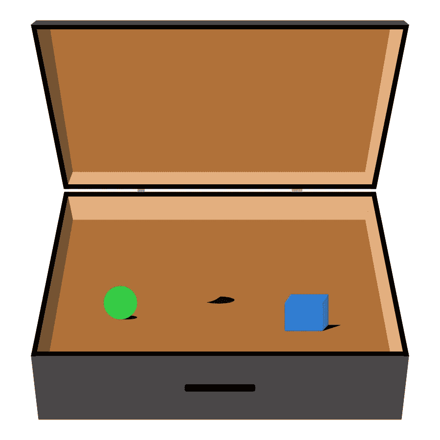

# 带 Dip 的依赖注入

> 原文：<https://betterprogramming.pub/dependency-injecton-with-dip-1d5adec45cee>

## 在 Swift 中使用依赖注入容器

依赖注入容器很像一个手提箱。

依赖注入是降低复杂性的一个重要概念。依赖注入有许多不同的方法，今天我们来看一个叫做依赖注入容器的概念。我们将探索一个提供这种容器的框架，称为 Dip，它是由 AliSoftware 开发的，可以在他的 [GitHub](https://github.com/AliSoftware/Dip) 上找到。

但是什么是依赖注入容器呢？你可以把它想象成一个手提箱，里面装着你所有的依赖。手提箱(以及里面的所有东西)可以很容易地从一个人手中转到下一个人手中。依赖项注入容器提供了一种简单的方法，将依赖项捆绑在一个对象中进行传递。当您需要处理许多依赖项时，这非常有用。看看这个例子:

一个类可能有许多依赖项。

像这样的类可以管理一个应用程序的设置。它使用存储库来加载和保存设置和用户数据，可以访问验证用户对电子邮件和密码所做的更改的类，并且有许多其他依赖项。每当您想要创建一个`SettingsService`的实例时，您将需要收集所有这些依赖项，它们自己可能有多个依赖项。

使用一个容器，例如 Dip 的`DependencyContainer`类，你可以将所有的依赖关系封装在一个大的单一依赖关系中。这样`SettingsService`的设置就简单多了！

只传递一个依赖容器要简单得多。

# 例子

让我们通过看一些例子来探索 Dip。为了演示 Dip 是如何工作的，我将引入一个协议`Clock`，它只定义了一个叫做`today`的方法。

协议时钟将用于演示 Dip 的工作方式。

我们将使用该协议的三种不同实现来探索 Dip 的不同方面。

第一个实现叫做`SimpleClock`。

SimpleClock 是 Clock 的一个精简实现。

`// 1` —每当这个类的一个实例被初始化时，它打印出一条消息。

`// 2` —我们还希望看到它何时被取消初始化，从而在此处添加另一个打印。

`// 3` —最后，我们需要实现所需的函数`today`，这里我们只是返回一个新的日期对象。

接下来，我们有了`InitializerClock`。与前面的时钟不同，这个类期望在它的初始化器中有一个参数。

每个 InitializerClock 都有自己的标识符。

像以前一样，我们打印出一条短消息，以便在初始化器被调用时得到通知。此外，我们保存给定的标识符。

`// 2` —在反初始化器中，我们再次打印一条短消息。

`// 3` —同样，我们在`today`中返回当前日期。

最后但同样重要的是:`Clockzeption`。这个类看起来有点像上一个，但是这次它没有将标识符传递给它的初始化器，而是传递给了另一个`Clock`实例。

Clockzeption 非常懒惰，它使用另一个时钟来完成它的工作。

现在我们已经设置好了一切，让我们看看 Dip 能为我们提供什么。

# Dip 提供了什么

## 注册并解决

首先，让我们注册并解析一个`SimpleClock`的实例。

注册并解决与 Dip 的依赖关系。

`// 1` —首先，我们创建一个新的`DependencyContainer`。在闭包中，我们可以通过引用容器来注册依赖关系。

`// 2` —注册就像调用方法`register`并传递一个我们想要注册的对象一样轻松，例如`SimpleClock`。这里我们创建了一个新的`SimpleClock`实例，并注册为一个符合`Clock`协议的依赖项。

`// 3` — 解析时，我们需要使用`try`来捕捉错误。我们还需要指定我们期望从容器中得到的类型，以便能够解析正确的依赖关系。

当我们运行这段代码时，我们会看到*在控制台中创建了 SimpleClock* ，因为它的初始化器被调用了。

## 标签

到目前为止一切顺利！Dip 还提供了使用标签来识别注册的依赖项的可能性。标签使得注册依赖关系的不同配置和设置成为可能。在解析时，我们需要传递我们想要依赖的标签。让我们使用`InitializerClock`来看看如何做到这一点。

标签允许我们识别注册的依赖项。

`// 1` —我们可以使用普通的字符串作为标签，或者我们可以引入一个新的 enum 来实现协议`DependencyTagConvertible`。该枚举保存要使用的标签。

`// 2` —通过使用方法`register(tag:)`，我们可以标记我们的依赖关系。这里你可以看到两种方法，使用`Tags`枚举和一个原始字符串。

最后，我们告诉容器标签，我们想要获得它的依赖。和以前一样，我们可以传递`Tags`枚举或者使用一个原始字符串。

查看控制台，我们看到*用标识符创建 initializer clock:Tagged clock*和*用标识符创建 initializer clock:Tagged*，确认两个时钟都是用预期的名称创建的。

## 自动布线

Dip 提供了一种称为自动布线的机制。这意味着容器可以自己解决依赖关系。我们可以在`Clockzeption`的帮助下探索这个特性。

自动连线自动连线从属关系。

`// 1` —首先，我们注册一个`SimpleClock`。

`// 2`——然后，当我们想要注册`Clockzeption`时，需要在其初始化器中传递另一个时钟，容器可以自动解决这种依赖性。

`// 3` — 从容器中取出`Clockzeption`时，它已经设置好，可以使用了。

我们将看到*创建 SimpleClock* 和*创建 clock zeption with internal clock:simple clock*，证明 Dip 自动提供注册的`SimpleClock`作为`Clockzeption`的参数。

作为自动布线的替代方案，我们可以通过解析`SimpleClock`手册在闭包中设置`Clockzeption`:

在寄存器闭包中配置依赖关系。

## 注册现有对象

现在我们总是在 register 内部调用初始化器，但是我们也可以注册一个已经存在的对象:

在容器中注册现有对象。

`// 1` —我们可能在代码中的其他地方创建了一个对象。

`// 2`—**—**在寄存器上，我们也可以引用已有的对象。

`// 3` — 解析时，我们可以检查是否是完全相同的实例。

## 寄存器值

Dip 还允许我们注册值。正如你在这个例子中看到的，我们可以注册字符串、整数、布尔值或任何其他类型。

在容器中注册值

## 范围

在依赖关系容器中注册的每个依赖关系都有一个定义其生存期的所谓范围。

两个主要范围是`unique`和`singleton`。第一种方法每次创建一个新的实例。这是默认的作用域，所以如果你没有明确声明，每个依赖项都会有这个作用域。第二个作用域只创建一个实例一次，每次解析都返回相同的实例。

范围`singleton`还有另外两种选择:`eagerSingleton` (容器引导时创建实例)和`weakSingleton` (容器存储对已解析实例的弱引用)。

另一个范围叫做`shared`。具有此范围的依赖项是为一次 resolve 调用创建的。这允许我们有两个不同的对象共享同一个实例。

为了让事情更清楚，让我们看看不同范围的依赖关系是如何表现的:

`// 1` —我们通过使用范围参数调用 register 方法来显式声明范围。这里我们注册了`InitializerClock`的两个实例，一个具有作用域`unique`，一个具有`singleton`。我们用标签来区分要解决哪一个。

`// 2` —当两次解析带有范围`unique`的时钟时，我们将在控制台中看到两行*创建带有标识符的 initializer clock:unique*。这证明了每次解析都会初始化一个新的实例。

`// 3` —但是当我们两次用作用域`singleton`解析时钟时，我们只能看到一行*用标识符:singleton 创建 InitializerClock。因此，两个时钟 singleton1 和 singleton2 是相同的。*

## 合作

多个容器可以链接在一起，从而进行协作。这允许使用其中一个组合容器的类也可以访问在另一个容器中注册的依赖项。

依赖性容器可以协作并共享它们依赖性。

`// 1` —我们创建了两个容器，在其中我们用不同的标识符注册了`InitializerClock`的实例。

`// 2` —连接两个容器就像调用方法`collaborate`一样简单。

`// 3` —当我们将其中一个容器传递给一个类时，这个类现在可以使用在两个容器中注册的依赖项。

# Dip 的优点和缺点

现在我们知道了如何使用 Dip，我们可以看看它的一些优点和缺点。

## 优势

*   注册和解析依赖关系非常简单。
*   传递多个依赖项更加方便，因为只需要传递一个容器，而不是多个不同的实例。
*   自动连接改进了依赖项的创建和注册，依赖项本身依赖于已经在容器中注册的依赖项。
*   标签允许我们注册多个不同配置的类。需要的变体可以通过标签识别。
*   使用一个单独的容器来模拟使得测试变得简单。
*   Dip 可以自己解决循环依赖。

## 不足之处

*   任何只需要一个依赖项的类都可以访问容器中所有注册的对象。
*   乍一看，一个类具有哪种依赖关系是看不出来的。您需要查看哪些类已被解析。
*   不像在初始化器中传递一个依赖项，从而确保它是可用的，任何解析依赖项的类都必须依赖于之前已经在某个地方注册过。
*   每个解决方案都需要错误处理。

# 结论

总而言之，Dip 是管理依赖关系的一个很好的方法。列出的缺点或多或少是这种依赖注入的普遍问题，并不仅仅与 Dip 相关。如果您决定使用依赖注入容器，Dip 是一个不错的选择，它将为您提供各种各样的功能。

如果你想玩 dip，但是用嵌入式 pods 创建一个游乐场对你来说太麻烦了，你可以在我的 [GitHub 站点](https://github.com/DavidPiper94/dip_playground)上找到一个包含所有代码示例的游乐场。或者你可以[阅读我关于游乐场](https://medium.com/@HeyDaveTheDev/making-swift-playgrounds-more-playful-6fd6d9f5ba54)的文章，在那里我解释了如何简单地用终端在一行中创建一个带有豆荚的游乐场。

# 资源

【https://github.com/AliSoftware/Dip 