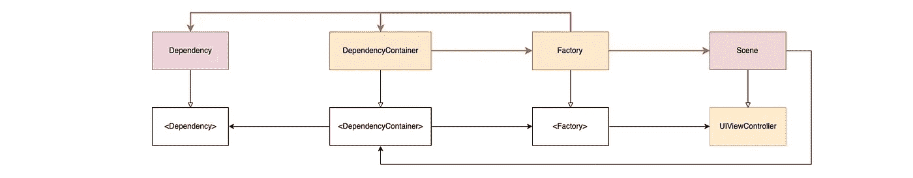

# 在 Swift 中手动完成依赖性管理

> 原文：<https://betterprogramming.pub/dependency-management-done-manually-in-swift-ee0f8f2dfbe3>

## 可扩展 iOS 应用架构的组成部分

## 通过编写自己的容器轻松解决依赖关系

如果你依赖某样东西，你就失去了一些自由。但是如果你可以很容易地取代这种依赖，你至少可以自由地决定你所依赖的是什么！🙃

在代码中，这意味着通过协议只定义抽象的依赖关系，这样就可以很容易地交换具体的实现。然后在运行时从外部分配具体的依赖关系。这被称为依赖注入(DI ),或者从更广的意义上说，称为依赖管理(DM)。

Alexey Kuznetsov 在他的文章“[swift 中的依赖注入](https://medium.com/ios-os-x-development/dependency-injection-in-swift-a959c6eee0ab)”中非常清楚地解释了如何做到这一点。而 [Joe Masilotti](https://medium.com/u/27f1499af22d?source=post_page-----ee0f8f2dfbe3--------------------------------) 展示了为什么应该在“[使用 Swift](https://medium.com/@joemasilotti/better-unit-testing-with-swift-b2d5746b5101) 进行更好的单元测试”中完成。

Swift 项目中的 DI 有框架解决方案，如 [Swinject](https://github.com/Swinject/Swinject) 。您创建一个容器，并在其中注册所有可能的依赖项。创建对象时，会查询容器，通过返回这些对象来解析依赖关系。

一个有趣的选择是 Weaver。与 Swinject 不同，Weaver 是一个命令行工具，因此不作为框架包含在项目中。在构建过程中，它会自动生成依赖代码。

正如 [Théophane Rupin](https://medium.com/u/c7f0f9651ab7?source=post_page-----ee0f8f2dfbe3--------------------------------) 在他的文章“[Weaver:Swift 的无痛依赖注入框架](https://medium.com/scribd-data-science-engineering/weaver-a-painless-dependency-injection-framework-for-swift-7c4afad5ef6a)中解释的那样，Weaver 比 Swinject 有几个优点，例如编译时解决方案，而 Swinject 可能会由于非可选选项而经历运行时崩溃。此外，使用注释定义依赖项是一种非常有趣的方法，但它也带来了一些问题，因为您突然在注释中编写了“代码”。😬

当然，任何喜欢框架或命令行工具的人都应该使用它们。然而，为了解决依赖性而使自己依赖于新的事物，这具有一定的讽刺意味。😏

# 手动依赖注入

原则上，您需要一个容器来保存所有依赖项，并传递给需要依赖项的类。为了避免直接依赖于这个容器，您使用协议以及依赖关系本身。

第 5 行定义了依赖关系:这里是一个*服务器*类，它的典型任务是与服务器通信。

为了不直接依赖于这个特定的类，在第 1 行定义了相关的协议。在这种情况下，协议在传统意义上被用作接口，因此也这样命名。回到使用头文件的好时光。😅

同样的情况发生在第 9 行和第 13 行，在那里定义了容器。 *DependencyContainer* 表示保存变量`server`中*服务器*依赖关系的容器。容器已经对具体的*服务器*类一无所知，因为它只引用了*服务器接口*。

然后，一个虚构的 *ViewController* 获取在`init`方法中注入的容器。同样， *ViewController* 不知道具体的 *DependencyContainer* 类，只知道它的协议。然而，这足以通过第 29 行中的从属*服务器*类启动一个服务器请求。

根对象，比如 *AppDelegate* ，必须创建具体的实例。这里，这发生在第 38 行的例子中。创建了类型为 *DependencyContainer* 和 *Server* 的具体实例。

第 39 行最后创建了具体的 *ViewController* 并注入了依赖项。如果您没有手动实例化您的 *ViewController* ，您也可以通过属性注入来传递容器，因此不是通过`init`方法基于初始化式，而是将依赖关系直接分配给属性。

如果一个*视图控制器*调用一个新的视图控制器，这将通过 DI 再次完成，这在第 32 行的`navigate`方法中作为一个例子给出。

如果需要更多的依赖关系，你所要做的就是扩展 *DependencyContainer* 并将具体的依赖关系传递给实例化。

在一个 *UnitTest* 环境中，你不会给 *DependencyContainer* 一个特定的*服务器*实例，而可能是一个*服务器模拟*实例。然后，mock 简单地实现了 *ServerInterface* ，并检查在测试期间是否调用了正确的方法，或者是否返回了测试数据。

因为 *DependencyContainer* 有自己的接口协议，所以很容易用一个特殊的测试存根来替换它，这个测试存根可以创建所有的依赖模仿，如下例所示。

其实就这些了。很容易控制，对吧？但是阿迪框架实际上做了什么呢？🤔

> 依赖注入框架仅仅提供了一个容器。剩下的还是要自己写。

那么，它真的需要一个框架吗？每个人都必须自己决定，但在我看来，没有一个也很好，如上所示，你甚至可以获得新的自由！😁

# 短暂依赖

等等，第 33 行创建了一个新的 *NextViewController* 。那不也是一种依赖吗？🧐

确实！

这就是为什么它也属于 *DependencyContainer* 的原因。然而， *UIViewController* 的依赖关系有些特殊，因为我们真的不想在容器中保存一个 *NextViewController* 的实例。如果我们通过容器请求一个 *NextViewController* ，那么每次都应该重新创建它。因此，这种依赖成分是暂时的。

此外，我们并不真的想知道它是什么特定的 *NextViewController* 类。如果我们知道它是一个 *UIViewController* 就足够导航了。这将防止 *ViewController* 知道任何关于 *NextViewController* 的信息。

工厂模式来拯救！🤠

> 工厂模式描述了一个对象如何通过一个接口创建新的对象，而不必知道这些对象的具体类。

*dependency 容器*现在在第 13 行提供了一个工厂方法`scene(_ scene: Scene) -> UIViewController`。根据输入，我们得到想要的具体数据 *UIViewController* 。

在第 1 行中定义，*场景*是一个简单的枚举，映射到具体的 *UIViewController* 类。实例化发生在 *DependencyContainer* 中，其中容器将自身作为对新 *NextViewController* 实例的依赖引用注入。

这允许第 31 行中的 *ViewController* 从 *NextViewController* 创建一个实例，而不直接依赖于该类。顺便说一下， *AppDelegate* 根对象对 *ViewController* 的直接依赖现在也在第 37 行中以这种方式解决了。

不再依赖于具体的 *UIViewController* 类，而是依赖于*场景*枚举。然而，这是合理的，因为一个*逻辑*模块或者一个*视图控制器*必须最终决定导航到哪个新场景。这样，就是一个简单的，独立的类型。

因此，如果添加更多的视图控制器，你必须扩展*场景*枚举和*依赖容器*。潜在的合并冲突应该很容易解决。通常情况下。😅

# 场景设置参数

您通常希望用附加数据初始化场景，而不仅仅是全局依赖。例如，*视图控制器*中的用户可以进行输入，然后该输入将被传递给*下一个视图控制器*进行进一步处理。

因此，该值也是 *NextViewController* 的依赖项，但仅适用于该控制器，不适用于所有其他控制器。这些参数也应该通过 DI 传递。这是怎么回事？🤔

很简单，您可以定义一个结构，如第 25 行所示，它可以保存您想要传递给新控制器的任何数据。那么在第 28 行会出现这种依赖关系。

当然， *ViewController* 必须在第 19 行创建它并相应地填充它，然后将其作为关联值传递给第 20 行的*场景*枚举。

然后， *DependencyContainer* 从第 11 行的 enum 中检索这个关联值，并在实例化期间将其作为额外参数传递给 *NextViewController* 。

好了，其他人 *UIViewController* 不需要知道这个参数。🤫

# 嵌套依赖关系

在第一个例子中，有一个服务器依赖，它可以传递给任意数量的 *UIViewControllers* 。但是，如果在运行时，出现了新的依赖怎么办？例如，从某一点开始，我们有一个登录用户，他成为流程中所有后续 *UIViewControllers* 的新依赖项？🤔

[John Sundell](https://medium.com/u/5486d7313999?source=post_page-----ee0f8f2dfbe3--------------------------------) 在他的讲座[系统设计的失落艺术](https://youtu.be/ujOc3a7Hav0)中展示了这个用例，并将他的解决方案称为“锁定&键”。

其思想是新的用户对象是打开锁的钥匙，这意味着创建一个新的依赖容器。当然，这是作为对旧容器的依赖来完成的，所以旧容器创建新容器。

这里对预登录应用状态和登录后应用状态进行了区分。因此，在第 13 行和第 36 行定义了两个容器。一开始，应用程序处于预登录状态，因此，只有*PreLoginDependencyContainer*存在。

在特定时间，通过线 58 进行登录。从那里开始，有了一个具体的用户对象，应用程序现在应该切换到登录后状态，并进行相应的转换。为此，在第 60 行创建带有所需用户参数的*PostLoginDependencyContainer*。

*PostLoginDependencyContainer*现在知道登录后状态的所有场景，这在第 26 行中定义。所以您也可以在第 61 行创建 *NextViewController* 并呈现它。在任何情况下， *NextViewController* 和任何后续控制器都存在用户依赖性。

如果还需要更多的依赖项，例如服务器对象，这也必须传递给*PostLoginDependencyContainer*。当然，通过注射。😊

# 结论

希望我已经能够展示依赖性管理并不复杂，并且可以手动很好地完成。你不必不断地重新发明轮子，但有时它比安装一个现有的更快。😉

在我的 [DemoApp 项目](https://github.com/indieSoftware/DemoArchitecture) (DAP)中，可以看到更复杂环境下 DI 的手动使用。在那里，工厂部分被外包到自己的*工厂*类中，该类由 *DependencyContainer* 作为一个依赖项持有。但那只是糖衣。🤓

顺便说一句，这是一篇来自“[可扩展的 iOS 应用架构](https://medium.com/@sven.korset/pieces-of-a-scalable-ios-app-architecture-7c182f9dcd2c)”系列的文章。