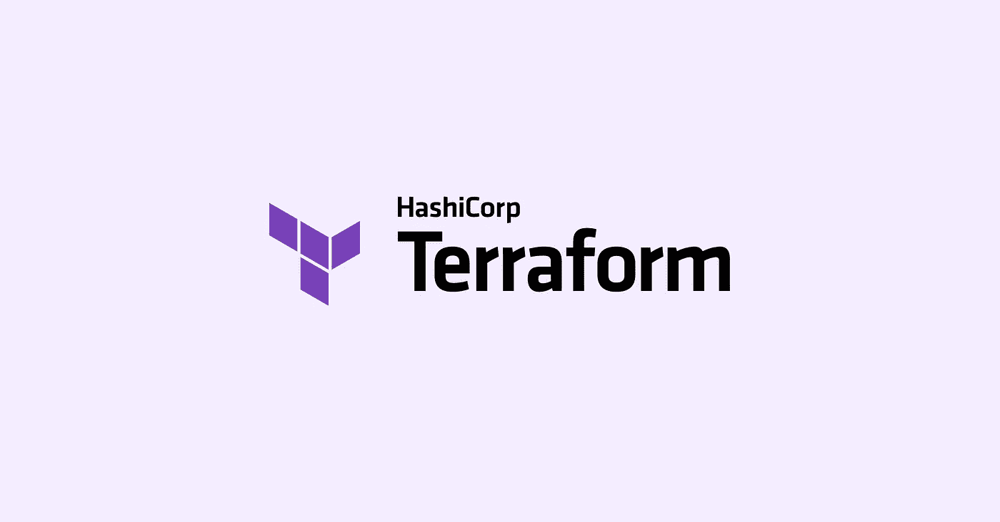
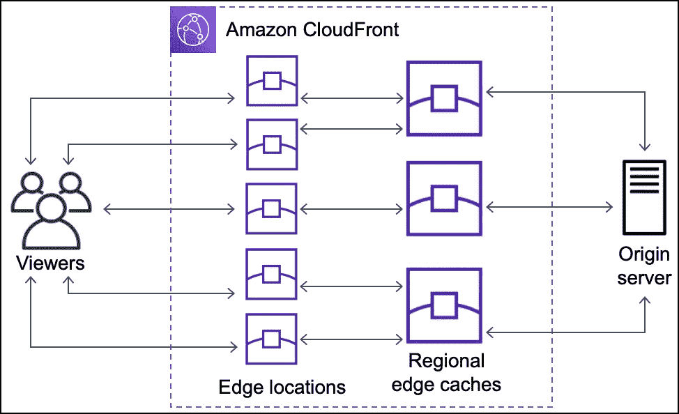
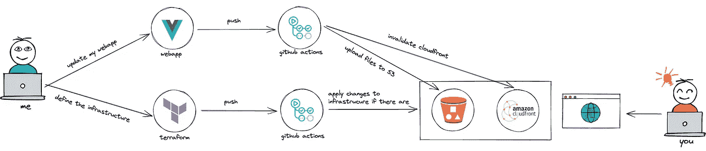
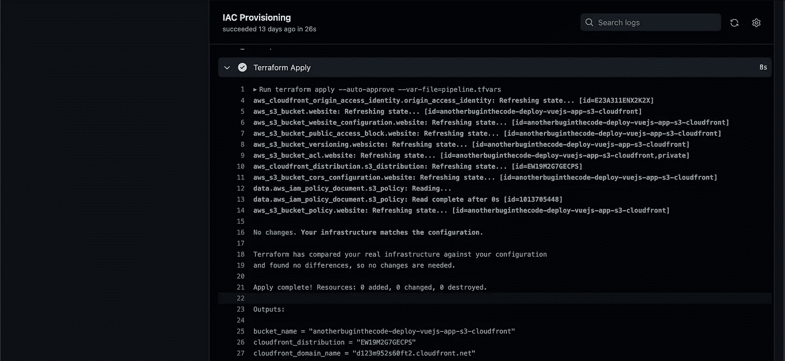
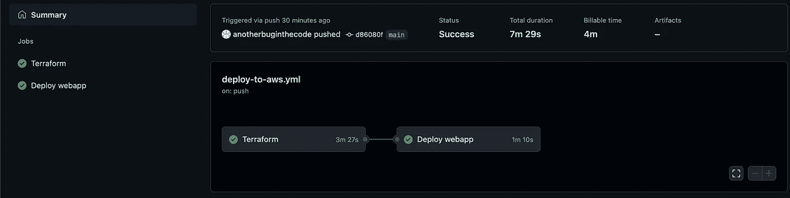
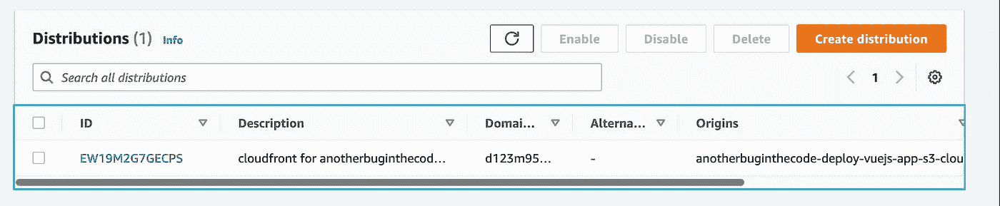
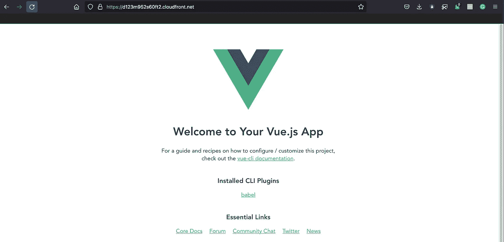

# 使用 Terraform 和 GitHub 操作在 AWS 上部署一个经济高效的 Vue.js Web 应用程序

> 原文：<https://betterprogramming.pub/deploy-a-cost-effective-vue-js-web-app-on-aws-with-terraform-and-github-actions-f84fb8df6d17>

## Terraform、GitHub Actions、亚马逊 S3 和 CloudFront 走进一家酒吧


由 [Timelab Pro](https://unsplash.com/@timelabpro?utm_source=unsplash&utm_medium=referral&utm_content=creditCopyText) 在 [Unsplash](https://unsplash.com/s/photos/warehouse?utm_source=unsplash&utm_medium=referral&utm_content=creditCopyText) 上拍摄的照片

# 介绍

这篇文章是在我和我的队友讨论之后发表的。在我们的讨论中，我们试图找到在 AWS 上部署 web 应用程序的最佳解决方案，该方案使用 Vue 和 React 等框架，既高效又经济。

由于我正在准备 [AWS 解决方案架构师助理认证](https://aws.amazon.com/certification/certified-solutions-architect-associate/)，我认为这是一个非常鼓舞人心和有益的机会来实践我所学的内容并巩固概念。

我们找到的解决方案是结合使用亚马逊 S3 和 CloudFront。

下面是我试图通过一个小项目来表示所提出的解决方案。

项目的每个部分都是作为现实生活中的项目来构建的，因此 Terraform 被用作提供基础设施和资源的 IAC 工具，GitHub Actions 被用于在项目中集成 CI/CD 概念。

接下来将快速解释一些概念，如 Terraform、亚马逊 S3 和 CloudFront。如果您已经熟悉它们，我建议您跳过这些部分，直接进入已实现工作流的演示。

让我们开始吧！

# **先决条件**

*   [AWS](https://aws.amazon.com/console/) 账户
*   [地形云](https://cloud.hashicorp.com/products/terraform)账号
*   [GitHub](https://github.com/) 账户
*   Terraform CLI
*   安装了 Vue CLI

# 什么是 Terraform？

在这个世界上，当涉及到自动化和审查任务时，DevOps 的作用越来越重要，IAC 是 DevOps 带上的几个工具之一。IAC 代表 Infrastructure-As-Code，而 [Terraform](https://www.terraform.io/) (由 [HashiCorp](https://www.hashicorp.com/) 开发的开源供应工具)允许您在人类可读的声明性配置文件中定义您的基础架构和资源，以及管理您的基础架构的生命周期。

像对待代码一样对待您的基础设施:应用版本控制来跟踪您的变更，编写自动测试来避免错误，与您的合作者共享，并重用它们。



[地形](https://www.terraform.io/)由[哈希公司](https://www.hashicorp.com/)

Terraform 是一个多云平台，所以它可以让你描述你的主要云提供商的完整基础设施，比如 AWS、Azure、GCP 等等。社区非常活跃，你可以找到很多模块，可以加快你的文件配置，防止你重新发明轮子。

Terraform 模块将不同的资源封装到一个任务中，减少了您必须为类似的基础架构组件开发的代码量。

在部署基础设施和资源时，Terraform 为您做的是将您的声明性代码翻译成提供者用来与指定资源交互的相应 API。

主要的 Terraform 工作流程可以总结为三个步骤:
1。写:在配置文件中定义你的基础设施。
2。计划:审查 Terraform 将应用于您的基础架构的更改。
3。应用:Terraform 将提供您的基础设施并更新状态。

在本文中，Terraform 用于提供一个亚马逊 S3 桶，我们将在其中部署我们的 Vue 应用程序文件和 CloudFront 发行版，以潜在地将我们的工作分发到世界各地！

# 什么是亚马逊 S3？

> [“亚马逊简单存储服务](https://docs.aws.amazon.com/AmazonS3/latest/userguide/Welcome.html)(亚马逊 S3)是一种对象存储服务，提供行业领先的可扩展性、数据可用性、安全性和性能。

如[官方文档](https://aws.amazon.com/s3/getting-started/)中所述，AWS S3 的一些优势包括:

*   耐用性:S3 提供 99.999999999%的耐用性。
*   低成本:S3 让您根据访问文件的频率和速度，将数据存储在不同的“存储类别”中。
*   可伸缩性:S3 只对你使用的资源收费(按使用付费)。
*   可用性:S3 提供 99.99%的对象可用性。
*   安全性:S3 提供不同的访问管理工具和加密功能，提供顶级的安全性。
*   灵活性:S3 是数据存储、数据备份、软件交付、数据归档、灾难恢复、网站托管、移动应用、物联网设备等广泛应用的理想选择。
*   简单的数据传输:这项服务围绕着简单和易用。

# 什么是 CloudFront？

[AWS CloudFront](https://docs.aws.amazon.com/AmazonCloudFront/latest/DeveloperGuide/HowCloudFrontWorks.html) 是亚马逊全球分发和提供的 CDN(内容交付网络)，帮助用户快速请求数据，并具有低延迟网络。

它主要用于传递静态内容，如。css，。js，。html 和多媒体文件。

如前所述，CloudFront 是一个遍布全球的网络，分布在世界各地的几个数据中心，称为 edge location。

为了保证最佳性能和最低延迟，当用户请求由 CloudFront 提供的内容时，它会找到地理上最近的边缘位置，该位置可以在速度和最低延迟方面提供最佳结果。



【CloudFront 如何交付内容

此外，CloudFront 的一个有趣特性是，它可以在边缘位置缓存内容，从而减少工作量。在像 S3 这样的服务中(你不仅要为使用的空间付费，还要为与桶的交互付费)，它可以转化为与 S3 桶的交互次数的减少，从而为你省钱。

其他功能包括指定地理目标以定义向特定最终用户的交付(黑名单与白名单)，它使用 HTTP 和 HTTPS 协议来交付您的内容，并且它是一种较便宜的服务，因为您将只对数据传输收费。

# 工作流程



本文中实现的工作流的图形解释

如上所述，主要思想是创建一个 Terraform 配置，以定义每次使用 GitHub 动作在 GitHub 上推送时将应用的基础设施。如果`terraform plan`识别出与状态文件相比的任何变化。

正如我们将看到的，Terraform 创建了亚马逊 S3 和 CloudFront，以及必要的配置和依赖关系。

web app 是一个简单的 Vue 应用程序。每当我将一些很酷的东西放入我的存储库时，我的 GitHub actions 中的一个作业负责创建文件的最终版本，以便在生产中使用。然后，将它们上传到我的 S3 桶中——之前是用 Terraform 构建的——最后，这项工作将使 CloudFront 中的缓存无效，以便用户在下次请求时获得我的 web 应用程序的新版本。

# 我们开始吧

是时候把想法变成现实了。

我们从 Terraform 开始，然后我们将进入 GitHub 操作，在那里魔法会成真！

我们可以添加和开发很多东西，也可以遵循其他最佳实践。这个项目应该被认为是一个惊人的起点。

让我们看一下项目结构。

```
root/
├── LICENSE
├── README.md
├── terraform/
└── webapp/
```

Terraform:它包含 AWS 基础设施和资源的定义。

webapp:包含 vue 应用。它是使用 Vue CLI `vue create webapp`创建的。

你可以在我的 GitHub [上找到这个项目。](https://github.com/anotherbuginthecode/terraform-deploy-vuejs-app-to-s3-and-cloudfront)

# 将（行星）地球化（以适合人类居住）

为了部署我们的 webapp，我们决定使用亚马逊 S3 和 CloudFront。

我们可以使用 AWS 控制台手动配置它们，但是假设这种方法是您的团队采用的主要策略，并且几乎每个新的 web 应用程序都需要使用这个堆栈进行部署。此外，假设您的团队领导要求您在生产环境中准备一个试运行环境。

现在，作为新的业务要求，所有网站都应该记录与 web 应用程序的每次交互，并在出现特定错误模式时触发一个事件。啊！我提到过我们需要改变 CloudFront 中的最小缓存持续时间和默认标签吗？


手动完成所有改动后疲惫的海绵宝宝

像 Terraform 这样的 IAC 工具，结合远程后端和版本控制，可以帮助您控制所有产品的所有更改，并在不失去理智的情况下传播更新。此外，使用 Terraform module，您可以部署一个完全可用的基础架构，减少您和开发人员的工作量，从而缩短上市时间。

```
terraform
├── backend.tf
├── cloudfront.tf
├── provider.tf
├── s3.tf
├── terraform.tfvars
└── variables.tf 
```

这些是 terraform 文件夹中的文件。我喜欢将所有资源分开。它帮助我保持井井有条，并且易于维护。即使项目很小，我也强迫自己不要把所有东西都写在一个唯一的`main.tf`里。

## 后端. tf

在这里，我告诉 Terraform 它必须在哪里存储我的基础设施的状态。在这种情况下(99%的情况下)，我使用 S3 后端将我的 terraform 配置的状态存储在由环境或工作空间分隔的 S3 存储桶中。

```
terraform {
backend "s3" {
bucket     = "<YOUR-S3-BACKEND-BUCKET>"
key        = "<S3-KEY-PATH>/terraform.tfstate"
region     = var.region
access_key = var.access_key
secret_key = var.secret_key
}
}
```

`region`、`access_key`、`secret_key`是在`variables.tf`内部定义并在`terraform.tfvars`内部初始化的变量。这最后一个文件是我初始化变量和秘密的地方。将此文件添加到您的。gitignore 以避免在线发布您的凭据。

Terraform 配置中变量的定义。sensitive = true 避免在状态文件中显示变量值。

## **provider.tf**

提供者文件告诉 Terraform 应该与哪个提供者进行交互。

大多数情况下，当您定义一个提供者时，您应该传递必要的配置以允许与之交互。在这种情况下，我必须声明区域、标识我的 AWS 帐户的凭证以及允许在我的帐户内创建资源的用户。对我来说，它是我之前使用 [AWS IAM](https://aws.amazon.com/iam/) 用管理员权限创建的 Terraform 用户。

此外，我认为定义`default_tags`有助于在使用成本浏览器工具时保持所有资源的一致性和易于搜索。

## **s3.tf**

在`s3.tf`文件中，我们定义了我们的 bucket。由于我们将在桶中托管一个静态网站，我们需要将其设置配置为静态网站托管。如第 21–33 行所示，我们必须指定当用户导航到我们的静态网页时将被服务的`index_document`和`error _document`。

另一个需要设置的是 OAI(原始访问身份)，这是一个与我们的发行版相关联的特殊的 CloudFront 用户。它只允许用户通过 CloudFront 访问你的文件，而不是通过一个直接指向 S3 的 URL。这可能发生在创建 OAI 用户时，附加一个只允许在我们的 S3 bucket 上执行`s3:GetObject`的策略，最后，将这个策略添加到我们的 bucket `policies.geo-restrictionsgeodomain-restrictions`。

## cloudfront.tf

让我们定义一下我们的 CloudFront 分布。为此，我们需要将 s3 bucket 指定为源域名。然后，在 s3 配置中将之前设置的`default_root_document`定义为`index_document`。

正如 CloudFront 部分所解释的，有趣的特性之一是它可以在边缘位置缓存内容，从而减少工作量。在我们的例子中，我们保持它相当标准，告诉我们的发行版缓存所有内容写`path_pattern = “*”`。最终，您可以在不同的路径上指定几个缓存行为，复制并粘贴`ordered_cache_behavior`语句。

此外，您可以创建一个允许列表，以使您的用户仅在您的允许列表中的批准国家/地区之一时才能访问您的内容。同样，您可以指定一个阻止列表，以拒绝您的用户访问您的内容，如果他们在您的允许列表上的黑名单国家之一。

CloudFront 的边缘位置遍布世界各地，按地理区域分组。我们可以指定使用哪组位置来发布我们的文件。为此，我们需要选择一个`price_class`。在我们的例子中，它等于`PriceClass_200`。

关于哪些不同的`price_class`标识的完整解释可以在[这里](https://docs.aws.amazon.com/AmazonCloudFront/latest/DeveloperGuide/PriceClass.html)找到。请记住，选择较低的`price_class`，例如`PriceClass_100`，并不意味着该覆盖区域之外的用户无法访问该网站，但他们会经历一些响应延迟，因为他们将由`price_class`内最近的边缘位置提供服务。

最后，我们指定输出语句来查看哪个将是从 AWS 生成并可从外部访问的 CloudFront URL。下一步，您可以将此 URL 作为记录添加到 Route53 中，以将您的网站附加到您的域名。

# GitHub 操作

不错！我们已经准备好了我们的 Vue 应用，并且我们已经使用 Terraform 定义了我们的基础设施。现在，是时候使用 GitHub Actions 将这些点连接起来并创建一个 CI/CD 管道了。

> ["GitHub Actions](https://docs.github.com/en/actions/learn-github-actions/understanding-github-actions) 是一个持续集成和持续交付(CI/CD)平台，允许您自动化您的构建、测试和部署管道。您可以创建工作流，为您的存储库构建和测试每个“拉”请求，或将合并的“拉”请求部署到生产环境中。”

在我们的根文件夹下创建文件夹`.github/workflows`这里是动作所在的地方，定义为 YAML 文件。

让我们如下创建我们的`deploy-to-aws.yml`:

我们可以看到，我们有两个主要的工作:Terraform 和 Webapp。

Terraform 负责提供基础设施，并在与状态文件有差异时对其进行更新。

地形作业的主要阶段是:

*   设置:安装 Terraform CLI 并连接到 Terraform Cloud。如果你只是一个用户，Terraform Cloud 是免费的，可以让你轻松地将工具集成到你的行动中。您需要提供 GitHub 操作`TF_API_TOKEN`，您可以在 [Terraform Cloud](https://cloud.hashicorp.com/products/terraform) 上创建帐户后创建该操作。
*   Init:在创建后端变量之后，我们运行`terraform init`将应用程序的结果存储在我们的远程状态中，并下载必要的模块和依赖项来执行 tf 文件。
*   格式和语法检查:`terraform fmt`命令用于将 Terraform 配置文件重写为规范的格式和样式。
*   应用:一切正常后，我们可以将我们的更改应用到基础设施中。
*   输出有用的变量:我们需要存储`CLOUDFRONT_DISTRIBUTION`和`BUCKET_NAME`的地形输出，供下面的作业动态使用。



应用程序的结果和生成的输出。

Webapp 负责完成以下工作:

*   构建我们的 Vue 应用程序，生成一个包含构建结果的`dist/`文件夹。
*   将`dist/`文件夹中的所有文件上传到我们的 S3 桶中。
*   使 CloudFront 缓存无效，以确保用户一旦向我们的 CloudFront 执行新的请求，就会收到新版本的应用程序。

总之，作为最佳实践，最好将敏感信息如`AWS_ACCESS_KEY_ID`和`AWS_SECRET_ACCESS_KEY`放在 GitHub secrets 下面，嗯，保密。[这里的](https://docs.github.com/en/actions/security-guides/encrypted-secrets)是怎么做到的。一旦创建完毕，您就可以在您的操作中以`${{ secrets.MY_SECRET }}`的身份访问它们。

现在一切都设置好了，您的 GitHub 操作应该如下所示:



您的操作的 GUI 结果在 GitHub 的 action 选项卡下。



由 Terraform 创建的 CloudFront 服务

当操作完成时，您要做的就是导航到您的由 AWS 生成的 CloudFront URL(在我们的例子中，是 Terraform 输出`cloudfront_domain_name`的结果),并为您今天所取得的成就感到自豪！



我们的 webapp 在 CloudFront URL 下运行。

# 最后的话

我们已经把所有的点连接起来了！每当我们在主节点上推送任何更改时，都会触发该操作，我们的更新将被部署到 AWS 中。如果我们的 AWS 帐户中还没有基础设施，Terraform 将为我们创建一个，您的 web 应用程序的新版本将自动部署到我们的 S3 存储桶中。由于 CloudFront，它将被传送到世界各地。很棒，对吧？

> “你们才是真正的英雄！”— Homelander，男孩们

希望你觉得这个小项目有用。有很大的改进空间，但这是主要思想。

请在评论中告诉我你的想法！下次实验再见！

# 有用的链接

[](https://github.com/anotherbuginthecode/terraform-deploy-vuejs-app-to-s3-and-cloudfront) [## GitHub-another bug in the code/terra form-deploy-vuejs-app-to-S3-and-cloudfront:terra form 项目 to…

### Terraform 项目在 aws 上提供 s3 bucket 和 cloudfront，其中将托管一个用 vuejs3 制作的静态网站…

github.com](https://github.com/anotherbuginthecode/terraform-deploy-vuejs-app-to-s3-and-cloudfront) [](https://www.terraform.io/intro) [## 哈希公司的 Terraform | Terraform 是什么

### 搜索 Terraform 文档 HashiCorp Terraform 是一个基础架构代码工具，可让您定义云…

www.terraform.io](https://www.terraform.io/intro) [](https://aws.amazon.com/cloudfront/) [## 低延迟内容交付网络(CDN) -亚马逊 CloudFront -亚马逊网络服务

### Amazon CloudFront 1 TB 的数据传输量通过分布在全球各地的 410 多个点交付数据，减少了延迟…

aw.amazon.com](https://aws.amazon.com/cloudfront/) [](https://aws.amazon.com/s3/) [## 云对象存储-亚马逊 S3 -亚马逊网络服务

### 亚马逊 S3 5gb S3 标准存储亚马逊简单存储服务(亚马逊 S3)是一种对象存储服务，提供…

aws.amazon.com](https://aws.amazon.com/s3/) [](https://docs.github.com/en/actions/learn-github-actions/understanding-github-actions) [## 了解 GitHub 操作- GitHub 文档

### GitHub Actions 是一个持续集成和持续交付(CI/CD)平台，允许您自动化您的…

docs.github.com](https://docs.github.com/en/actions/learn-github-actions/understanding-github-actions)