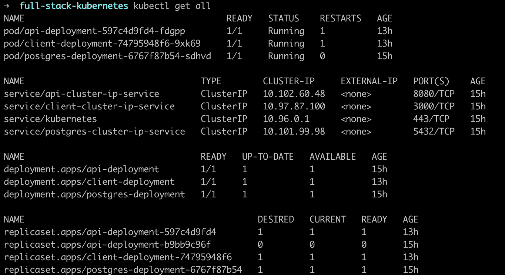
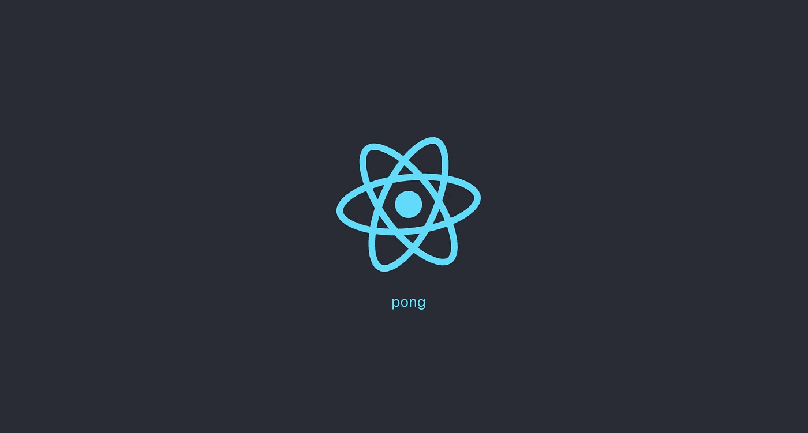

# 在 Kubernetes 上部署全栈 Go and React 应用

> 原文：<https://betterprogramming.pub/deploy-a-full-stack-go-and-react-app-on-kubernetes-4f31cdd9a48b>

## 了解如何使用 minikube 和 kubectl 在 Kubernetes 上部署 Gin-Gonic 的 Go 后端和 React web 应用程序


[https://unsplash.com/photos/4I41IQtmSs0](https://unsplash.com/photos/4I41IQtmSs0)

首先，我们创建部署所需的 Docker 映像，并将它们推送到 Docker Hub。

我们将从后端容器开始。在您的根目录中，创建一个名为 api 的目录，它将包含所有与后端相关的文件。由于我们将使用 [Gin-Gonic](https://gin-gonic.com/) 作为我们的 Go 框架，我们将创建一个`go.mod`文件(注意，您应该更改模块的名称):

```
**module** github.com/uxioandrade/go-react-kubernetes-tutorial**go** 1.13**require** github.com/gin-gonic/gin v1.5.0
```

现在我们已经设置好了`go.mod`文件，让我们创建一个`main.go` 文件，它本质上是一个基本的 Gin-Gonic 服务器示例:

Gin-Gonic 基本服务器

与后端相关的最后一步是创建 Dockerfile *。*同样，这将是一个极简方案，只需要运行我们的服务器:

API Dockerfile 文件

最后，我们将运行两个命令将我们的 Docker 映像推送到 Docker Hub。请注意，要使这些命令生效，您必须登录到 Docker Hub。

```
**docker** build -t uxioandrade/tutorial-api**docker** push uxioandrade/tutorial-api
```

现在我们已经准备好了我们的后端，让我们继续到 React 应用程序。导航到项目的根目录，并运行以下命令:

```
**npx** create-react-app client
```

同样，我们会尽量保持代码简单。然而，我们将安装`axios`库来发出请求。

```
**npm** i axios  --save
```

接下来，导航到客户端文件夹，打开`src/App.js` 文件——我们需要修改的唯一文件。在 App 组件中，我们向后端发出一个请求，以测试一切都正常工作。以下代码将满足我们的需求:

App.js

最后，让我们为客户机创建一个 docker 文件。如我们所见，它看起来与后端相似:

客户文档文件

正如我们对后端映像所做的那样，让我们将它推送到 Docker Hub:

```
**docker** build -t uxioandrade/tutorial-client**docker** push uxioandrade/tutorial-client
```

现在，我们已经具备了在 Kubernetes 上部署应用所需的一切。事实上，我们可以运行两个容器，看看它们是否工作。

然而，为了让两个容器能够相互通信，我们需要做一些修改。例如，一个简单的解决方案(尽管不是最优雅的)是在`App.js`文件中改变 GET 请求的端点。另一种选择是将 docker-compose 与 NGINX 容器一起使用，但这对于我们的用例来说是一个完全不切实际的解决方案。

在这篇文章中，我将使用 minikube 和 kubectl，所以您需要在您的计算机上安装这两个工具。安装后，运行以下命令来运行 minikube:

```
minikube start
```

一旦有了这些，创建一个名为`k8s` *，*的文件夹，我们将在其中分配与 Kubernetes 部署相关的所有文件。此外，我将添加一个`postgres`服务，这将有助于展示如何创建一个[持久卷声明](https://kubernetes.io/docs/concepts/storage/persistent-volumes/)。

我们首先创建与 API 和客户机部署相关的配置文件。但是首先，让我们明确一下在这个上下文中我们所说的部署是什么意思。部署是一种维护一组相同 pod 的对象，确保它们具有正确的配置。记住这一点，让我们看看我们的部署文件会是什么样子。

在 API 部署(`api-deployment.yaml`)中，我们添加了一些与 Postgres 服务相关的环境变量。注意，在真实的场景中，我们想要创建一个[秘密](https://kubernetes.io/docs/concepts/configuration/secret/)来存储 postgres 密码。

API 部署

客户端部署(`client-deployment.yaml`)将看起来像上一个的简化版本，因为我们没有使用任何`env`变量:

客户端部署

另一方面，我们还需要 postgres 服务的部署。然而，我们必须在此之前创建某种持久存储服务，否则，一旦 pod 关闭，我们将丢失所有数据。出于这个目的，我们将使用一个按体积索赔，正如我之前提到的。`database-persistent-volume-claim.yaml`文件将如下所示:

数据库永久卷声明

请注意，1Gi 的大小是任意的，因此我们可以将其更改为更适合我们需要的任何数字。

在了解了数据库的持久性之后，我们必须编写的部署再次与前一个类似，除了我们必须添加持久性卷声明部分:

Postgres 部署

完成这些之后，我们就完成了所有需要的部署。然而，这些部署是孤立的，它们不能与任何外部服务通信。为了实现任何通信，我们将使用一个名为`ClusterIP`的新服务。三个部署的`ClusterIP`将具有完全相同的结构，我们只需要修改一些参数:

api-cluster-ip-service.yaml

客户端群集 ip 部署. yaml

postgres-cluster-IP-service . YAML

我们快完成了！

唯一要做的就是创建最后一个服务:入口服务。这管理对集群中服务的外部访问。更具体地说，我们将使用 NGINX 入口控制器。查看[本指南](https://kubernetes.github.io/ingress-nginx/deploy/#minikube)了解如何启用它。然而，在我们的例子中，我们可以用两个命令来完成:

```
**kubectl** apply -f https://raw.githubusercontent.com/kubernetes/ingress-nginx/master/deploy/static/mandatory.yaml**minikube** addons enable ingress
```

我们已经准备好编写最后一个配置文件:

ingress-service.yaml

如果您已经做到了这一步，那么恭喜您，您已经准备好运行所有配置了。为此，只需从项目的根目录运行以下命令:

```
**kubectl** apply -f k8s
```

要检查一切是否按预期运行，您可以运行以下一些命令:

```
**kubectl** get all**minikube** dashboard
```

如果您运行第一个，您应该检查三个 pod 是否正在运行，并且您创建的 ClusterIPs 也在其中:



kubectl 获取所有输出

另一方面，如果您选择第二个命令，您可以以直观的方式导航 minikube 仪表板，并检查 Kubernetes 集群是否相应地运行。

最后，让我们看看我们的应用程序是否确实在运行。使用以下命令在您的本地计算机中获取 minikube 的 ip:

```
**minikube** ip
```

然后在您的首选浏览器中导航到该 IP。如果您看到类似下面的内容，那么您已经在 Kubernetes 上成功部署了一个全栈 Golang 和 React 应用程序！



完成部署

如果你有任何疑问，或者认为你可能犯了一些错误，你可以在这个 [Github 库](https://github.com/UxioAndrade/tutorials/tree/main/go-react-kubernetes)中找到代码。