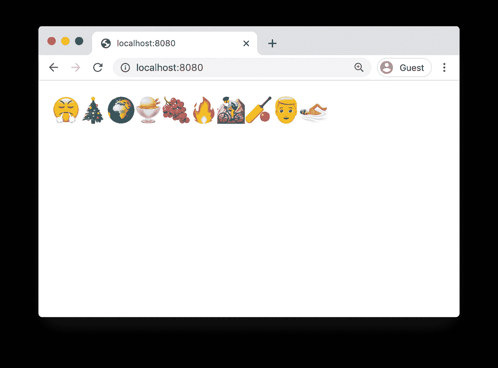

# 将节点 API 部署到云运行

> 原文：<https://betterprogramming.pub/deploy-a-node-api-to-cloud-run-f93fea4ff2e6>

## 在谷歌的云运行基础设施上运行定制的 Docker 映像


照片由[亨利迪克](https://unsplash.com/@henry_photo?utm_source=unsplash&utm_medium=referral&utm_content=creditCopyText)在 [Unsplash](https://unsplash.com/s/photos/cloud?utm_source=unsplash&utm_medium=referral&utm_content=creditCopyText) 上拍摄。

[云运行](https://cloud.google.com/run)与 Google 的 App 引擎和云功能非常相似。主要区别在于，使用 Cloud Run，您可以创建自定义 Docker 映像。

这意味着你可以更好地控制如何构建你的应用程序，你可以疯狂地定制复杂的 Docker 构建。缺点是与谷歌的应用引擎相比，设置起来有点困难。

在本文中，我将向您展示如何在 Cloud Run 上设置自定义 Docker 映像。

# 创建云项目

我们需要做的第一件事是创建一个新的谷歌云项目。我将使用命令行来设置一切。

首先，我通过运行以下命令来验证自己:

```
gcloud auth login
```

这将打开一个谷歌登录浏览器窗口，我可以选择我的帐户。

然后我创建了新的谷歌云项目:

```
gcloud projects create emojiapi-project
```

在这种情况下，`emojiapi-project`是项目 ID，因此您可以将其更改为其他值。

然后，我将当前活动项目设置为`emojiapi-project`:

```
gcloud config set project emojiapi-project
```

最后，我为这个项目启用了云运行 API:

```
gcloud services enable run.googleapis.com
```

# 创建节点项目

我们的项目存在于云中的某个地方，但是我们还没有任何东西可以上传到那里。

让我们通过创建一个简单的节点 API 来解决这个问题。

首先，我创建一个新目录并初始化一个空白节点项目:

```
mkdir emoji-api
cd emoji-api
npm init
```

Cloud Run 会向程序抛出 HTTP 请求，所以我打算安装`express`来处理这些传入的请求。

我还会在里面添加很棒的`random-unicode-emoji`包。这样，API 可以返回一些表情符号作为响应:

```
npm i express
npm i random-unicode-emoji
```

为了创建服务器，我添加了下面的`index.js`文件:

这个程序所做的就是创建一个 Express 服务器，监听传入的请求，并用十个随机表情符号进行响应。

为了进行测试，我运行以下命令:

```
node index.js
```

当我导航到`localhost:8080`时，我看到了十个随机的表情符号！



有史以来最好的 API。

# 将申请归档

为了在云上运行 API，我们需要将我们的 API 进行 dockerize。

我做的第一件事是创建一个新的`Dockerfile`:

这将复制我们的 JavaScript 代码，安装依赖项，并启动服务器。

为了构建映像，我运行以下命令:

```
docker build -t emoji-api-image .
```

然后，您可以像这样运行 Docker 容器:

```
docker run -p 8080:8080 emoji-api-image
```

注意，我使用`-p 8080:8080`将我们的`8080`端口映射到容器的`8080`端口。这样，`8080`上的任何传入请求都会被路由到 Express 服务器正在监听的 Docker 容器。

当我打开`localhost:8080`时，我仍然能看到表情符号。这意味着应用程序已经被 dockerized！

# 将 Docker 容器上传到云运行

最后一步，我们需要将 Docker 映像上传到 Cloud Run。

您可以使用以下命令将 Docker 容器推至云运行:

```
gcloud builds submit --tag gcr.io/emojiapi-project/emojiapi
```

注意`emojiapi-project`是项目 ID。

接下来，我们应该将推送的容器部署到云运行:

```
gcloud run deploy emojiapi \
  --image gcr.io/emojiapi-project/emojiapi \
  --platform managed \
  --region us-central1 \
  --allow-unauthenticated
```

就是这样！控制台输出告诉您在哪里可以找到正在运行的应用程序。

在我的情况下，你可以[在这里找到表情 API](https://emojiapi-savvf6y7sq-uc.a.run.app/)！

# 结论

我们已经容器化了一个节点 API，并在 Cloud Run 上部署了 Docker 容器。

感谢阅读！