# 使用应用引擎将 React 应用部署到 Google 云平台

> 原文：<https://betterprogramming.pub/deploy-a-react-app-to-google-cloud-platform-using-google-app-engine-3f74fbd537ec>

## 在不到五分钟的时间内，从零开始创建 React 应用并将其部署到 Google 云平台

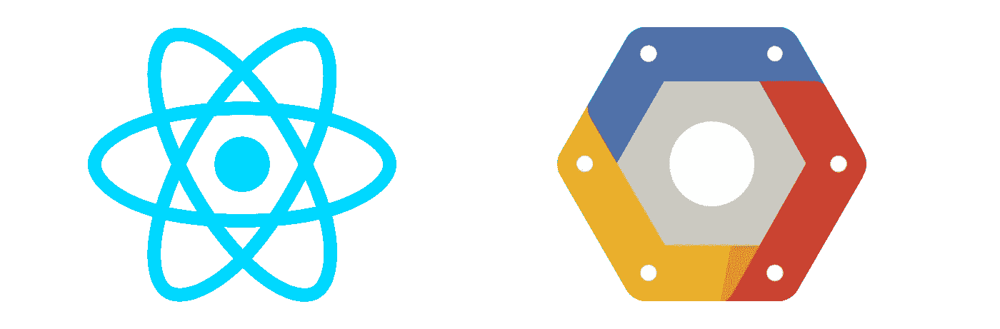

先决条件:
- [节点](https://nodejs.org/en/)
-一个激活的[谷歌云平台](https://console.cloud.google.com/)账号
- [gcloud CLI](https://cloud.google.com/sdk/docs/quickstarts)

首先，使用 npx 生成一个新的 React 应用程序，使用 [create-react-app](https://reactjs.org/docs/create-a-new-react-app.html) :

```
npx create-react-app <app-name>
```

一旦 npx 为您的 React 应用程序生成了所有必需的文件，让我们通过执行以下操作来确保它运行良好:

```
cd <app-name>
npm start
```

在您最喜欢的浏览器中，导航到[http://localhost:3000](http://localhost:3000)
您应该会看到与此类似的屏幕:

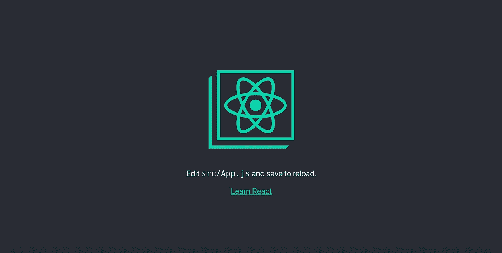

现在您的应用程序已经启动并运行，让我们用它来创建一个生产版本。为此，只需运行:

```
npm run build
```


在这一点上，从 React 的角度来看没有什么可做的了。下一步是在 App Engine 中配置一个新项目。然后，剩下要做的就是使用 Google Cloud SDK 将我们新构建的 React 应用程序部署到 GCP。


下面是一系列截图，将带你完成第一部分:在 GCP 应用引擎中配置一个新项目。

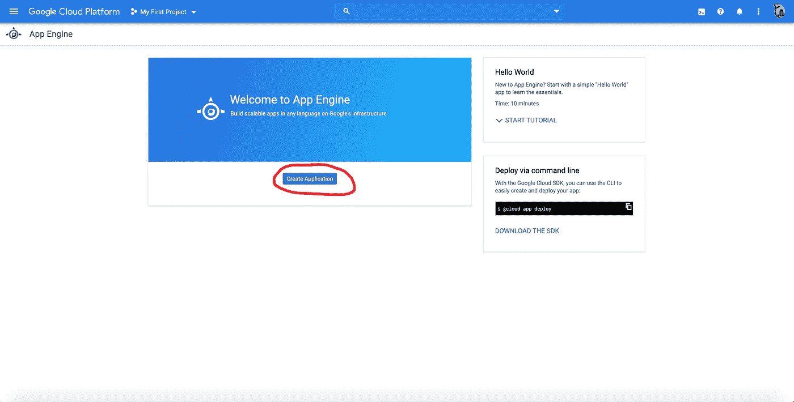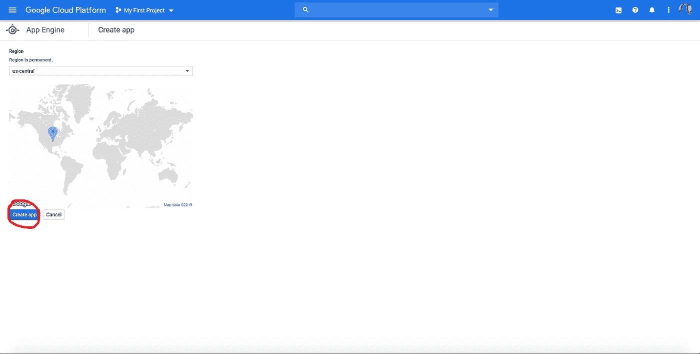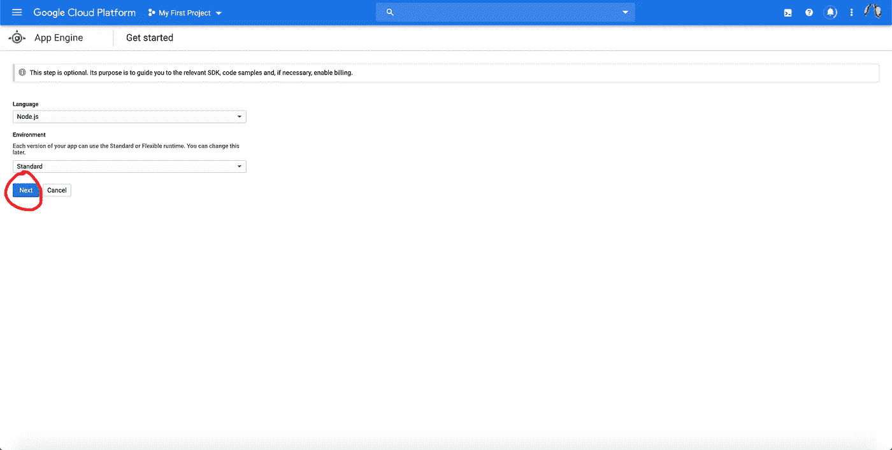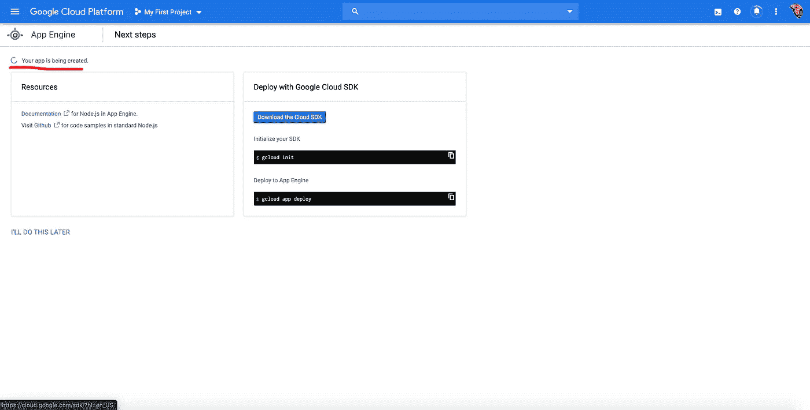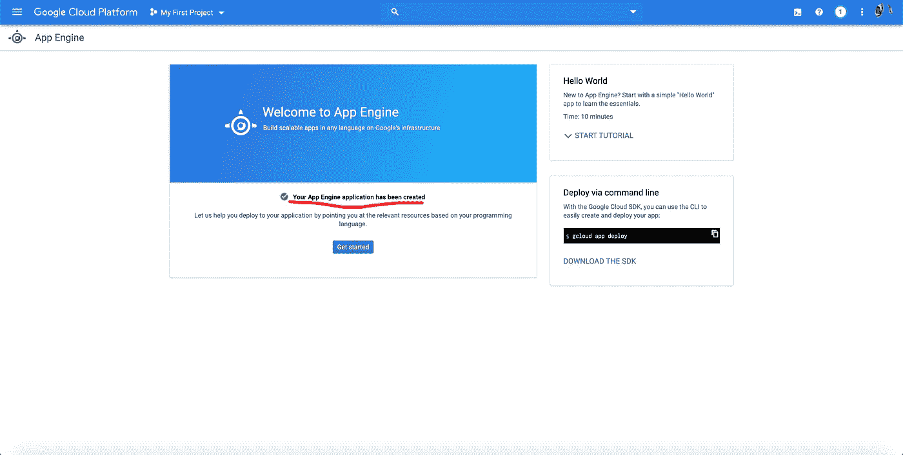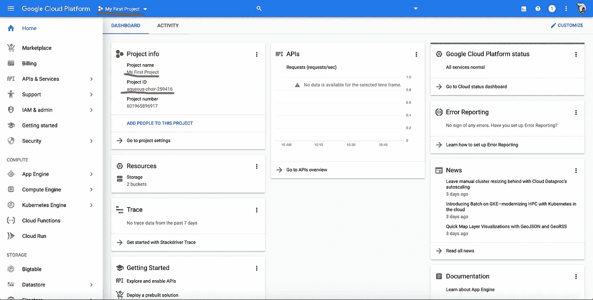

如果您成功地遵循了这些步骤，您应该能够看到您的 Google App Engine 仪表盘，如上图所示。这是我们对 App Engine web 控制台做的最后一件事。现在，我们将重点介绍如何使用 gcloud CLI。通过执行以下命令来验证您是否拥有它:

```
gcloud -v
```

如果你在安装时遇到问题，[这里是你的官方指南](https://cloud.google.com/sdk/docs/quickstarts)。

现在导航到您的 React 应用程序文件夹。我们需要在项目文件夹的根目录下创建一个新的 app.yaml 文件，gcloud CLI 将使用该文件将我们的应用部署到应用引擎。创建文件后，将此内容添加到文件中[(官方来源)](https://cloud.google.com/appengine/docs/flexible/nodejs/configuring-your-app-with-app-yaml):

```
runtime: nodejs
env: flex

# This sample incurs costs to run on the App Engine flexible environment.
  # The settings below are to reduce costs during testing and are not appropriate
# for production use. For more information, see:
# https://cloud.google.com/appengine/docs/flexible/nodejs/configuring-your-app-with-app-yaml
manual_scaling:
  instances: 1
resources:
  cpu: 1
  memory_gb: 0.5
  disk_size_gb: 10
```

确保保存文件，现在我们终于可以使用 CLI 了:

```
gcloud init
```

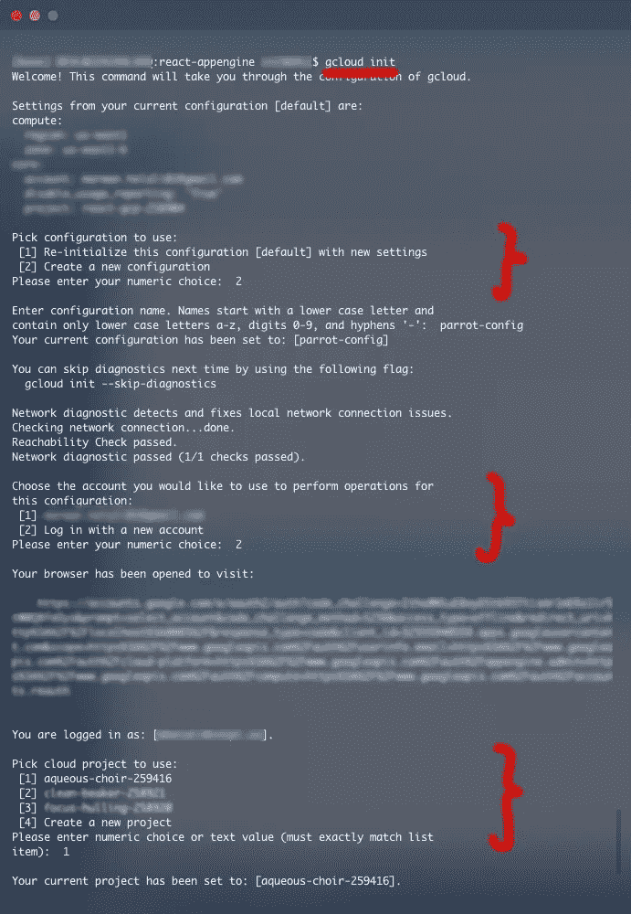

按照步骤添加您的帐户、地区，并确保选择您刚刚创建的项目。

一旦成功初始化，我们就可以运行最终的部署命令:

```
gcloud app deploy
```

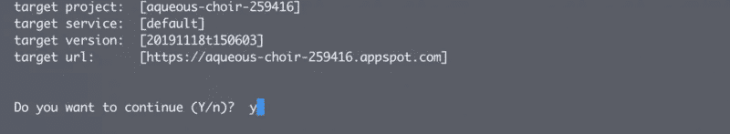

gcloud 应用部署的结果


几分钟后，您应该会在“Deployed service [default] to”中看到链接:

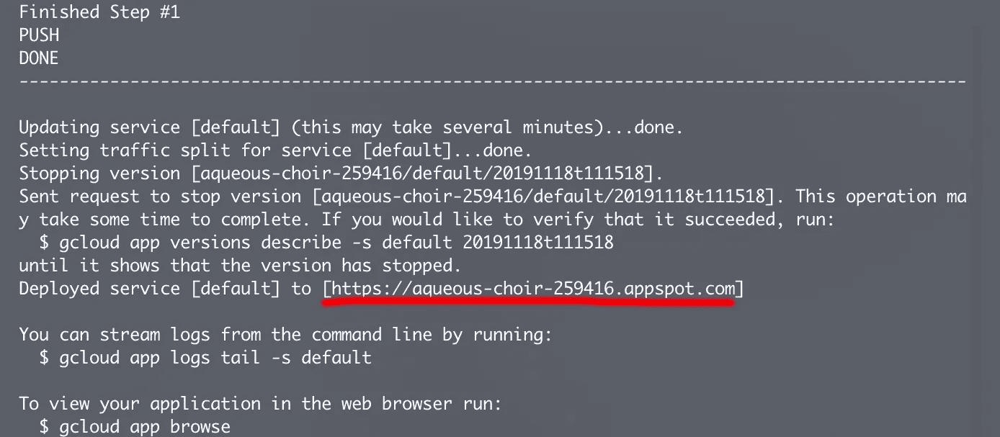

在您的浏览器中访问它，找到您部署的 React 应用程序。这里是[矿](https://aqueous-choir-259416.appspot.com/)。

恭喜冠军！你做到了！🎉🎉🎉

这里有一个 git repo 的链接，它包含 React 应用程序和本文使用的 YAML 文件。感谢您的阅读！💟📖