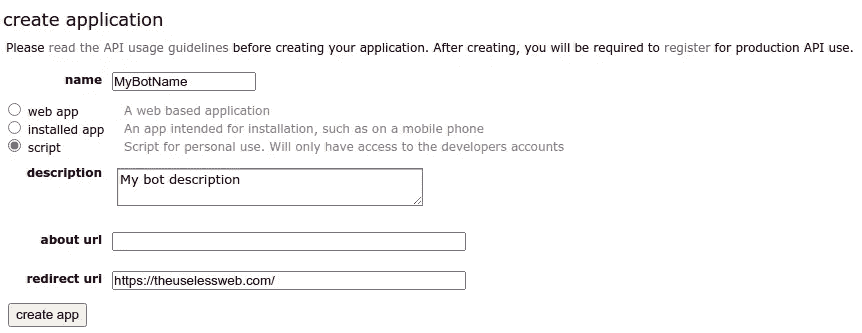
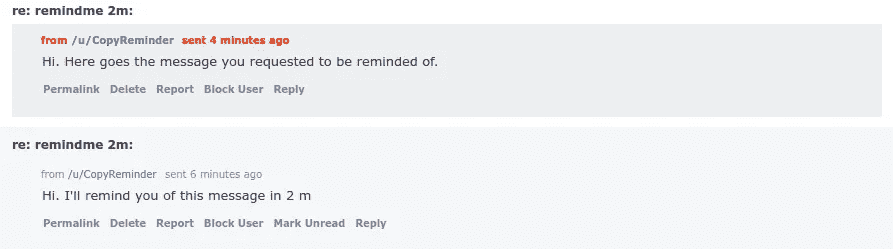

# 使用 AWS Lambda 和 EventBridge 部署一个“RemindMe”Reddit Bot

> 原文：<https://betterprogramming.pub/deploy-a-reddit-bot-using-aws-lambda-and-eventbridge-7df793b979b2>

## 通过无服务器轻松安排 AWS Lambda 功能


布雷特·乔丹摄于 Pexels。

# 目录

```
Introduction
Register a Reddit bot
Create a RemindMe bot with praw
Deploy the service to Lambda and run it on a schedule
Complete scripts
Conclusion
References
```

# 介绍

什么是 Reddit 机器人？我可以造一个吗？我该怎么做？运行它们很贵吗？这些只是我在开始实现自己的 Reddit 机器人之前的几个问题。

让我们从头开始。Reddit 机器人是一个可以自动跟踪帖子、评论或回复的应用程序。你可以创建一个机器人来识别和自动标记 NSFW 的帖子，禁止用户使用攻击性的语言，检查事实，或者简单地用一个模因来回复。

Reddit 不仅允许你建立一个机器人，而且鼓励你这样做。你怎么可能会问？通过它的官方应用程序编程接口(接下来会详细介绍)。

你怎么做到的？个人认为最简单的方法是使用 Python 库 *praw* 。这个库简化了你如何连接到 Reddit API，如何阅读消息，检测提及以及如何回复。

运行它们很贵吗？嗯，看情况。你需要多久跑一次步？每毫秒、每秒、每分钟或每小时？您需要跟踪多少子条目、用户或消息？如果您每次只处理几条消息，并且只需要每隔几分钟处理一次，那么您可能可以免费完成这项工作(使用 AWS 免费层)。

在这篇文章中，我将总结使用 AWS Lambda⁴和 EventBridge⁵.免费构建提醒机器人的关键概念

# 注册一个 Reddit 机器人

好，你需要两样东西:

1.  Reddit 用户帐户(如果您还没有的话)。只需按照此[链接](https://www.reddit.com/register/)中的说明进行操作。我建议为机器人创建一个新的用户帐户。
2.  要注册您的新 Reddit 机器人，请点击[此处](https://ssl.reddit.com/prefs/apps/)。在`Name`部分输入你的机器人名称；选择`script` 选项(脚本自用)；在`redirect uri` 部分键入一个随机 url(这是必填字段)；点击`create app`。



如何创建一个 Reddit 机器人？点击[这里](https://ssl.reddit.com/prefs/apps/)进行注册。作者截图。

如果一切顺利，你现在应该看到与你的机器人相关的两个重要键:一个`client_id`(就在“个人使用脚本”下)和一个`secret`。请记住这些，因为我们将在下一节用到它们。

# 用 praw 创建一个提醒机器人

首先在一个新环境中安装`praw`库，并将已安装的包保存在一个`requirements.txt`文件中(我们稍后会用到)。Praw 是我们将用来与 Reddit API 交互的库。您可以简单地将下面的片段复制到一个新的终端窗口。

现在，要连接到 Reddit API，您需要上面生成的 bot 凭证以及您的用户凭证。按照下面的片段连接并阅读收件箱中的前 5 封邮件。

在本教程中，我们将创建一个机器人，提醒用户一个线程，评论或个人信息，以便稍后检查。如果你经常使用 Reddit，你可能已经在使用一个类似我们描述的机器人:RemindMeBot⁶.

为了创建我们的新机器人，我们需要能够:从收件箱中读取新消息(就像上面的例子)；提取到预期提醒的时间；回复消息。

让我们创建第一个函数，从收件箱中读取消息并处理提醒请求。为了跟踪我们解析的消息，我们将使用 S3。该函数的一个示例如下所示。

我们的第二个也是最后一个函数将加载任何用`save_unread_requests()`处理过的 S3 文件，如果当前时间超过了提醒时间，就给用户发送一条提醒消息。该函数的一个示例如下所示。

我们现在可以顺序运行这两个函数来检查任何未读的消息，然后检查是否有任何已处理的请求可以被满足。

万岁！我们刚刚创建了一个 Reddit 机器人，可以回复提及或 pm。让我们试一试，从不同的帐户向`YOUR_USER_ACCOUNT_NAME`发送一个 PM，主题为' **remindme 2m** ' ，正文中包含任何文本。如果一切顺利，您应该会收到来自机器人的两条消息，如下所示。



bot“copy reminder”正在回复用户提醒请求。作者截图。

# 将服务部署到 Lambda 并按计划运行它

困难的部分已经完成了。使用 Docker +无服务器框架将 Python 服务上传到 Lambda 非常容易。

如果你没有看过我以前的文章“用 Amazon Lambda 和 API Gateway ⁷构建一个无服务器 API”，我强烈推荐你学习其他与 Amazon Lambda 函数交互的方法，以便更深入地理解无服务器框架。

因此，对于这个例子，让我们首先创建一个包含我们的应用程序(机器人)的`Dockerfile`文件。在此阶段需要记住几个关键概念:

1.  从`public.ecr.aws/lambda`中选择支持的图像
2.  安装所有需要的包(还记得我们之前创建的`requirements.txt`文件吗？)
3.  将您的应用程序复制到 Docker 容器中。你可以在这里找到`app.py`文件[。](https://github.com/andreRibeiro1989/medium/blob/main/reddit_bot_lambda_schedule/app/app.py)
4.  确保最后的命令指向您想要运行的函数。在这种情况下，我们想要运行`app.py`文件中的`lambda_handler`函数。

现在让我们创建`serverless.yml`文件，该文件用于通过无服务器框架创建我们需要的所有 AWS 服务。对于这项服务，我们需要:

1.  将 praw 和 S3 路径的凭证定义为环境变量。我们也可以直接在`app.py`文件中设置它们，但是如果我们改变凭证或 S3 路径，就会使容器不可用。
2.  允许 Lambda 从我们定义的存储已处理提醒请求的 S3 位置读取、写入和删除。
3.  定义通过 EventBridge (CloudWatch 事件)调用 Lambda 函数的计划速率，以检查未读消息并完成任何未完成的请求。

请注意，在下面的代码片段中，您必须用自己的凭据替换凭据占位符。

现在在根目录(Dockerfile 和 serverless.yml 文件所在的位置)运行`serverless deploy`来部署 Lambda 函数。

为了测试它是否有效，向`YOUR_USER_ACCOUNT_NAME`发送一条新消息，主题为“remind me 2m”**，正文中包含任何文本。**

# **完成脚本**

**如需完整的脚本，请点击以下链接进入我的 GitHub 页面:**

**[](https://github.com/andreRibeiro1989/medium/tree/main/reddit_bot_lambda_schedule) [## medium/Reddit _ bot _ lambda _ schedule at main and Ribeiro 1989/medium

### 具有 AWS Lambda 和 EventBridge 的 Reddit bot 服务

github.com](https://github.com/andreRibeiro1989/medium/tree/main/reddit_bot_lambda_schedule)** 

# **结论**

**构建和维护一个 Reddit 机器人并不困难，也不昂贵。通过开发无服务器计算，人们可以开发和部署一个不需要花费太多的弹性机器人。**

**这个简单的例子应该给你所有必要的工具来构建更复杂的 Reddit 机器人，如情感/对话、事实检查或仇恨言论检测机器人。**

**如果你想了解更多关于无服务器计算的知识，请查看我以前的文章:**

*   **[用亚马逊 Lambda 和 API 网关](https://towardsdatascience.com/build-a-serverless-api-with-amazon-lambda-and-api-gateway-dfd688510436) ⁷构建一个无服务器 API**
*   **使用亚马逊 S3 和⁸53 号公路建立一个无服务器网站**

# **参考**

**[1] Reddit 团队。" *Reddit api 文档*【https://www.reddit.com/dev/api/】
T3**

**[2]布莱斯·博伊斯。https://praw.readthedocs.io/en/stable/:*PRAW:Python Reddit API 包装器*** 

**[3]亚马逊团队。" *AWS 自由层*"
[https://aws.amazon.com/free](https://aws.amazon.com/free)**

**[4]亚马逊团队。*AWS Lambda*
[https://aws.amazon.com/lambda/](https://aws.amazon.com/lambda/)**

**[5]亚马逊团队。*亚马逊事件桥*
[https://aws.amazon.com/eventbridge/](https://aws.amazon.com/eventbridge/)**

**[6] u/Watchful1。"*remind mebot Info v 2.1*"[https://www . Reddit . com/r/remind mebot/comments/E1 bko 7/remind mebot _ Info _ v21/](https://www.reddit.com/r/RemindMeBot/comments/e1bko7/remindmebot_info_v21/)**

**7 a .里贝罗。"*用亚马逊 Lambda 和 API 网关*构建无服务器 API "
[https://towardsdatascience . com/Build-a-server less-website-using-Amazon-S3-and-route-53-c 741 FAE 6 ef 8d](https://towardsdatascience.com/build-a-serverless-api-with-amazon-lambda-and-api-gateway-dfd688510436)**

**8 a .里贝罗。"*使用亚马逊 S3 和 Route 53*"
[https://towards data science . com/Build-a-server less-website-using-Amazon-S3-and-Route-53-c 741 FAE 6 ef 8d](https://towardsdatascience.com/build-a-serverless-website-using-amazon-s3-and-route-53-c741fae6ef8d)**