# 使用 GitHub 操作在 AWS ECS 上部署 Spring Boot 应用程序

> 原文：<https://betterprogramming.pub/deploy-a-spring-boot-app-on-aws-ecs-with-github-actions-669928f62043>

## 使用 GitHub 操作，部署到 AWS ECS 变得更加方便


雅各布·欧文斯在 [Unsplash](https://unsplash.com?utm_source=medium&utm_medium=referral) 上的照片

[GitHub actions](https://github.com/features/actions) 允许你自动化工作流程，从构建你的应用程序到部署你的应用程序，再到当 PR 出现时在你的社区 Slack 频道上发布消息。您可以使用不断扩展的市场目录中的操作来自动化各种工作流。

GitHub 动作最有趣的特性之一是 CI/CD。它支持所有语言和所有主要平台。这意味着您可以在所有受支持的操作系统(Linux、Windows 和 macOS)上运行您的测试和执行构建，而且是并行的。所有这些都是零成本的，至少对于开源项目是这样。说够了，让我们言归正传。

要完成本教程，你只需要一个 AWS 帐户和一个托管在 Github 上的 Spring Boot 项目。

以下几点将作为本教程的一部分。如果您的 ECS 基础架构已经设置好，请随意跳过前两个步骤:

*   在 AWS ECR 中设置存储库
*   在 AWS ECS 中设置集群、服务和任务
*   使用 GitHub 操作设置 AWS ECS 部署工作流

# 在 AWS ECR 中设置存储库

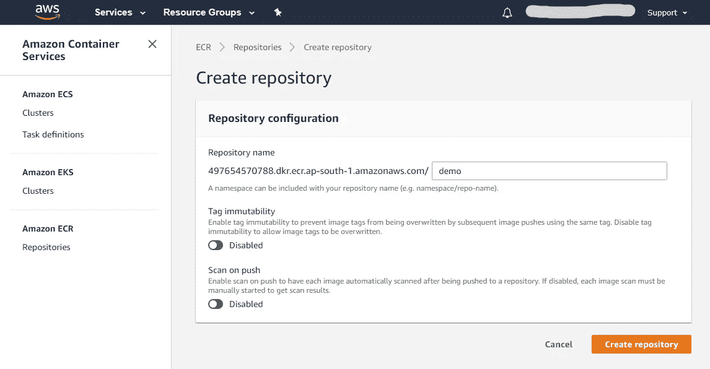

在 AWS Elastic repository 中创建存储库非常简单明了。

**第一步。**转到 AWS ECR 服务页面，单击创建存储库。

**第二步。**给出您选择的名称，然后点击创建存储库。

完成了。

但是要在 ECR 上上传您的图像，您还需要一个 IAM 角色。创建相同内容的步骤如下:

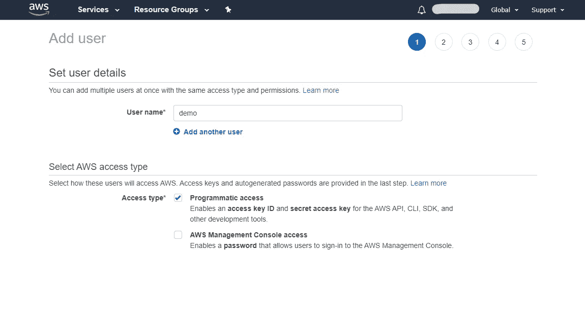

**第一步。**转到 AWS IAM 服务并点击添加用户。

**第二步。**在添加用户页面上，输入任意用户名并选择“编程访问”

**第三步。**在下一页，您需要选择一个现有组或创建一个新组。确保该组有足够的权限执行所有操作。如果只是初学者，先给管理员访问权限，等对权限有了更多的了解后，再做相应的调整。

**第四步。**在最后一页上，查看用户属性并单击创建用户。之后，您将看到一个访问密钥和一个秘密密钥。请确保将它们保存在机器中的安全位置，因为您将无法再次查看密钥。

现在，您可以将您的图像上传到 ECR 上了。要做到这一点，确保你的机器上运行了 [Docker](https://www.docker.com/) ，并且你的 Docker 注册表中有你的 Spring Boot 应用的镜像。此外，您不能直接将图像推送到弹性注册表。您需要首先向弹性注册中心认证您的 Docker 客户机。

**第一步。(仅适用于 Windows)**首先，您需要在机器上安装 AWS CLI 工具。在管理模式下打开 Power Shell 并运行`Install-Module -name AWSPwerShell.NetCore.`

**第二步。(仅适用于 Windows)**然后运行以下命令，将您的访问密钥和秘密密钥存储在您的机器中。

```
Set-AWSCredential -AccessKey ACCESS_KEY -SecretKey SECRET_KEY -StoreAs STORE_NAME
```

**第三步。(仅限 Windows)**然后运行以下命令设置默认区域`Set-DefaultAWSRegion -Region ap-south-1.`用您的默认区域替换`ap-south-1`。

**第四步。(仅适用于 Windows)**现在运行以下命令来检索认证令牌并认证您的 Docker 客户端。

```
(Get-ECRLoginCommand).Password | docker login --username AWS --password-stdin YOUR_REPOSITORY_URL
```

注意:如果您尝试直接运行上面的命令，它可能不会工作，因为它需要秘密和一个区域来工作。因此，在运行该命令之前，请确保遵循步骤 2 和 3。

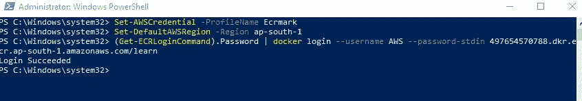

如果您收到“登录成功”消息，您就可以开始了。这里你可以注意到我使用了`Set-AWSCredential -ProfileName Ecrmark`而不是步骤 2 中的命令，原因是一旦你设置了你的配置文件，你只需要下次调用。

**步骤五。**最后，按顺序运行以下两个命令。

```
ps> docker tag learn:latest 497654570788.dkr.ecr.ap-south-1.amazonaws.com/learn:latestps> docker push 497654570788.dkr.ecr.ap-south-1.amazonaws.com/learn:latest
```

这里的`learn:latest`是我的带有标签的图片的名称，后面的 URL 是 Elastic Repository 的 URL。现在转到你的 ECR，你会发现你的图像上传到那里。顺便说一下，您可以通过单击存储库页面上的“查看推送命令”按钮来获取存储库的所有上述命令。

# 在 AWS ECS 中设置集群、服务和任务

AWS ECS 是一个容器编排服务。它允许您轻松托管、管理和扩展您的容器。我们将从创建集群开始。

**步骤 1。**转到 ECS 服务页面，单击“创建新集群”

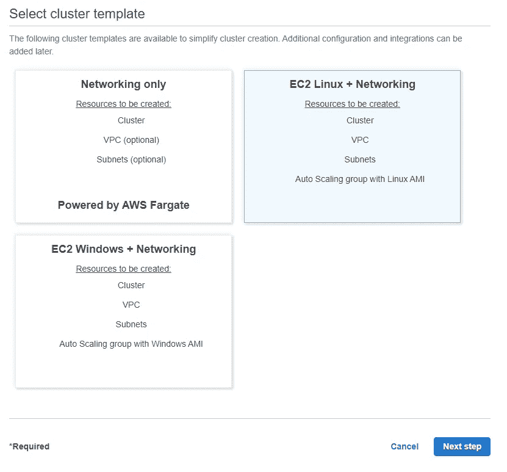

你必须从这三个选项中选择。我们将使用 EC2 Linux +网络选项。如果你想详细了解这些选项的含义，请访问 AWS 弹性容器服务页面。

**第二步。**在下一页，给集群起一个您喜欢的名称，并选择 EC2 实例类型。如果使用的是 Free Tier，使用 t2.micro 否则，你可以选择任何一个。填写其他详细信息，最后单击 Create。

搞定了。

接下来，我们将创建一个任务定义，我们将在服务中使用它。

**第一步。**点击左侧导航面板上的任务定义。

**第二步。**选择 EC2 启动兼容性。

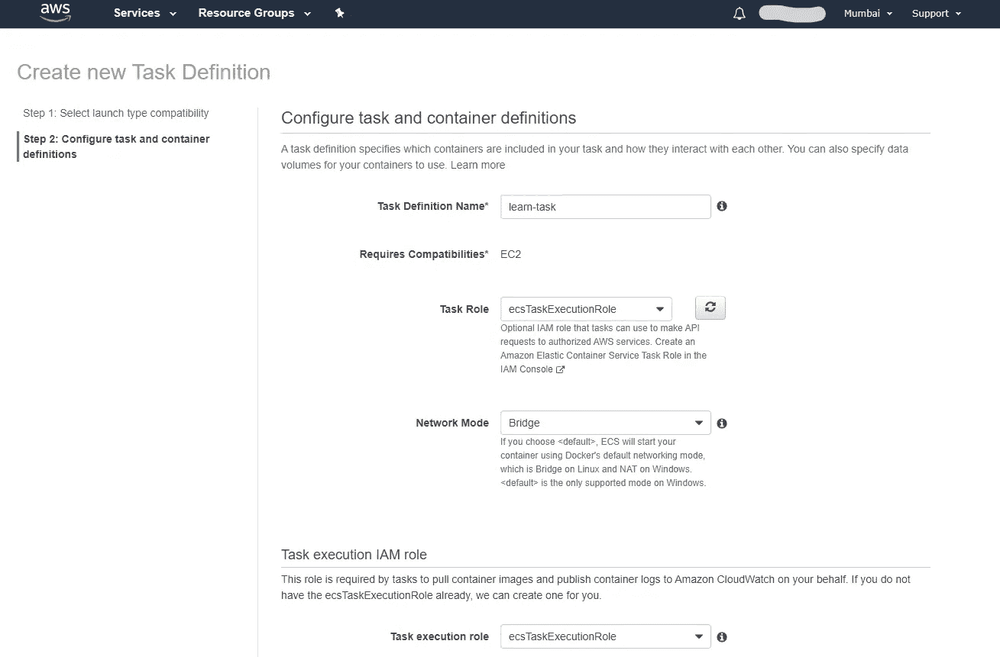

**第三步。**填写所需的详细信息。需要记住的一些要点:

*   如果您想要不同的主机和容器端口，请确保选择网桥网络模式。
*   确保你给你的任务足够的内存和 CPU。对于 EC2，这是可选的，但是如果您仍然决定设置这些值，请记住 EC2 实例的最大 CPU 和内存。

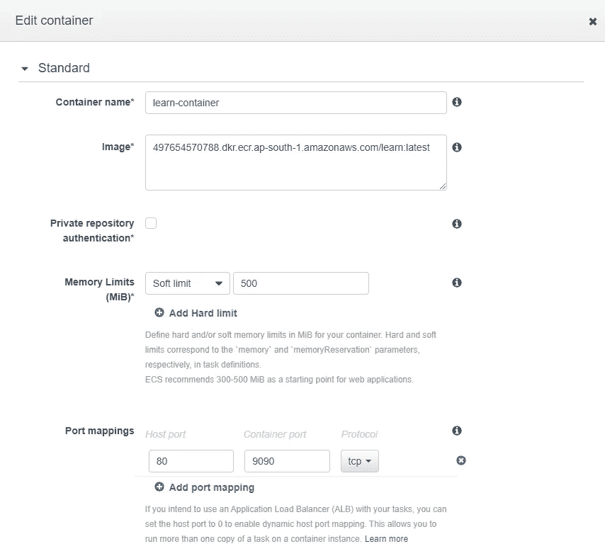

**第四步。**转到添加容器。从 AWS ECR 粘贴您的最新映像 URI，设置内存限制，并进行主机端口映射。此外，如果您想要检查服务中的日志，请确保启用日志记录。

搞定了。

最后，我们将创建一个服务来启动任务。

**第一步。**返回集群>转到服务选项卡>点击创建。

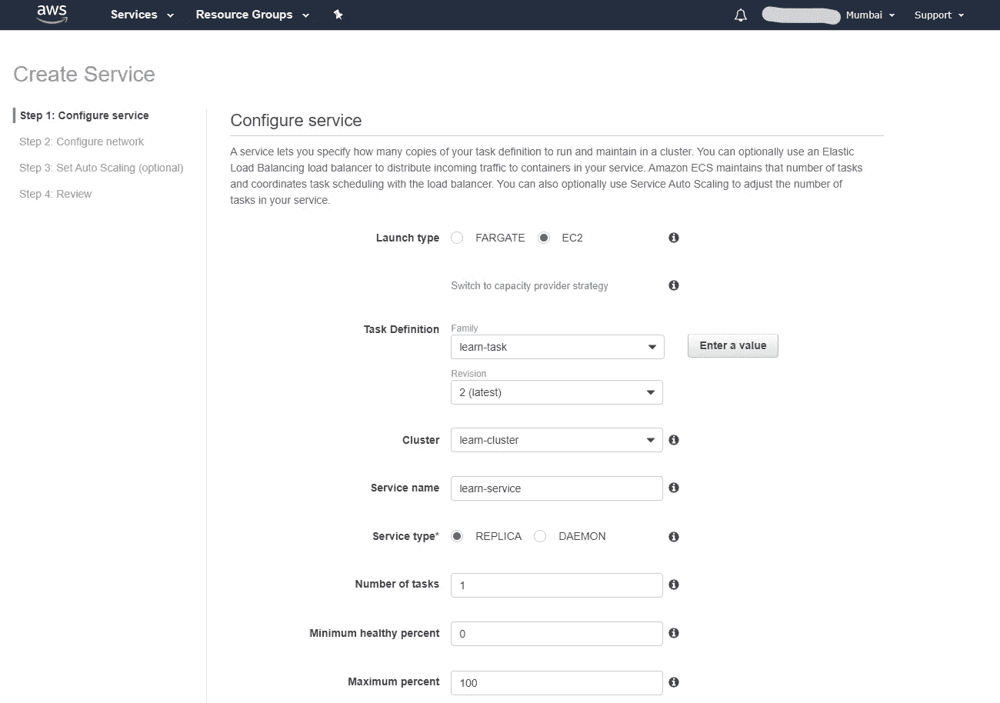

**第二步。**选择启动类型 EC2。选择具有最新版本的任务定义，选择集群，然后键入要运行的任务的实例数。您可以保持最小健康百分比和最大健康百分比不变，也可以进行更改，就像我在这里所做的那样。我选择 0 和 100 的原因是，当更新的任务推出时，首先旧的任务将被终止，然后只有新的任务将被托管。

**第三步。在剩余的一页上填写详细信息。最后，查看最后一页上的配置。之后，点击创建服务。**

您的服务将被创建，您的应用程序将托管在公共 IP 上，您可以通过在任务选项卡中单击您正在运行的任务来获得该 IP。

如果你的数据库是 H2 的或者指向任何公开托管的数据库，你的应用应该运行良好。如果不是这样，那么您可能也需要托管一个数据库。这对于 AWS RDS 服务来说非常容易。

**第一步。**进入 RDS 服务页面>点击创建数据库。

**第二步。**选择您的数据库，并填写其余的详细信息。确保保持可访问性公开，这样您也可以从本地机器连接到它。另外，不要忘记添加一个带有您的机器 IP 的入站规则。

为了更加安全，您可以将数据库凭证存储在 AWS Secrets Manager 中。

这些是在 AWS 上快速设置基础设施的步骤。现在您可以继续使用 GitHub 操作来设置您的 CI/CD 管道。

# 使用 GitHub 操作设置 AWS ECS 部署工作流

这是最后一步，也可能是最容易的一步。为了让这个工作，你需要把一些东西放在适当的位置。我们从最简单的开始。

**第一步。**将您的 IAM 用户访问密钥和秘密密钥添加到您的 GitHub 存储库秘密中。你会在你的设置标签中找到秘密页。

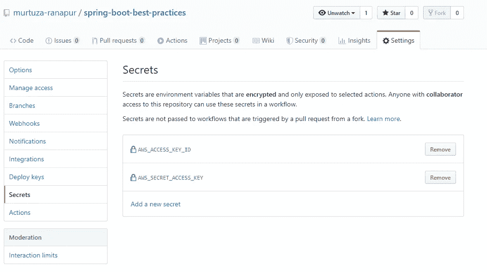

**第二步。**确保您的存储库中提交了 Docker 和任务定义 JSON 文件。要获得 JSON 格式的任务定义，只需转到您的任务定义页面。你会在那里的 JSON 标签中找到它的 JSON。将其复制并提交到您的存储库中。下面是我的 Docker 和任务定义 JSON 文件，供大家参考。

一旦完成了这些，剩下的唯一一步就是从 GitHub Actions 设置 AWS ECS 工作流。

**第一步。**转到存储库中的“操作”选项卡。在那里你会发现新的工作流程按钮。点击它。

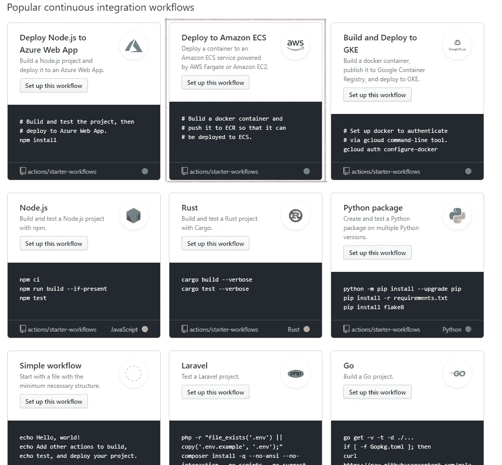

**第二步。**在持续集成部分，您会看到“部署到 AWS ECS”操作。点击“设置此工作流程”您将被重定向到编辑器，在这里您可以在您的`aws.yml`工作流文件中填写所需的详细信息。

**第三步。**在`aws.yml`中，你会在顶部找到一组说明。如您所见，我们已经创建了 ECR 存储库、ECS 任务定义、集群和服务。按照步骤操作，将占位符替换为您的存储库、集群和服务的实际名称。

**第四步。模板中缺少一个重要的动作:构建你的应用。您需要在工作流程中手动添加。你可以查看我的`aws.yml`文件，在第 43 行我添加了一个 Maven 命令来构建这个应用。**

**第五步。**提交文件。您将在“操作”选项卡中找到您的工作流。

您可以注意到，除了构建步骤之外，我的`aws.yml`和给定的模板之间仍然存在一些差异。第一个是触发工作流的事件。

```
on:  
  release:    
    types: [**published**] <-- In template it's **created**
```

工作流可以由许多事件触发。你可以在这里找到[完整的活动列表](https://help.github.com/en/actions/reference/events-that-trigger-workflows)。我已经选择在发布事件上触发我的构建，特别是在发布发布时，这样当我在我的存储库中发布了一个发布时，AWS ECS 工作流将被触发。您可以使用此事件或您选择的任何其他事件。顺便说一下，您还可以让您的工作流在多个事件上触发。

第二个变化是 Docker 命令。

```
docker build -t $ECR_REGISTRY/$ECR_REPOSITORY:$IMAGE_TAG --build-arg ACCESS_ARG=${{ secrets.AWS_ACCESS_KEY_ID }} --build-arg SECRET_ARG=${{ secrets.AWS_SECRET_ACCESS_KEY }} .
```

模板中的命令没有生成参数。正如您在这里看到的，我已经将我的访问密钥和秘密密钥作为构建参数进行了传递。这些参数的值随后被传递给 Docker 文件中的环境变量。检查上面的 Docker 文件。你会问，这是为了什么？答案是保护我的 AWS RDS 数据库凭证。让我来解释一下。

要将我们的 Spring Boot 应用程序连接到数据库，我们需要在属性文件中指定数据库的连接字符串、用户名和密码。当我们在本地机器或开发环境上工作时，这很好。但是您可能不想让每个人都知道您的生产数据库凭证。所以很明显，你不能把它放在你的项目属性中。

现在，解决这个问题的方法不止一种。我选择的方法涉及到利用 AWS 秘密和一个名为`aws-secretsmanager-jdbc`的 AWS 库。它是数据库驱动程序的包装器。它为您从 AWS Secrets 检索数据库凭证。为此，首先您需要在您的`pom`文件中添加它的 Maven 依赖项。

```
<**dependency**>
    <**groupId**>com.amazonaws.secretsmanager</**groupId**>
    <**artifactId**>aws-secretsmanager-jdbc</**artifactId**>
    <**version**>1.0.5</**version**>
</**dependency**>
```

接下来，您需要将属性文件更新为以下内容:

如你所见，我没有使用 Postgres 驱动程序，而是使用了它的 AWS JDBC 包装器。此外，我提到了我的 AWS 秘密名称，而不是用户名。它还需要访问密钥、秘密密钥和区域才能工作。您可以在系统环境变量中设置相同的值。

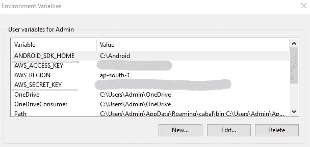

以及 Docker 文件中环境变量的存在。

咻！我们完了。剩下的唯一步骤是触发工作流。执行您在 YML 文件中提到的事件。它将触发工作流，如果一切顺利，您将在您的工作流详细信息页面中看到所有绿色勾号。

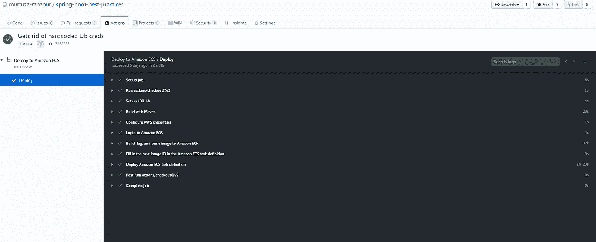

祝贺你的第一个 GitHub 工作流程！如果你认为我遗漏了什么配置，你也可以看看我的[项目](https://github.com/murtuza-ranapur/spring-boot-best-practices)。感谢阅读。

# 参考

*   【https://spring.io/guides/gs/spring-boot-docker/ 
*   [https://medium . com/underscoretec/deploy-your-own-custom-docker-image-on-Amazon-ECS-b 1584 e 62484](https://medium.com/underscoretec/deploy-your-own-custom-docker-image-on-amazon-ecs-b1584e62484)
*   [使用 AWS Secrets Manager 和 Spring Boot 进行数据库密码轮换](https://www.youtube.com/watch?v=gIbr6-AR6T8)
*   [https://vsupalov . com/docker-build-pass-environment-variables/](https://vsupalov.com/docker-build-pass-environment-variables/)