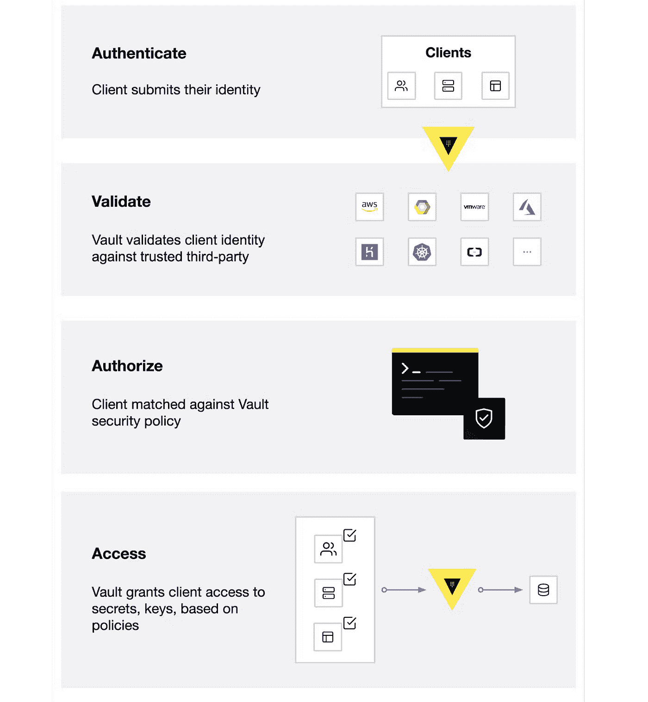
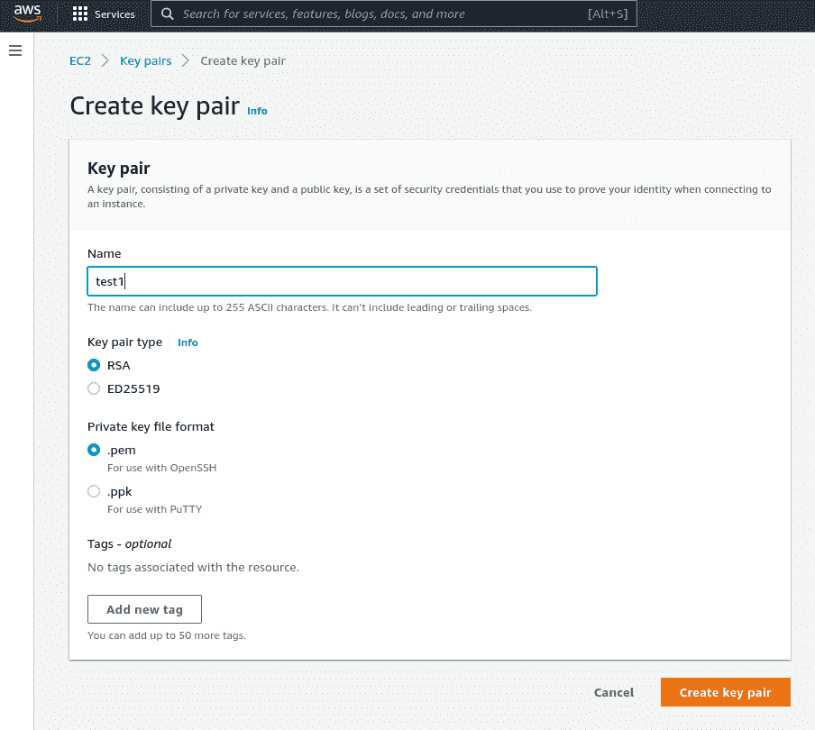
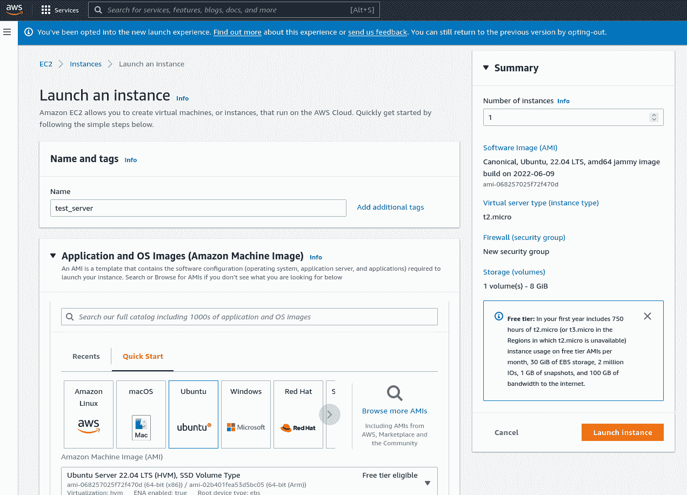
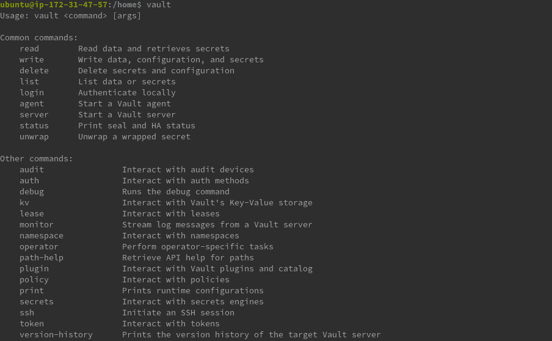
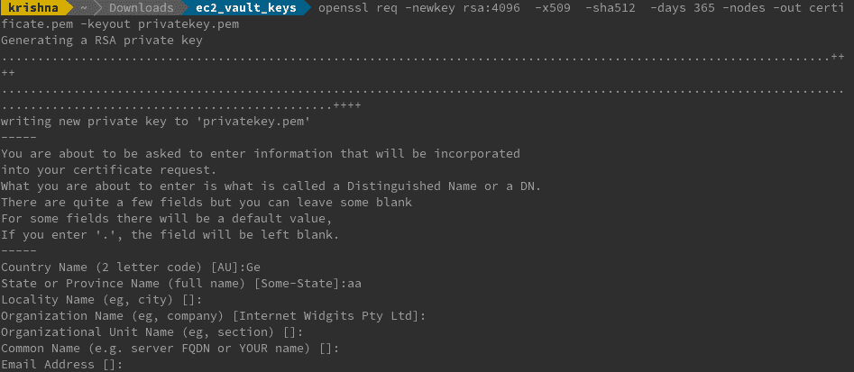
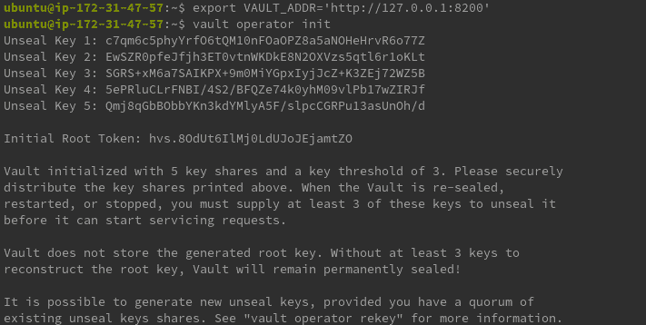
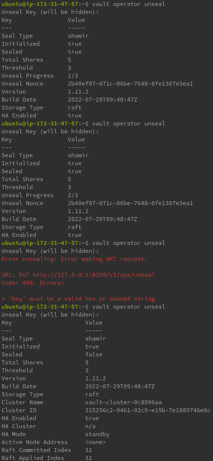
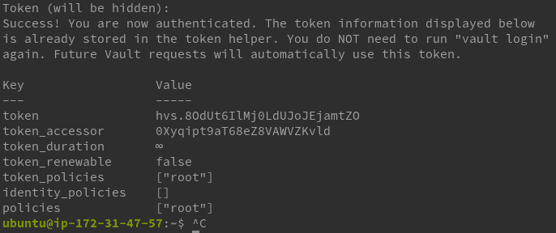

# 在 AWS 云中部署和运行具有 TLS 安全性的 Hashicorp Vault

> 原文：<https://betterprogramming.pub/deploy-and-run-hashicorp-vault-with-tls-security-in-aws-cloud-25541d02d182>

## 安全性和 AWS

## 在 AWS 中部署生产级存储库


通常在软件工程中，当我们开发新功能时，我们会对某些敏感信息进行编码，如密码、密钥或令牌，以使我们的代码实现其预期的功能，这是一个非常常见的功能。IT 领域的不同专业人员以不同的方式使用它，例如:

*   开发人员使用来自 API 令牌、数据库凭证或代码中其他敏感信息的秘密。
*   开发-运营工程师可能必须将某些值导出为环境变量，并将这些值写入 YAML 文件中，以便 CI/CD 管道高效运行。
*   云工程师可能必须传递凭证、秘密令牌和其他秘密信息，以便他们访问各自的云(在 AWS 的情况下，即使我们将这些保存在一个`.credentials`文件中，我们仍然必须在 terraform 块中传递文件名，这将表明凭证在计算机内本地可用。)
*   系统管理员可能需要向员工发送不同的登录名和密码，以便他们访问不同的服务

但是以纯文本形式编写或以纯文本形式共享它是一个相当大的安全问题，因为任何登录到代码库的人都可能访问这个秘密或发起中间人攻击。为了解决这个问题，在发展中国家，我们有不同的选择，比如从另一个文件中导入机密(YAML。py 等。)或将它们导出为环境变量。但是这两种方法都有一个问题:能够访问一个单独的配置文件或机器的人可以回显密码(read print)。考虑到这些问题，如果我们能够部署一个单一的解决方案，为上面提到的所有 it 专业人员提供解决方案，这将是非常有用的。这是介绍跳马的理想场所。

# 跳马——简介

HashiCorp Vault 是一个基于用户身份的秘密和加密管理系统。如果我们必须将其与 AWS 进行比较，它就像一个 IAM 基于用户的资源管理系统(在此处阅读 Vault ),可以保护您的敏感信息。这些敏感信息可以是 API 加密密钥、密码和证书。

其工作流程如下所示:



# 保管库的托管成本

*   本地托管:如果秘密只由本地用户或在开发阶段访问，通常使用这种方法。如果这些秘密引擎必须与其他人共享，就必须避免使用这种方法。因为它在本地开发环境中，所以没有额外的部署投资。这可以直接托管在[一台本地机器](https://www.vaultproject.io/downloads)上，或者通过它的[官方 docker 镜像](https://hub.docker.com/_/vault/)来托管
*   公共云托管(AWS 中的 EC2/Azure 中的虚拟机):如果想法是建立 Vault 与不同地区的人共享，那么在公共云上托管是个好主意。虽然我们可以通过本地服务器实现同样的目标，但前期成本和可扩展性是一个很大的问题。对于 AWS，我们可以通过在 EC2 实例中托管 Vault 并创建 IPs 可以访问 EC2 的安全组来轻松保护端点。如果您更喜欢冒险，您可以将它映射到一个域名，并从 Route 53 路由，以便最终用户可以在域上作为服务访问 vault。在使用 AWS 定义的域托管 EC2 的情况下，成本为 0.0116 美元/小时。
*   Vault 云托管(HashiCorp 云平台):如果您不想在公共云环境中建立基础架构，可以选择由 vault 托管的云。我们可以将其视为一个基于 SaaS 的云平台，使我们能够在订阅的基础上使用 Vault 作为服务。由于 hashicorp 自己管理云，我们可以期待一致的用户体验。就成本而言，它有三个生产级[选项](https://cloud.hashicorp.com/products/vault/pricing):起步版 0.50 美元/小时，标准版 1.58 美元/小时，升级版 1.84 美元/小时(见 2022 年 7 月)。

# AWS 云中的自托管示例

我们在这个项目中的目标是在 EC2 中创建一个 Vault 实例，并将静态秘密存储在 Key-Value secrets 引擎中。这些秘密稍后被检索到 terraform 脚本中，当应用时，该脚本将从 Vault Secrets 引擎中提取秘密，并使用它们在 AWS 中创建基础结构。

要创建一个随时可用的存储库，我们将遵循以下步骤:

1.  用 ssh 密钥创建一个 EC2 Linux 实例来访问它。
2.  SSH 到实例中，并安装 Vault 以启动并运行它
3.  配置阀门机密管理器

## 步骤 1:创建一个 EC2 Linux 实例，用 ssh 密钥来访问它

要创建 EC2 实例并通过 SSH 远程访问它，我们需要创建密钥对。首先，让我们通过 AWS 控制台创建一个 SSH 密钥。



一旦键被创建并下载到本地工作台中，我们就创建一个 EC2 (t2.micro) Linux 实例，并将其与上述键相关联。EC2 的大小可以根据您的要求来选择，但通常 t2.micro 就足够了。



## **第二步:SSH 进入实例并安装秘密以启动并运行**

一旦 EC2 的状态变为 running，打开保存 SSH 的目录(。pem)键。打开一个终端，输入`ssh -i <keyname.pem> ec2-user @<publicdns IP4>`。一旦我们在 Ec2 实例中建立了成功的 SSH 会话，我们就可以使用以下命令安装 Vault:

```
wget -O- <https://apt.releases.hashicorp.com/gpg> | gpg — dearmor | sudo tee /usr/share/keyrings/hashicorp-archive-keyring.gpg

echo "deb [signed-by=/usr/share/keyrings/hashicorp-archive-keyring.gpg] <https://apt.releases.hashicorp.com> $(lsb_release -cs) main" | sudo tee /etc/apt/sources.list.d/hashicorp.list

sudo apt update && sudo apt install vault
```

以上命令将在 EC2 环境中安装 vault。有时第二个命令会抛出一些错误。如果出现错误，将`$(lsb_release -cs)`替换为`jammy`。[通过在创建 EC2 实例时将上述命令复制到 EC2 用户数据中，可以自动完成整个过程]。

## **第三步:配置 Hashicorp 阀**

在初始化存储库之前，让我们按照以下命令确保它已正确安装:

```
vault
```



让我们确保没有名为`VAULT_TOKEN`的环境变量。为此，请使用以下命令:

```
$ unset VAULT_TOKEN
```

一旦我们安装了存储库，我们需要配置存储库，这是使用 HCL 文件完成的。这些 HCL 文件包含诸如 backed、listeners、cluster address、UI 设置等数据。正如我们在 vault 的体系结构中所讨论的，存储数据的后端与 vault 引擎有很大不同，后者即使在 Vault 被锁定时也是持久的(有状态资源)。除此之外，我们需要指定以下细节:

*   监听器端口:Vault 监听 API 请求的端口。
*   API 地址:指定要通告的地址，以路由客户端请求。
*   群集地址:指示用于群集中 Vault 节点之间通信的地址和端口。为了进一步保护它，我们可以使用基于 TLS 的通信。这一步是可选的，只有当您想进一步保护您的环境时才能尝试。TLS 证书可以在 Linux 中使用 openssl 生成。

```
# Installs openssl
sudo apt install openssl

#Generates TLS Certificate and Private Key
openssl req -newkey rsa:4096 -x509 -sha512 -days 365 -nodes -out certificate.pem -keyout privatekey.pem 
```



将 TLS 证书和私钥文件路径插入侦听器“tcp”块中它们各自的参数中。

*   `tls_cert_file`:指定 PEM 编码文件格式的 TLS 证书路径。
*   `tls_key_file`:以 PEM 编码的文件格式指定证书私钥的路径。

```
#Configuration in config.hcl file

storage "raft" { 
path = "./vault/data" 
node_id = "node1" 
}
listener "tcp" {
 address = "127.0.0.1:8200" 
tls_disable = "true"
tls_cert_file = certificate.pem
tls_key_file = privatekey.pem
}
disable_mlock = true
api_addr = "http://127.0.0.1:8200" 
cluster_addr = "https://127.0.0.1:8201"
 ui = true
```

一旦创建了这些，我们就创建了我们的后端将存放的文件夹:vault/data。

```
mkdir -p ./vault/data
```

完成后，我们可以使用以下命令启动 vault 服务器:

```
vault server -config=config.hcl
```

完成后，我们可以使用配置文件中提到的后端及其所有设置来启动我们的 Vault 实例。

```
export VAULT_ADDR='http://127.0.0.1:8200'

vault operator init
```



初始化之后，它会创建五个名为 shamir 密钥的解封密钥(其中三个在默认设置下用于解封 Vault)和一个初始根令牌。这是迄今为止 vault 唯一一次知道所有这些数据，并且这些细节将被安全地保存以启封 Vault。实际上，这些 shamir 密钥将在项目的关键涉众之间分发，并且密钥阈值应该以这样的方式设置，即当大多数人一致同意这样做时，可以打开保险库。

一旦我们创建了这些密钥和初始令牌，我们需要解封保险库:

```
vault operator unseal
```

这里我们需要提供启封密钥的阈值数量。一旦我们提供了这个，密封状态就会变为 false。



然后，我们使用初始根令牌登录到保险库。

```
vault login
```



一旦认证成功，您就可以轻松地探索不同的加密引擎，如 Transit secrets 引擎。这有助于加密传输中的数据，例如用于安全存储密钥-值对(如密码、凭证等)的密钥-值存储。

从这个过程中可以看出，Vault 在加密方面非常健壮，只要以一种敏感的方式处理 shamir 密钥和初始令牌，我们就可以确保安全性和完整性

您有一个非常安全的 Vault 引擎(由它自己的 shamir 密钥保护)，运行在一个免费的 AWS EC2 实例上(反过来，由安全组保护)！

```
**Want to Connect?**

If you want to connect with me, you can do so on [LinkedIn](https://www.linkedin.com/in/krishnadutt/).
```