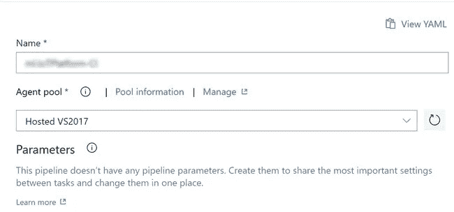
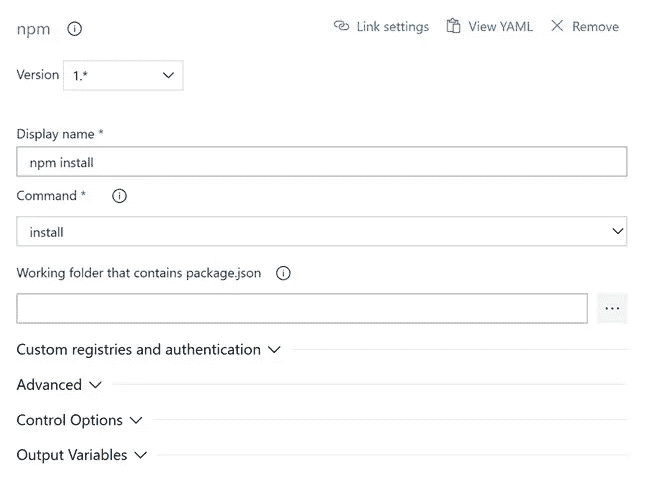
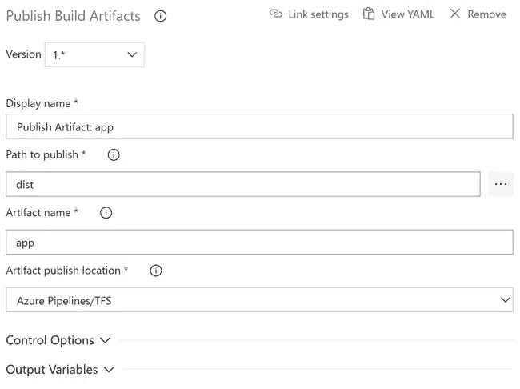
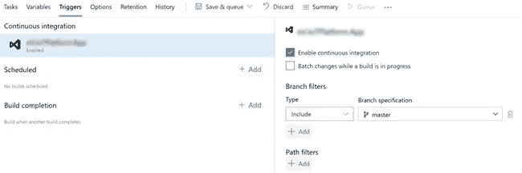
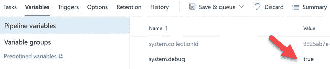
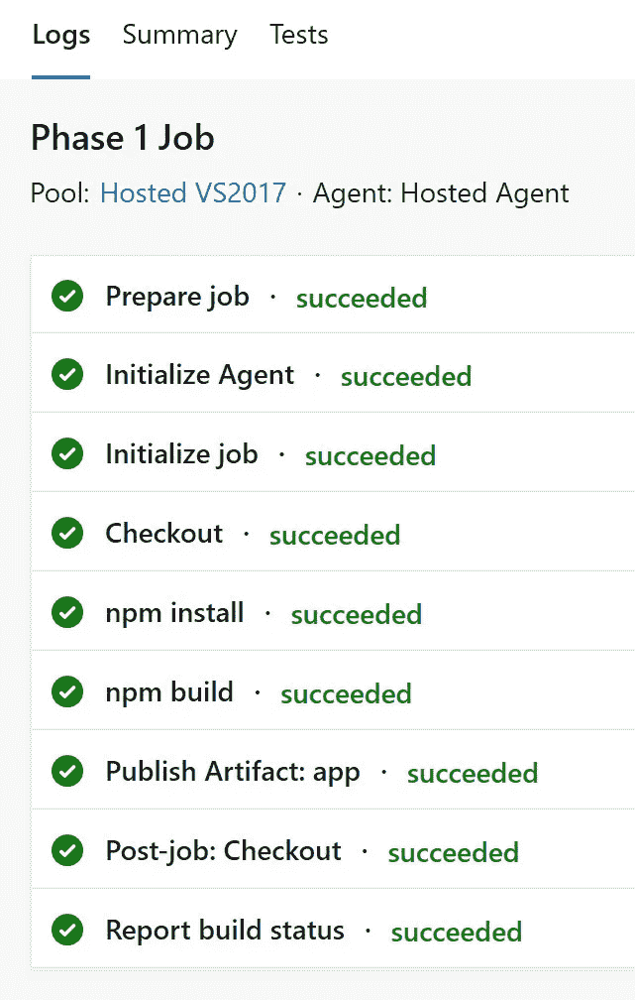
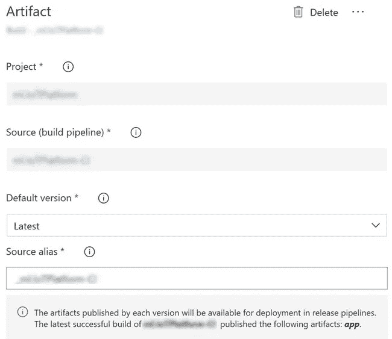
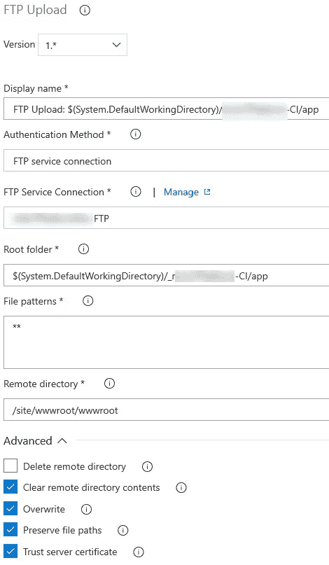
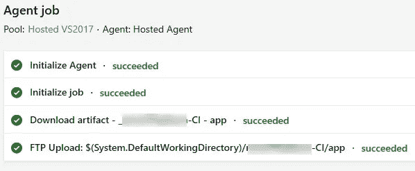
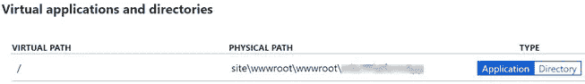

# 使用 Azure DevOps 构建和发布管道部署 Angular 应用程序

> 原文：<https://betterprogramming.pub/deploy-angular-app-using-azure-devops-build-and-release-pipelines-f7f77ca28be4>

## 如何通过在 Azure DevOps 中配置构建和发布管道，轻松地将 Angular app 部署到 Azure

发布管道任务输出

# 介绍

我知道有很多关于这个主题的文章，但是对于最新的管道配置，大多数解决方案都不适合我，所以，我想我应该写这篇文章并分享我的发现。这里，我们将通过几个基本步骤来设置我们的 Angular 应用程序的构建和发布管道配置。我们将使用 Azure DevOps FTP 管道服务连接进行配置。介绍够了，让我们进入配置。

# 背景

当我试图将我的 [Angular](https://sibeeshpassion.com/category/angular) 应用程序部署到 Azure 时，我想建立我的构建和发布管道。我遵循了一些教程，但我仍然遇到了一些问题。后来，我决定使用 Azure FTP Upload Release 任务，所以我们的发布管道中将只有一个任务。

# 构建管道

让我们从配置 Azure DevOps 构建管道开始。但是，首先，我们需要在`package.json`文件中定义我们的脚本:

如果你有不同的路线，需要在浏览器的 URL 中直接访问，你应该考虑在你的`src`文件夹中添加一个`web.config`文件:

完成后，将其作为资产添加到`angular.json`文件中。

去你的 Azure DevOps 站点，点击*管道*，然后*构建*。现在，点击+图标。

# 管道

在管道部分，您可以提到您的管道名称和代理池。请记住将代理池设置为`Hosted VS2017`，否则可能会出现错误: [Npm 失败，返回代码:1 2019–01–07t 10:14:37.3309955 z # #[section]完成:Npm 构建](https://stackoverflow.com/questions/51227020/npm-failed-with-return-code-4294963238-in-ci-in-vsts/54072646#54072646)。

选择管道代理

## npm 安装

点击*阶段*部分的+图标，搜索 *npm* 并点击添加。现在我们可以配置这项任务:

npm 安装任务

您还可以单击功能区上的*查看 YAML* ，查看任务的 yml 版本。

## npm 构建

在这一步中，我们将添加一个新的 npm 任务，并为我们的构建脚本进行配置。

npm 运行构建

请注意，该命令是自定义的，我们已经在`package.json`文件中包含了`prod-build-dev`脚本。

## 发布工件

在这一步中，我们将发布我们已经生成的工件。这一点非常重要，否则发布配置将无法在目录中找到`package.json`文件。添加一个名为 *Publish Build Artifacts* 的新任务，并对其进行如下图所示的配置:

发布构建工件

## 支持持续集成

现在任务已经准备好了，是时候建立持续集成了。点击*触发*部分并勾选*启用持续集成*。

支持持续集成

## 调试版本

如果您需要调试构建管道，您可以在*变量*部分中这样做。只要将`system.debug`的值设置为真就可以了！

调试版本

## 运行构建

完成后，点击*保存&队列*按钮开始构建。我们的代理将立即运行并执行任务。由于我们已经启用了 debug 属性，我们现在可以在控制台中看到详细的日志。将发生以下任务:

生成管道输出

# 释放管道

好了，我们已经成功地创建了构建管道，现在是时候创建发布管道了。正如我前面提到的，我们将在发布管道中有一个任务:FTP 上传。点击*管道*然后*释放*。最后，点击 *+New* 图标，创建一个新的发布管道。

## 选择工件

选择构建中生成的工件:

选择工件

## 选择阶段

点击阶段并添加一个。

## 添加 FTP 服务连接

在添加新的 FTP 上传任务之前，我们需要在 Azure DevOps 站点中创建一个新的 FTP 服务连接。点击左下角的*项目设置*，进入*管道*部分，然后点击*服务连接*。现在点击 *+新服务连接*，在弹出窗口中你需要提供你可以从你的 Azure Web 应用的*发布*配置文件中获得的详细信息(点击 Azure 门户中你的 Web 应用资源概述部分的*获取发布配置文件*)。

添加通用服务连接

## 添加 FTP 上传任务

现在是添加 FTP 上传任务的时候了。点击*代理作业任务*中的+图标，添加任务`FTP Upload`。

FTP 上传任务

远程目录是我们的应用程序文件所在的文件夹，当您使用应用程序发布配置文件中的 FTP 详细信息登录浏览器时，您应该能够看到这些文件。

## 创建一个版本

现在，是时候创建一个发布了，点击 *+发布*按钮，然后点击 *+创建一个发布*。在接下来的窗口中，您应该能够看到所选择的管道和工件。只需点击*创建*按钮。代理将在几秒钟内启动，一旦准备就绪，它将执行任务。请注意，`FTP Upload`任务将首先从目录中删除内容，然后上传新内容:

发布管道任务输出

# 更改应用服务虚拟路径

由于我们已经在*版本*配置中提供了自定义文件夹位置，我们还应该更改 Azure App 服务的虚拟路径。为此，请转到您的 Azure 应用服务，然后在*应用程序设置*下选择*虚拟路径*。将虚拟路径设置为站点`\wwwroot\wwwroot\yourappname`(dist 文件夹中的文件夹名)，类型设置为`Application`。

设置虚拟物理路径

完成后，您将看到您的 Angular 应用程序正在运行。

# 结论

哇！让我们看看我们学到了什么:

*   如何设置 Azure DevOps 构建管道配置
*   如何设置 Azure DevOps 发布管道配置
*   如何在 Azure DevOps 中创建新的 FTP 服务连接
*   如何配置 Azure Web App

# 轮到你了。你怎么想呢?

非常感谢你的阅读。我错过了你认为这篇文章中需要的东西吗？你觉得这篇文章有用吗？请随时向我发送您的反馈！

最亲切的问候

你可以随时在这里阅读我与 Azure [相关的文章。](https://sibeeshpassion.com/category/azure)

在 Medium 和 Twitter 上关注我。

 [## Sibeesh Venu —培养基

### 在介质上阅读 Sibeesh Venu 的作品。职业上是工程师，热情上是作家。微软 MVP…

medium.com](https://medium.com/@sibeeshvenu)  [## sibeesh Venu(@ sibeesh Venu)| Twitter

### Sibeesh Venu 的最新推文(@SibeeshVenu)。https://t.co/qgUFdZS3Zb,微软 MVP @MVPAward，@CsharpCorner…

twitter.com](https://twitter.com/SibeeshVenu)