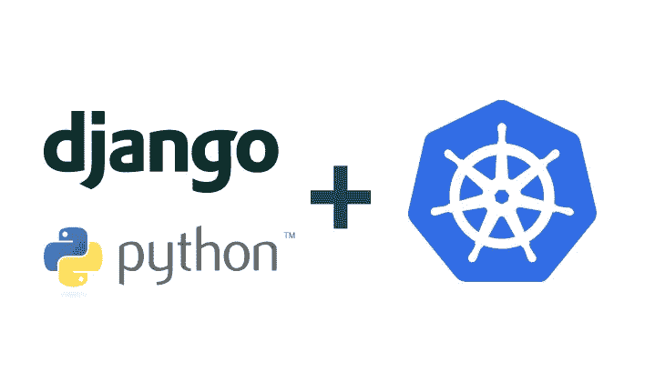
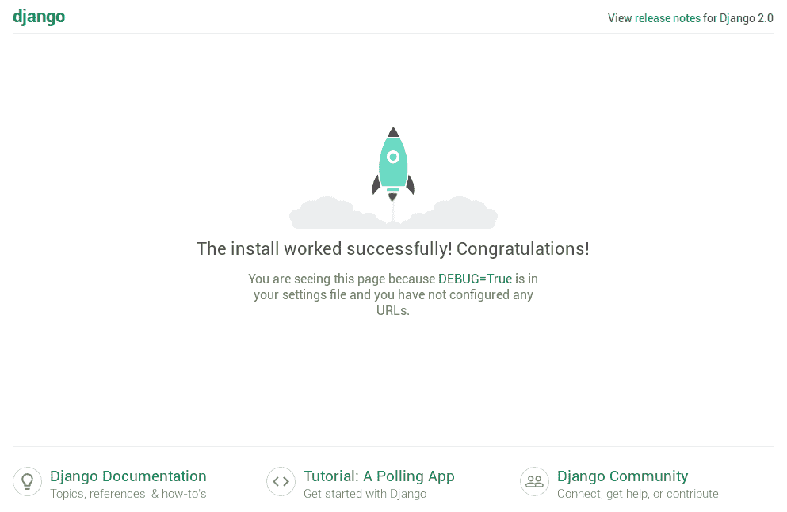

# 将 Django 项目部署到 Kubernetes

> 原文：<https://betterprogramming.pub/deploy-django-projects-to-kubernetes-d1c9584036a5>

## 使用 Kubernetes 和 DevSpace 的可伸缩 Django 部署



资料来源:Lukas Gentele

本教程旨在为想要探索 Kubernetes 并在使用 Kubernetes 构建和部署 Django 项目时提高生产力的 Django 开发人员提供指导。本教程独立于任何云平台。一切都适用于任何 Kubernetes 集群，无论它是使用 Minikube 或 Docker desktop 创建的本地单节点集群，还是位于 GKE、阿拉斯加州或 EKS 的完全托管集群。

即使您还没有 Kubernetes 集群，也可以学习本教程。如果你已经有一个集群，那就更好了！让我们开始吧。

# 1.创建 Django 项目

如果您已经有一个 Django 项目，您可以跳过这一步，但是要确保您的项目根目录中有一个`requirements.txt`(运行`pip freeze > requirements.txt`来创建它)。

在创建一个新的 Django 项目之前，让我们用我们希望 Django 项目所在的目录来定义一个变量:

```
PROJECT_DIR=/c/Users/[username]/django # win (git-bash)
PROJECT_DIR=/home/[username]/django # mac, linux (bash)
```

如果你正在使用传统的 Docker 工具箱(例如，因为你正在使用 Windows Home Edition)，你的`$PROJECT_DIR`需要在你的用户的主目录中，例如`/c/Users/[username]`。

如果你在 Windows 上使用 Docker 桌面，确保你的项目所在的驱动器在 Docker 设置中被标记为[共享驱动器](https://docs.docker.com/docker-for-windows/#shared-drives)。

我们还应该为项目名称定义一个变量:

```
PROJECT_NAME=mysite  
*# warning: Django only allows characters a-z, no -, space or anything else*
```

现在我们使用 Docker 创建一个新的 Django 项目:

```
mkdir $PROJECT_DIR docker run --rm -v /$PROJECT_DIR:/app -w //app python bash -c "pip install django && django-admin startproject $PROJECT_NAME && pip freeze > $PROJECT_NAME/requirements.txt" cd $PROJECT_DIR/$PROJECT_NAME
```

太好了！我们都准备好了。现在让我们将 Django 项目容器化。

# 2.集装箱化项目

当然，我们可以手动创建 Dockerfile、Kubernetes manifests，甚至是 Helm chart，但是这需要大量的工作，而且很容易出错。因此，让我们使用 DevSpace 来自动化我们的 Django 项目的容器化。 [DevSpace 是一款面向 Kubernetes 的云原生开发工具。它是开源的，你可以从 GitHub](https://github.com/devspace-cloud/devspace) 安装它。

在您的计算机上安装了 DevSpace 之后，您可以使用以下命令将您的 Django 项目容器化:

```
devspace init
```

DevSpace 会问几个问题。确保您告诉它这是:

*   一个使用`python`作为编程语言的项目
*   监听端口`8000`的项目

如果你不确定 Docker 注册表或其他问题，只需选择 DevSpace 为你推荐的默认选项。

在我们将项目容器化之后，DevSpace 为项目添加了一个`Dockerfile`。将此 Dockerfile 文件中的最后一行从:

```
CMD ["app.py"]
```

到

```
CMD ["manage.py", "runserver"]
```

现在我们准备将 Django 项目部署到 Kubernetes。

# 3.选择 Kubernetes 集群

如果您已经有了一个 Kubernetes 集群，使用下面的命令告诉 DevSpace 将项目部署到哪个名称空间:

```
devspace use namespace [my-namespace]
```

如果这个名称空间还不存在，DevSpace 将在部署过程中创建它。在部署项目之前，确保您处于正确的 kube 上下文中。

## 没有 Kubernetes 集群？

如果没有 Kubernetes 集群，可以使用 DevSpace 赞助的免费 Kubernetes 名称空间。使用以下命令创建一个:

```
devspace create space mysite
```

DevSpace 将自动为您配置 kube-context，这样您就可以使用任何 Kubernetes 工具来使用这个名称空间，比如 kubectl、Kustomize、Skaffold 或 Helm。

# 4.发展

在我们以类似生产的方式部署我们的项目之前，让我们首先启动开发模式:

```
devspace dev
```

这个命令告诉 DevSpace:

1.  基于 Docker 文件构建 Docker 映像
2.  标记并将该图像推送到 Docker 注册表(例如，Docker Hub)
3.  为我们的 Django 应用程序部署一个带有 Kubernetes 部署的舵图
4.  启动端口转发以访问本地主机上的应用程序(并在浏览器中打开)
5.  流式传输容器的日志
6.  观察文件更改，如果有任何文件更改，请重新启动应用程序

您可以定制在 DevSpace 配置文件`devspace.yaml`中发生的事情，这个文件是`devspace init`为您的项目创建的。

在`devspace dev`成功部署之后，您应该会在命令行中看到 Django 的日志输出，浏览器将会打开，显示一个漂亮的欢迎页面:



Django 欢迎页面——如果你看到这个页面，说明你目前做的一切都是正确的！

现在，是时候创建`/pages`文件夹了。运行以下命令来创建它:

```
devspace enter python manage.py startapp pages
```

添加完 pages 文件夹后，我们需要将`pages.apps.PagesConfig`添加到`$PROJECT_NAME/settings.py`中的`INSTALLED_APPS`数组中:

```
INSTALLED_APPS = [
    'django.contrib.admin',
    'django.contrib.auth',
    'django.contrib.contenttypes',
    'django.contrib.sessions',
    'django.contrib.messages',
    'django.contrib.staticfiles',
    'pages.apps.PagesConfig',
]
```

太好了！是时候添加 Hello World 页面了。

## 添加“Hello World”视图

编辑文件`$PROJECT_NAME/pages/views.py`，使其看起来像这样:

```
from django.http import HttpResponsedef homePageView(request):
    return HttpResponse('Hello, World!')
```

现在，用以下内容创建文件`$PROJECT_NAME/pages/urls.py`:

```
from django.urls import pathfrom .views import homePageViewurlpatterns = [
    path('', homePageView, name='home')
]
```

添加 Hello World 页面的最后一步是将`$PROJECT_NAME/urls.py`中的代码从:

```
from django.contrib import admin
from django.urls import pathurlpatterns = [
    path('admin/', admin.site.urls),
]
```

收件人:

```
from django.contrib import admin
from django.urls import path, includeurlpatterns = [
    path('admin/', admin.site.urls),
    path('', include('pages.urls')),
]
```

就是这样！现在，您可以重新加载浏览器，您将看到 DevSpace 实时更新了您的 Django 应用程序—无需部署您的项目，因为 DevSpace 使用热重新加载来更新您的运行容器。

自己试试:

1.  改变你的 Hello World！文件中的语句:`$PROJECT_NAME/pages/views.py`
2.  重新加载浏览器，查看更改如何立即生效。

## 额外收获:添加 PostgreSQL 数据库

在添加 Postgres 数据库之前，确保您终止了`devspace dev`，例如，使用`CTRL+C`。

首先，我们需要使用以下命令将 Python 的 Postgres 驱动程序添加到我们的`requirements.txt`中:

```
docker run --rm -v /$PROJECT_DIR:/app -w //app python bash -c "pip install psycopg2 && pip freeze | grep psycopg2 >> $PROJECT_NAME/requirements.txt"
```

现在我们需要告诉 DevSpace，我们也想部署一个 PostgreSQL 数据库。为此，我们需要将我们的`devspace.yaml`中的`deployments`部分从:

```
deployments:
- name: mysite # this line may be different for you
  helm:
    componentChart: true
    values:
      containers:
      # this line may be different for you
      - image: dscr.io/${DEVSPACE_USERNAME}/mysite  
      service:
        ports:
        - port: 8000
```

收件人:

```
deployments:
- name: database
  helm:
    chart:
      name: stable/postgresql
    values:
      postgresqlDatabase: "db_mysite"
      postgresqlUsername: "db_user"
      postgresqlPassword: ${DB_PASSWORD}
- name: mysite # this line may be different for you
  helm:
    componentChart: true
    values:
      containers:
      # this line may be different for you
      - image: dscr.io/${DEVSPACE_USERNAME}/mysite
        env:
        - name: DB_HOST
          value: "database-postgresql"
        - name: DB_NAME
          value: "db_mysite"
        - name: DB_USER
          value: "db_user"
        - name: DB_PASSWORD
          value: ${DB_PASSWORD}
      service:
        ports:
        - port: 8000
```

如果我们再次部署项目，DevSpace 现在将启动一个 PostgreSQL 数据库容器。然而，在我们这样做之前，我们需要配置 Django 项目来连接数据库。

因此将`$PROJECT_NAME/settings.py`从:

```
DATABASES = {
    'default': {
        'ENGINE': 'django.db.backends.sqlite3',
        'NAME': os.path.join(BASE_DIR, 'db.sqlite3'),
    }
}
```

收件人:

```
DATABASES = {
    'default': {
        'ENGINE': 'django.db.backends.postgresql',
        'HOST': os.environ.get('DB_HOST'),
        'NAME': os.environ.get('DB_NAME'),
        'USER': os.environ.get('DB_USER'),
        'PASSWORD': os.environ.get('DB_PASSWORD'),
    }
}
```

现在，让我们使用以下命令重新部署 Django 项目:

```
devspace dev -b
```

在这个改变之后第一次运行`devspace dev`时，DevSpace 会要求您定义一个用于变量`DB_PASSWORD` *的数据库密码。*

注意`-b`标志，它是`--force-rebuild`的快捷方式。它告诉 DevSpace 我们不想使用热重载，而是重建 Docker 映像并完全重新部署项目。当重要设置发生变化而无法使用热重装进行更新时，这通常很有用，例如`settings.py`。

当您再次看到日志时，您可以中止`devspace dev`或者您可以打开一个额外的终端并检查 PostgreSQL 数据库的日志以确保在您继续之前它已经准备好了。您可以通过以下方式查看日志来检查它是否准备好了:

```
devspace logs -f
```

在将数据库连接添加到 Django 应用程序之后，我们需要运行一个迁移。我们可以使用以下命令来实现这一点:

```
devspace enter python manage.py migrate
```

DevSpace 将询问您应该在哪个容器中执行迁移。确保选择 Django 应用程序。

# 5.部署

如果您完成了应用程序的构建，并且想要发布它，那么您不应该通过`devspace dev`来发布，这是为了开发。对于类似生产的部署，您可以使用以下命令:

```
devspace deploy
```

在成功地将 Django 部署到 Kubernetes 之后，您可以通过运行以下命令使项目在公共 URL 上可用或者通过 localhost 访问它(使用类似于`devspace dev`的端口转发):

```
devspace open
```

# 下一步是什么？

我希望这篇教程能够帮助很多人开始在 Kubernetes 上部署 Django 项目。一个教程很难涵盖每个细节，我想写这篇文章的后续。如果你有任何问题或事情想让我在下一篇文章中写，请留下评论。

我目前的计划是写另一篇文章，讲述如何使用自动伸缩、数据库高可用性和多阶段 Docker 构建使基于 Kubernetes 的 Django 项目可以投入生产。