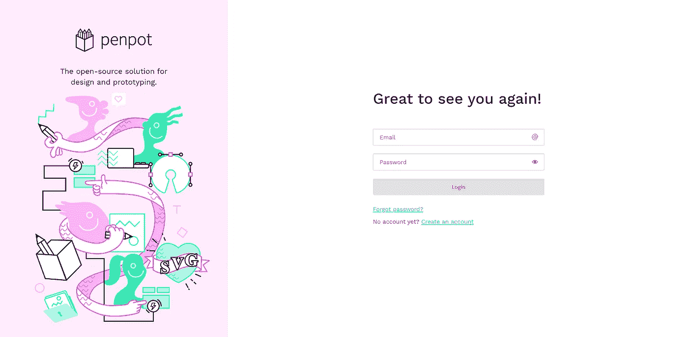

# 使用 Docker 部署免费的 Figma 替代笔筒

> 原文：<https://betterprogramming.pub/deploy-free-figma-alternative-penpot-with-docker-9caf94c11030>

## 使用 Docker 在本地部署 PenPot，或者使用 Traefik 和 SSL 远程部署 pen pot，以取代 Figma 作为开发中的设计工具。


照片由 [Unsplash](https://unsplash.com/s/photos/figma?utm_source=unsplash&utm_medium=referral&utm_content=creditCopyText) 上的 GuerrillaBuzz Crypto PR 拍摄

我们可能都听说过，Adobe 正以 200 亿美元的天价收购流行的设计工具 [Figma](https://www.figma.com/) 。不幸的是，这种通过收购业务来消除竞争的“策略”在大型科技公司中很常见。

但是，幸运的是，有一个免费的开源设计工具，它也可以做得更好。它的灵感来自 Figma。

# Penpot:免费的开源设计工具

Penpot 是一个开源项目，正在积极开发，对每个人都完全免费。

以下是让 Penpot 变得有趣的一些主要功能:

*   免费开源(当然)。
*   自托管的选项(将在此主要介绍)
*   跨平台
*   使用 SVG 作为本机格式
*   基于网络的
*   具有行业标准特性(灵感来自 Figma)

观看此 Penpot 官方视频，了解 Penpot 的基础知识:

演示钢笔基本用法的介绍视频

Penpot 的一个非常重要的特性是使用 SVG 作为其原生格式，而不是 PNG/JPG，因为它使您能够兼容许多矢量图形编辑工具。

这尤其有用，因为您不会因为被迫使用其他应用程序无法使用的专有文件格式而受到限制。

此外，Penpot 旨在使用已经存在的绝对最好的开放标准。Penpot 的首席执行官 Pablo Ruiz-Múzquiz 提到了更多信息:

> “如果您在存储级别使用 SVG(开放标准、web、移动等),您可以突然将所有 Penpot 设计与您的代码库集成在一起。多亏了 SVG，而不是另一种封闭的格式，您可以对设计本身的实际表示进行修改。这为设计师和开发者打开了巨大的机会之门。此外，SVG 意味着我们是免费的低代码准备。
> 
> 你可以选择 Penpot 中的任何元素，并要求它的 SVG(和 CSS)表示，知道它实际上是什么，没有翻译。这在设计师和开发人员之间带来了更值得信赖的关系，并允许前端开发人员尝试他们的设计技能。"

如前所述，Penpot 的一个非常重要的特性是能够在本地机器和任何服务器(运行 Docker)上的 Docker 容器中自托管它。以下步骤将向您展示如何轻松地使用 Docker 来托管您自己的钢笔，以取代 Figma 作为您的设计工具。

*如果你想在将 Penpot 安装为自托管版本之前对其进行测试，可以前往 https://design.penpot.app/*[](https://design.penpot.app/)**用 GitHub/Gitlab/Google 账号登录或者新建一个账号进行测试。但是我会避免这样做和分享你的个人数据，因为在本地部署它会非常快(如果你已经安装了 Docker)。**

# *使用 Docker 在本地部署 Penpot*

## *安装 Docker*

*   *要在本地(或远程)部署 Penpot，您需要安装 Docker。*
*   *要在你的系统上安装 Docker，请遵循 docker.com 官方教程。*
*   *如果您使用的是 Windows 并且不允许安装 Docker Desktop，您可以遵循以下[指南](https://www.paulsblog.dev/how-to-install-docker-without-docker-desktop-on-windows/):*

*[](https://www.paulsblog.dev/how-to-install-docker-without-docker-desktop-on-windows/) [## 如何在 Windows 上不用 Docker 桌面安装 Docker

### 此外，学习如何使用 Portainer 作为 Docker 桌面的替代 Docker GUI。作为一个从 Linux 转行的开发者…

www.paulsblog.dev](https://www.paulsblog.dev/how-to-install-docker-without-docker-desktop-on-windows/) 

# 部署钢笔

如果安装了 Docker，那么在本地启动一个 Penpot 实例是非常容易的。为此，您可以通过下载从官方 Penpot Github 项目中检索最新的 Compose 和 config 文件:

GitHub 项目的配置文件相当大，包含了几个在本地使用 Penpot 时永远不会用到的变量。使用以下配置就足够了，因为它只包含强制值:

现在您已经下载(或创建)了这两个文件，切换到该文件夹并使用以下命令启动 Docker 服务:

如果过程完成，您可以打开`[http://localhost:9001](http://localhost:9001/)`。如果 Penpot 安装正确，您将看到以下屏幕:



使用 Docker 将 Penpot 部署到本地主机后的登录屏幕

# 创建一个钢笔用户

尽管您在本地计算机上部署了 Penpot，但您不能使用 web 界面创建用户，因为您启动 Penpot 时没有配置 SMTP 帐户来接收注册电子邮件。但是，这没有问题，因为您可以简单地使用 Docker 命令来手动创建一个已经激活的用户:

**重要提示:**检查`penpot-penpot-backend-1`是否是您的后端容器的正确名称。您可以通过执行`docker ps`来做到这一点。

执行该命令后，您可能会得到以下令人困惑的输出:

忽略一切，只需输入您想在本地安装中使用的电子邮件，然后设置您的名称和密码。生成的日志将如下所示:

创建您的用户后，您可以在`[http://localhost:9001/](http://localhost:9001/)`登录您的 Penpot 安装并开始使用 Penpot。

# 使用 Docker 和 Traefik 远程部署 Penpot

如果您是唯一使用 Penpot 的人，那么在本地安装一个正在运行的 Penpot 会非常有用。通常，您将在团队中工作，在团队中，多名设计师、开发人员或其他人一起协作完成不同的设计。要使用 Penpot 实现这一点，您可以使用 Docker 和 Traefik 在任何服务器上部署 Penpot。

## 安装 Traefik

要在您的服务器上安装 Traefik 并使用它将 URL 转发到 Docker 服务并自动分配 SSL 证书，您可以遵循此[指南](https://www.knulst.de/how-to-setup-traefik-with-automatic-letsencrypt-certificate-resolver/)。

请记住，您至少需要一个 URL 指向运行 Traefik 实例的服务器。如果您没有任何 URL，您必须购买一个并将其映射到您的 sesrver。

## 更新配置

在具有特定 URL 的服务器上部署 Penpot(多个用户可以一起工作)需要对前面显示的配置文件进行一些更改，因为应该启用注册过程。因此，您必须添加一个电子邮件帐户，Penpot 将使用该帐户发送注册电子邮件。一个简单的谷歌/GMX/苹果邮件账户就足够了。

将`PENPOT_REGISTRATION_ENABLED`环境变量改为 true，并将以下变量(具有正确的值)添加到配置文件中:

这里的一个重要设置是`PENPOT_REGISTRATION_DOMAIN_WHITELIST=""`，你可以添加一个逗号分隔的允许注册的电子邮件域列表。如果留空，则允许所有域。在 Github 上找到完整的配置。

## 调整 Traefik 使用的合成文件

更新配置文件后，您需要更新合成文件并添加 Traefik 网络和标签，以便在部署 Penpot 后自动生成 SSL 证书。将以下合成文件的内容复制到您的文件中:

## 部署钢笔

在您可以部署 Docker 服务并与您的同事/朋友一起使用 Penpot 之前，您必须设置您的 URL。这必须与您在配置中使用的 URL 相同(没有 HTTPS)。此外，网址必须指向您的服务器！

现在，切换到您的文件夹，使用以下命令部署您的 Penpot 服务:

切换到您的 URL，并注册一个新用户。你应该从 Penpot 那里收到一封电子邮件，并且可以和你的同事一起使用。

请记住，您仍然可以通过在配置中设置适当的环境变量并重新部署服务器来停用注册。如果这样做，您可以通过执行以下命令并手动设置用户名/密码来创建新用户。代码如下:

有了这种方法，你就不需要电子邮件帐户，仍然可以和其他人一起工作。

# 结束语

恭喜你！如果您遵循我的方法，您只需在您的本地机器或服务器上安装 Penpot 作为您自己的 Figma 替代品，供合作者使用。

远程部署的完整合成文件(和配置)可以在我为本文创建的 GitHub Gist 中找到[。](https://gist.github.com/paulknulst/18829ae330bf6fcd3917aee7ff4a3b7d)

本教程到此结束。希望您现在能够设置您的个人安装。如果你仍然对设置 Penpot 作为 Figma 的替代有疑问，你可以在评论区提问。

此外，如果你喜欢阅读这篇文章，考虑评论你的宝贵想法！我很乐意听到你对我的教程或钢笔的反馈。

```
**Want to Connect?**This post was initially published on my blog: [https://www.paulsblog.dev/deploy-free-figma-alternative-penpot-with-docker/](https://www.paulsblog.dev/deploy-free-figma-alternative-penpot-with-docker/)Feel free to connect with me on [my personal blog](https://www.paulsblog.dev), [LinkedIn](https://www.linkedin.com/in/paulknulst/), [Twitter](https://twitter.com/paulknulst), and [GitHub](https://github.com/paulknulst).
```