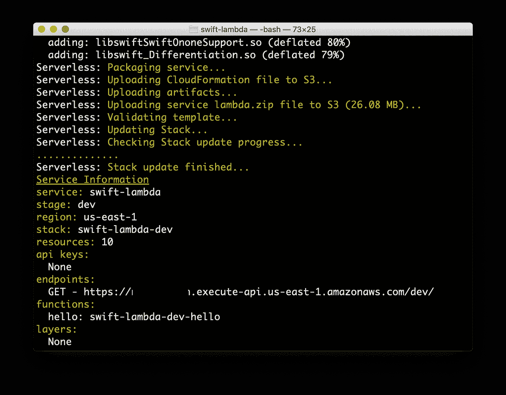
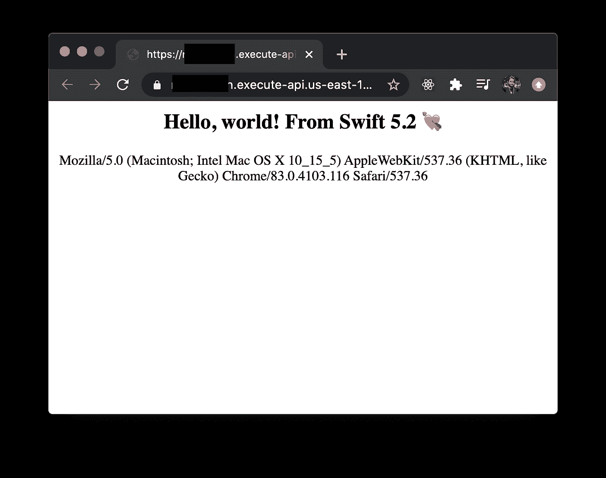

# 在几秒钟内将 Swift 编写的 HTTP 服务部署到 AWS

> 原文：<https://betterprogramming.pub/deploy-http-services-written-in-swift-to-aws-in-seconds-d9933206746a>

## 苹果新的 Swift AWS Lambda 运行时

[Adrien Converse](https://unsplash.com/@lurm?utm_source=unsplash&utm_medium=referral&utm_content=creditCopyText) 在 [Unsplash](https://unsplash.com/s/photos/patterns?utm_source=unsplash&utm_medium=referral&utm_content=creditCopyText) 上拍照

最近苹果公布了 [Swift AWS Lambda 运行时](https://swift.org/blog/aws-lambda-runtime/)。现在可以使用与 iOS 开发相同的 Swift 编写在 AWS 上运行的自包含函数。这不仅让您可以重用您已经拥有的 Swift 知识，还可以在服务器和客户端之间共享代码。

然而，设置起来还是有点复杂。为了帮助您更快入门，我构建了一个用于在 Swift 中编写 HTTP 服务的[起点，它在一个脚本中完成您需要的一切。](https://github.com/GetStream/swift-lambda)

Swift Lambda 包含配置文件和脚本，使用[无服务器框架](https://www.serverless.com/)在几秒钟内完全自动部署到 AWS。它基于来自[swift-server/swift-AWS-lambda-runtime](https://github.com/swift-server/swift-aws-lambda-runtime)的样本和文档。

# 入门指南

1.  克隆存储库:[https://github.com/GetStream/swift-lambda](https://github.com/GetStream/swift-lambda)
2.  [安装对接器](https://docs.docker.com/docker-for-mac/install/)
3.  [安装无服务器框架](https://www.serverless.com/framework/docs/getting-started/)
4.  [配置 AWS 凭证](https://www.serverless.com/framework/docs/providers/aws/guide/credentials/)
5.  在`Sources/Lambda/main.swift`中编写您的代码
6.  通过运行`./Scripts/deploy.sh`进行部署
7.  在浏览器中打开输出 URL:

# 编写代码

在`Sources/Lambda/main.swift`文件中已经有一些代码了。它只是简单地输出“你好，世界！”以纯文本格式。

如果你想输出一些 HTML，只需将`Content-Type`头设置为`text/html; charset=UTF-8`:

有关可用设置和方法的更多信息，请参考 [Swift AWS Lambda 运行时自述文件](https://github.com/swift-server/swift-aws-lambda-runtime)。

# 配置端点

要改变 HTTP 端点的一些特性，比如期望的方法，您应该修改`[serverless.yml](https://github.com/GetStream/swift-lambda/blob/main/serverless.yml#L70-L72)`文件。有关可用参数的更多信息，请参考 [Serverless.yml 参考](https://www.serverless.com/framework/docs/providers/aws/guide/serverless.yml/)

# 贡献的

如果您有建议或错误报告，请[在 Swift Lambda 存储库](https://github.com/GetStream/swift-lambda/issues/new)中提交问题。如果你想尝试贡献代码，不要犹豫提交一份简历。喜欢的话别忘了留个星！