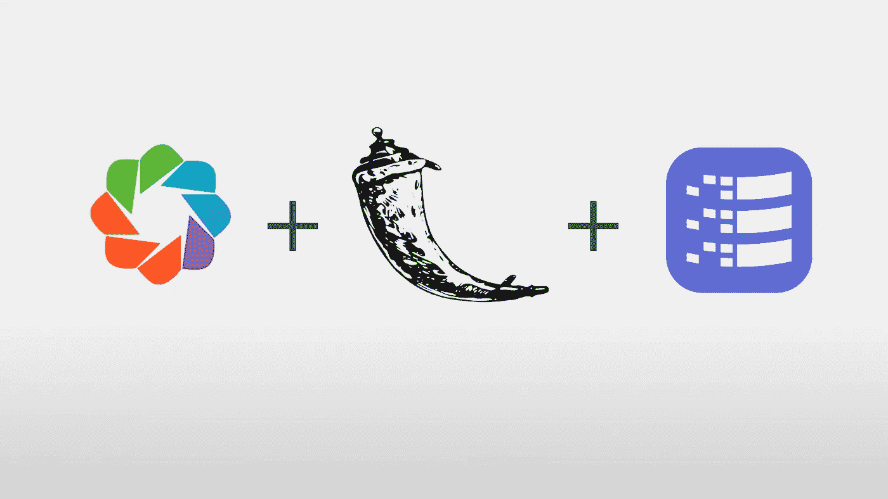
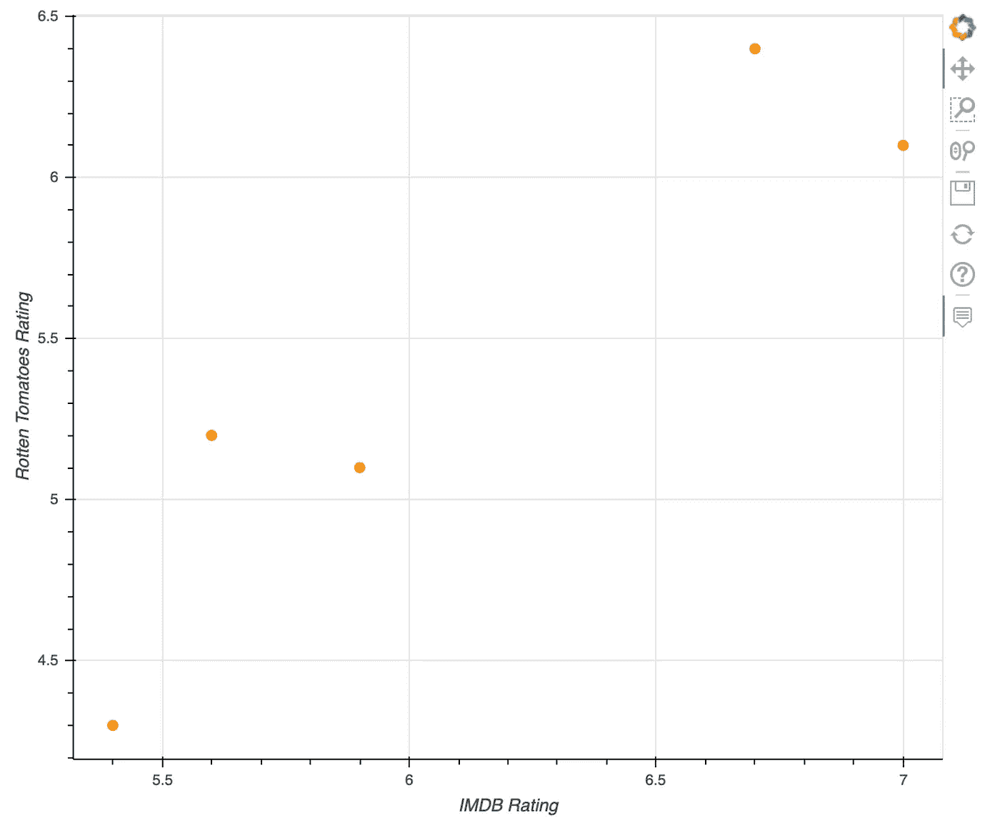
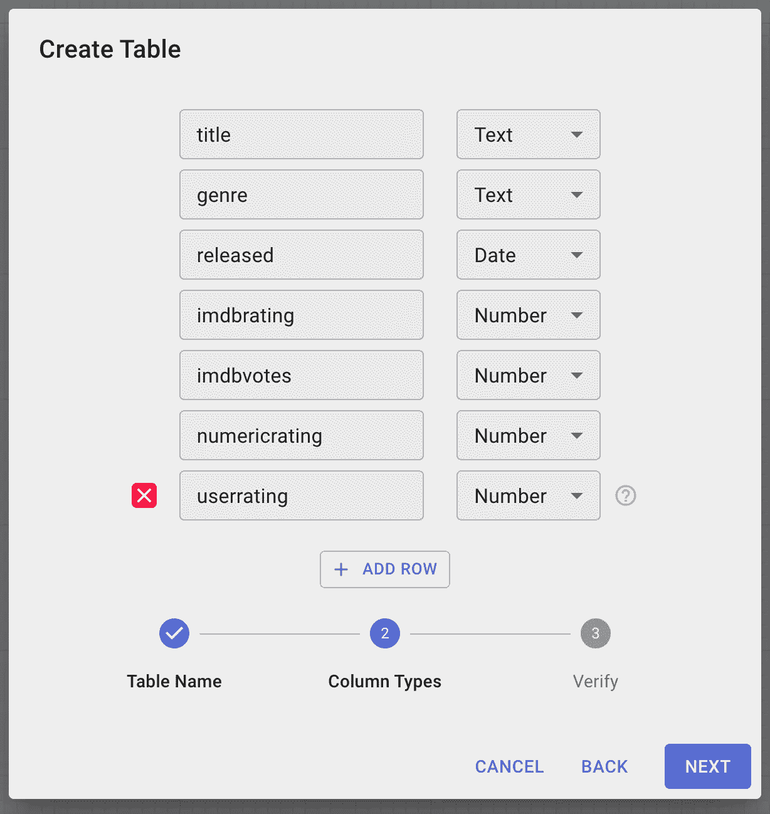
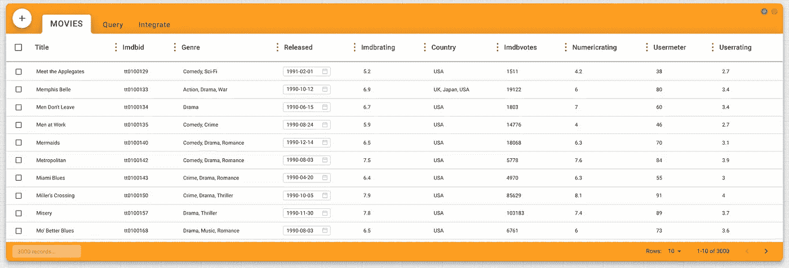
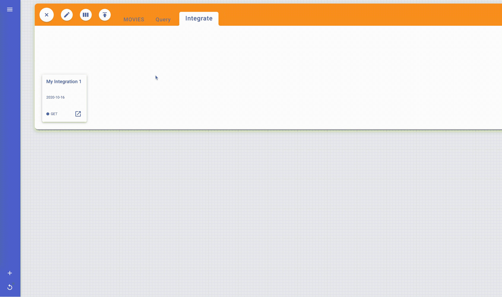
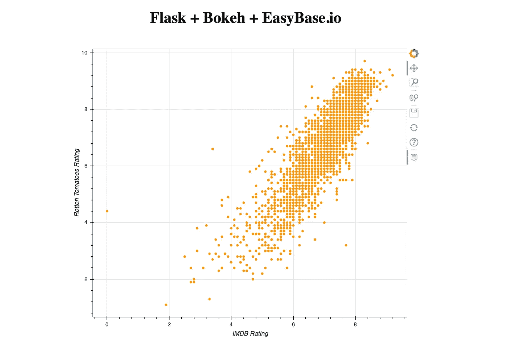
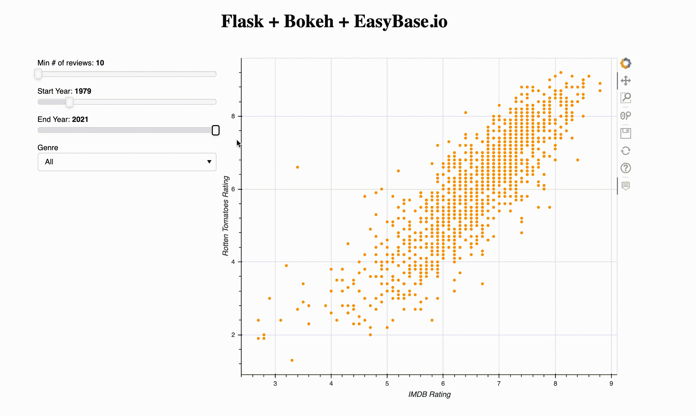

# 使用散景在 Flask 上部署交互式实时数据可视化

> 原文：<https://betterprogramming.pub/deploy-interactive-real-time-data-visualizations-on-flask-with-bokeh-311239273838>

## 更好的数据可视化



图片来源:作者

Python 对函数式分析工具有极好的支持，包括 NumPy、SciPy、pandas、Dask、Scikit-Learn、OpenCV 等等。在 Python 的各种数据可视化库中， [Bokeh](https://bokeh.org/) 是功能最强大的。该库支持覆盖许多常见用例的一些接口。

Bokeh 的一个很棒的特性是能够将图片导出为原始的 HTML 和 JavaScript。这允许我们将编程创建的图形注入到一个 [Flask](https://flask.palletsprojects.com/en/1.1.x/) 应用程序的模板中。当用户连接到您的 Flask web 应用程序时，散景图像会实时创建并嵌入到提供的 HTML 中。

对于我们的例子，我们将为电影数据创建一个交互式浏览器。我们的项目将以 UI 小部件(滑块，菜单)为特色，当改变时，更新显示的数据。

我们将涵盖:

1.  如何创建具有五个数据点的交互式散景图
2.  集成一个包含 3000 个数据点的免费云数据库( [Easybase.io](http://easybase.io) )
3.  如何将散景图注入烧瓶模板
4.  使用 JavaScript 回调(`[CustomJS](https://docs.bokeh.org/en/latest/docs/user_guide/interaction/callbacks.html)`)添加散景小部件来查询数据

# 第一部分

第一步是执行`pip install bokeh`和`pip install Flask`，将散景库和 Flask 库安装到 Python 实例中。创建一个名为`app.py`的文件，从下面的代码开始:

变量`source`用于以散景元素标准化的方式表示数据。我们将把我们的数据传递给那个对象，这个对象被提供给散景图。它被构造成一个对象，将键映射到一个值数组。稍后我们将看到如何使用`CustomJS`直接访问和操作它。

接下来，`fig`表示散景视觉组件。`tooltips`参数设置当您将鼠标悬停在可视化中的某个点上时，显示框中显示的内容。该数组的元组被构造为`("NAME TO DISPLAY", "@COLUMN_NAME_IN_SOURCE"`。要编辑图形上单个点的大小，您可以编辑`fig.circle()`中的尺寸参数。保持`x`、`y`和`color`参数不变，因为我们将在后面看到如何有条件地改变这些参数。

`axis_label`变量控制可视化的 X 轴和 Y 轴上显示的内容。在我们的例子中，X 轴将测量电影的 IMDB 评级，Y 轴将测量烂番茄评级。我们稍后会看到(显然)两者之间存在正相关关系。

现在，我们可以实现以下代码，将一些数据传递到我们的图形中，并在浏览器中显示它:

在第二部分之前，我们将使用一个由五个示例词典组成的数组，这些词典包含各种与电影相关的属性。我们最终将从 EasyBase 检索 3000 条实时记录。

在`source.data`中设置的属性是散景的参考，即一个元素应该在图形中的什么位置显示，以及它应该如何显示。如前所述，这个变量的结构是一个将所有属性映射到相应数组的字典。出于这个原因，我们使用内联数组构造语法从数据中获取每个属性并将其放入数组中。

我们可以看到这些元素在我们的散景图中的使用位置:`x`、`y`和`color`被传递到`fig.circle()`方法中，`title`、`genre`、*、*被传递到工具提示中(我们将在后面使用`released`、`imdbvotes`和`genre`)。随意改变每个数组中的值。例如，如果你想让点的颜色符合它的类型，`color = ["#FF9900" for d in currMovies]`就是你要做的，或者`color = ["#008800" if d['genre'] == "drama" else "#FF9900" for d in curMovies]`。

最后，`output_file`指向您想要保存您的后期图形的位置。`show(fig)`将图形保存在该位置，并在浏览器中打开。

运行该文件，您将看到:



还不太令人兴奋，但是你可以将鼠标悬停在任何一点上来获得关于这部电影的具体信息，就像在`tooltips`中设定的那样。此外，尝试在这个 UI 上平移和缩放。这个功能以后会派上用场。

# 第二部分

这里有一个到一个 [CSV 文件](https://bit.ly/3lXvOnE)的链接，该文件包含 3000 个与我们示例中的属性相同的电影记录。

让我们把我们的记录放在数据库中，这样我们就可以从一个合适的源异步地访问和操作它们。我打算用 [Easybase.io](https://easybase.io) 因为它是免费的，你不用下载任何东西([在这里了解更多](https://easybase.io/about/))。此外，用 CSV 或 JSON 文件填充集合也非常容易。

登录 EasyBase，创建一个至少包含以下各列的表(如果愿意，可以随意添加所有属性):



该表打开后，单击+号并导航至“上传数据”屏幕。


将 CSV 文件拖放到该对话框中。最终的集合将类似于以下内容:



请记住，您可以随时从 EasyBase 下载 CSV 或 JSON 格式的数据，方法是选择“全部”(在+下),然后进入“共享”

去整合→休息→获取。打开新的集成，在 Get 下添加所有的列。保存它，然后打开集成弹出窗口。我的看起来像这样:



请记下您的集成 ID，因为这是我们从 Python 应用程序中检索数据的方式。

# 第三部分

现在让我们把我们的应用程序变成一个烧瓶项目。导航到与`app.py`相同的目录。创建一个名为`templates`的文件夹，并添加一个名为`index.html`的文件。

```
project
├── templates
│   └── index.html
└── app.py
```

让我们看看`app.py`中一个非常简单的 Flask 实现:

在 Mac 上用`export FLASK_APP=app.py && flask run`或者在 Windows 上用`set FLASK_APP=app.py && flask run`运行这个程序将会创建一个本地 web 服务器。在 web 浏览器中导航到`localhost:5000`，应用程序将返回`templates/index.html`的内容。让我们用以下内容填充`index.html`:

这是一个非常简单的 HTML 网页，有四个液体属性:`js_resources`、`css_resources`、`plot_script`和`plot_div`。散景会给我们所有的变量，我们将传递到这四个属性。

首先，我们将把第一部和我们的`app.py`结合起来。让我们从添加所有正确的导入开始:

在调用`return render_template("index.html")`之前，将**第一部分**中的代码添加到`index()`方法中。

我将用一个对 EasyBase 的`get()`调用来替换我们的硬编码电影数组。如果您没有安装 EasyBase Python 库，请快速执行`pip install easybase-python`。我用以下方法替换第一部分中的数组:

`get()`的第一个参数是之前的集成 ID，后面是`offset`、`length`和`authentication`。

类似于第一部分，这个方法返回一个字典数组。这些字典具有与以前相同的属性。

在我们的`index()`方法中，我们将修改当前的`return render_template("index.html")`。将该行替换为以下内容:

这是注入到 HTML 模板中的内容的映射。

*   `plot_script`:特定于图形的 JavaScript
*   `plot_div`:包装在< div >标签中的特定于图形的 HTML
*   `js_resources`:一般散景所需的 JavaScript
*   `css_resources`:普通散景所需的 CSS

此时`app.py`会是这样的:

在 Mac 上用`export FLASK_APP=app.py && flask run`或者在 Windows 上用`set FLASK_APP=app.py && flask run`运行这个程序。你在`localhost:5000`的网站应该是这样的:



# 第四部分

所以现在我们有了一个在 Flask 中展示的散景模型。我们的最终目标是添加一些用户可以与之交互来操作数据的 UI 小部件。

我们所有的改变都将在`index()`方法之内。我非常努力地使下面的实现易于扩展。

让我们首先创建一个控件字典:

这里我们有三个滑块和一个下拉菜单。随意编辑或添加任何自定义小部件到这个字典中。

接下来，我们需要实现一个回调，当我们的任何控件发生变化时就会发生回调。这是通过散景的`[CustomJS](https://docs.bokeh.org/en/latest/docs/user_guide/interaction/callbacks.html)`模块完成的。这一部分可能会变得很棘手，但我已经尽我所能把它分解了。我们将从创建回调变量开始:

每次输入发生变化时，都会调用此`code` 函数。它用可访问的参数`source`(原始数据)和`controls`(控制字典)来调用。这个`code`的第一部分检查是否有一个全局 JavaScript 变量调用`full_data_save` *。由于这个函数第一次运行时并不存在，它将对我们的原始数据做一个深层拷贝，并保存到全局变量中。*

从这一点来看，这个变量将不会改变，所以我们总是有一个引用我们的原始数据。接下来，我们创建一个名为`new_data`的新对象，它采用与源数据相同的形式。然后遍历所有原始数据，检查它是否满足控件的值。我们可以看到，控件的值是通过`controls.*control_name*.value`、*、*访问的，类似于通过`CustomJS`参数中的参数访问原始数据。因为我的`released`属性的格式是 MM-DD-YYYY，所以我只使用最后四个字符与`min_year`和`max_year`进行比较(第 17–18 行)。如果一个单独的元素满足所有的定制查询，它将被推送到`new_data` 中，下面一行是:

```
Object.keys(new_data).forEach(key => new_data[key].push(full_data[key][i]));
```

这只是将所有属性从索引`i`处的原始完整数据推送到`new_data`的相应数组中。

遍历完整数据后，将源数据指向新数据。最后，用`source.change.emit()`发出变更。

我试图使其可扩展，所以添加新控件的工作流程如下:

1.  向`controls`字典添加新的小部件。
2.  在`CustomJS`中，在第 15 行的 if 语句中添加自定义条件语句。

最后，为了激活这个回调，我们使用一个循环来分配所有。

最后一步是将我们的控件添加到一个`[layout](https://docs.bokeh.org/en/latest/docs/user_guide/layout.html)`中。将我们之前的`script, div = components(fig)`替换为以下内容:

这创建了一列名为`input_controls`的控件，后面是一行`input_controls`和我们的图形。现在，我们将该行传递给`components()`方法，而不仅仅是数字。

让我们运行 Flask 应用程序:



# 结论

我们的应用程序已经成功地将一个交互式的散景图与定制的 JavaScript 回调函数集成在一起。回调在我们的任何控件被编辑时运行，并允许来自多个源的交互式查询。Python 使用`easybase-python`包从 Easybase.io 中提取了数千条实时记录，这些技术都在本地 Flask 实例上成功运行。

接下来，我们将为用户添加一个从 Flask 应用程序向数据库添加数据的路径。我们的散景图像会实时更新。

感谢阅读！如有任何问题，请随时回复。

下面我添加了`app.py`的完整源代码:

*你建了，他们就来了。*