# 如何使用 LetsEncrypt SSL 在 AWS EC2 上安全部署 MERN 堆栈应用程序

> 原文：<https://betterprogramming.pub/deploy-mern-stack-app-on-aws-ec2-with-letsencrypt-ssl-8f463c01502a>

## 立即推送您的应用程序(2021 年 12 月更新)


照片由[哈里森·坎德林](https://www.pexels.com/@harrison-candlin-1279336?utm_content=attributionCopyText&utm_medium=referral&utm_source=pexels)从[佩克斯](https://www.pexels.com/photo/new-zealand-topography-from-above-2441454/?utm_content=attributionCopyText&utm_medium=referral&utm_source=pexels)拍摄

首先，我要说的是，我写这篇文章的主要原因之一是，每当我必须部署一个 MERN 应用程序时，我都有一个基本的蓝图可以遵循。我把所有的步骤都集中在一个地方，这样我就可以随时方便地查阅，因为所有这些信息花了我太长时间来收集和拼凑。我想如果我把它公之于众，可能也会对其他人有所帮助。(请注意:我知道本指南绝不是部署 MERN 堆栈应用程序的完美指南，但这是一个适合我的指南。)

在我们开始之前，请系紧你们的安全带，因为这将是一次长途旅行。如果中途出了什么问题，请永远记住:

> “不要害怕失败。犯罪的不是失败，而是目标低。在伟大的尝试中，即使失败也是光荣的。”——李小龙

再试一次。

现在，首先根据下面的内容创建一个 EC2 实例。

首先，选择 Ubuntu 18.04 LTS，并选择免费层。

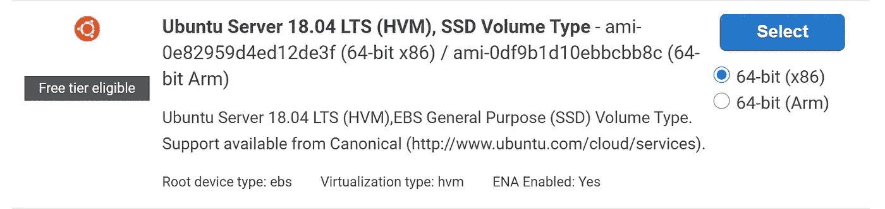

其次，在上面选择的实例的安全组设置中创建以下条目。

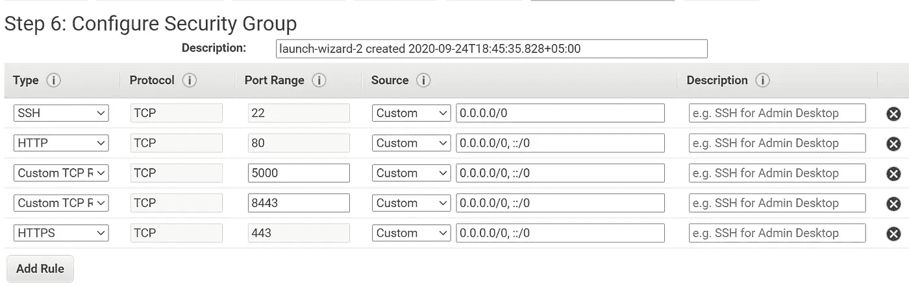

第三，创建一个安全密钥对，并下载如图所示的`.pem`文件。

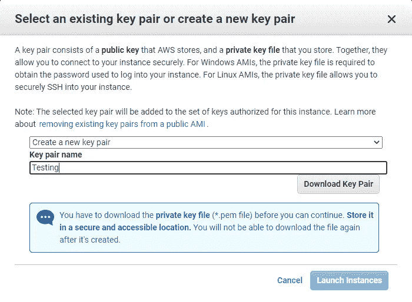

最后，保留 AWS 建议的所有内容，并启动实例。

按照 AWS 在 Mac 上的建议，使用 SSH 连接到实例，或者如果您是 Windows 用户，那么按照 AWS 指南中关于如何使用 Putty 连接到实例的说明，如该链接中所述。
[https://docs . AWS . Amazon . com/AWS ec2/latest/user guide/putty . html？icmpid=docs_ec2_console](https://docs.aws.amazon.com/AWSEC2/latest/UserGuide/putty.html?icmpid=docs_ec2_console)

连接后，您需要在实例上设置以下内容列表，以便应用程序运行。

1.  [Node.js](https://nodejs.org/en/) 和 [npm](https://www.npmjs.com/)
2.  代码设置( [git](https://git-scm.com/) 或 FTP)
3.  网络服务器( [nginx](https://www.nginx.com/) )
4.  数据库( [MongoDB](https://www.mongodb.com/) )
5.  流程经理( [PM2](https://pm2.keymetrics.io/)

以上都是在 AWS 上运行 MERN 应用程序所必需的。从现在开始，它将使用大量命令来设置所有这些东西。我会尽量保持简单。

# 节点和国家预防机制

为了安装 Node 12 和 npm 6，我们需要更新和升级实例 APT 存储库。

## **第一步。**

作为一种规范，我们致力于更新系统，以确保我们没有依赖问题。

```
sudo apt updatesudo apt -y upgrade
```

## **第二步。**

Node 的所有版本都来自官方的 APT 库。但是，这需要手动添加到您的系统中。

```
sudo apt update
sudo apt -y install curl dirmngr apt-transport-https lsb-release ca-certificates
curl -sL https://deb.nodesource.com/setup_14.x | sudo -E bash -
```

## **第三步。**

已添加节点存储库。现在安装它。

```
sudo apt -y install nodejs
```

您也可以安装用于构建本地附加组件的开发工具:

```
sudo apt -y  install gcc g++ make
```

通过检查安装的版本来确认节点 12 的安装。

```
$ node --version
v12.10.0

$ npm --version
6.10.3
```

如果一切正常，那么您已经成功安装了节点和 NPM。

# 代码设置(git 或 FTP)

在设置 web 服务器之前，您需要在服务器上有项目代码，以便可以在实例上运行它。有两种方法可以做到这一点:通过连接 FTP，如底部的附加材料部分所述，或者使用 git。如果您计划使用 FTP，那么您可以完全忽略这一部分，继续设置 nginx。首先，确保项目的文件夹结构如下所示:

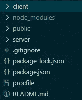

要使用 git，我们必须使用以下命令安装它:

```
sudo apt install git -y
```

使用以下命令确认 git 已安装:

```
git --version
```

现在，使用以下代码克隆您的项目:

```
sudo git clone {{your project file path on github/git}}
```

完成后，导航到项目文件夹:

```
cd /{{your cloned repo’s name}}
```

使用此选项安装服务器依赖项:

```
sudo npm install
```

然后导航到客户端文件夹:

```
cd /client
```

现在，安装客户端依赖项，如下所示:

```
sudo npm install
```

您的`Client`文件夹包含 React 应用程序的源代码。现在，您可以使用以下命令将其编译成优化的包:

```
npm run build
```

**注意:**这将生成一个新的构建文件夹，其中包含您编译的代码。请记住，如果您使用这种方法，那么您必须将 nginx 服务器指向`default.conf`文件配置中的构建文件夹，就像这样:

```
location / {
        root   /home/ubuntu/{{appName}}/client/build;
```

您已在服务器上成功设置了项目代码。

# 网络服务器(nginx)

现在我们需要安装和配置 nginx，设置一个基本的 HTTP 服务器，将它指向一个域，测试它是否工作，为 SSL 创建证书，最后设置 HTTPS。我知道这有很多事情，但一旦完成，你的应用程序应该在你的 HTTPS 域上可见。

## **第一步。**

我们需要安装 nginx web 服务器:

```
sudo apt install nginx
```

要启动 Nginx 服务器，请使用以下命令:

```
sudo service nginx start
```

此外，如果您想检查 Nginx 服务器的状态，请使用以下命令:

```
sudo service nginx status
```

如果需要停止或重启 nginx 服务器，那么使用以下命令。(注意:现在没有必要这样做。)

```
sudo service nginx stop
sudo service nginx restart
```

## 第二步。

我们必须为它设置 nginx 配置来运行我们的应用程序。

为此，我们将在这些位置制作或编辑两个 nginx 配置文件。

*   `/etc/nginx/nginx.conf`
*   `/etc/nginx/conf.d/default.conf`

首先，导航到`nginx`文件夹:

```
cd /etc/nginx
```

要编辑这些文件，我们需要 root 用户访问权限，因为这些是系统文件。

首先，我们将编辑`nginx.conf` 文件。

```
sudo vi nginx.conf
```

这将在 [Vim](https://www.vim.org/) 编辑器中打开文件。要开始编辑该文件，请按**I "**进入插入模式，然后删除其所有内容，并确保没有括号随机留在任何地方；否则 nginx 无法工作。然后将下面的代码片段粘贴到文件中。****

****要退出插入模式，请按 Escape 键，要保存，请键入“:wq”在保存文件后应该会退出。这将为 nginx 服务器设置一些基本的设置。如果你想更详细地了解它们，那么你必须一条一条地用谷歌搜索——我不会解释它们，因为那样的话这将是一篇永无止境的文章。****

****完成后，导航到`conf.d`文件夹:****

```
**cd /etc/nginx/conf.d/**
```

****现在创建并编辑`default.conf` 文件。****

****我分享这个片段是为了让 nginx 快速建立一个 web 服务器，并测试它是否工作。一旦我们有了一个运行在 HTTP 上的服务器，我们就可以进入为 HTTPS 协议设置 SSL 的细节了。****

****在上面的代码片段中有一些事情需要注意。****

****首先，如果你有一个域名，请在这里编辑它:代替 yourdomain.com，添加你自己的域名，像这样:****

```
**server_name  abc.com www.abc.com;**
```

****其次，这些行定义了 nginx 服务器在服务器上显示主索引文件的位置。因此，您需要将构建/编译的 React 应用程序放在部署文件夹中。(注意:默认情况下，这些文件夹不存在。您需要创建它们，要么通过终端，要么在连接后使用 FTP，如本文结尾的附加内容部分所述。)****

```
**location / {
        root   /home/ubuntu/{{appName}}/client/deployed;**
```

****现在，您可以转到 AWS 管理面板，使用该实例的公共 IP 地址来查看该实例是否在 HTTP 中运行您部署的应用程序。****

## ****第三步。****

****如果您尝试点击您在配置文件中设置的域名，您会发现它不会显示您部署的应用程序，这是理所当然的，因为您还没有将您的域指向您的实例的 IP 地址。以下是你如何在 GoDaddy 管理面板中做到这一点。****

****1.登录后，转到 My Domains，选择您想要附加到 EC2 实例的域，然后单击这三个点。****

****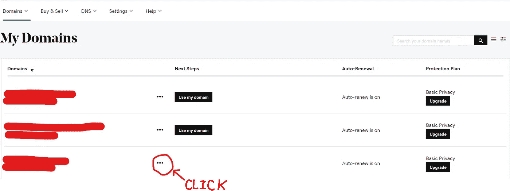****

****2.在选项中选择管理 DNS。****

****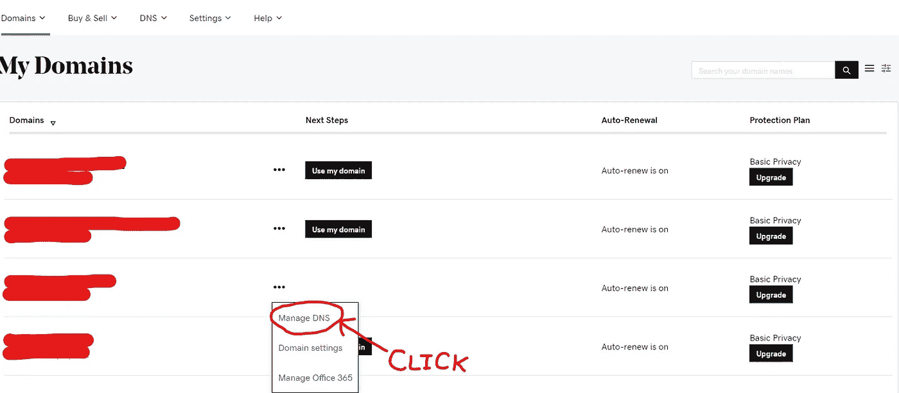****

****3.现在转到“A”条目的铅笔图标，单击编辑它。****

****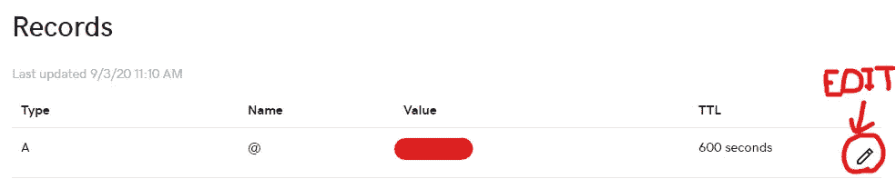****

****4.在“指向”字段中输入 EC2 实例的公共 IP 并保存。****

****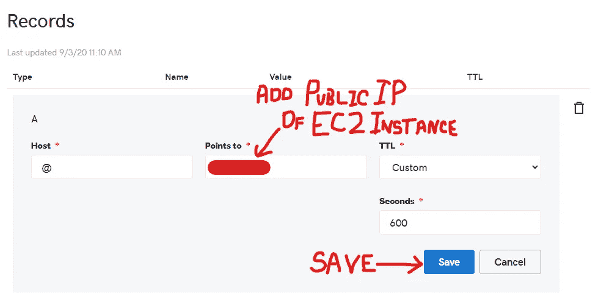****

****应该就是这样了。这将需要几分钟的时间，但现在当任何人在上述域中键入时，它将从输入的 EC2 实例的 IP 地址中提取您部署的服务器，并应该显示您部署的 React 应用程序。****

******(更新:步骤 4 已更改为步骤 4a，因为 certbot-auto 软件包已于 2020 年 12 月弃用。如果您已经在实例上安装了它，那么步骤 4a 将起作用，否则请忽略它，并按照步骤 4b 获取 LetsEncrypt 许可证。之后请继续第五步******

## ****步骤 4a。****

****要为我们的服务器设置免费的 SSL，我们首先需要使用`[certbot-auto](https://certbot.eff.org/docs/install.html?highlight=certbot%20auto#certbot-auto)`为我们的域生成 SSL 证书。为此，请使用以下命令:****

```
**cd /etc**
```

****然后，安装`certbot-auto`并为其提供适当的权限。****

```
**sudo wget [https://dl.eff.org/certbot-auto](https://dl.eff.org/certbot-auto)
sudo chmod a+x certbot-auto**
```

****现在，使用以下命令安装它****

```
**sudo ./certbot-auto certonly**
```

****一旦您开始该过程，它将询问您有关安装后创建证书的问题。第一个大概是这样的:****

****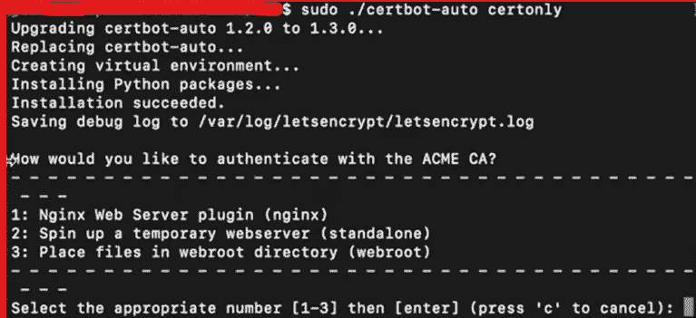****

****键入“1”并回车使用 nginx 插件。****

****第二个大概是这样的:****

****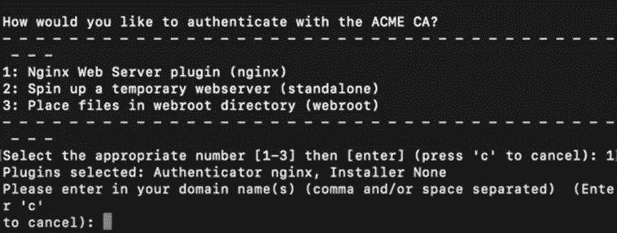****

****添加您的域名，用空格隔开，就像这样:abc.com www.abc.com。如果将来要使用 www 进行重定向，请使用两个域名(一个带 www，另一个不带 www)。****

****然后，它会询问您的电子邮件地址，以便在该证书即将到期时通知您。之后，还有两个是非问题，我可以找到截图。用“是”来接受这两者那么您应该已经创建了您的证书。它会显示它们在系统中的位置，就像这样:****

****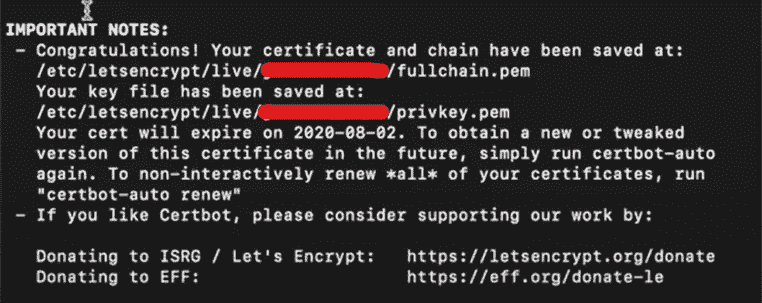****

****请注意，上图中的红线将带有您的域名，例如，abc.com。****

****恭喜你！您已经成功地为您的域创建了有效期为三个月的 SSL 证书。现在你只需要把它们连接到服务器上。****

## ****步骤 4b。****

******(注:如果您能够遵循步骤 4a 并已获得证书。请忽略此步骤。)******

****要为我们的服务器设置免费的 SSL，我们首先需要使用`[certbot](https://certbot.eff.org/docs/install.html?highlight=certbot%20auto#certbot-auto)`为我们的域生成 SSL 证书。以下说明也可在官方网站上获得。以下是链接。
[https://certbot.eff.org/lets-encrypt/ubuntubionic-nginx](https://certbot.eff.org/lets-encrypt/ubuntubionic-nginx)****

****因此，请使用以下命令来安装 Snapd****

```
**sudo apt install snapd**
```

****然后，确保您的 Snapd 是最新的****

```
**sudo snap install core; sudo snap refresh core**
```

****现在使用 Snapd 安装 Certbot****

```
**sudo snap install --classic certbot**
```

****准备 Certbot 命令以便能够在机器上运行****

```
**sudo ln -s /snap/bin/certbot /usr/bin/certbot**
```

****因为我们正在自己修改 nginx 配置，所以我们将使用下面的命令来获取证书****

```
**sudo certbot certonly --nginx**
```

****一旦开始这个过程，它将自动检测在 nginx 部分的 default.conf 文件中定义的服务器名称，并让您像这样选择它们:****

****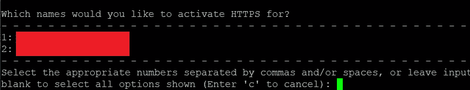****

****然后，它会询问您的电子邮件地址，以便在该证书即将到期时通知您。之后，还有两个是非问题，我可以找到截图。用“是”来接受这两者那么您应该已经创建了您的证书。它会显示它们在系统中的位置，就像这样:****

********

****请注意，上图中的红线将带有您的域名，例如，abc.com。****

****恭喜你！您已经成功地为您的域创建了有效期为三个月的 SSL 证书。现在你只需要把它们连接到服务器上。****

## ****第五步。****

****使用 SSL 证书连接到服务器分为两个部分。首先，您必须通过在`/etc/nginx/conf.d`位置编辑`default.conf`文件来为它创建一个 nginx 配置。使用下面的代码片段允许 nginx 访问 SSL 证书。****

****现在，您必须用 Node 创建一个 HTTPS 服务器，并允许它读取您创建的证书。检查下面的代码片段，并相应地调整您的`server/index.js`文件。(注意:这只有在您已经在服务器上设置了代码的情况下才有可能。)****

****您可能需要更改对`letsencrypt`的文件和文件夹的访问权限，以允许访问节点文件系统。查看最后的参考资料部分，了解如何做到这一点。****

## ****附加步骤****

****这一步不是上述指南的一部分，但是它将帮助任何想在 nginx 中设置 HTTP 到 HTTPS 的重定向的人。****

****要设置 HTTPS 重定向，请在`default.conf`文件的顶部添加下面的代码片段。****

```
**server {
    listen 80;
    listen [::]:80;
    server_name [yourdomain](https://digikampus.com$request_uri).com [www.](http://www.digikampus.com)[yourdomain](https://digikampus.com$request_uri)[.com](http://www.digikampus.com); 
    return 301 [https://www.yourdomain.com$request_uri](https://digikampus.com$request_uri);
}**
```

****如果您也想将其重定向到 www，请在 HTTPS 块的顶部添加以下内容:****

```
**server {
    server_name yourdomain.com; 
    return 301 [$scheme://www.yourdomain.com$request_uri](https://digikampus.com$request_uri);
}**
```

# ****Mongo 数据库****

****为您的 MERN 堆栈应用程序设置 MongoDB 有不同的方法。最简单的方法是在 MongoDB 亚多拉斯上托管一个集群，并将其连接到您的应用程序。这里，我们将在 EC2 实例上运行一个简单的 MongoDB 服务，并将其连接到我们的后端。为此，我们必须遵循几个步骤来成功设置 MongoDB。****

## ****第一步。****

****使用以下命令在您的 Ubuntu 机器上添加官方 MongoDB 包存储库的 GPG 密钥:****

```
**wget -qO - https://www.mongodb.org/static/pgp/server-4.2.asc | sudo apt-key add -**
```

## ****第二步。****

****使用以下命令在您的 Ubuntu 机器上添加官方的 MongoDB 包存储库:****

```
**echo "deb [ arch=amd64 ] https://repo.mongodb.org/apt/ubuntu bionic/mongodb-org/4.2 multiverse" | sudo tee /etc/apt/sources.list.d/mongodb-org-4.2.list**
```

## ****第三步。****

****使用以下命令更新 APT 包存储库缓存:****

```
**sudo apt update**
```

## ****第四步。****

****现在，您可以使用以下命令安装 MongoDB 的最新稳定版本(v4.2):****

```
**sudo apt-get install mongodb-org**
```

## ****第五步。****

****安装后，使用以下命令检查 MongoDB 是否安装正确:****

```
**mongod --version
mongo --version**
```

## ****第六步。****

****现在我们必须将 MongoDB 作为一个服务来启动，以便它能够在我们的实例上持续运行。为此，请使用以下命令:****

```
**sudo systemctl enable mongod.service
sudo systemctl start mongod.service**
```

****要检查`mongod`服务的状态，使用以下命令:****

```
**sudo systemctl status mongod.service**
```

****如果您需要停止或重启`mongod`服务，请使用以下命令。(注意:现在没必要这么做。)****

```
**sudo systemctl stop mongod.service
sudo systemctl restart mongod.service**
```

****一旦确认`mongod`正在工作，在服务器中使用下面的代码连接到应用程序的本地实例。****

```
****const** DB = await mongoose.connect(‘mongodb://localhost:27017/databaseName’, {useNewUrlParser: true,useUnifiedTopology: true,});**
```

****这应该理想地将您的应用程序连接到实例的本地 MongoDB。****

# ****PM2(流程经理)****

****为了无限期地运行一个 MERN 应用程序，我们需要在我们的服务器上有一个进程管理器来正确地管理事情。为此，我们将使用 PM2。使用以下命令安装它。****

```
**npm install pm2@latest -g**
```

****要使用 PM2 运行您的服务器，您首先需要导航到服务器文件夹。****

```
**cd /{{appName}}/server**
```

****要使用 PM2 启动服务器，请键入:****

```
**pm2 start index.js --name="App Server"**
```

****这将使用您的`index.js`启动一个进程，该进程的 id 应该为 0。(注意:name 标志是完全可选的，没有它该命令也能正常工作。它只是为您的流程提供一个可读的名称。)****

****要查看正在运行的进程列表，请使用以下命令:****

```
**pm2 list**
```

****它将向您显示所有正在运行的进程的列表，以及它们各自的 id 和名称。如果您必须查看流程的日志，请键入:****

```
**pm2 logs 0**
```

****它应该开始向您显示该过程的日志。****

****如果您想查看流程的完整细节，请使用:****

```
**pm2 show 0**
```

****要停止进程，请使用:****

```
**pm2 stop 0**
```

****有时，您必须删除不再需要的流程。为此，请使用以下内容:****

```
**pm2 delete 0**
```

****恭喜你！您已经使用 SSL 在 AWS EC2 实例上成功部署了 MERN 应用程序。****

# ****附加材料****

****我将在这里添加任何不属于服务器设置过程的内容，比如将实例连接到 [FileZilla](https://filezilla-project.org/) FTP。****

## ****连接文件 Zilla****

****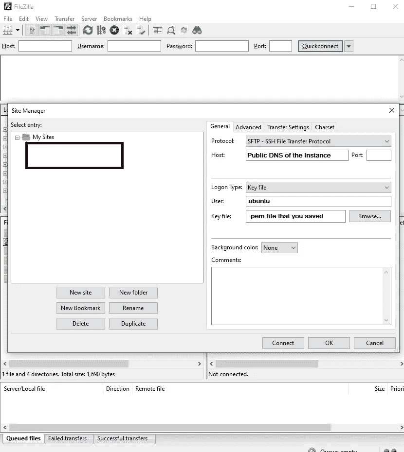****

****只需将主机设置为实例的公共 DNS，将用户设置为 Ubuntu，选择`.pem`密钥文件即可轻松连接到实例并访问其文件系统。****

# ****参考****

****这里有一些有用的链接，让我想出了这个指南。****

****1.阅读以下内容，了解如何更改`letsencrypt`的权限:****

****[](https://stackoverflow.com/questions/48078083/lets-encrypt-ssl-couldnt-start-by-error-eacces-permission-denied-open-et) [## 让我们加密 SSL 无法由“错误:EACCES:权限被拒绝，打开…

### 当您使用 sudo 发布证书时，它们将归 root 所有。因为节点不是作为根运行的，并且…

stackoverflow.com](https://stackoverflow.com/questions/48078083/lets-encrypt-ssl-couldnt-start-by-error-eacces-permission-denied-open-et) 

2.如果你想看整个过程的视频指南，看看这个家伙。他有多个视频解释这个过程。

[](https://www.youtube.com/channel/UCFyXA9x8lpL3EYWeYhj4C4Q/videos) [## 约翰·安

### 一起快乐编码😄

www.youtube.com](https://www.youtube.com/channel/UCFyXA9x8lpL3EYWeYhj4C4Q/videos) 

3.让我们加密底部的快速访问官方链接。

[](https://certbot.eff.org/instructions?ws=nginx&os=ubuntu-18) [## 证书机器人说明

### 和一个带有开口...它托管在一个可选的上，如果您需要，可以通过通配符证书访问它…

certbot.eff.org](https://certbot.eff.org/instructions?ws=nginx&os=ubuntu-18) 

感谢您的阅读。****