# 在虚拟机中部署 React-Node.js 应用程序

> 原文：<https://betterprogramming.pub/deploy-react-node-js-application-in-a-virtual-machine-5b910d6f3aac>

## 在 Ubuntu 中部署全栈应用的分步指南

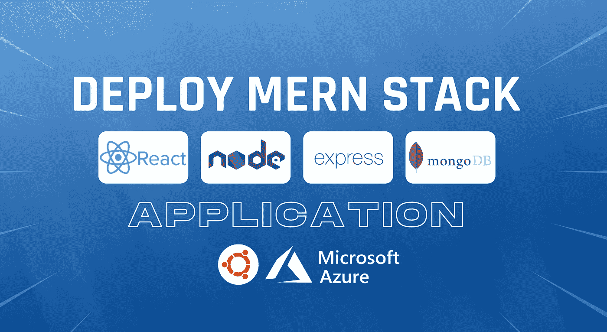

部署 MERN 堆栈应用程序(图片由作者提供)

作为全栈开发者，我们构建新的应用。从头开始制作一个应用程序，设计架构，集思广益，编码，测试和修复 bug，这总是很有趣而且存在的。

因此，下一步，我们需要部署我们的应用程序，使其对公众可用。在大多数情况下，我们在这一点上陷入了困境，因为据我们所知，没有适当的 DevOps 实践。

因此，通过这篇文章，我将带您一步步地部署您的全栈应用程序。此外，我愿意揭示部署应用程序时的最佳实践。

因此，您不仅能获得部署应用的知识，还能获得生产最佳实践、性能和可靠性。

# 部署应用程序的概念

如果你理解它的概念，你可以做任何事情。app 是在 React 还是 Angular 都无所谓。概念将是相同的。因此，在开始部署之前，让我们先了解一下基础知识。

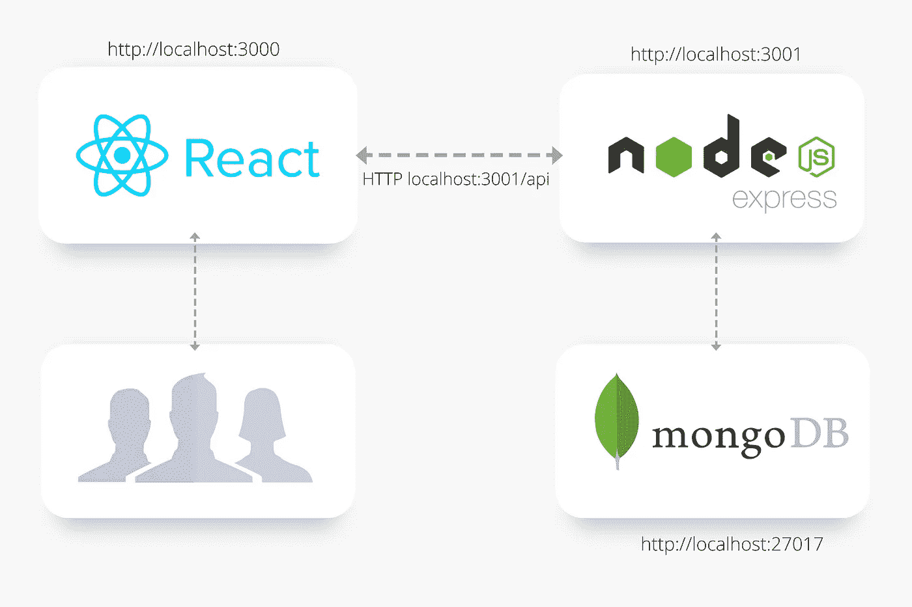

本地开发环境中的 MERN 应用程序(图片由作者提供)

正如我在图中所示，这是一个全栈应用程序在开发环境中通常的样子。

我们用服务于应用程序的地下开发服务器开发 React 应用程序。但是在生产中，我们不使用这个开发服务器。我们创建了一个优化的生产版本，并使用 Nginx 服务器提供服务。

等等！这个 Nginx 是什么？我们不能直接使用我们的后端服务应用程序吗？让我为你澄清这些事情。

著名的 Unix 哲学是“编写做一件事的程序，并把它做好。”虽然我们的 Node express 后端可以提供静态文件，但它并不是为此而专门设计的。但另一方面，Nginx 就像一只小野兽。

Nginx，发音为 **'** engine ex，是一个免费的开源的功能丰富的 web 服务器。此外，它还可以用作反向代理、负载平衡器、邮件代理和 HTTP 缓存。

## **你应该考虑使用 Nginx 的一些原因:**

1.  更好地服务静态内容:它能以闪电般的速度为他们服务，处理器负载最小。它还带有一个内置的 gzip 压缩器。
2.  低内存和资源消耗:这可以处理许多并发用户请求，同时消耗大约 2.5MB 的非常低的内存。这可以更好地利用操作系统和硬件资源。
3.  缓存:这为静态和动态内容提供了缓存。
4.  充当反向代理:它将客户端请求转发到适当的服务器，反之亦然。
5.  充当负载平衡器:这有助于在多个服务器之间分配资源和调度流量，允许非常高效地向外扩展。此外，它可以配置为在同一台服务器上运行多个后端。
6.  错误处理:如果应用程序崩溃，它可以显示正确的错误页面。
7.  实现 SSL/TLS:这允许用 SSL 配置安全 HTTPS 协议。因此网站用户接收和发送的信息将受到保护。加密和压缩是 Node.js 不擅长的两个繁重的计算过程。
8.  安全性:可以防止 DDoS 攻击、IP 黑名单和白名单等。

我希望现在你对 Nginx 有了清晰的认识。让我们讨论一下我们的应用程序在生产环境中是什么样子的。

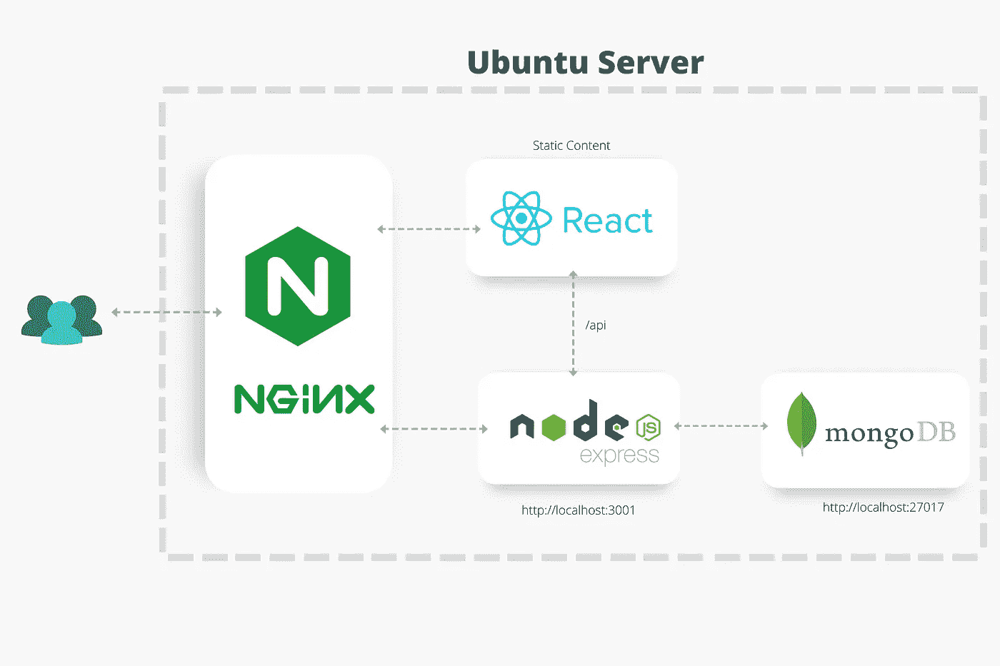

生产环境(图片由作者提供)

如图所示，我为我的虚拟机选择了一个 Ubuntu 实例。在主入口点，Nginx 将处理用户请求并充当反向代理。它将为 React 静态内容提供服务，并将 web 客户端的请求路由到适当的节点流程。

好吧！现在我们已经准备好部署应用程序了。

# 示例应用程序

我为这个演示创建了一个简单的 notes 应用程序。您可以在参考资料部分找到这个应用程序的源代码。

我实现了一些基本的 CRUD 操作，可以添加和删除注释。下面是在我的本地主机上运行的应用程序:

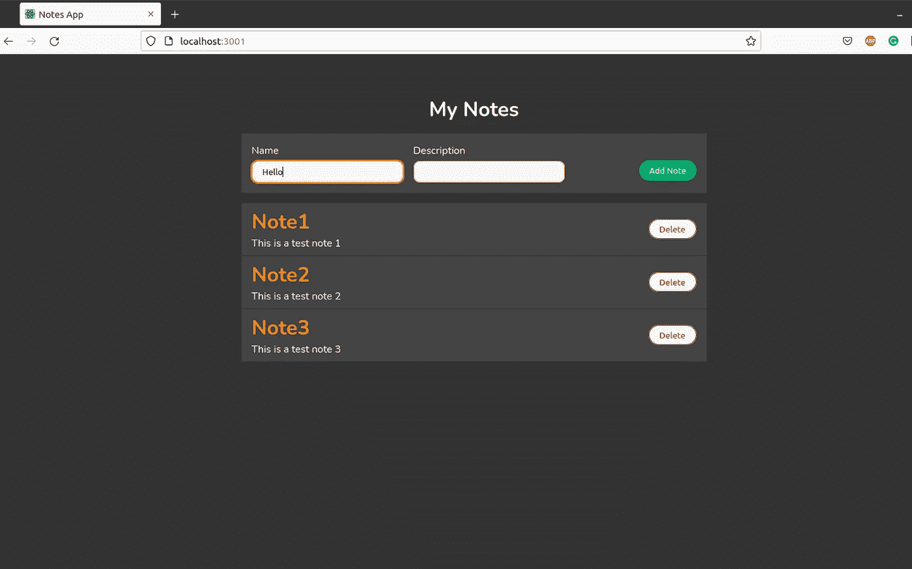

我的笔记应用程序(图片由作者提供)

源代码由服务器和客户端文件夹组成。所有的 React 前端代码都在客户端文件夹中，Node.js 后端代码在服务器文件夹中。

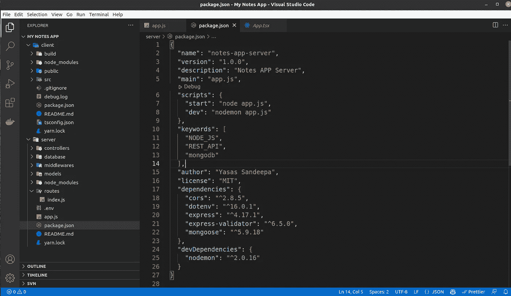

文件夹结构(作者图片)

# 部署应用程序

让我们进入部署应用程序的分步教程。

# 1.代码修改

作为第一步，我们需要对当前工作的应用程序做一些小的代码修改。

## 前端

我们需要更改基本 URL，因为我们的 express 服务器不再可以通过`localhost:3001`访问，我们可以只使用前缀`/api`来访问资源，因为我们从同一台机器上提供服务。

在我的应用程序中，你可以在`src`文件夹中找到`API.ts`文件。在那里，基本 URL 将如下所示:

```
const baseUrl: string = "[http://localhost:3001](http://localhost:3001/api)/api";
```

因此，按如下方式更改基本 URL:

```
const baseUrl: string = "/api";
```

## 后端

在将应用程序投入生产之前，您应该遵循一些最佳实践。

**实现一个记录器**

由于这是一个演示应用程序，我没有特意包括一个日志。但是在部署应用程序之前配置一个日志记录器是非常必要的。你可以使用像温斯顿这样的记录器。有一篇文章用我写的最佳实践解释了 Node.js 日志记录。您可以在参考资料部分找到它。

此外，请记住 Node.js 应用程序在遇到未捕获的异常时会崩溃。因此，请确保正确处理异常。

**取下 CORS**

跨源资源共享是一种允许从不同的域、子域、端口或协议请求资源的机制。但是现代网络浏览器强制执行同源策略作为其安全模型的一部分。所以对于 CORS，我们可以绕过它。

我们使用 CORS 是因为 React 和 Node.js 运行在开发环境中的两个不同的端口上。我们需要从一个源向另一个源请求资源。由于端口不同，浏览器会将它们视为不同的来源。

但是在生产中，我们不需要 CORS 机制来访问资源，因为我们不使用 React 的开发服务器。正如我之前告诉您的，我们可以只使用相对路径(`/api`)来访问端点。所以我们可以移除它。

有些人盲目地认为 CORS 为应用程序提供了安全性。实际上，CORS 就是漏洞。这可能导致您的应用程序容易受到跨域攻击。

作为一个简单的场景，如果攻击者通过删除和添加必要的 CORS 头来创建自己的代理，您的应用程序将容易受到攻击。

此外，CORS 会影响应用程序的性能，因为 CORS 预检请求会产生额外的请求和延迟开销。

如果你更关心安全，我建议你使用头盔包。

## 使用头盔包装保护应用

我希望你们大多数人都知道这个计划。这将创建一个安全层，防止像跨站点脚本(XSS)、点击劫持等攻击。，通过设置各种 HTTP 头。

头盔是 Node Express 应用程序的安全最佳实践。它由 15 个较小的中间件组成，可以单独启用或禁用。

使服务器安全的一些标题是:

*   content-Security-Policy-这表示允许加载哪些动态资源。它可以缓解跨站脚本(XSS)攻击。
*   严格的传输安全—这确保了只能使用 HTTPS 访问网站。
*   Expect-CT —检查证书的滥用。这只影响 HTTPS 连接。
*   Referrer-Policy-定义应该从请求的 referrer 中包含哪些信息。
*   x-内容-类型-选项-通过 [MIME 类型嗅探](https://developer.mozilla.org/en-US/docs/Web/HTTP/Basics_of_HTTP/MIME_types#mime_sniffing)进行保护

我们可以通过使用`npm instal --save helmet`简单地安装头盔，并像这样将其作为中间件来操作，从而将头盔添加到我们的应用程序中:

```
const helmet = require('helmet');
app.use(helmet());
```

因为我打算部署这个应用程序，所以我不会在本文中深入探讨安全问题。有一篇关于 Node.js 安全清单的好文章。如果你对那个领域更感兴趣，你可以在这里阅读[并获得额外的知识。](https://blog.risingstack.com/node-js-security-checklist/)

## 将 Node.js 投入生产

将 Node.js 环境转化为生产环境将优化代码并提高性能。此外，它将删除错误页面中的堆栈跟踪，使您的应用程序更加安全。

您可以使用一个`.env`文件将 Node.js 环境设置为生产环境。(也可以用环境变量来设置这个，简单多了。)

在服务器目录中创建一个`.env`文件，并将以下代码行添加到其中:

```
NODE_ENV = production
```

这些是您在部署应用程序时应该考虑的一些最佳实践。此外，您可以遵循生产指南中的[快速性能最佳实践中提到的步骤。](http://expressjs.com/en/advanced/best-practice-performance.html)

但是大部分都是用 Nginx 处理的。例如，Nginx 默认启用 Gzip 压缩。所以你不需要担心这个。

# 2.创建优化的生产版本

我们需要优化和最小化前端应用程序中的 js 包，以提供更好的用户体验。

运行前端(客户端)文件夹中的`yarn build`或`npm run build`。这将捆绑，缩小和优化所有代码成 HTML，CSS 和 JavaScript 文件，并把它放入`build`文件夹。


创建优化的生产版本(图片由作者提供)

# 3.创建虚拟机

您可以使用 AWS EC2、微软 Azure、GCP 或任何其他服务来创建虚拟机。我在这个演示中使用了微软 Azure。此外，如果你是一名大学生，你可以申请 Azure 学生计划，并获得免费的 100 美元 Azure 信用，而不需要信用卡。([学生用天蓝色](https://azure.microsoft.com/en-us/free/students/))

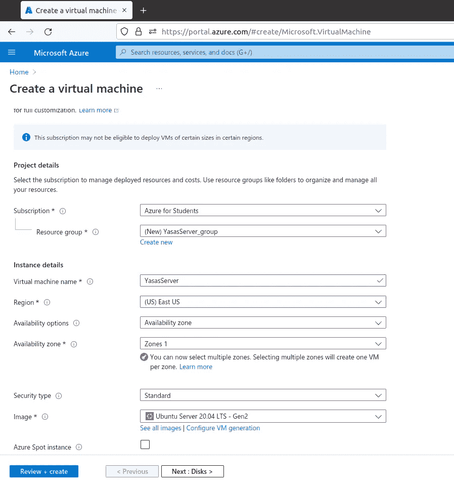

Azure 虚拟机创建(图片由作者提供)

> 专业提示:创建虚拟机时，根据成本更改区域(大多数情况下，美国东部的成本会更低)。有价格计算器来计算这个。

我选择了 Ubuntu Server 20.04 LTS 版本作为我在虚拟机中的操作系统。

然后，您需要允许入站流量，因为您可以到达您的实例。确保在部署应用程序后创建规则，以获得更好的安全性。

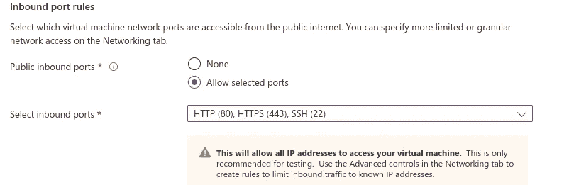

设置入站端口(图片由作者提供)

我希望您能按照每个选项卡中的步骤创建虚拟机。如果您在某一点上遇到困难，请在参考资料部分观看我的视频指南。

# 4.连接到虚拟机

如果您是 windows 用户，您可以使用 power-shell，或者使用第三方工具(如 Putty)连接到虚拟机。我已经写了一篇关于创建 EC2 实例的文章。如果连接有问题，可以参考参考资料部分。

所有必要的细节和 SSH 信息都在 Azure dashboard 中提供。因此您可以轻松地连接到实例。

成功连接后，您将看到以下消息:


连接到虚拟机(作者图片)

确保在执行任何其他操作之前更新您的虚拟机。

```
sudo apt update && sudo apt upgrade -y
```

# 5.配置虚拟机

首先，我们需要在虚拟机中设置环境来部署我们的应用程序。

## 设置 NGINX

小野兽来了。您可以使用以下命令轻松安装 Nginx:

```
sudo apt-get install nginx -y
```

此外，我们需要确保 Nginx 配置为在服务器重启时自动启动。为此，运行以下命令:

```
sudo systemctl enable nginx
```

现在，您可以看到 Nginx 的状态，通过运行以下命令来确认一切正常:

```
sudo systemctl status nginx
```

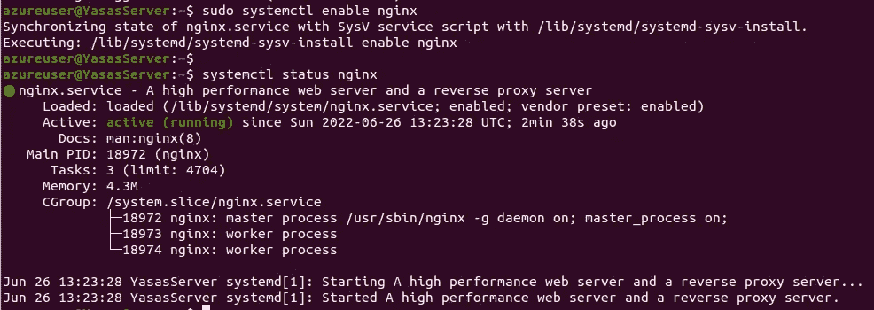

Nginx 安装(图片由作者提供)

现在，如果您在浏览器中粘贴虚拟机的公共地址(您可以使用`curl [https://ipinfo.io/ip](https://ipinfo.io/ip)` 命令找到它)，您将会看到类似这样的内容。

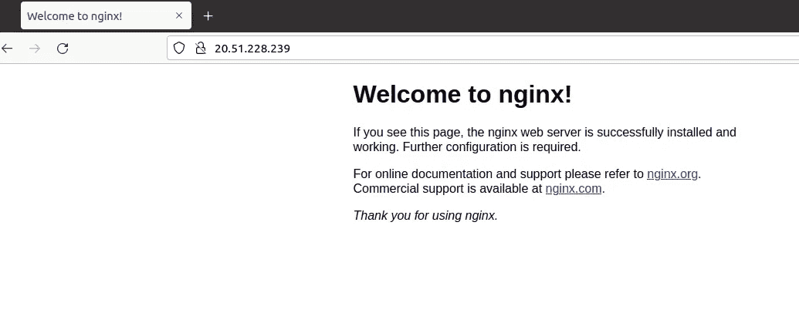

默认 Nginx 登录页面(图片由作者提供)

这是默认的 Nginx 登录页面。

确保在创建实例时启用了 HTTP 流量。除非防火墙会屏蔽 Nginx 服务。

现在我们需要配置 Nginx 服务器来服务我们的应用程序。为此，我们需要浏览`cd /etc/nginx/sites-available`目录。您将看到一个名为 default 的文件。

这是 Nginx 服务器配置的参考文件。你可以复制并根据你的要求修改它。首先，通过运行以下命令将其复制并粘贴为`myserver`:

```
sudo cp default myserver
```

然后，您可以使用以下配置覆盖该文件。使用 vim 作为内部编辑器来编辑文件。确保以超级用户权限打开(`sudo vim myserver`)。

键入`:%d`并按回车键删除所有行。使用`ctrl+shift+v`复制并粘贴该配置，根据您的虚拟机更改配置，然后`:wq`写入更改。

这将侦听 IPV4 和 IPV6 上的`port 80`。根目录是您的前端(客户端)构建文件夹所在的位置。你可以把它命名为`/home/{user}/apps/my-notes-app/client/build;`把它放在这里，我们稍后会创建文件夹。

如果你有购买的域名，可以添加到`server_name`我目前没有。所以我添加了虚拟机的公共 IP 地址。

我们在安装 Nginx 后看到了一个默认的网页。现在我们必须覆盖它来显示我们的应用程序，而不是那个。这可以通过使用`location /`块来实现。

这将在构建文件夹中找到`index.html`文件，并将其作为静态内容。此外，任何其他 URL 路由都将被重定向到`index.html`，因此，所有路由都可以从 react 应用程序内部处理。

最后，我们可以使用`location /api` Nginx 来配置我们的 Node express 服务器，Nginx 将代理将在`port 3001`上运行的 Node express 服务器。

设置完成后，您需要启用站点并重启 Nginx 服务以使更改生效。

```
sudo ln -s /etc/nginx/sites-available/myserver /etc/nginx/sites-enabled/sudo service nginx restart
```

# 安装节点。射流研究…

我们来安装 Node.js 吧，至于 Debian 和基于 Ubuntu 的 Linux 发行版的[官方文档](https://nodejs.org/en/download/package-manager/#debian-and-ubuntu-based-linux-distributions)，推荐的方式是使用二进制安装。

Node.js 二进制发行版可以在节点源代码 GitHub 页面上找到。

您可以运行以下命令来安装 Node.js。请确保您选择的版本与您的应用程序兼容。我选择版本 16 作为我的应用程序构建版本，使用该节点版本。

您可以使用`node --version`检查版本并安装相关的版本。

```
curl -fsSL [https://deb.nodesource.com/setup_16.x](https://deb.nodesource.com/setup_16.x) | sudo -E bash -sudo apt-get install -y nodejs
```

安装成功后，您可以检查版本进行确认。

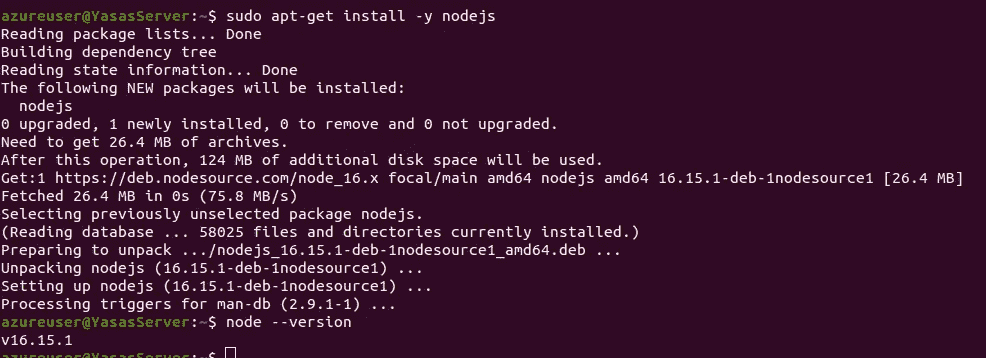

Node.js 安装(图片作者提供)

> 专业提示:始终使用 Node.js 的 LTS 版本，因为你会收到关键的错误修复、安全更新等。消除新的错误或漏洞。

## 安装流程管理器

现在，我们可以通过运行`node app.js`来启动我们的 Node express 服务器，但这不是最佳实践，因为它很容易崩溃。这就是为什么流程经理会出现的原因。

它通过在崩溃后甚至在虚拟机重启后自动重启应用程序，确保应用程序在部署后保持在线。此外，我们可以使用进程管理器来了解运行时性能和资源消耗。

有很多流程经理，比如 Forever、Strong PM 等等。此外，您可以使用操作系统本地进程管理器，如 SystemD 和 Upstart。

但是 PM2 是其中最著名的，它超级酷。它以 NPM 软件包的形式提供，因此您可以通过以下命令安装它:

```
npm install pm2 --location=global
```

如果您遇到权限问题，请授予对`/usr/lib/node_modules/`文件夹的写权限。(这里不要用`sudo`，因为从安全角度来看这样不好。)

如果已经成功安装，试着在控制台运行`pm2`。

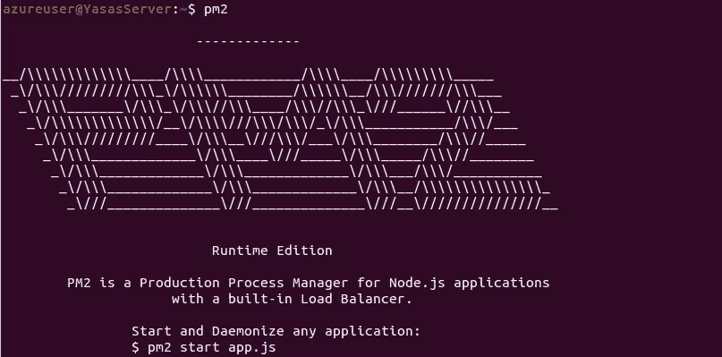

PM2 装置(图片由作者提供)

PM2 不仅仅是一名流程经理，他还能提供更多的东西。

PM2 提供的一些主要功能:

*   [行为配置](http://pm2.keymetrics.io/docs/usage/application-declaration/)
*   [集装箱集成](http://pm2.keymetrics.io/docs/usage/docker-pm2-nodejs/)
*   [集群模式](http://pm2.keymetrics.io/docs/usage/cluster-mode/)
*   [观看&重新加载](http://pm2.keymetrics.io/docs/usage/watch-and-restart/)
*   [日志管理](http://pm2.keymetrics.io/docs/usage/log-management/)
*   [监控](http://pm2.keymetrics.io/docs/usage/monitoring/)
*   [启动脚本](http://pm2.keymetrics.io/docs/usage/startup/)

PM2 最有趣的部分是集群模式。众所周知，Node.js 是一个单线程应用程序。因此它一次只能使用一个内核。但是我们可以使用这种集群模式来利用所有其他内核。

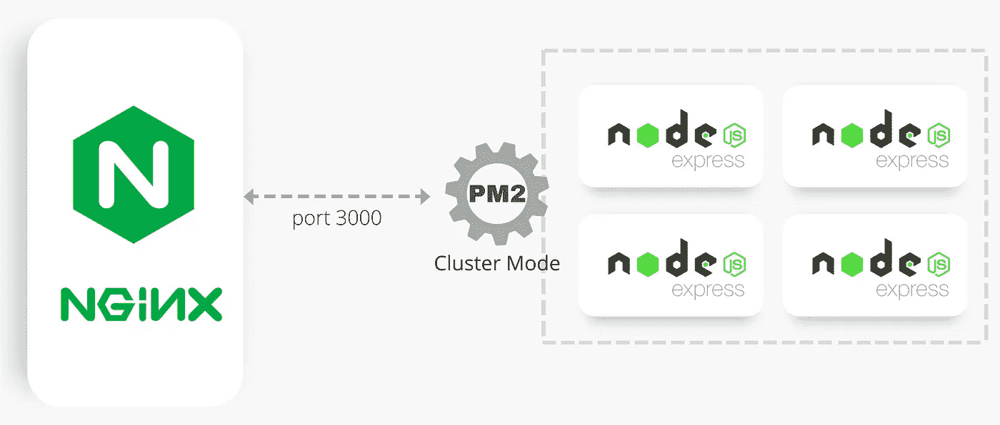

PM2 集群模式(图片由作者提供)

如上图所示，我们可以使用 PM2 在集群模式下运行 Node express 服务器。所以它将为每个处理器创建一个子进程。此外，PM2 将执行负载平衡并共享同一个端口，因为它带有内置的负载平衡器。

如果我们的虚拟机中有四个内核，我们最多可以创建同时运行的四节点集群实例。这将提高应用程序的性能和可靠性。这是一个水平缩放。

但是当应用程序完全无状态时，这个特性工作得最好。这意味着在这个过程中没有存储本地数据。(sessions/web-sockets)如果你有这种行为，最好使用 native Node.js [集群模块](https://nodejs.org/api/cluster.html)。

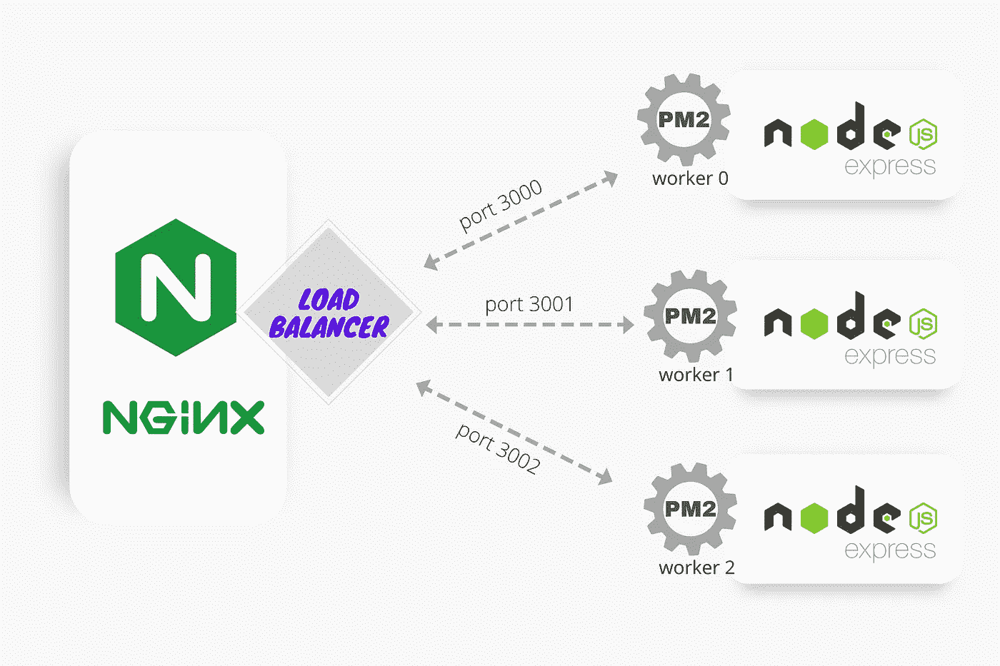

Nginx 作为负载平衡器(图片由作者提供)

Nginx 还可以为 Node.js 应用程序进行负载平衡。正如我们前面看到的，我们可以使用`upstream`块在服务器文件中设置配置。这是示例配置。(这个不需要补充。)

```
upstream app_servers {
        server 127.0.0.1:3000;
        server 127.0.0.1:3001;
        server 127.0.0.1:3002;
}
```

Nginx 允许跨多个服务器的负载平衡。(IP 和端口)因此，这可以用于在单个服务器上部署不同的应用程序，以及在不同的服务器上部署相同的应用程序。此外，我们可以通过将 Nginx 和 PM2 集群模式与多个虚拟机相结合来实现进一步的水平扩展。

这里我将使用 PM2，因为我们只有一个应用程序。在本文的后半部分，我将讨论如何在我们的应用程序中使用集群。所以，在这里你只需要安装它。

## 设置 MongoDB

在使用 MongoDB 时，您可以使用两种解决方案:

1.  MongoDB Atlas——带免费层的在线云数据库。
2.  在虚拟机中安装 MongoDB。

希望大家可以建立一个 MongoDB atlas 账号，在 Node.js app 中使用。但是我会安装 MongoDB，因为它非常简单，你不需要再修改代码。如果你需要连接 MongoDB atlas 账户的帮助，请在评论区留言。我很乐意帮忙。

由于我使用的是 Ubuntu 20.02 实例，我需要遵循[官方 MongoDB 文档](https://www.mongodb.com/docs/manual/tutorial/install-mongodb-on-ubuntu/)中提供的必要说明。那个文档真的很好。

安装 MongoDB 只需要四个简单的步骤。您可以在控制台中逐一运行这些命令:

```
wget -qO - [https://www.mongodb.org/static/pgp/server-5.0.asc](https://www.mongodb.org/static/pgp/server-5.0.asc) | sudo apt-key add -echo "deb [ arch=amd64,arm64 ] [https://repo.mongodb.org/apt/ubuntu](https://repo.mongodb.org/apt/ubuntu) focal/mongodb-org/5.0 multiverse" | sudo tee /etc/apt/sources.list.d/mongodb-org-5.0.list 

sudo apt-get updatesudo apt-get install -y mongodb-org
```

运行这些命令后，您可以通过输入以下命令启动`[mongod](https://www.mongodb.com/docs/manual/reference/program/mongod/#mongodb-binary-bin.mongod)`进程:

```
sudo systemctl start mongod
```

然后验证 MongoDB 是否已经成功启动。

```
sudo systemctl status mongodmongo --version
```

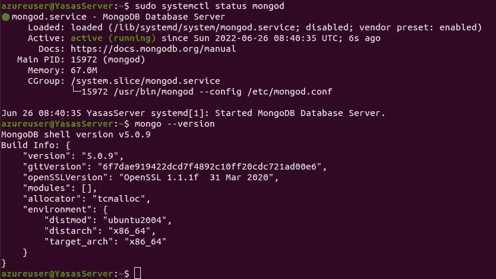

MongoDB 安装(图片由作者提供)

您需要使`mongod`服务在虚拟机自动重启后启动。

```
sudo systemctl enable mongod.service
```

此外，您需要给 MongoDB 套接字执行的权限。

```
sudo chown -R mongodb:mongodb /var/lib/mongodbsudo chown mongodb:mongodb /tmp/mongodb-27017.socksudo service mongod restart
```

此外，您可以通过设置用户名和密码认证来保护 MongoDB 实例。我希望你能独立完成。

好吧！部署我们的应用程序的一切准备就绪。那我们现在为什么要等呢？让我们将源代码移到 VM 中。

# 6.将源代码移入虚拟机

你可以直接从 GitHub 克隆你的代码，或者通过 SSH 把文件复制到 VM。此外，您可以使用第三方 FTP 客户端，如 FileZilla 或 WinSCP，将代码复制到 VM 中。

我打算用 SSH 把我的代码复制到 VM，因为这非常简单。

正如您所记得的，在 Nginx 服务器配置中，我们将根命名为`/home/azureuser/apps/my-notes-app/client/build`。因此，让我们创建文件夹，并据此复制我们的代码。

我在我的机器中创建了一个名为`my-notes-app`的新文件夹，然后我将把我的源代码放入其中。

> 专业提示:确保在上传文件到服务器之前移除节点模块，因为这会耗费你的时间和数据。

现在，您可以将该文件夹 SSH 复制到您的虚拟机中。转到计算机中服务器密钥对文件所在的新终端。现在运行下面的命令将文件夹复制到虚拟机中。

```
scp -i key-pair.pem -r ./path/to/folder <username>@<public-ip>:/pathwhere/you/need/to/copy
```

在我的场景中，我使用了以下内容:

```
scp -i YasasServer_key.pem -r ./my-notes-app azureuser@20.51.228.239:/home/azureuser/apps/
```

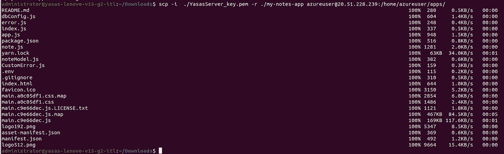

SSH 将源代码复制到 VM(图片由作者提供)

现在您需要在服务器上安装 NPM 软件包。为此，将`cd`放入服务器文件夹并运行`npm install`来安装软件包。

# 7.运行应用程序

现在您可以通过运行`npm run dev`来检查您的应用程序。

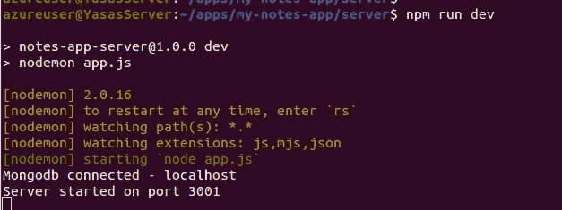

运行服务器(作者图片)

如您所见，我们的 Node.js express 服务器运行良好。但这不是正确的部署。按`ctrl+c`退出。

> 专业提示:确保以非根用户身份运行 Node.js 进程，因为根用户访问会导致安全漏洞。如果攻击者设法在服务器上运行恶意脚本，他将获得对虚拟机的无限权力。所以建议不要以超级用户权限运行。

如您所知，我们安装了 PM2 流程管理器。大狗来了！我们可以使用 PM2 通过指向主`app.js`文件来部署应用程序。

此外，我们可以添加`--name`标志来给进程一个描述性的、可识别的名称，该名称可以用来引用 PM2 子命令。

```
pm2 start app.js --name notes-app
```

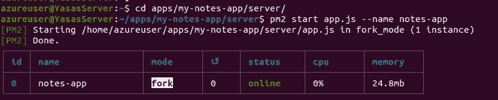

行动中的 PM2(图片由作者提供)

或者，您可以使用 PM2 集群模式，就像我前面提到的那样。(不要两者都用。只有一种方法就够了！您可以通过`pm2 stop 0`停止分叉过程

要启用集群模式，你只需要通过`-i <number-of-instances>`选项。

对于`<number of instances>`，您可以给出 0/1/2…直到虚拟机中可用 CPU 的数量。也可以给它`max`。然后，PM2 将自动检测可用 CPU 的数量，并运行尽可能多的进程。

```
pm2 start app.js -i max
```

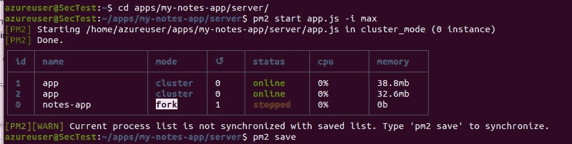

PM2 集群模式(图片由作者提供)

您可以看到两个实例以集群模式启动并运行。然后，您需要将 PM2 配置为在自动重启后启动该过程。运行以下命令:

```
pm2 startup
```

现在，根据您的虚拟机，您将看到一条与此类似的消息。

```
To setup the Startup Script, copy/paste the following command:
sudo env PATH=$PATH:/usr/bin /usr/lib/node_modules/pm2/bin/pm2 startup systemd -u azureuser --hp /home/azureuser
```

不要抄这个！复制您的消息并粘贴到终端。

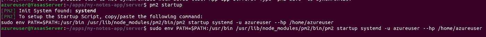

PM2 重启后自动启动(图片由作者提供)

然后使用`pm2 status`验证应用程序正在运行。您还需要使用`pm2 save`保存这些配置。

PM2 允许你通过一个漂亮的仪表板监控所有的服务器处理器。你可以在这里评估一下[。](https://app.pm2.io/)

如果您已经按照本指南完成了所有步骤，现在您将在虚拟机的公共地址中看到一个托管应用程序。

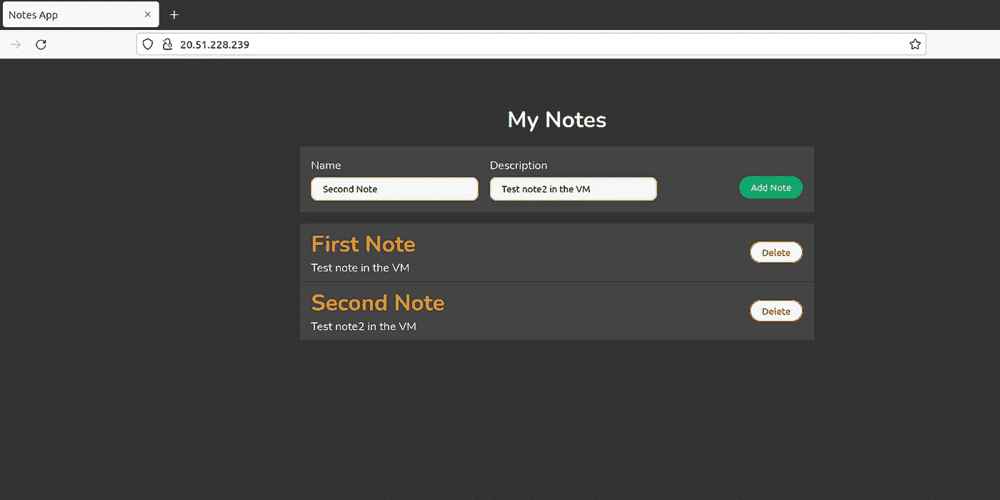

部署的应用程序(图片由作者提供)

问候！你的申请在网上。

尝试`sudo reboot now`并再次检查是否所有东西都工作正常。

本文可以进一步扩展到添加自定义域、启用防火墙、获取 SSL 证书、创建自定义负载平衡器、扩展应用程序等。我会写一篇单独的文章，因为它会比这更长。

# 解决纷争

如果您正确遵循本教程，您将很快看到您的应用托管。但是，如果您无法配置它，我会给您一个一般的故障排除指南来帮助您。这也会帮助你记住重要的事情。

首先，确保所有服务都已启动并运行。你可以通过`systemctl`命令来检查。Nginx 和 MongoDB 应该启用并运行。即使在虚拟机重新启动后，这些进程也应该会自动启动。

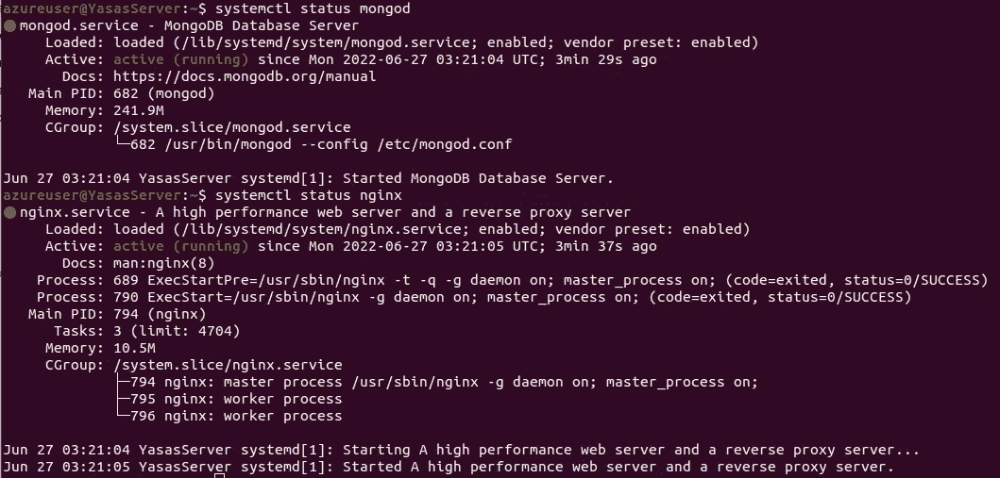

所有服务都已启动并运行(图片由作者提供)

如果您正在使用 MongoDB Atlas，请确保您的虚拟机的 IP 地址没有被阻止。您可以在这里设置访问策略[。](https://www.mongodb.com/docs/atlas/security/ip-access-list/)

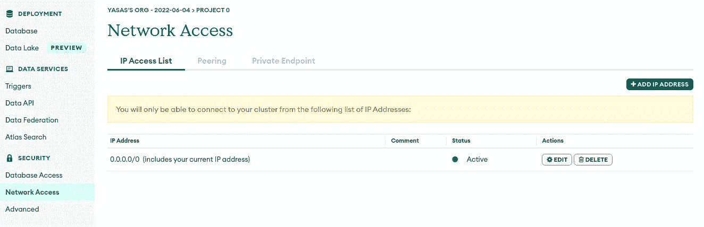

MongoDB Atlas 网络访问(图片由作者提供)

如果您的`mongod`服务在 VM 重启后给出状态 14，这意味着您没有正确地允许 MongoDB 套接字。按照本文 MongoDB 安装一节中的描述为套接字提供权限。此外，再次检查路径是否正确。就像有时候`/var/lib`文件夹可以是`mongo`而不是`mongodb`。

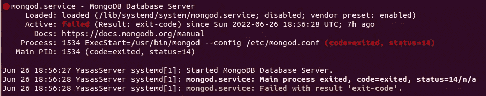

MongoDB 加载但中断并返回状态=14 问题(图片由作者提供)

此外，您应该确保将正确的路径放入 Nginx 配置文件并激活它。仔细检查`server_name`，因为我已经给了我的 IP 地址。将其替换为虚拟机的公共 IP 地址。您可以使用`curl [https://ipinfo.io/ip](https://ipinfo.io/ip)`命令检查您的 IP 地址。

在 Nginx 配置文件中做了任何更改后，您需要运行`sudo restart nginx`并验证它运行时没有任何问题。

如果您的 Nginx 服务失败了，您最好检查一下配置文件语法，确保您没有引入任何错误。您可以通过键入以下命令来检查它:

```
sudo nginx -t
```

如果你有任何问题，请在评论区留言。我很乐意帮助你解决你的问题。

# 资源

*   [源代码库](https://github.com/Yasas4D/NotesApp)
*   [node . js 日志记录的完整指南](/a-complete-guide-to-node-js-logging-1ba70a4a346d)
*   [连接到 EC2 实例](https://medium.com/@yasassandeepa007/connecting-to-ec2-instance-linux-ubuntu-ultimate-guide-1788fee00182)
*   视频教程

# 结论

终于，我们做到了！

现在您已经了解了关于部署 MERN 堆栈应用程序的一切。您不仅学会了部署应用程序，还学会了遵循最佳实践。

我相信一切都很清楚。如果没有，不要犹豫给我发信息。你可以将今天学到的一切应用到你的应用程序中，并与世界分享。希望能在评论区看到你的一些申请。

我将按照承诺，分别撰写关于扩展应用程序和提高安全性的文章。如有任何意见或建议，我们将不胜感激。

保持健康，保持安全，保持学习。下次见，编码快乐！