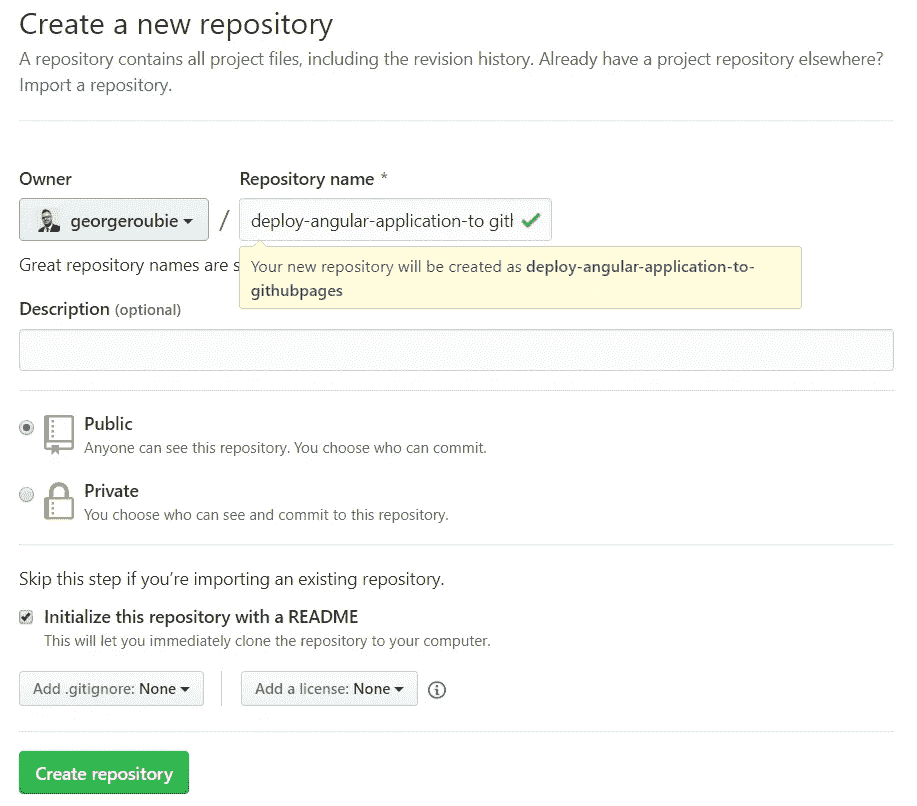
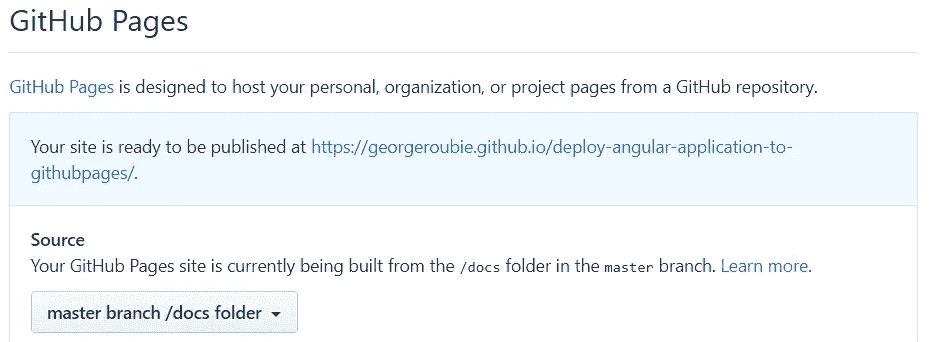

# 将 Angular 应用程序部署到 GitHub 页面

> 原文：<https://betterprogramming.pub/deploy-your-angular-application-to-github-pages-959dc04d9f10>

## 实时推送应用程序！


有了 [GitHub Pages](https://pages.github.com/) ，你可以为你的知识库创建一个免费的网站。这非常简单，我将一步步向您展示如何将 Angular 应用程序部署到 GitHub 页面。

首先，你必须在 GitHub 中创建新的资源库。



现在，转到您希望包含项目的文件夹并执行:

```
git clone repository-url
```

用实际的存储库 URL 替换`repository-url`。

现在用 Visual Studio 代码打开生成的项目文件夹。删除自述文件。MD 文件，并提交它来检查与 GitHub 的连接是否正常。

如果一切正常，在 Visual Studio 代码中打开终端(Ctrl +`)并执行:

```
ng new appName --directory ./
```

用应用程序名称替换`appName`。

提交并推送生成的文件。

接下来，我们必须在 package.json 中创建新的 npm 脚本命令。

```
"githubpage": "ng build --outputPath=docs"
```

保存 package.json 并执行:

```
npm run githubpage
```

该命令将生成一个 docs 文件夹。提交并推动变更。

在 GitHub 中项目的存储库设置中，在 GitHub Pages 部分，选择 as source:master branch/docs 文件夹。



当您选择此选项时，GitHub 将刷新页面，并在浅蓝色警告中显示 GitHub 页面的 URL。例如:

"您的网站已准备好在[https://georgroubie . github . io/deploy-angular-application-to-githubpages/](https://georgeroubie.github.io/deploy-angular-application-to-githubpages/)发布。"

仅复制 URL 并更新 npm 脚本命令，如下所示:

```
"githubpage": "ng build --outputPath=docs --base-href=url-of-page"
```

用复制的 URL 替换`url-of-page`。

执行:

```
npm run githubpage
```

提交并推送更改以查看 GitHub 页面的工作情况。

通常，需要两到三分钟才能看到变化。

# 资源

这一块的代码可以在 [GitHub](https://github.com/georgeroubie/deploy-angular-application-to-githubpages) 上找到。