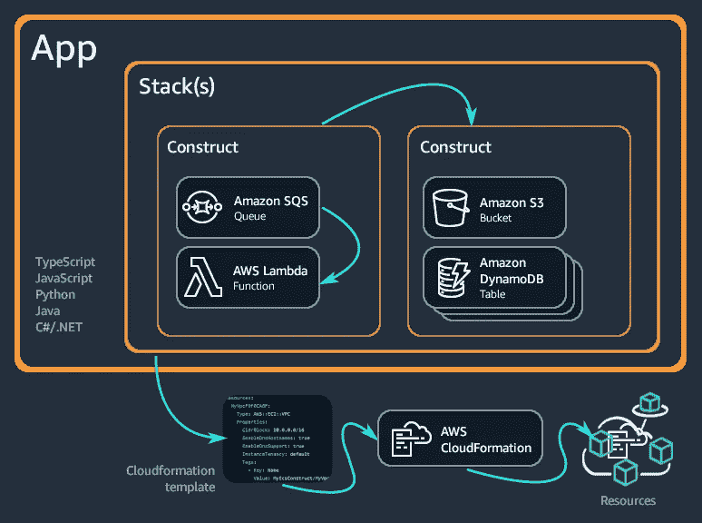
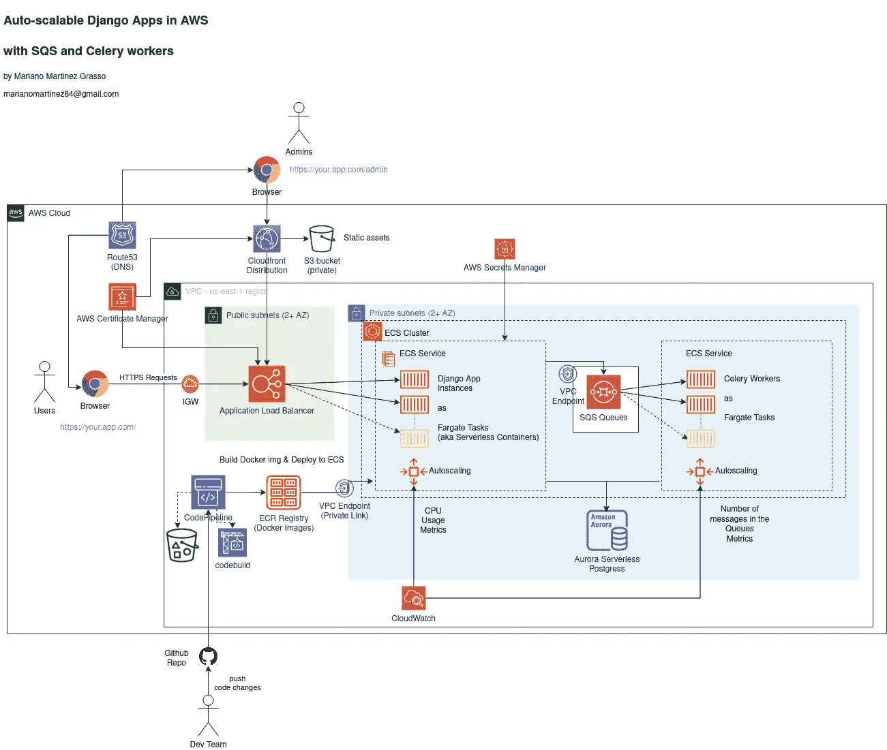
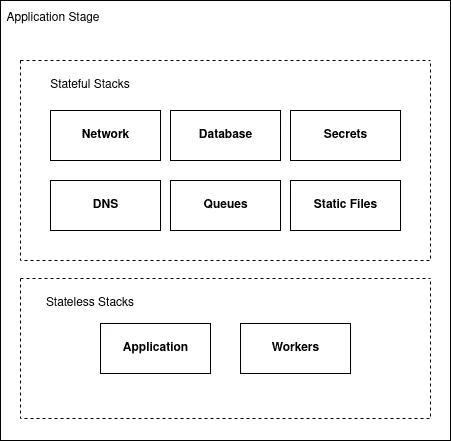
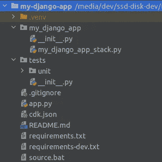
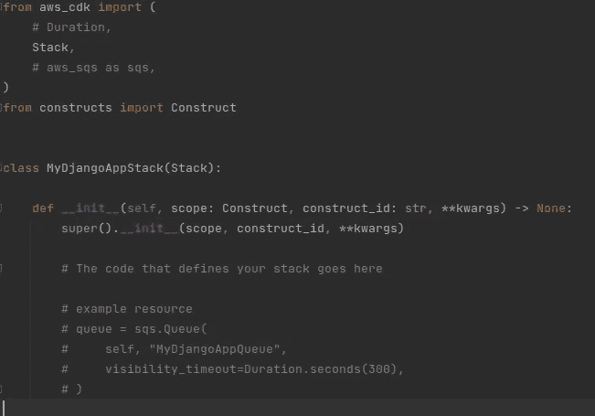

# 使用 CDK (v2)在 AWS 中部署 Django 应用

> 原文：<https://betterprogramming.pub/deploy-your-django-apps-in-aws-with-cdk-v2-997731a4aa50>

## 将基础设施作为代码进行管理


在 [Unsplash](https://unsplash.com/s/photos/guide?utm_source=unsplash&utm_medium=referral&utm_content=creditCopyText) 上由 [Darya Jum](https://unsplash.com/@darya_jumelya) 拍摄的照片

# 什么是作为代码的基础设施？

基础设施即代码(IaC)意味着通过“代码”而不是手动来配置和管理您的基础设施。这段代码的一个很大的优点是，现在您可以像管理您的软件代码一样管理它。您可以将它提交给某个存储库，您可以比较和检查更改，您可以进行回滚，并且您可以在其他项目中重用代码。

但是这种“代码”通常意味着用他们自己的语言编写 YAML 或 JSON 配置文件，而这些语言通常并不像您想象的那样对开发人员友好。

例如，让我们检查这个 CloudFormation 模板(AWS 中的 IaC 配置文件)的代码，该模板用于创建运行最小 flask 应用程序的负载平衡 Fargate 服务:

这种语言主要是陈述性的；语法和结构很复杂，你必须处理大量与网络和权限相关的底层配置。此外，随着架构复杂性的增长，代码行数也在快速增长。所有这些都使得维护这些文件变得很痛苦。

# 基础设施是用 CDK 编码

[云开发工具包](https://docs.aws.amazon.com/cdk/v2/guide/home.html) (CDK)通过支持 Python、TypeScript 和 JavaScript 等流行的编程语言，将 IaC 带到了一个新的高度。这允许您通过编写类和实例化对象来进行面向对象编程(OOP ),从而对您的基础设施进行建模。同时，CDK 库提供了更高层次的抽象，可以封装与网络和权限相关的细节，选择好的(但可编辑的)默认值。

例如，让我们看看用 Python 中的 CDK 创建负载平衡的 Fargate 服务所需的代码:

我们可以看到，它只是 Python 中的 OOP，代码行数大幅减少。现在，您可以像维护应用程序代码一样维护您的基础结构代码。您可以应用最佳实践，甚至[为它添加单元测试](https://aws.amazon.com/blogs/developer/testing-cdk-applications-in-any-language/)！

# CDK 基础知识

## CDK 是如何工作的？



亚马逊在 [cdk 文档上的图表](https://docs.aws.amazon.com/cdk/v2/guide/home.html)

CDK 建在云层之上。它采用 Python 代码并从中合成 CloudFormation 模板。它附带了一个[工具包](https://docs.aws.amazon.com/cdk/v2/guide/cli.html)，允许创建一个新的 CDK 项目，合成代码，并使用选择的帐户和地区部署它。

## CDK 基础知识

*   构造:[构造](https://docs.aws.amazon.com/cdk/v2/guide/constructs.html)代表 AWS 中的云资源，例如 S3 桶、负载平衡器或 RDS 数据库。您通常将它们用作架构的底层构建块。
*   解决方案构造:[解决方案构造](https://docs.aws.amazon.com/solutions/latest/constructs/welcome.html)是一个具有更高抽象层次的构造，它实现了常见的架构模式，例如，负载平衡的 ECS+Fargate 服务。
*   堆栈:一个[堆栈](https://docs.aws.amazon.com/cdk/v2/guide/stacks.html)将需要一起部署的资源组合在一起，例如，一个 S3 桶加上一个 CloudFront 发行版，它们一起用于服务一些静态文件，一个负载平衡的 Fargate 服务加上用于服务你的 Django 应用的自动伸缩策略。
*   阶段:一个[阶段](https://docs.aws.amazon.com/cdk/api/v1/python/aws_cdk.core/Stage.html)可以对栈进行分组，以对整个系统的单个实例进行建模。一个阶段可以被实例化多次，以便在多种环境中部署您的应用程序，如测试、登台或生产。
*   app:[app](https://docs.aws.amazon.com/cdk/v2/guide/apps.html)是代表整个 CDK 项目范围的根构造。每个 CDK 项目实例化一个应用程序，堆栈或阶段作为子节点添加。
*   AWS 环境:一个[环境](https://docs.aws.amazon.com/cdk/v2/guide/environments.html)是一个帐户和一个将要部署堆栈的区域的组合。我们将在实例化一个`Stack`时设置 AWS 环境。

# 亲自动手

## **先决条件**

这是你开始 CDK 所需要的:

*   安装 Python 3.6 或更高版本，包括`pip`和`virtualenv`
*   [安装 CDKv2 先决条件](https://docs.aws.amazon.com/cdk/v2/guide/getting_started.html#getting_started_prerequisites)(节点，AWS 客户端...)
*   [安装 AWS CDK 工具包](https://docs.aws.amazon.com/cdk/v2/guide/getting_started.html#getting_started_install)。

另外，[将你的 Django 应用](/dockerize-your-django-apps-428189407c69)归档。所选择的架构需要一个容器化的应用程序

## 代码

您可以在 [GitHub](https://github.com/marianobrc/scalable-django-apps) 上找到这个示例项目的完整代码。

## 我们在云中的架构

我们将使用 ECS 和 Fargate 将 Django 应用程序作为无服务器容器运行。我们还将添加队列和使用 SQS 和芹菜的工人，以支持在后台执行长期运行的任务。如果你想了解更多关于这个特定架构的特性，请阅读之前的文章:[在 AWS 中为你的 Django 应用设计一个可自动伸缩的架构](/design-an-auto-scalable-architecture-for-your-django-apps-in-aws-850ca5ec63a1)。



你可以在这里得到这个全尺寸的图

## 定义堆栈

为具有不同生命周期的组件定义单独的栈是一个好的实践，尤其是将有状态和无状态的组件分开。例如，运行 Django 应用程序的 ECS+Fargate 服务是无状态的，您可能会更频繁地更新、销毁或重新创建这些资源(例如，在新版本中或在扩展事件中)。

但是数据库是有状态的。你可能不想销毁它或替换它。一般来说，它的生命周期将与应用程序的生命周期分离。

因此，我们将基础设施代码划分为以下堆栈:



你可以在这里得到这个全尺寸的图

# 从 CDK 开始

先说好玩的部分吧！

第一步是创建一个目录，然后使用 CDK 客户端初始化一个模板项目。我们选择 Python 语言。目录名会作为项目名，这次是`my-django-app`。

```
$ mkdir my-django-app
$ cd my-django-app/
$ cdk init app --language python
Applying project template app for python...Initializing a new git repository...
Please run 'python3 -m venv .venv'!
Executing Creating virtualenv...
✅ All done!
```

让我们看看项目结构:



CDK 项目初始结构

*   CDK 为你创建了一个基础工程和一个虚拟工程。请注意，这个虚拟环境只能在处理基础结构代码时使用，不能用作您的应用程序虚拟环境。避免在此安装应用程序依赖项。
*   `app.py`:这是 CDK 项目的入口点，根 app 构造和主栈在这里被实例化。
*   这些是使用 CDK 所需的核心 Python 依赖，包括 CDK 核心库本身。您还可以在此添加包含额外构造或解决方案构造的第三方包。
*   这些是开发过程中需要的其他依赖，例如，在 CDK 堆栈上运行单元测试。
*   `my_django_app/my_django_app_stack.py`:默认情况下，CDK 会为你的堆栈创建一个文件夹，为你的应用创建一个堆栈。我们将在这个目录中添加所有的栈。

现在，我们将激活 virtualenv 并安装依赖项:

```
$ source .venv/bin/activate
(.venv) $ pip install -r requirements.txt
(.venv) $ pip install -r requirements-dev.txt
```

## 拔靴带

由于我们将在部署过程中生成 docker 映像等资产，CDK 需要[引导](https://docs.aws.amazon.com/cdk/v2/guide/bootstrapping.html)。首先，确保您之前已经配置了 AWS 客户端，或者查看先决条件一节。现在，您需要做的就是使用您的帐户 id 和地区名称运行 bootstrap 命令:

```
$ cdk bootstrap aws://123456789123/us-east-2
 ⏳  Bootstrapping environment aws://123456789123/us-east-2...
...
 ✅  Environment aws://123456789123/us-east-2 bootstrapped
```

# **创建我们的堆栈**

对于每个堆栈，我们将在 stacks 目录`my_django_app` /中添加一个新文件，并且我们将定义一个新的 stack 子类。

## **网络堆栈**

我们将开始为我们的服务创建我们的[虚拟私有云](https://docs.aws.amazon.com/vpc/latest/userguide/what-is-amazon-vpc.html) (VPC)、一些 [VPC 端点](https://docs.aws.amazon.com/vpc/latest/privatelink/vpc-endpoints.html)和一个 [ECS 集群](https://docs.aws.amazon.com/AmazonECS/latest/developerguide/clusters.html)。我们的目标是一次性创建这些资源，并与其他栈共享它们来支持我们的架构，因此我们将它们分组到一个独立的`Stack`中。

`my_django_app/network_stack.py`

`NetworkStack`类继承自 CDK [栈](https://docs.aws.amazon.com/cdk/api/v2/python/aws_cdk/Stack.html)类。然后我们在`__init__`方法中定义我们的资源。首先，我们使用构造 [Vpc](https://docs.aws.amazon.com/cdk/api/v2/python/aws_cdk.aws_ec2/Vpc.html) 来创建虚拟专用网络。

所有的构造都接受两个第一强制参数:`scope`和`id`。`scope`是对父构造的引用，`id`是一个标识字符串，它在该范围内必须是唯一的。在我们的堆栈中，我们将 id 参数重命名为`construct_id`，因为`id`是 Python 中的保留字。

然后，继续讨论 VPC 参数，我们选择两个可用性区域(AZ ),因为这是获得高可用性和零 NAT 网关以降低成本的最低要求。这将为每个 AZ 生成一个公共和一个私有隔离子网。

我们还需要启用 DNS 支持和 DNS 主机名，因为需要使用 VPC 端点。我们还在亚马逊弹性容器服务(ECS)中创建了一个集群。ECS 集群是 ECS 服务的逻辑分组，Django 应用程序和工作人员将被放置在其中。

然后，我们为设计中使用的所有托管服务添加 VPC 端点，否则将需要互联网传出流量(然后是 NAT 网关):

*   S3
*   electroniccashregister 电子现金出纳机
*   CloudWatch 日志
*   秘密经理
*   SQS

最后，由于 CDK 在创建资源的过程中会生成随机名称，因此保存一些参数以便以后查找或引用它们是很有用的。在这种情况下，我们将把 VPC id 和子网 id 作为参数保存在[系统管理器(SSM)参数存储库](https://docs.aws.amazon.com/systems-manager/latest/userguide/systems-manager-parameter-store.html)中。我们将对所有参数和机密使用以下形式的命名约定:

`/StageName/ParameterName`

因此，例如，登台环境的 VPC id 参数的全名将是:`/MyDjangoAppStaging/VpcId`。

# **数据库堆栈**

`my_django_app/database_stack.py`

为了创建数据库，我们使用支持不同数据库引擎的 [ServerlessCluster](https://docs.aws.amazon.com/cdk/api/v2/python/aws_cdk.aws_rds/ServerlessCluster.html) 结构。在这种情况下，我们选择 PostgreSQL 版本 10 的 [Aurora PostgreSQL](https://docs.aws.amazon.com/AmazonRDS/latest/AuroraUserGuide/Aurora.AuroraPostgreSQL.html) 引擎(这是撰写本文时支持的最新版本)。

我们还设置了子网和权限，使数据库只能从私有子网访问(Django 应用程序将驻留在这里)。

此外，这一次我们将在`__init__`方法中添加一些额外的参数，这样我们就可以在为不同的环境实例化这个堆栈时定制它的一些设置:

*   VPC:这是数据库将会存在的 VPC。这将是我们之前在网络堆栈中创建的 VPC。
*   `database_name`:这个参数允许我们设置默认数据库的名称，这个名称将在以后被我们的 Django 应用程序使用。`ServerlessCluster`构造用`default_database_name`参数中给定的名称创建一个默认数据库。
*   `min_capacity`和`max_capacity`:这些参数定义了集群的缩放限制。计算能力以“ [Aurora 容量单位](https://docs.aws.amazon.com/AmazonRDS/latest/AuroraUserGuide/aurora-serverless.how-it-works.html#aurora-serverless.architecture)”(ACUs)来衡量，它是 CPU/内存/网络容量的组合。最低两个 acu，最高 384。然后，数据库将根据 CPU 利用率、连接和可用内存的指标组合自动扩展，但始终在定义的限制范围内。
*   `auto_pause_minutes`:这将允许我们在数据库空闲一定时间后关闭数据库的计算能力，这意味着容量缩减到零。为了节省成本，您可能希望在测试/试运行环境中这样做。下次检测到新连接时，将恢复数据库容量。你应该知道有一个预热时间，可以是一分钟左右。
*   `backup_retention_days`:数据库备份在此天数后自动删除。Aurora 每天自动备份一次，保留一天的备份是免费的。

CDK 创建数据库后，会在机密管理器中添加一个新的机密，其中包含数据库集群 URL、数据库名称和数据库凭据。因为我们稍后需要找到这个秘密，所以我们将秘密的名称保存在 SSM 参数存储中。

## **静态文件堆栈**

我们将把静态文件存储在一个 [S3 桶](https://docs.aws.amazon.com/AmazonS3/latest/userguide/Welcome.html)中，并且我们将通过一个 [CloudFront 发行版](https://docs.aws.amazon.com/AmazonCloudFront/latest/DeveloperGuide/Introduction.html)来服务它们。

`my_django_app/static_files_stack.py`

首先，我们创建一个私有桶。出于安全原因，我们不希望桶是公开的，所以我们阻止任何来自互联网的流量。由于静态文件可以随时重新生成，我们允许 CDK 根据需要销毁这个桶及其对象。

然后我们创建一个[源访问标识](https://docs.aws.amazon.com/AmazonCloudFront/latest/DeveloperGuide/private-content-restricting-access-to-s3.html) (OAI)来允许我们的 CloudFront 发行版访问桶中的文件。

此外，如果提供了`cors_allowed_origins` ，我们将添加一个 CORS 策略，只允许来自这些域/子域的请求。否则所有的起源都是允许的。

最后，这次我们将在 [SSM 参数存储](https://docs.aws.amazon.com/systems-manager/latest/userguide/systems-manager-parameter-store.html)中保存 s3 bucket 名称和 CloudFront 发行版 URL。

**外部秘密堆栈**

有些参数我们无法预先设定。例如，我们不想在我们的存储库中提交 Django `SECRET_KEY`值，并且我们直到数据库被部署后才能知道数据库主机 URL。

但幸运的是，有一种方法可以让这些参数值在运行时被注入。包含敏感信息的参数(如 Django 密钥或数据库机密)被加密存储在 AWS Secrets Manager 中，而其他参数(如 TLS 证书)可以作为文本存储在 AWS SSM 参数存储中。

这个堆栈将这些类型的参数分组，并允许我们稍后将它们传递给应用程序堆栈和工人堆栈。

`my_django_app/external_parameters_stack.py`

`app_secrets`字典对包含敏感信息的 Django 应用程序所需的环境变量进行分组。因此，我们没有对值进行硬编码，而是创建了 [ecs。秘密](https://docs.aws.amazon.com/cdk/api/v2/python/aws_cdk.aws_ecs/Secret.html)对象。这使得当容器启动时，在运行时将值注入到 env 变量中。

`ecs.Secret`可以从存储在秘密管理器中的秘密或存储在 SSM 参数存储中的参数中检索值。此外，secrets manager 中的秘密可以存储(加密)为文本或 JSON。

Django 秘密密钥是存储在秘密管理器中的字符串，所以我们使用`[secretsmanager.Secret.from_secret_name_v2](https://docs.aws.amazon.com/cdk/api/v2/python/aws_cdk.aws_secretsmanager/Secret.html#aws_cdk.aws_secretsmanager.Secret.from_secret_name_v2)`从秘密名称构建秘密对象。注意，您需要在 AWS 控制台中手动创建这个秘密，并且名称应该与前面提到的约定相匹配，以便使用这个示例代码。

数据库机密也存储在机密管理器中。但是它是在创建数据库的过程中自动创建的，它的内容是一个 JSON 映射，包含数据库主机 URL、数据库名称、用户名、密码等。因此，我们使用由数据库栈创建的 secret 对象，并指定我们想要从中提取每个值的 JSON 字段。

AWS API 密钥以文本形式存储在 secrets manager 中，它们的检索方式与 Django 密钥相同。(这些 AWS 键被`django-storages`用来在 S3 存储静态文件)。

# **应用堆栈**

你会看到 CDK 已经自动创建了一个名为`MyDjangoAppStack`的空堆栈类。

`my_django_app/my_django_app_stack.py`



我们将使用这个堆栈来创建运行 Django 应用程序所需的基础设施，如下所示:

在这种情况下，我们希望将 Django 应用程序作为 ECS 服务运行，使用前端负载平衡器，这样我们就可以进行水平扩展。因为这是一个众所周知的架构模式，所以我们可以使用一个名为[ApplicationLoadBalancedFargateService](https://docs.aws.amazon.com/cdk/api/v2/python/aws_cdk.aws_ecs_patterns/ApplicationLoadBalancedFargateService.html)的解决方案。我们还将启用运行状况检查和自动扩展。

首先，因为我们希望我们的应用程序在我们自己的域中运行于 HTTPS 之上，所以我们需要一个 TLS 证书。由于证书创建和验证可能需要一些时间，我们不会使用 CDK 创建它，但我们会导入它。

您可以使用 [AWS 证书管理器](https://docs.aws.amazon.com/acm/latest/userguide/acm-overview.html) (ACM)从 AWS 控制台创建证书。创建后，我们将证书 ARN 作为参数保存在 SSM 参数存储中，并将其导入到此处。稍后，我们使用 [acm 实例化一个证书对象。certificate . from _ certificate _ arn](https://docs.aws.amazon.com/cdk/api/v2/python/aws_cdk.aws_certificatemanager/Certificate.html#aws_cdk.aws_certificatemanager.Certificate.from_certificate_arn)。然后我们将在`certificate`参数中传递证书对象，同时将`protocol`设置为 HTTPS，并将`redirect_http=True`设置为强制将 HTTP 请求重定向到 HTTPS。

最后，设置`public_load_balancer=True`将使负载均衡器放在我们的公共子网中，这样它就可以暴露在互联网上。

然后，我们设置服务所在的`cluster`。我们从 cluster 参数中获取它，这里我们将传入我们之前在网络堆栈中创建的集群。我们使用一个 [ec2 来设置`task_subnets`。SubnetSelection](https://docs.aws.amazon.com/cdk/api/v2/python/aws_cdk.aws_ec2/SubnetSelection.html?highlight=ec2%20subnetselection#aws_cdk.aws_ec2.SubnetSelection) 使 Fargate 任务在我们的私有隔离子网中运行；它们只能通过负载平衡器访问，并且不会暴露在互联网上。

接下来，我们设置 CPU 和内存限制，以及 Fargate 任务的期望计数。我们已经在堆栈中对这些设置进行了参数化，因此我们可以指定更多或更少的容量和更多或更少的冗余实例，同时稍后为不同的环境(暂存、生产)实例化堆栈。

我们还需要在`task_image_options`中定义容器图像选项。我们希望从源代码构建图像，所以我们使用 [ecs。ContainerImage.from_asset](https://docs.aws.amazon.com/cdk/api/v2/python/aws_cdk.aws_ecs/ContainerImage.html#aws_cdk.aws_ecs.ContainerImage.from_asset) 并设置 repo 中 docker 文件的相对路径，以及要构建的目标(在本例中，prod 用于构建生产映像)。

我们指定应用程序监听的端口，以便负载平衡器将请求转发给它。最后，我们传入之前定义的环境变量和秘密。

对于健康检查，我们在应用程序中的`/status/`处添加了一个状态端点，它在 GETs 上返回状态 200 Ok，因此我们在配置中设置了该 URL。我们还设置了阈值，因此一个实例(容器)在三次成功的健康检查后将被标记为健康，在两次失败的健康检查后将被标记为不健康。

这样，不健康的实例将被自动检测和替换。

对于自动缩放，亚马逊支持不同的缩放策略:[目标跟踪缩放](https://docs.aws.amazon.com/AmazonECS/latest/developerguide/service-autoscaling-targettracking.html)、[步进缩放](https://docs.aws.amazon.com/AmazonECS/latest/developerguide/service-autoscaling-stepscaling.html)和[预定缩放](https://docs.aws.amazon.com/autoscaling/application/userguide/application-auto-scaling-scheduled-scaling.html)。在这种情况下，因为我们知道 CPU 使用率与我们的应用程序处理的请求数量相关，所以我们将使用基于 CPU 使用率指标的目标跟踪策略。

当平均 CPU 利用率超过 75%时，横向扩展警报将触发服务自动扩展，以添加另一个任务(增加所需的任务数)来帮助应对增加的负载。相反，当平均 CPU 利用率持续一段时间低于 75%时，扩展警报将触发服务所需数量的减少，以释放资源并降低成本。

我们还设置了最小和最大任务计数，这些设置也是参数，因此我们可以在以后针对不同的环境对它们进行调整。例如，我们可能希望生产环境中至少有两个任务来保证高可用性，但是对于测试/试运行环境，一个任务就足够了。

最后，我们保存了一些与 SSM 中的任务相关的参数，这对以后运行一次性任务(例如，在 ECS 中运行 Django 命令)很有用。

# **DNS 路由**

`my_django_app/dns_route_to_alb_stack.py`

注册域和创建托管区域需要一些验证步骤，可能需要一些时间，所以我们不会自动与 CDK。但是我们可以在 AWS 控制台中完成第一步，然后导入我们需要的内容。

因此，我们将通过域名寻找托管区域。然后，我们将设置一些 DNS 记录，使我们的域指向我们的负载平衡器。由于我们使用的是 CDK，如果更换了负载平衡器并且 DNS 发生了变化，那么 DNS 记录也会更新。

## **队列**

我们将使用[亚马逊简单队列服务](https://docs.aws.amazon.com/AWSSimpleQueueService/latest/SQSDeveloperGuide/welcome.html) (SQS)来创建我们的队列。SQS 是一项托管服务，因此我们不需要调配或管理任何服务器、资源或容量。

它高度可用，并支持存储无限数量的消息。这使得它非常适合作为芹菜的经纪人。忘记必须监视队列是否已满或存储空间是否已满并有可能丢失消息。

`my_django_app/queues_stack.py`

我们使用`sqs.Queue`构造来创建一个队列。我们将使用 SQS 作为芹菜的代理，这将是默认队列。我们将队列的 URL 保存在 SSM，以便以后在芹菜设置中引用它。

## **工人们**

工人将读取来自 SQS 队列的消息，并将执行芹菜任务。我们为工作人员添加了另一个堆栈，以便他们可以独立扩展。

`my_django_app/backend_workers_stack.py`

同样，这是一个众所周知的模式，所以我们可以使用现有的解决方案构造:[QueueProcessingFargateService](http://QueueProcessingFargateService)。大多数参数与[ApplicationLoadBalancedFargateService](https://docs.aws.amazon.com/cdk/api/v2/python/aws_cdk.aws_ecs_patterns/ApplicationLoadBalancedFargateService.html)中的参数非常相似，所以我将解释不同的参数。

对于自动伸缩，这一次我们使用基于队列中消息数量的分步伸缩策略。步骤在`scaling_steps`中被指定为字典。对于每个步骤，我们为队列度量中的消息数量定义了一个下限或上限，以及一个要采取的操作，用工作线程数量的增量或减量来表示。

我们允许在栈实例化期间改变这个策略，但是我们也设置了一些合理的默认值。

docker 映像与 Django app 服务中使用的映像相同，但是我们覆盖了在容器中执行的命令，以运行启动 Celery worker 的脚本，而不是启动 gunicorn。

## **部署阶段**

既然我们已经为所有系统组件定义了堆栈，我们将在[阶段](https://docs.aws.amazon.com/cdk/api/v2/python/aws_cdk/Stage.html?highlight=stage#aws_cdk.Stage)中对它们进行分组。

`my_django_app/deployment_stage.py`

这个阶段代表了整个系统的一个实例，这将使得为以后的测试/试运行或生产创建多个环境变得更加容易。因此，这里我们实例化了我们之前创建的所有堆栈。我们也

## **增加 CDK 管道的 CI/CD**

CDK 管道不仅允许在应用程序代码发生变化时部署新版本的应用程序，还可以更新基础设施(以及管道本身！)当您的基础架构代码发生变化时。

您可以根据您所使用的分支模型，按照最适合您的需求来对您的管道进行建模。例如，如果您正在跟踪 [GitHub 流](https://docs.github.com/en/get-started/quickstart/github-flow)，您可能想要在 PRs 被合并到主分支时触发一个单独的管道。

这个管道部署到一个测试环境中，在那里您可以运行更多的手动或自动化测试(端到端、集成、UI 测试等)。)，并在自动或手动批准后部署到生产环境中。

相反，如果您正在遵循 [GitFlow](https://nvie.com/posts/a-successful-git-branching-model/) ，您可能希望有两条管道:一条由开发分支中的提交触发，它将部署到您的登台环境，另一条由主分支中的提交触发，它将部署到您的生产环境。

对于这个例子，我们将选择 GitHub 流，它有两个环境，staging 和 production，在转移到 production 之前有一个手动批准步骤。那么我们的管道将有以下步骤:

*   Source:这个阶段从您的 GitHub repo 获取源代码，并在您每次向它推送新的提交时触发管道。存储库现在包括您的应用程序代码和基础设施代码。这通过你需要预先创建的 AWS CodeStar connection 应用程序使用 webhooks 来实现。
*   构建:这个阶段执行一个`cdk synth`。该步骤的输出是一个[云组件](https://docs.aws.amazon.com/cdk/latest/guide/apps.html#apps_cloud_assembly)，它用于执行管道其余部分的所有操作。
*   UpdatePipeline:该阶段使管道根据需要进行自我更新。例如，如果您更新基础结构代码以向管道添加新的部署阶段，管道将自动更新以反映您所做的更改。这也意味着我们只需要在第一次手动部署管道，之后，我们可以修改管道代码并将更改推送到存储库。
*   PublishAssets:这个阶段为应用程序、工作人员等构建并发布 Docker 图像..到[亚马逊弹性容器注册中心](http://aws.amazon.com/ecr/)(亚马逊 ECR)，这样它们可以在后续部署中使用。
*   转移:根据需要创建或更新转移环境。在这里，使用最新的 docker 映像创建或更新 ECS 服务。我们使用这个环境来做更多的 QA 工作(例如，集成测试、端到端测试、UI 测试)。
*   生产:在手动批准后，映像被部署到生产阶段。部署新映像，更新 ECS 中的应用程序。[滚动更新](https://docs.aws.amazon.com/AmazonECS/latest/developerguide/deployment-type-ecs.html)可用于避免停机。

让我们定义一下我们的渠道:

`my_django_app/pipeline_stack.py`

堆栈管道类似于任何其他堆栈，但是它将包含管道以及针对我们想要部署的不同环境的系统阶段。

我们使用[代码管道构造](https://docs.aws.amazon.com/cdk/v2/guide/cdk_pipeline.html#cdk_pipeline_define)创建管道。然后我们添加一个 [ShellStep](https://docs.aws.amazon.com/cdk/api/v2/python/aws_cdk.pipelines/ShellStep.html) ，在这里我们指定安装 CDK、安装依赖项和合成基础设施代码所需的源代码库和命令。

我们还提供 dockerhub 凭证，以使用标准的 dockerhub 帐户，对图像拉取有更高的限制。你可以使用免费帐户，但如果你一天部署几次，你可能会达到拉限制。ShellStep 将生成管道的前四个阶段:源代码、构建、更新管道和发布资产。

然后，我们使用 Stage 类`MyDjangoAppPipelineStage`实例化两个 Stage:一个用于 staging，名为`MyDjangoAppStaging`，另一个用于 production，名为`MyDjangoAppProduction`。每一个都有不同的设置。例如，对于转移，我们使用最小容量的数据库，启用数据库自动暂停功能，并限制 ECS 中的任务数量以降低成本。但是在生产中，我们保持数据库始终运行，并且我们设置了更高的扩展限制。

我们使用`[add_stage](https://docs.aws.amazon.com/cdk/api/v2/python/aws_cdk.pipelines/CodePipeline.html#aws_cdk.pipelines.CodePipeline.add_stageç)`方法按照我们希望应用程序部署的顺序将每个阶段添加到管道中。所以首先是筹备阶段，然后是生产阶段。我们还在添加生产阶段时设置了`pre` 参数，以阻塞管道，直到获得人工批准。

既然定义了管道栈，我们需要在入口点`app.py`中实例化它:

## 部署

我们现在需要做的就是使用 CDK 客户端部署管道:

```
$ cdk deploy MyDjangoAppPipeline
```

(你可以在这个视频的[中看到部署命令在起作用)。](https://share.vidyard.com/watch/p6VangmRSqWkcw2DU9oMki?)

首先，CDK 合成了 CloudFormation 堆栈，如果有语法错误或其他问题，您会在 stdout 中看到它。然后，CDK 将在创建角色、策略和安全组之前要求确认。输入“y”表示是，部署过程将开始。您将在 shell 中看到部署进度，一旦完成，您将在 AWS 控制台的 [CodePipeline 面板中看到管道。](https://us-east-2.console.aws.amazon.com/cloudformation/home?region=us-east-2)

部署管道后，它将被触发，所有的栈都将被创建。您可以在 AWS 控制台的 [CloudFormation 面板中监控堆栈的创建。](https://us-east-2.console.aws.amazon.com/cloudformation/home?region=us-east-2)

这是您唯一需要运行部署命令的时候。下次您提交基础架构代码或应用程序代码的任何更改时，管道将更新基础架构，并根据需要更新 ECS 服务。

# **运行命令**

使用 Django 时，运行 shell 命令或脚本是很常见的，比如为后台创建一个超级用户、运行一个定制的数据迁移，或者只是运行出于任何原因需要的任何定制命令或脚本。

但是由于应用程序运行在孤立的无状态容器中，我们不能通过 ssh 进入其中一个容器来获得一个 shell 并执行我们的命令(这不是一个 bug 这是一个特点！).但是我们可以在 ECS 中启动一个一次性的 Fargate 任务，在同一个集群和子网中，在一个新的容器中运行命令。

因为这个任务是短暂的，一旦命令退出，任务就停止，容器被销毁。我们可以通过使用 AWS CLI 或 AWS SDK 调用 [RunTask](https://docs.aws.amazon.com/AmazonECS/latest/APIReference/API_RunTask.html) API 来触发任务。因为我更喜欢编写 Python 代码而不是 shell 脚本，所以我将使用 Python SDK (boto3)，并且我将编写一个 Python 脚本来以这种方式运行 ECS 中的任何命令。

您将在`/scripts/run_cmd.py`找到这个助手脚本。

该脚本将接受一个命令和一个部署环境名称(我们给我们的暂存或生产阶段的名称)，并且它将启动一个任务以在该环境中执行该命令。

怎么会？还记得我们在 SSM 不同堆栈中存储的参数吗？这个脚本将读取这些 SSM 参数，并使用与 Django 应用程序相同的设置，在正确的集群中构建运行任务所需的配置。

docker 映像将与 Django 应用程序使用的映像相同，但是 docker 命令将被覆盖。这样，我们可以运行 Django 命令，并且由于任务可以访问数据库，我们可以使用 Django ORM 或任何我们需要的东西。

## **用法**

首先，我们需要用脚本调用 AWS API 所需的 AWS 配置设置一些 env 变量:

```
AWS_ACCOUNT_ID=123456789123
AWS_REGION_NAME=us-east-1
AWS_ACCESS_KEY_ID=SOME4P1KEYID
AWS_SECRET_ACCESS_KEY=sOmeSecretACcesKey
```

您可以在您的 shell 中设置这些 env 变量，或者您可以在. env 文件中设置它们，然后将它们加载到您的 shell 中。如果您使用的是 Linux，您可以使用位于`/scripts/set_env_vars.sh`的助手脚本:

```
$ . ./scripts/set_env_vars.sh
```

然后，您可以执行`run_cmd`脚本。您可以使用`-h`选项运行它来查看使用帮助:

```
(.venv) $ python ./scripts/run_cmd.py -h
usage: run_cmd.py [-h] --env ENV_NAME [--env-var ENV_VARS] commandRun a command as a fargate task in ecs, using the same container and settings used by the Apppositional arguments:
  commandoptional arguments:
  -h, --help          show this help message and exit
  --env ENV_NAME      The environment where the command will be run: MyDjangoAppStaging or MyDjangoAppProduction.
  --env-var ENV_VARS  Set extra env vars as --env-var NAME1=VALUE1 --env-var NAME2=VALUE2
```

例如，现在让我们在 staging 中为我们的后台创建一个超级用户:

```
(.venv) $ python ./scripts/run_cmd.py "python manage.py createsuperuser --noinput --username admin --[email=admin@your-domain.com](mailto:email=marianomartinez84@gmail.com)" --env MyDjangoAppStaging --env-var DJANGO_SUPERUSER_PASSWORD=MyPassWord123
Building execution config for MyDjangoAppStaging
Config loaded:
...
AWS Response:
...
```

最终的配置和 AWS API 响应被打印到 stdout，以便您可以捕捉任何错误。如果您没有看到错误，这意味着任务已经开始。您可以在 AWS 控制台的 [ECS 面板中监控任务状态，也可以在 CloudWatch 查看日志。](https://us-east-2.console.aws.amazon.com/ecs/home?region=us-east-2#/clusters)

感谢阅读！