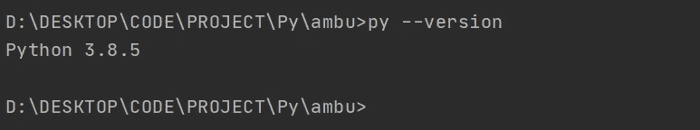
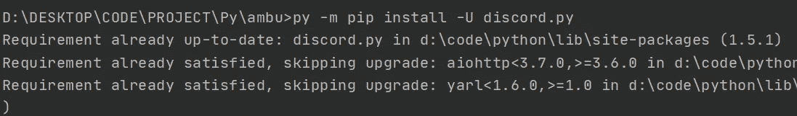

# 部署你的第一个不和谐机器人

> 原文：<https://betterprogramming.pub/deploy-your-first-discord-bot-ecaccdc233e9>

## 有没有想过建造和运输一个不和谐机器人？从这里开始


列宁·埃斯特拉达在 Unsplash 的照片。

现在每个人似乎都对制造机器人感兴趣，你不能真的责怪他们。制作机器人很有趣！然而，一些关于启动和运行机器人的概念可能不是很直观，所以我制作了这个教程来复习基础知识。

# 你需要什么

1.  [Python](https://www.python.org/downloads/release/python-379/) (本教程我们将使用 3.7)
2.  (我们将用它来编写我们的机器人)

我将在假设到目前为止所有跟随我的人都有一些编程背景/以前使用过 Python 的情况下继续本教程。如果你没有/还没有，没问题！realpython 为所有技能水平的人提供了非常好的 python 教程。

# 确保一切正常运行

启动您的终端/命令行并输入 Python 安装的名称。Linux 用户可能会有类似于`python3`的东西，而 Windows 用户可能会有他们自己的叫做`py`的东西。



一旦考虑到这一点，我们就可以安装`discord.py`。为此我们将使用`pip`。Pip 是一个软件包管理系统，用于安装和管理用 Python 编写的软件包。



# 编写基本的机器人

让我们回顾一下这个脚本是做什么的。因为我们正在创建一个可以响应命令的机器人，我们将使用来自`discord.ext`(第 1 行)的`commands.Bot`模块。

*   第 5 行:我们将机器人的前缀指定为`?`。你可以在文档中找到更多关于什么可以作为参数[传递的信息。](https://discordpy.readthedocs.io/en/latest/ext/commands/api.html#discord.ext.commands.Bot.command_prefix)
*   第 7-10 行:我们添加了一个监听器，基本上是告诉机器人监听一个事件。有很多事件发生在不和谐的地方。你可以在文档中找到他们[。](https://discordpy.readthedocs.io/en/latest/ext/commands/api.html#event-reference)
*   第 15 行:这里，我们正在运行机器人。你需要做的任何事情都必须在这之前。

在我们看到机器人运行之前，还有一件事要做:设置一个环境变量。出于显而易见的原因，在你的脚本中留下敏感信息并不是一个好主意——如果它将被发布到公共场所就更是如此。

根据您的操作系统，步骤会有所不同:

*   [对于 Windows](https://docs.oracle.com/en/database/oracle/r-enterprise/1.5.1/oread/creating-and-modifying-environment-variables-on-windows.html#GUID-DD6F9982-60D5-48F6-8270-A27EC53807D0)
*   [针对 Linux 的](https://www.serverlab.ca/tutorials/linux/administration-linux/how-to-set-environment-variables-in-linux/)

记住将其命名为`BOT_TOKEN`，并将值设置为您的 bot 的令牌。

WriteBots 有一个很好的指南[告诉你如何获得令牌并创建一个应用程序，如果你还没有这样做的话。一旦设置完令牌，就可以运行机器人了！](https://www.writebots.com/discord-bot-token/)


瞧，你的机器人上线了！


现在我们已经启动并运行了我们的机器人，试着在聊天中输入`?help`。在这里，`?`是你设置为机器人的`command_prefix`的任何东西。

现在，这只显示了`help`命令。让我们用一个简单的`echo`命令来活跃一下气氛:

```
@bot.command()
async def echo(ctx, *, args):
  await ctx.send(args)
```

现在试着运行`?echo Hello World`。机器人应该会回应你刚才说的话。

# 离别笔记

不要让你的机器人制造梦在这里结束。互联网上有很多很棒的教程，比如这个教程。