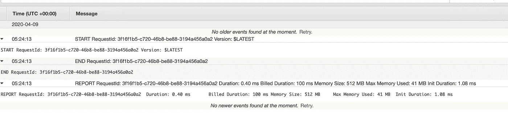
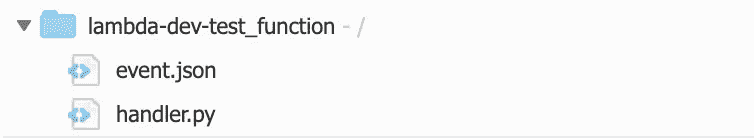
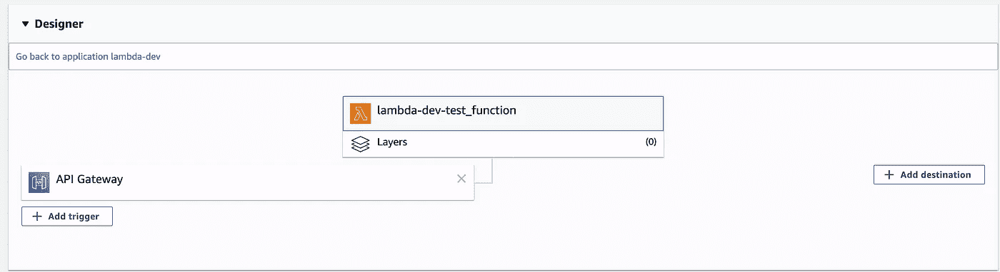
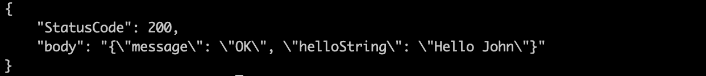

# 部署您的第一个 AWS Lambda 函数

> 原文：<https://betterprogramming.pub/deploy-your-first-lambda-function-4f7e54f75001>

## 使用命令行


柴坦尼亚·马赫什瓦里在 [Unsplash](https://unsplash.com/s/photos/command-line?utm_source=unsplash&utm_medium=referral&utm_content=creditCopyText) 上拍摄的照片

作为开发人员，您经常需要创建 API 来与各种系统和集成进行交互。传统上，这需要大量的工作，包括开发基础设施和在本地或云服务器(如 EC2)上部署代码。

然而，这种方法速度慢且成本高。

因此，无服务器计算的概念在过去的几年里变得流行起来。

无服务器服务的一个例子是[AWSλ](https://aws.amazon.com/lambda/)。Lambda 的工作方式类似于 API 端点，只要你可以访问一个函数，你就可以调用这个函数。

该服务仅在需要时执行代码，并根据需要自动调整每天的请求。当与 API 网关结合使用来开发一个最佳解决方案时，它会很方便。

AWS API Gateway 本身是一个完全托管的服务，允许开发人员创建、发布、监控和维护任何规模的 API。

当你把它和 Lambda 函数结合起来，你现在就有了所谓的 FaaS(函数即服务)。这使得开发人员可以用经济高效的无服务器解决方案取代缓慢的传统后端开发过程。

# 使用 Lambda 的好处

使用无服务器技术有几个好处。

在开发层面，Lambda 使得管理系统复杂性和进行集成测试变得更加容易。简而言之，Lambda 使工程师能够完全专注于业务逻辑，因为它处理缩放、日志记录、错误跟踪和授权。

Lambda 的一些最重要的优势如下:

## **内置日志**

您是否曾经开发过一个基础设施，并意识到您需要投入相当多的时间来包含日志记录和错误跟踪？

Lambda 为你做了这一切。您可以在 AWS 管理控制台中看到您的所有日志。



为我们的测试函数记录日志

## **可扩展性**

另一个有趣的特性是 AWS Lambda 会自动缩放您的应用程序。

它运行您的代码来响应每个请求，然后与正在运行的代码并行地单独处理每个请求。这样，触发器就可以根据整个工作负载的大小进行精确的扩展。

# 用 API Gateway 开发你的第一个 Lambda 函数

考虑到所有的好处，让我们来讨论如何设置一个 AWS Lambda 函数。

我们先来看看下面的函数。这是一个标准的“Hello World”风格的函数。您还会注意到我们正在使用 Python，这对于稍后配置您的设置非常重要。

我们想把这个基本功能推到 AWS Lambda 上。与您的标准“Hello World”函数不同，您可能只传入一个变量，这个函数将接受一个引用“事件”的参数。这将包含我们将在 HTTP 请求中传递的数据。

这些数据将被解析，并提取出请求体中的任何参数，然后根据我们的需要设置它们。在这种情况下，只有“名称”变量。

我们将用它发回“Hello”+name 和一个状态代码 200。这将表示函数成功返回。

## **第一步:Python 代码**

## 步骤 2: Serverless.yml 文件

为了使用命令行轻松地将这个函数推送到 Lambda，我们还将创建一个`serverless.yml`文件。

这个文件将提供一些参数，比如运行时使用哪种编程语言、区域、您的凭证，以及实际的函数和所需的参数。

这有助于配置 Lambda 函数，因此很容易通过命令行将其推送到云中。

下面的文件是我们将要使用的。

## **第三步:安装无服务器**

现在我们有了基本的函数和一个`serverless.yml`文件，将这个函数部署到 Lambda 的下一步是 [npm 安装无服务器](https://www.npmjs.com/package/serverless-lambda?activeTab=readme)，这将允许您访问`sls`命令。

下面的命令将帮助您安装此服务。

```
npm install -g serverless
npm i -D serverless-dotenv-plugin
sls plugin install -n serverless-python-requirements
```

## 步骤 4:部署功能

安装无服务器后，您现在可以访问`sls`命令。这将允许您使用一个命令部署无服务器功能。

首先，你需要确保你在你的`serverless.yml`和`test_function.py`所在的文件夹中。确保文件夹里只有这些东西。

这很重要，因为当您运行 deploy 命令时，您的整个文件都将被部署。您不希望意外部署 500GB 的随机文件。



一旦您确保只有您想要部署的文件在您的文件夹中，您就可以在您的终端中运行下面的命令。

```
sudo sls deploy
```

在此之后，`sls`会将您的代码部署到 AWS。最终，您应该能够在 AWS 管理控制台中自动找到它。



恭喜你。您已经启动了第一个无服务器功能。

## **步骤 5:测试您的功能**

为了测试这个函数，我们将使用一个 JSON 文件来传递参数。这将代表一个基本的 HTTP 请求。

下面是一个我们称之为`event.json`的文件，你将需要它。请注意，它只有一个“name”参数，但是在将来，您可以使您的无服务器函数变得更加复杂，从而拥有更多的参数。

一旦设置了这个 JSON 文件，就可以使用下面的命令在命令行中测试这个函数。

```
sudo sls invoke — function get-hello — path event.json
```

运行这个函数后，您将得到如下所示的输出。



如果您要在基础架构中实现这种无服务器功能，您将会得到这样的响应。

现在，您已经使用命令行启动并测试了您的第一个 Lambda 函数。

# 最后的话

AWS Lambda 是一个高度可伸缩的、事件驱动的、无服务器的服务，让开发人员可以快速开发功能。软件开发人员可以使用它来创建端点，数据工程师也大量使用它来开发 AWS 组件之间的数据管道，如 [S3](https://aws.amazon.com/s3/) 、 [Kinesis](https://aws.amazon.com/kinesis/) 和[红移](https://aws.amazon.com/redshift/)。

Lambda 减少开发基础设施所需时间的能力使得 Lambda 的使用日益流行。更不用说，由于所有这些昂贵的 EC2 成本，只为函数的每次调用付费的能力使得 Lambda 成为一个非常诱人的解决方案。

总而言之，这种 FaaS(功能即服务)对开发者来说非常棒，可以帮助你简化开发过程。