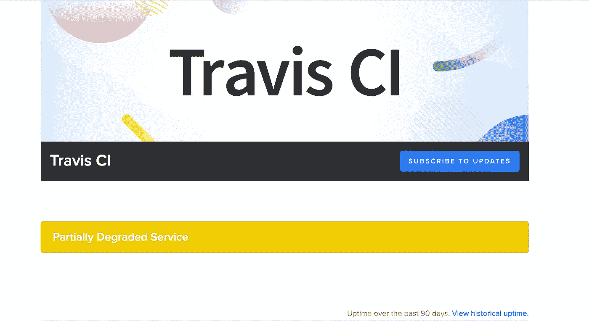
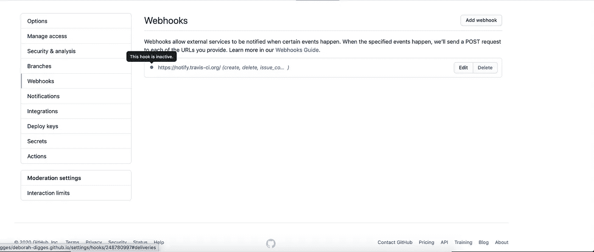
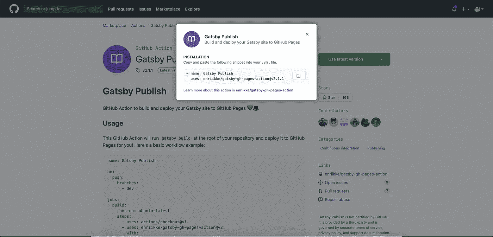
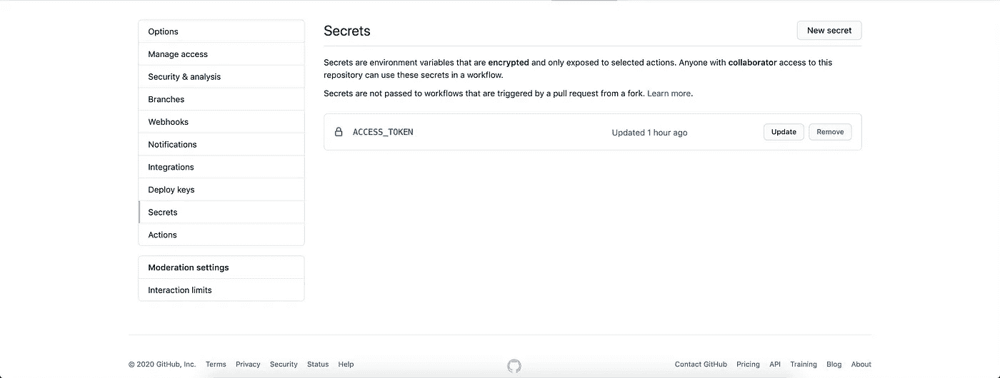
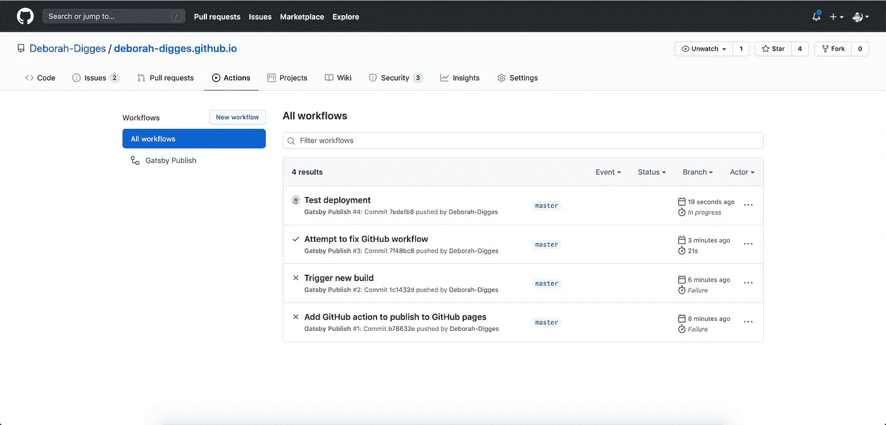

# 用 GitHub 操作部署您的 Gatsby 站点

> 原文：<https://betterprogramming.pub/deploy-your-gatsby-site-with-github-actions-e761ea93813f>

## 将 Travis CI 部署平台迁移到 GitHub Actions

照片来自 GitHub 博客。

在过去的几周里，我和[盖茨比](https://www.gatsbyjs.com/)进行了一次有趣的学习之旅。到目前为止，我已经[将我的旧 Jekyll 博客迁移到 Gatsby](https://medium.com/javascript-in-plain-english/from-jekyll-to-gatsby-7-simple-steps-98e0b7a5ead2) 并创建了一个管道，不断地将它部署到 GitHub 页面。为了创建 CD 管道，我使用了 [Travis CI](https://travis-ci.org/) ，这在我的[上一篇文章](https://medium.com/javascript-in-plain-english/gatsby-up-running-creating-a-cd-pipeline-68e561bb5f8e)中已经详细讨论过了。

# 介绍… GitHub 操作

GitHub 一直在努力扩展其平台，以支持开箱即用的存储库工作流。

> *“GitHub Actions 是您的工作流程:由您构建，由我们运行。”—*[*GitHub 博客*](https://github.blog/2018-10-16-future-of-software/)

这意味着 GitHub 平台本身现在支持这些功能，而不是让我的构建运行在 Travis CI 这样的外部 CI 服务器上。

Actions 已经进行了几年，GitHub 的团队一直在寻求和迭代社区反馈:

*   [有限公测](https://github.blog/2018-10-16-future-of-software/)于 2018 年末在 GitHub Universe 公布。
*   [公测版](https://github.blog/2019-08-08-github-actions-now-supports-ci-cd/)于 2019 年 8 月发布，支持 CI/CD、自定义事件和建议工作流。
*   actions[于 2019 年 11 月在 GitHub Universe](https://github.blog/2019-11-13-universe-day-one/)全面发售。
*   GitHub Enterprise 的[测试版于 2020 年 9 月推出。](https://enterprise.github.com/releases/2.22.0/notes)

# 为什么选择 GitHub Actions？

我在 Travis CI 中有一个运行良好的 CD 管道。

问题？链条中的另一个可能失败的环节，我需要监控和跟踪其状态的另一个第三方工具，我的 SaaS 账单中的另一个行项目，我的数据流经的另一项服务，我需要向我的合规团队报告。你明白了。

有趣的是，当我试图为我的博客设置它时，Travis CI 报告了性能下降，这让我开始质疑我的理智，因为我甚至在几次尝试后都无法让它工作。

关于 [Travis CI](https://www.traviscistatus.com/) 的降级服务通知

GitHub Actions 在一定程度上缓解了这些问题:

*   避免引入第三方工具，并防止数据流经另一个服务。
*   提供比 CI/CD 单独服务更低的[定价计划](https://docs.github.com/en/free-pro-team@latest/github/setting-up-and-managing-billing-and-payments-on-github/about-billing-for-github-actions#about-billing-for-github-actions)。它对公共存储库是免费的，对私人存储库是按需付费的。
*   允许重复使用共享工作流。这一点尤其重要，因为它避免了开发人员不得不一遍又一遍地解决相同的问题。相反，公共工作流创建了一个动作生态系统，开发者可以派生、编辑、迭代和改进，就像代码一样。

# Travis CI 是如何构建的？

在我的[上一篇文章](https://medium.com/javascript-in-plain-english/gatsby-up-running-creating-a-cd-pipeline-68e561bb5f8e)中，我回顾了我是如何配置我的博客的 GitHub 库来使用 Travis CI 的。

在 travis-ci.org 上启用知识库的构建

当我在 Travis CI dashboard 中为构建启用我的存储库时，它在 Github 上的存储库中设置了一个 webhook 配置。

Travis CI 在我的 Github 存储库设置中创建的 Webhook 配置

这个配置导致在这个存储库上生成的事件被推送到 Travis CI 托管的 webhook，该 web hook 触发了基于我的`.travis.yml`文件中定义的步骤的构建。

# 使用 GitHub 操作触发 Travis CI 构建

这种方法对改进我的工作流没有多大帮助，因为它只是改变了 GitHub 和 Travis CI 之间的集成点。

[Travis-CI GitHub 动作](https://github.com/travis-ci/actions)使用 [Travis CI v3 api](https://github.com/travis-ci/actions/blob/master/create-build.js#L19) 触发 Travis CI 上的构建以响应 GitHub 上的事件，而不是 Travis 托管的 webhook 监听 GitHub 事件。

依赖性依然存在，与之相关的问题也是如此。不过，人们很快就明白了。

# 使用 GitHub 操作部署到 GitHub 页面(再见，Travis)

为了消除对 Travis CI 的依赖，我开始寻找一个 GitHub 动作，它可以执行与我的 Travis CI 构建和部署管道相同的功能:运行一个构建，运行一些测试(尚不存在)，将生成的站点推送到我的 GitHub 存储库的`gh-pages`分支。

事实证明，找到一个为此目的的社区构建的动作并将其与我的存储库集成并不难:

*   首先，我在我的 [Travis CI 设置](https://travis-ci.org/account/repositories)中禁用了 Travis CI 构建，这在 Github 中禁用了相应的 webhook。

travis-ci.org 的残疾人建筑

在我的 GitHub 存储库中禁用了 Travis CI webhook

*   然后我在 [GitHub Actions Marketplace](https://github.com/marketplace) 上搜索一个[合适的 action](https://github.com/marketplace/actions/gatsby-publish) 来部署一个 Gatsby 站点到 GitHub 页面。

盖茨比出版行动

*   我手动将该动作添加到我的存储库中的一个 YAML 文件中，位于`[.github/workflows](https://github.com/Deborah-Digges/deborah-digges.github.io/blob/master/.github/workflows/build_and_publish.yml)`下。我对这一步有点失望，因为我希望市场上有一个单击选项，允许我将工作流文件直接提交到我的存储库中。

*   为了让工作流能够推送至我的存储库，我将 GitHub 存储库`Secrets`中的`ACCESS_TOKEN`环境变量设置为个人 [GitHub 令牌](https://github.com/settings/tokens/)。

GitHub 存储库设置中的秘密部分

*   有了这些，我就能够通过合并到我的存储库的主分支来触发我的第一次构建了！

GitHub 操作构建正在进行

# 收获利益

即使是这个小项目，我也收获了 GitHub 操作的好处:

*   我的博客的构建过程不再依赖于第三方工具 Travis CI。我可以禁用 Travis CI 上的存储库，还可以删除我的 Travis CI 帐户。
*   我能够重用一个共享的工作流，并从我的项目中删除代码和关于如何部署到 GitHub 页面的知识。这避免了我不得不再次解决同样的问题，而是使用社区构建的解决方案！

我很高兴探索了 GitHub 动作，以及它通过重用现有工作流所能做的事情。在我的下一篇文章中，和我一起探索如何从头开始编写一个定制的工作流！

*原载于*[*https://Deborah-digges . github . io*](https://deborah-digges.github.io/2020/09/24/gatsby-deploy/)