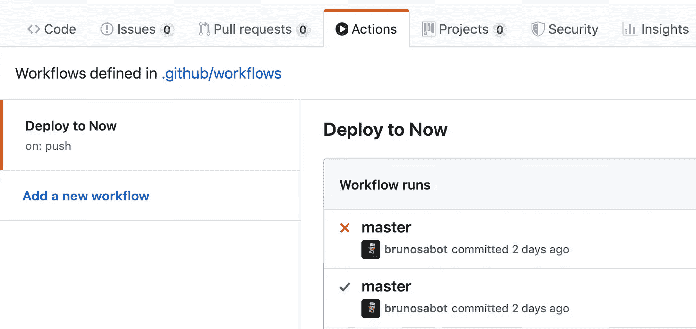
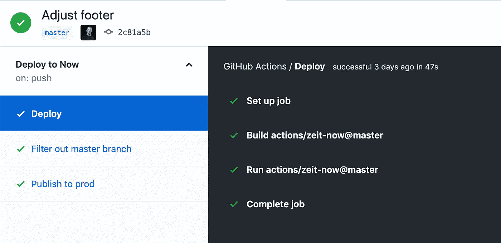
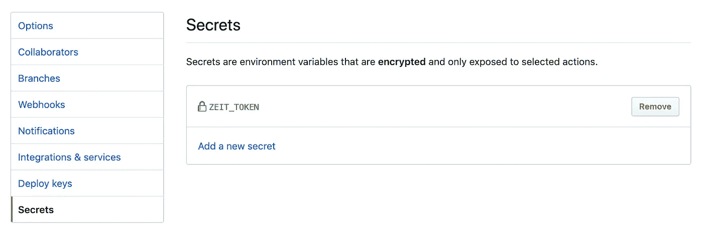

# 使用 GitHub 操作部署您的 ZEIT Now 应用程序

> 原文：<https://betterprogramming.pub/deploy-your-zeit-now-app-with-github-actions-ca3977806b40>

## 在 GitHub 中处理 CI/CD 的一种新的简单方法

我最近访问了 [GitHub Actions](https://github.com/features/actions) ，并决定在 [ZEIT Now](https://zeit.co/home) 中进行简单部署来测试它。我的第一步是看莱昂哈德·梅尔策的这篇精彩文章。

它包含了很多有用的信息，但不幸的是，它使用了旧的工作流语法，现在已经被弃用，取而代之的是 YAML。我花了很多时间进行转换，所以这里有一篇关于我如何用一个`yml`文件实现它的文章。

## 要求

*   在我写这篇文章的时候，GitHub Actions 还在测试阶段。您可以在这里请求访问[并等待您的请求被接受。](https://github.com/features/actions)
*   你还需要一个 T21 的账号。
*   当然，你需要一个 GitHub 账户和一个存储库来存储你的应用源代码。
*   最后但同样重要的是，要部署的应用程序。

# 开始

因为我主要使用 React，所以我将给你一个使用`create-react-app`应用程序的例子，但是你可以随意使用任何你喜欢的库。

# ZEIT Now 配置

现在在存储库的根目录下需要一个名为`now.json`的配置文件，它包含托管环境中的应用配置。

现在示例配置文件

让我们考虑一下这个文件的重要部分:

*   `version`:配置文件版本。您可以简单地使用 2，因为版本 1 已经过时。
*   `name`:我们在 ZEIT 仪表盘上使用的应用程序的名称。它将在你的应用程序上创建一个自定义子域。
*   `builds`:如何构建应用程序。当我部署一个`create-react-app`时，我使用`@now/static-build`，但是还有[许多其他选项你可能想考虑](https://zeit.co/docs/v2/advanced/builders)。
*   `regions`:我们希望应用程序部署的位置。我选择了`bru`在布鲁塞尔使用 GCP，但是你可以在那个列表上选择你最喜欢的一个[。](https://zeit.co/docs/v2/network/regions-and-providers)
*   `routes`:简单地映射任何传入请求应该指向的位置。请注意，所有未知的内容都将被重定向到`index.html`文件。

还有呢！由于我使用的`@now/static-build`有一些约束，我需要尊重它们:

*   我们需要在`package.json`文件中添加一个`now-build`脚本，它将由构建器的入口点运行。
*   输出数据应该包含在`dist`文件夹中，而`create-react-app`将内容设置在`build`文件夹中。

把所有的东西放在一起，我们的`package.json`文件看起来会像这样:

为了简化要点，我只保留了名称、版本和脚本键

好了，一切准备就绪。我们的下一步是实现适当的 GitHub 动作。

# GitHub 操作配置

为了创建一个新的部署工作流，我们需要在我们的存储库的根目录下创建一个`.github`文件夹。如果您使用[问题模板](https://help.github.com/en/articles/creating-issue-templates-for-your-repository)，您可能已经在使用它了。

然后，添加一个`workflows`子文件夹，它将包含您想要的任意数量的工作流。

接下来，我们将创建一个与我们想要的部署工作流相对应的 YAML 文件。例如，您可以创建许多文件来创建多个工作流，一个用于测试，一个用于部署。

现在，让我们分析一下我们在文件中写了什么:

*   `name`:我们将在 GitHub 中看到的一个漂亮的工作流名称。
*   `on`:工作流程应该执行的时间。[有很多事件我们可以挑选。](https://help.github.com/en/articles/events-that-trigger-workflows)
*   `jobs`:要执行的作业列表。

GitHub 界面中的作业列表

这些工作看起来几乎一样。我将只展示包含比其他版本更多信息的版本。

*   再次，一个漂亮的名字来标识当前的工作。
*   `runs-on`:将执行作业的操作系统。这里列出的[可能性很少](https://help.github.com/en/articles/workflow-syntax-for-github-actions#jobsjob_idruns-on)。
*   `needs`:执行此任务前需要的任务。GitHub 动作很智能；他们会遵循`needs`的顺序，所以你不必担心你的工作是如何排序的。你会在下面的截图中看到说明。
*   `steps`:要执行的动作列表

让我们再一次深入了解步骤是如何配置的:

*   `name`:猜猜看？这个动作的名字真好听！
*   `uses`:最后要执行的动作。有很多可用的操作。我使用的两个是`actions/checkout@v1`来获取我的存储库文件，而`actions/zeit-not@master`用于与 ZEIT-Now 相关的操作。动作的结构是首先有存储库(例如动作/检出)，然后是我们想要使用的分支(例如主)。
*   `env`:存储在 GitHub 接口中的环境变量。
*   `with`:允许配置一些变量的动作。在本例中，我们只想将`--prod`参数添加到将要执行的`now`命令中。

工作在左边，台阶在右边

## 存储秘密

在 YAML 文件中，我们使用一个`ZEIT_TOKEN`秘密。您可以在*设置*菜单中进行设置，在那里我们可以找到一个*秘密*菜单。一旦您添加了一个秘密，您将无法再次获得该值。

# 结论

设置 GitHub 操作一开始有点复杂，尤其是因为你在互联网上找到的故事使用的是旧语法。但是，最终，对于一个测试版特性来说，一切都非常简单和实用。

当然，关于用法还有更多要说的，比如考虑构建性能。但那将是另一个故事的内容。敬请期待！

我喜欢探索 API，我希望你会和我一样兴奋地开始挖掘行动！