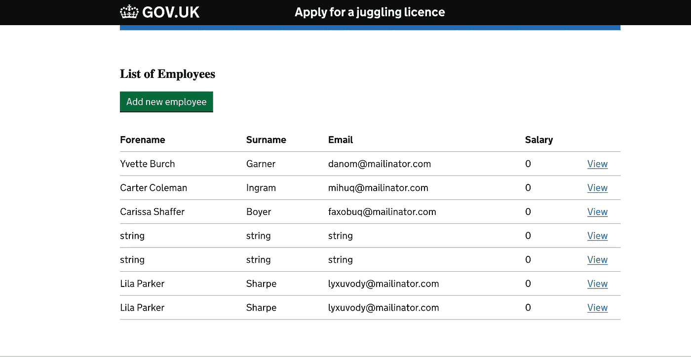

# 一天内完成部署:Github Actions、Docker 和 AWS App Runner

> 原文：<https://betterprogramming.pub/deployed-in-a-day-github-actions-docker-aws-app-runner-2f72ae0f52a7>

## 我在云上部署应用程序的确切流程


鲁拜图·阿扎德在 [Unsplash](https://unsplash.com?utm_source=medium&utm_medium=referral) 上的照片

所有开发人员都会在某个时候发现自己在本地机器上构建并运行了一个应用程序，他们很想让这个应用程序在云中运行，但是没有时间或知识来了解如何在云中部署应用程序，而不需要亲自参与服务器配置。

作为培训项目的一部分，我为见习软件工程师构建了一个简单的应用程序，允许用户创建、编辑和删除员工。受训者从建立一个数据库开始，然后建立一个 REST API 来执行 CRUD 操作，最后添加一个用户界面，下面采用的方法将适用于任何与 [Docker](https://www.docker.com/) 配合良好的框架。

现代软件工程的一部分不仅仅是编写代码并把代码扔给负责部署应用的平台团队。为了培养全面发展的软件工程师，理解这些应用程序如何从在本地机器上运行到在生产中运行是至关重要的。

下面的过程概述了我如何使用 [Github Actions](https://github.com/features/actions) 、Docker 和 AWS App Runner 来将上面提到的应用程序部署到云中。

让我们从数据库层开始。这很简单，因为云提供商提供了有限的方法来在云中托管数据库。由于我的背景是 AWS，所以我使用的是[亚马逊托管关系数据库服务(RDS)](https://aws.amazon.com/rds/) ，它允许您通过控制台只需简单点击几下就可以创建数据库，这可以通过使用基础设施代码(如 Terraform 或 AWS CDK)来自动化，这将允许您在需要时轻松地在任意数量的测试环境中扩展您的应用程序。

现在我们已经创建了数据库，我们可以继续创建将用于应用程序数据的数据库结构。作为数据库开发的一个常见的最佳实践，您不应该直接对数据库运行数据定义语言(DDL)语句，而应该编写它们的脚本，以便它们可以重新运行和审查。使用这个数据库脚本，您可以在存储您的脚本的存储库上创建一个 Github Actions 作业，以将脚本加载到您的数据库中，如果您使用特性环境，这可以在一个 pull 请求上完成，或者当您想要更新您的测试环境时，只需在 commit to master 上完成。

```
mysql — host=<your_host> — user=<your_username> — password=<your_password> <your_database_name> < employeesdb.sql
```


照片由 [Unsplash](https://unsplash.com?utm_source=medium&utm_medium=referral) 上的 [Sunder Muthukumaran](https://unsplash.com/@sunder_2k25?utm_source=medium&utm_medium=referral) 拍摄

接下来，我们希望容器化我们的应用程序，在我的例子中，我使用的是 Java Dropwizard REST API 和 Node.js Express 前端，但如上所述，这种方法将允许您部署任何允许您使用 Docker 运行的应用程序。这里的[容器](https://www.docker.com/resources/what-container)包含了在任何支持运行容器的地方运行应用程序所需的所有代码和包，Docker 允许你创建和运行你的容器。

Github Actions 有一个 Docker image 工作流，它将为您生成一个配置文件，该文件将在 merge to master 上运行 docker build 命令。一旦 Github Actions 生成了容器，我们需要将它存储在某个地方，以便我们可以使用它来运行应用程序，在我的例子中，我使用 [AWS 弹性容器注册表(ECR)](https://aws.amazon.com/ecr/) 来存储我的 API 和 UI 容器，但是有许多替代方法可供您使用，但是使用 ECR 可以让我们轻松地将容器与您想要用来运行应用程序的任何服务集成在一起。

从下面的示例代码中，您可以看到秘密的使用。Github 允许你在一个存储库或者一个帐户级别上创建秘密。您可以使用这些秘密来存储将容器存储在容器存储库中所需的凭证，下面是我为有权访问 ECR 的用户提供的访问凭证。您还可以使用秘密来存储数据库访问信息，以将您的 API 与您的数据库实例连接起来，在您的前端，您可以使用秘密来存储您的 API URL，以使其在构建时可配置。正如您在 docker build 命令上看到的，我们在此阶段将机密传递给容器，这意味着我们不需要将机密存储在运行应用程序的位置，并且在 AWS App Runner 的情况下，该服务不允许将机密传递给应用程序，只允许将未加密的环境变量传递给应用程序。

```
name: Docker Image CIon:
 push:
 branches: [ main ]
 pull_request:
 branches: [ main ]jobs:build:runs-on: ubuntu-lateststeps:
 — uses: actions/checkout@v2- name: Configure AWS credentials
 uses: aws-actions/configure-aws-credentials@v1
 with:
 aws-access-key-id: ${{ secrets.AWS_ACCESS_KEY_ID }}
 aws-secret-access-key: ${{ secrets.AWS_SECRET_ACCESS_KEY }}
 aws-region: eu-west-1- name: Login to Amazon ECR
 id: login-ecr
 uses: aws-actions/amazon-ecr-login@v1- name: Build & push the Docker image
 env:
 DB_PASSWORD: ${{ secrets.DB_PASSWORD }}
 DB_USERNAME: ${{ secrets.DB_USERNAME }}
 DB_HOST: ${{ secrets.DB_HOST }}
 DB_NAME: ${{ secrets.DB_NAME }}
 ECR_REGISTRY: ${{ steps.login-ecr.outputs.registry }}
 ECR_REPOSITORY: employee_demo
 IMAGE_TAG: api
 run: |
 docker build — build-arg DB_PASSWORD=${DB_PASSWORD} — build-arg DB_USERNAME=${DB_USERNAME} — build-arg DB_HOST=${DB_HOST} — build-arg DB_NAME=${DB_NAME} -t $ECR_REGISTRY/$ECR_REPOSITORY:$IMAGE_TAG .
 docker push $ECR_REGISTRY/$ECR_REPOSITORY:$IMAGE_TAG
```


[伊恩·泰勒](https://unsplash.com/@carrier_lost?utm_source=medium&utm_medium=referral)在 [Unsplash](https://unsplash.com?utm_source=medium&utm_medium=referral) 上拍照

现在我们已经创建并存储了我们的容器，我们只需要运行应用程序的地方，这里有许多[选项](https://aws.hashnode.com/amazon-containerization-guide-to-running-containers-in-aws)用于在云中运行容器，这实际上取决于您和您的应用程序的需求，您希望对您的服务器配置进行多少控制，这将决定您选择哪个选项。

对于这个简单的演示应用程序，我不需要对配置进行精细控制，所以我决定使用 [AWS App Runner](https://aws.amazon.com/apprunner/) ，这是一个完全托管的服务，允许您运行您的容器，在几分钟内为您提供一个访问您的 URL 的 URL，如果需要，您可以使用基础架构作为代码来自动执行此部署以测试环境。App Runner 还具有自动扩展功能，这意味着您只需为应用程序使用的计算支付费用，应用程序的流量越少，月底的 AWS 账单就越少。

App Runner 目前仅限于几个地区，因此您可能需要检查离您最近的地区，并在与 App Runner 服务相同的地区创建您的 ECR 存储库。



就是这样！

现在，您已经有了一个托管在云中的数据库、前端和后端。很简单，对吧？

我的所有代码都链接在下面，所以请随意查看并尽可能多地使用:

*   [Node.js Express 前端应用](https://github.com/shaunganley/nodejs-express-govuk-axios)
*   [Java Dropwizard 后端应用和数据库脚本](https://github.com/shaunganley/java-dropwizard-swagger-jdbc/actions/new)

```
**Want to Connect?**If you have any questions then feel free to reach out in the comments or via [LinkedIn](https://www.linkedin.com/in/shaun-ganley-8068aa82/).
```