# 在 Amazon EC2 上部署基本的 Express API

> 原文：<https://betterprogramming.pub/deploying-a-basic-express-api-on-amazon-ec2-eea0b54a825>

## 循序渐进的指南


图片来自 Unsplash

我计划在未来发表的几篇文章需要在 EC2 实例上运行 express API，所以我想提供一个一站式解决方案，我的读者可以参考这个方案，帮助他们在 AWS EC2 实例上部署一个全功能的 express API。

# 先决条件

您应该有一个有效的 AWS 帐户。

**注**:最初，AWS 提供积分让你试用其服务，但 EC2、route53 等服务。，现在成本。在使用它们之前，请注意这一点，并通过 AWS 的[成本浏览器持续跟踪您的成本。](https://aws.amazon.com/aws-cost-management/aws-cost-explorer/)

# 在 AWS 上初始化 EC2 实例

第一步是在 AWS 上初始化 EC2 实例。为此，请前往 https://aws.amazon.com/ec2/。

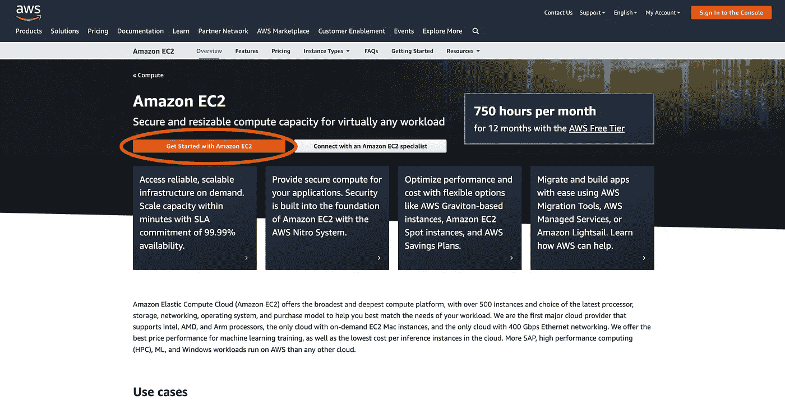

点击“亚马逊 EC2 入门”如果您有 AWS 帐户，请登录，您将被重定向到以下页面:

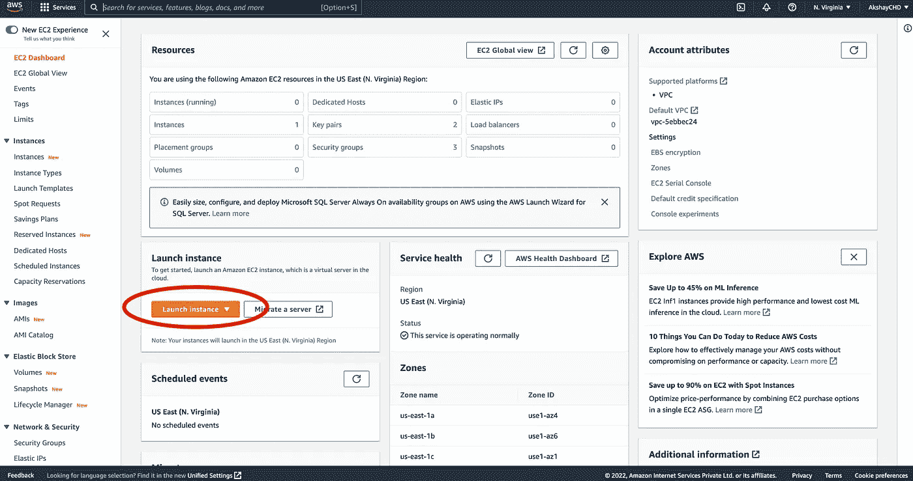

点击“启动实例”按钮，如下所示:

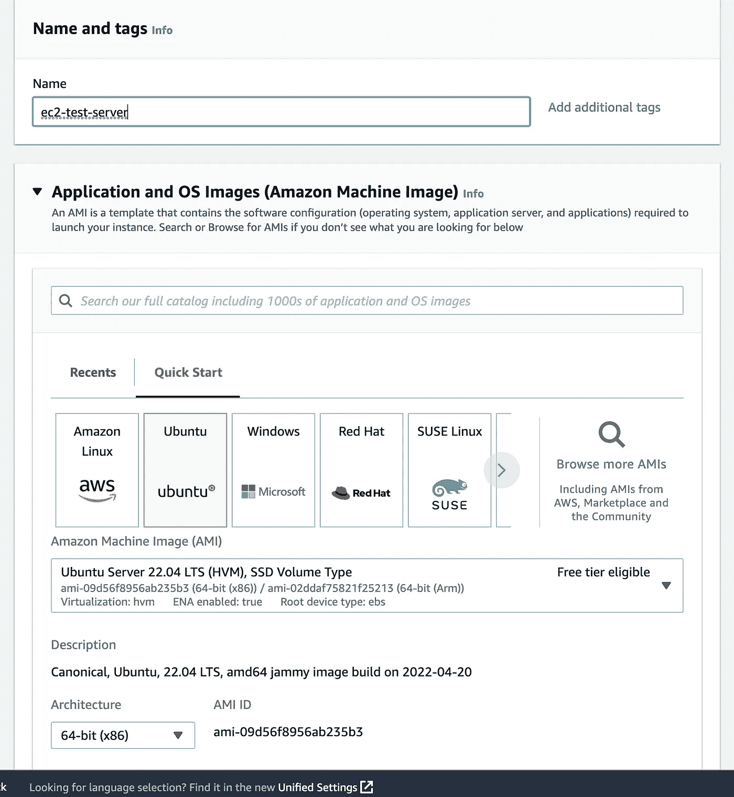

在下一页，选择操作系统“Ubuntu”，并为您的服务器提供一个名称。

然后选择一个实例类型。我选择了 t2 micro，它为我们提供了 1 GB 的内存和 1 个 CPU 内核。

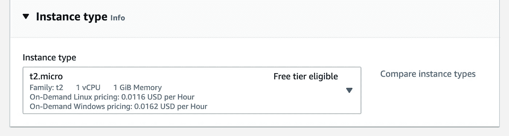

接下来，您需要提供一个 SSH 密钥对，以便实例能够验证您的`ssh`请求。这是一张图片:

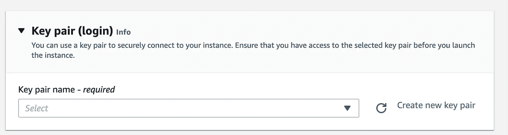

如果您已经实例化了一个`ssh`密钥对，您可以使用它，或者点击“创建一个新的密钥对”

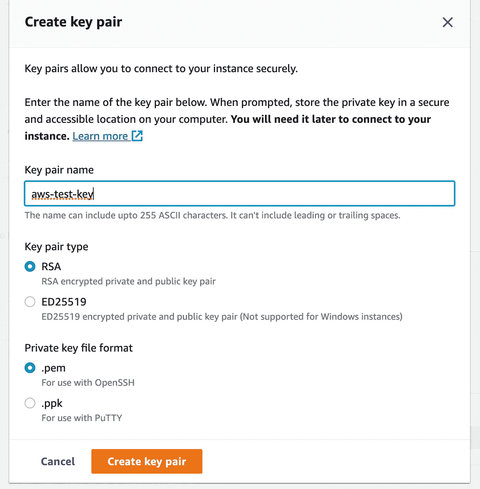

为密钥提供一个名称，然后单击创建。包含密钥的压缩文件将被下载到您的系统中。

请确保将文件提取并保存在本地；它将在稍后阶段用于连接到我们的远程实例。

然后在网络设置中，允许通过 SSH(用于远程访问您的服务器)、HTTP 和 HTTPS(用于访问我们的 API)的流量。

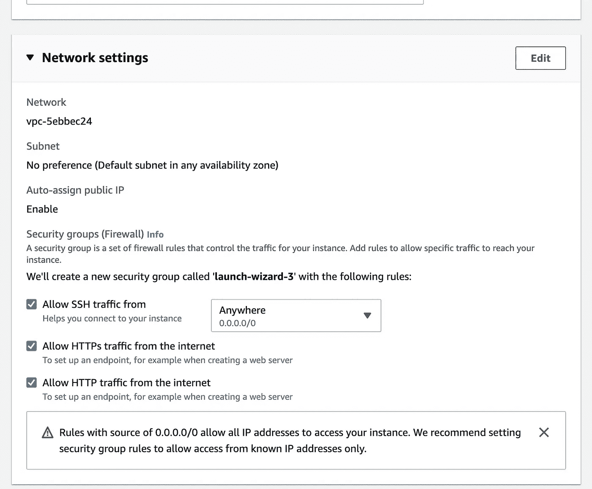

将其余设置保留为默认设置，然后单击“启动实例”按钮。

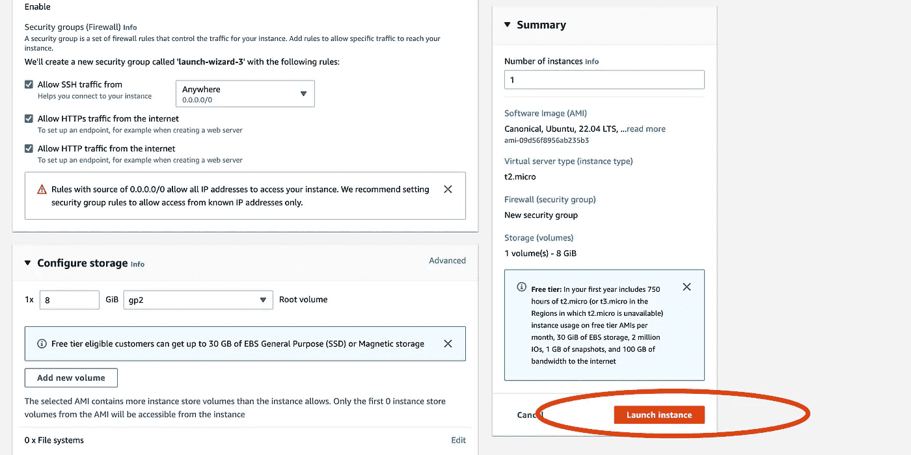

启动后，您将看到以下屏幕:

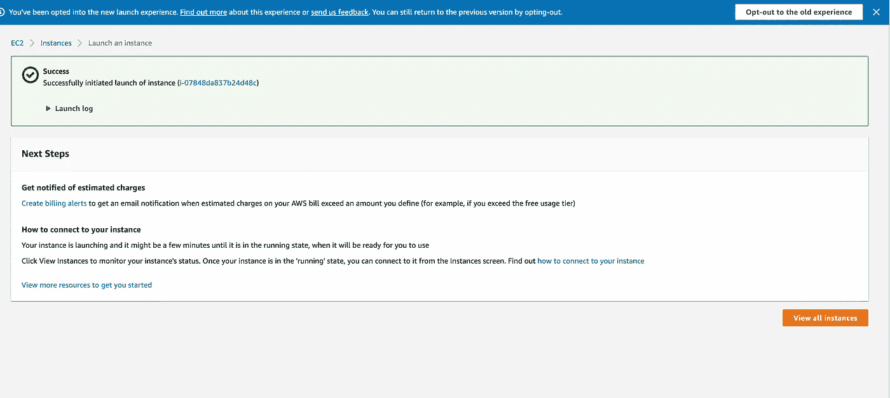

在这里，单击“查看所有实例”从这里，您将被重定向到可以看到所有实例的屏幕。

在此屏幕上，复制实例的公共 ipv4 地址。在下一部分中，我们需要这个地址和保存的`.pem`文件。

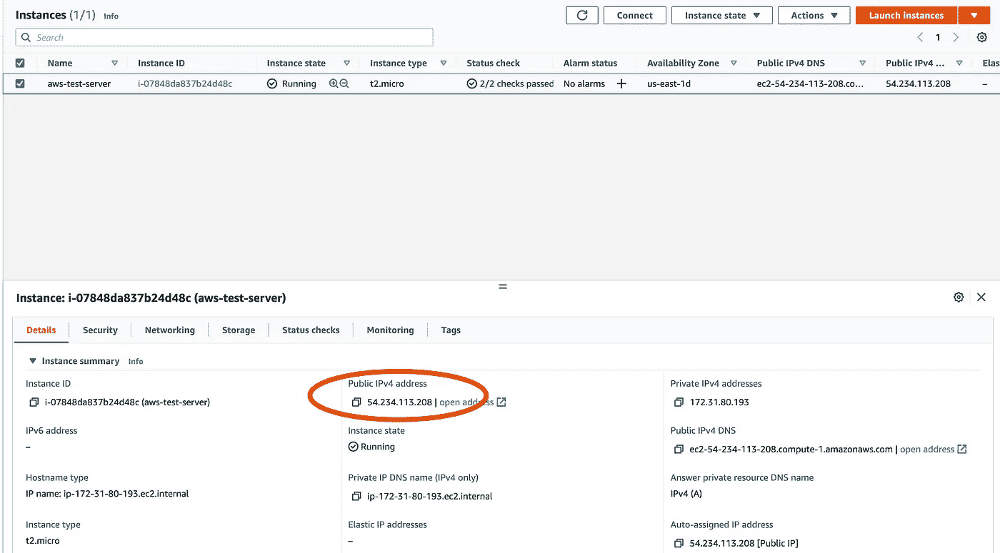

# 设置实例环境

要设置我们的实例，我们需要首先连接到它。为此，我们将使用这个`ssh`协议。

为此，打开我们操作系统的终端，移动到包含我们保存的`.pem`文件(我们在上一节中生成的)的目录，并运行以下命令:

```
ssh -i aws-test-key.pem ubuntu@54.234.113.208
```

注意，您必须根据您的上下文修改上面的命令。

```
ssh -i <PEM_FILE_NAME> OPERATING_SYSTEM@SERVER_IPV4_ADDRESS
```


登录后，您会看到一个类似的终端。

现在，我们必须安装 NodeJS 和一些其他依赖项，以便在实例上运行我们的 express 服务器。

要安装 NodeJS，您可以使用官方 [GitHub 页面](https://github.com/nodesource/distributions/blob/master/README.md#installation-instructions)上的任何 curl 命令(取决于您想要安装的版本)。

对于我们的情况，我将使用以下内容:

```
curl -fsSL https://deb.nodesource.com/setup_18.x | sudo -E bash -
sudo apt-get install -y nodejs
```

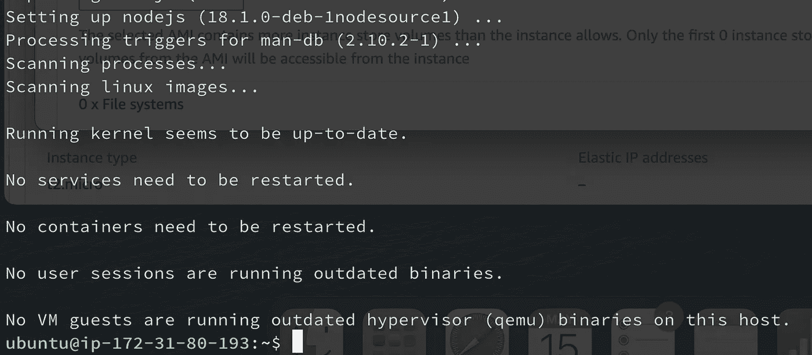

我们将在安装后看到以下输出。

您可以通过运行以下命令来验证节点是否安装成功:

```
node --version
```

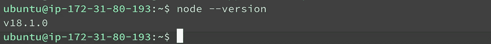

接下来，我们将安装一个名为`pm2`的包管理器来管理我们的 NodeJs 进程，这样即使我们关闭了当前的终端会话，它们也能继续运行。

要安装 [pm2](https://pm2.keymetrics.io/) ，运行以下命令:

```
sudo npm install -g pm2
```

再次验证安装，运行以下命令:

```
pm2 --version
```

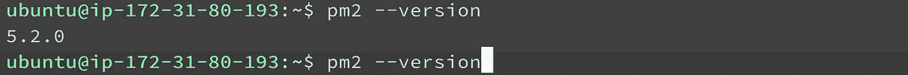

# 初始化我们的快递服务器

您可以在实例中初始化您自己的 express 服务器，或者您可以使用这个命令克隆下面的[存储库](https://github.com/AkshayCHD/node-basic.git):

```
git clone [https://github.com/AkshayCHD/node-basic.git](https://github.com/AkshayCHD/node-basic.git)
```

本质上，该项目包含一个`index.js`文件，用于初始化以下 express 服务器:

之后，进入目录并运行以下命令:

```
cd node-basic && npm install
```

现在，要生成 pm2 进程，运行以下命令:

```
pm2 start index.js
```

运行此命令后，您可以通过运行一个简短的命令来验证该过程是否已正确启动:

```
pm2 logs
```

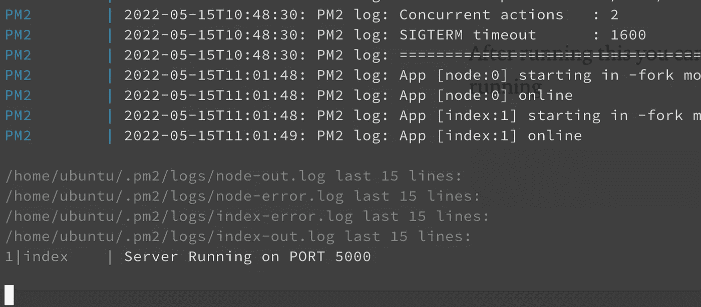

您应该会看到以下输出。

现在，如果我们想向外界公开我们的 API，我们必须在默认的 HTTP 端口`port 80`上启动我们的进程，或者我们必须以某种方式将我们的进程(运行在`port 5000`上)映射到`port 80`。

实现这一点的正确方法是通过 Nginx 这样的反向代理，我们将在下一篇文章中使用它。现在，我们将在系统的 IPtable 中使用一种不太理想的方式来映射`port 80`到`5000`，使用以下命令:

```
sudo iptables -t nat -A PREROUTING -p tcp --dport 80 -j REDIRECT --to-ports 5000
```

现在，当您在浏览器中键入实例的 IP 时，您将看到以下消息:

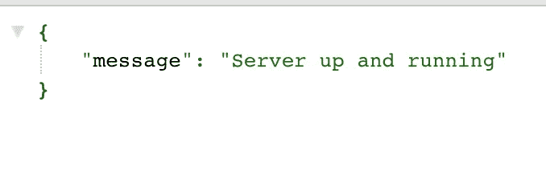

这意味着我们的服务器运行良好。

# 结论

按照上面的步骤，您可以实例化一个裸机 Ec2 实例，它将运行一个向外界公开的简单 express API。

在本系列的下一篇文章中，我们将学习如何为我们的 API 设置一个反向代理，从而使它更加高效、安全和可扩展。