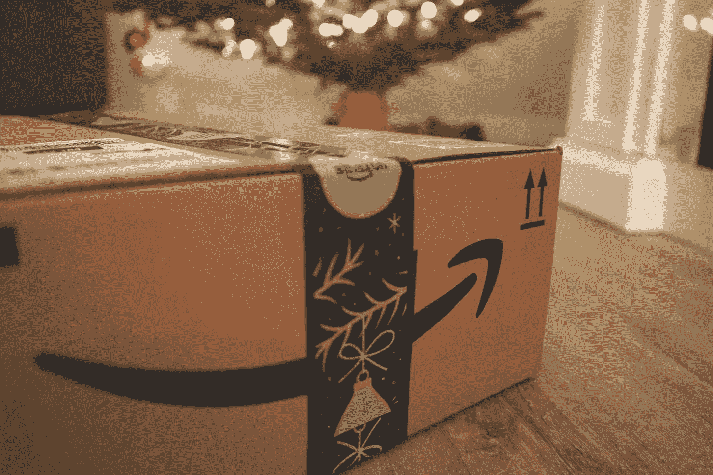
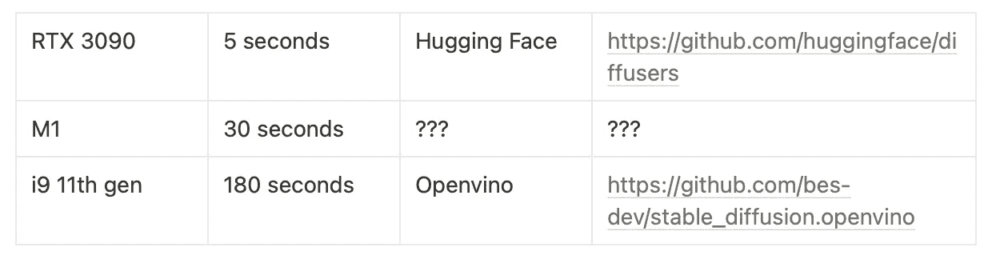
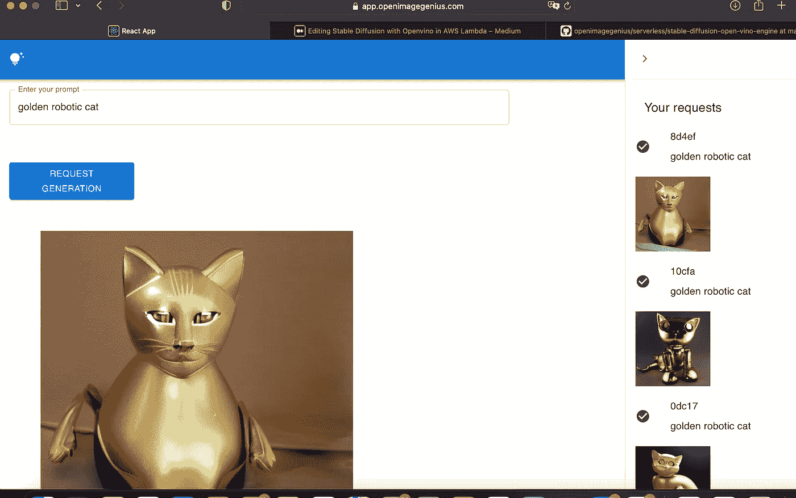
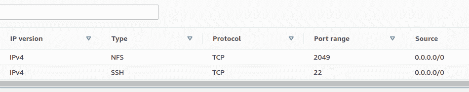
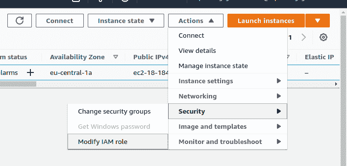
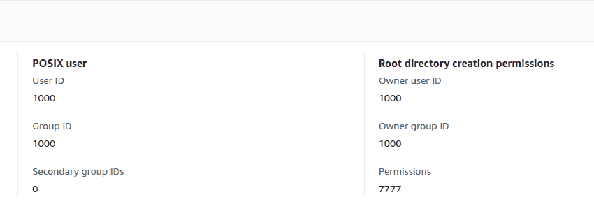
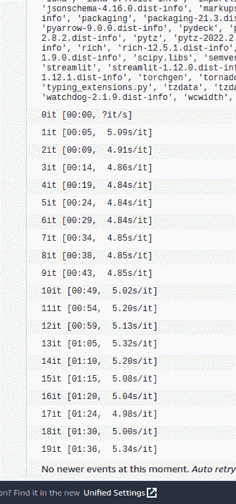
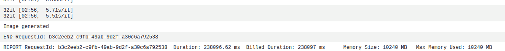

# 在 AWS Lambda 中部署预训练的稳定扩散模型

> 原文：<https://betterprogramming.pub/deploying-a-pre-trained-stable-diffusion-model-in-aws-lambda-4a9799cb7113>

## 部署人工智能生成器模型的设置指南



[Unsplash](https://unsplash.com?utm_source=medium&utm_medium=referral) 上[邪恶星期一](https://unsplash.com/@wickedmonday?utm_source=medium&utm_medium=referral)的照片

在本文中，我将描述如何在 AWS Lambda 上部署一个稳定的扩散(神经网络)模型，使用一个预训练的模型作为基础，特别是一个预先具有权重和推理代码的模型。

基础代码使用 [Openvino](https://www.intel.com/content/www/us/en/developer/tools/openvino-toolkit/overview.html) 来产生一个高度 CPU 优化版本的稳定扩散。

这个框架对于 Edge 和物联网用例特别有用，但在这里，我们将使用完全不同的东西——我们将部署一个真正大的模型(大约 3 GB，并在 AWS Lambda 上成功执行)。

我不会教任何关于 openvino 的东西，因为我对它不熟悉。事实上，我几乎只是使用了一个开源库作为基础。

相反，我将集中精力把它部署在 AWS Lambda 上。

所描述的方法应该不管底层框架(拥抱脸、PyTorch 等)如何都可以工作。)，所以如果您想在一个无服务器的 HTTP 端点上执行推理，了解它是非常有用的。

这个小故事分为:

1.  简要背景
2.  在 AWS Lambda 上部署它的分步指南
3.  我犯的愚蠢的错误

# 关于稳定扩散的一些背景

但是在我们开始之前，先了解一下我们正在做的事情的背景。你可能听说过人工智能生成的图像及其最近的稳定扩散热潮。如果没有，如果你对这个话题感兴趣，你可能会想看看《拥抱脸》关于这个话题的精彩博客:[https://huggingface.co/blog/stable_diffusion](https://huggingface.co/blog/stable_diffusion)。

这是我用稳定扩散生成的一只太空猫的样本图片:


执行这个神经网络来生成图像需要大量的 GPU 能力，尽管该模型正在随着时间的推移而优化，并且随着时间的推移，对于任何拥有现代台式机或笔记本电脑的最终用户来说，应该变得更容易使用。

因为稳定扩散模型是开源的，不同的人也一直致力于提供优化的替代方案:为 MacBook M1 芯片优化它，为英特尔芯片优化它，等等。

通常，所需的时间在很大程度上取决于实际的硬件。我针对不同类型的处理器提取了以下计算近似值(使用 RTX 3090 和 i9 在本地进行了测试，并且只在网上阅读了 M1 的相关资料):



如您所见，当在`i9`上执行时，Openvino 解决方案与其他解决方案相比慢得令人痛苦。

另一种方法是使用由 HuggingFace 提供的 ONNX 版本(在用`onnx simplifier`(【https://github.com/daquexian/onnx-simplifier】)对其进行优化后，它具有相似的计算时间)。

**注**:简化器需要大约 27GB 内存来简化这个模型。我怀疑如果我使用 ONNX 版本，最终的结果会是相似的。

尽管 CPU 推理很慢，但有趣的是它可以在 AWS Lambda 中执行，这意味着它可以用于免费试用/演示，因为有大量的 AWS Lambda 免费层。我正在构建类似的东西，例如，我在[https://app.openimagegenius.com](https://app.openimagegenius.com/)下发布的免费玩具产品。

如果你想尝试一下，一定要有耐心，等待五分钟图像生成。Lambda 只使用了 12 个推理步骤来加速(一旦 Lambda 变热，大约需要 60 秒的执行时间)。



为我 5 岁的儿子制造金色的机器猫

这个例子的源代码可以在这里找到。你可以随意使用它，不需要征得我的同意(这是麻省理工学院的许可)。请记住模特的执照。

[https://github . com/paolorechia/open image genius/tree/main/server less/stable-diffusion-open-vino-engine](https://github.com/paolorechia/openimagegenius/tree/main/serverless/stable-diffusion-open-vino-engine)

聊够了。让我们开始解决问题吧。

# 无服务器胶水

(工作版本:基于容器的 Lambda 和 EFS🎉)

# 手动部分

不幸的是，这里有许多手动步骤。虽然可以自动完成其中的大部分工作，但我认为投入这么多时间是没有意义的。精通造云或地形的人可能会自动完成这些步骤中的大部分(如果不是全部)。

如果你试图遵循这些步骤，却遇到了困难，不要犹豫，请联系我，我很乐意帮助你。

## **让我们从 VPC 和 EC2 开始**

1.  创建一个 VPC 或使用默认的。哪种方式都可以。
2.  创建一个连接到此 VPC 的 EC2 实例，并最好将其部署到公共子网。您需要通过 SSH 连接到实例，当您使用公共子网时，这要容易得多。
3.  创建新的安全子组或修改您使用的安全子组。您需要在入口打开端口 22 和 2049。



## **现在的 EFS**

1.  创建 EFS。确保它在 EC2 实例设置的相同子网中可用，并使用您定义的相同安全组。
2.  SSH 到您的 EC2 实例。
3.  遵循 AWS 指南，了解如何在 EC2:[https://docs.aws.amazon.com/efs/latest/ug/wt1-test.html](https://docs.aws.amazon.com/efs/latest/ug/wt1-test.html)中安装 EFS
4.  总之，您执行以下命令(使用从 AWS 控制台/ CLI 提取的实际装载文件夹和装载目标 DNS(您可以在 EFS 文件系统 UI 屏幕中找到 DNS ),适当地修改参数)
5.  `mkdir mnt-folder`
6.  `sudo mount -t nfs -o nfsvers=4.1,rsize=1048576,wsize=1048576,hard,timeo=600,retrans=2,noresvport mount-target-DNS:/ ~/mnt-folder`
7.  将 openvino 模型文件保存到 EFS。在我的例子中，我使用这段代码([https://github . com/bes-dev/stable _ diffusion . open vino/blob/master/stable _ diffusion _ engine . py](https://github.com/bes-dev/stable_diffusion.openvino/blob/master/stable_diffusion_engine.py))手动下载了它们，并在之前将它们上传到了一个 S3 桶中。然后在我的 EC2 实例中，我从 S3 桶下载到 EFS

(**注意**:为此，您可能需要为您的 EC2 分配一个角色，如下面的屏幕截图所示。)



一旦您正确配置了角色，aws-cli 就应该工作了，例如，您可以执行像`aws3 sync s3://your-bucket`这样的命令。

## 然后为弹性文件系统创建一个访问点

为您配置的弹性文件系统创建一个 EFS 访问点。

这里需要注意几件事:

文件系统用户权限——如果它们太严格，当从 Lambda 访问 EFS 文件时，您将得到`PermissionError`。在我的例子中，这个 EFS 专用于这个 Lambda，所以我不关心粒度，只提供完全开放的访问(我稍后将在无服务器文件中做同样的事情):



此外，避免将`/` 分配到您为访问点定义的根目录路径，这可能会在挂载时导致问题。此外，请务必记下您选择的值。你需要在 Lambda 函数中使用它。我个人用过:`/mnt/fs`，在另一个指南中有描述。

好了，我们已经差不多完成了手动创建资源的工作。

# 无服务器框架

我从[https://medium . com/swlh/mount-your-AWS-EFS-volume-into-AWS-lambda-with-the-server less-framework-470 B1 c 6 B1 b 2](https://medium.com/swlh/mount-your-aws-efs-volume-into-aws-lambda-with-the-serverless-framework-470b1c6b1b2d)d 收集的关于 EFS 部分的无服务器模板的大部分繁重工作

这是完整的模板。您几乎必须替换自己的资源 id。

```
service: stable-diffusion-open-vino
frameworkVersion: "3"
provider:
  name: aws
  runtime: python3.8
  stage: ${opt:stage}
  region: eu-central-1
  memorySize: 10240
  iam:
    role:
      statements:
        - Effect: Allow
          Action:
            - "elasticfilesystem:*"
          Resource:
            - "arn:aws:elasticfilesystem:${aws:region}:${aws:accountId}:file-system/${self:custom.fileSystemId}"
            - "arn:aws:elasticfilesystem:${aws:region}:${aws:accountId}:access-point/${self:custom.efsAccessPoint}"
functions:
  textToImg:
    url: true
    image:
      name: appimage
    timeout: 300
    environment:
      MNT_DIR: ${self:custom.LocalMountPath}
    vpc:
      securityGroupIds:
        - ${self:custom.securityGroup}
      subnetIds:
        - ${self:custom.subnetsId.subnet0}
custom:
  efsAccessPoint: YOUR_ACCESS_POINT_ID
  fileSystemId: YOUR_FS_ID
  LocalMountPath: /mnt/fs
  subnetsId:
    subnet0: YOUR_SUBNET_ID
  securityGroup: YOUR_SECURITY_GROUP
resources:
  extensions:
    TextToImgLambdaFunction:
      Properties:
        FileSystemConfigs:
          - Arn: "arn:aws:elasticfilesystem:${self:provider.region}:${aws:accountId}:access-point/${self:custom.efsAccessPoint}"
            LocalMountPath: "${self:custom.LocalMountPath}"
```

值得一提的几个部分:

内存大小:默认情况下，你不能使用 10GB 的内存。您需要向 AWS 开一个票证来支持此用例。请注意，您不会找到此请求的具体案例。我请求增加 Lambda 存储，并解释说我需要更多内存。AWS 花了几天时间才接受它。

```
memorySize: 10240
```

函数 URL:这一行`url: true`允许一个公共 URL 调用您的函数，主要用于开发/调试目的。

## **码头工人集装箱建造模式**

```
provider:
	...
  ecr:
    images:
      appimage:
        path: ./...functions:
  textToImg:
    url: true
    image:
      name: appimage
    timeout: 300
```

无服务器框架在这里为您做了很多:仅这些块就将:

1.  创建私有 ECR 存储库
2.  使用本地 docker 文件来构建您的容器
3.  给图像加标签
4.  将其推送到私有 ECR 存储库
5.  创建一个 Lambda 函数，该函数使用刚刚创建的 docker 图像

话虽如此，还是要做好准备。与原生 AWS Lambda 相比，我们的构建/部署将花费相当多的时间。

下面是我用过的 Dockerfile 文件:

```
FROM python:3.9.9-bullseyeWORKDIR /srcRUN apt-get update && \\
    apt-get install -y \\
    libgl1 libglib2.0-0 \\
    g++ \\
    make \\
    cmake \\
    unzip \\
    libcurl4-openssl-devCOPY requirements.txt /src/

RUN pip3 install -r requirements.txt --target /src/
COPY handler.py stable_diffusion_engine.py /src/ENTRYPOINT [ "/usr/local/bin/python", "-m", "awslambdaric" ]
CMD [ "handler.handler" ]
```

它安装了 AWS Lambda 运行时接口和我们执行稳定扩散所需的依赖项(openvino 版本)。

同样，鸣谢归 openvino 解决方案的原作者所有:[https://github.com/bes-dev/stable_diffusion.openvino](https://github.com/bes-dev/stable_diffusion.openvino)。

在构建 docker 映像之前，您需要修改`stable_diffusion_engine`模块并获得 Lambda 处理程序。你可以从我的仓库中提取或者从上面的仓库中改编。

引擎所需的主要变化是关于如何加载模型:

```
 self.tokenizer = CLIPTokenizer.from_pretrained(
             "/mnt/fs/models/clip") (...)
        self._text_encoder = self.core.read_model(
            "/mnt/fs/models/text_encoder/text_encoder.xml") (...)
        self._unet = self.core.read_model(
	    "/mnt/fs/models/unet/unet.xml") (...)
        self._vae_decoder = self.core.read_model(
            "/mnt/fs/models/vae_decoder/vae_decoder.xml") (...)
        self._vae_encoder = self.core.read_model(
            "/mnt/fs/models/vae_encoder/vae_encoder.xml")
```

然后你可以在我的处理程序中使用这个模块(它只是改编自 https://github.com/bes-dev/stable_diffusion.openvino[的`demo.py`文件):](https://github.com/bes-dev/stable_diffusion.openvino)

```
# -- coding: utf-8 --`
print("Starting container code...")
from dataclasses import dataclass
import numpy as np
import cv2
from diffusers import LMSDiscreteScheduler, PNDMScheduler
from stable_diffusion_engine import StableDiffusionEngine
import json
import os
@dataclass
class StableDiffusionArguments:
    prompt: str
    num_inference_steps: int
    guidance_scale: float
    models_dir: str
    seed: int = None
    init_image: str = None
    beta_start: float = 0.00085
    beta_end: float = 0.012
    beta_schedule: str = "scaled_linear"
    model: str = "bes-dev/stable-diffusion-v1-4-openvino"
    mask: str = None
    strength: float = 0.5
    eta: float = 0.0
    tokenizer: str = "openai/clip-vit-large-patch14"
def run_sd(args: StableDiffusionArguments):
    if args.seed is not None:
        np.random.seed(args.seed)
    if args.init_image is None:
        scheduler = LMSDiscreteScheduler(
            beta_start=args.beta_start,
            beta_end=args.beta_end,
            beta_schedule=args.beta_schedule,
            tensor_format="np",
        )
    else:
        scheduler = PNDMScheduler(
            beta_start=args.beta_start,
            beta_end=args.beta_end,
            beta_schedule=args.beta_schedule,
            skip_prk_steps=True,
            tensor_format="np",
        )
    engine = StableDiffusionEngine(
        model=args.model, scheduler=scheduler, tokenizer=args.tokenizer, models_dir=args.models_dir
    )
    image = engine(
        prompt=args.prompt,
        init_image=None if args.init_image is None else cv2.imread(
            args.init_image),
        mask=None if args.mask is None else cv2.imread(args.mask, 0),
        strength=args.strength,
        num_inference_steps=args.num_inference_steps,
        guidance_scale=args.guidance_scale,
        eta=args.eta,
    )
    is_success, im_buf_arr = cv2.imencode(".jpg", image)
    if not is_success:
        raise ValueError("Failed to encode image as JPG")
    byte_im = im_buf_arr.tobytes()
    return byte_im
def handler(event, context, models_dir=None):
    print("Getting into handler, event: ", event)
    print("Working dir at handler...", )
    current_dir = os.getcwd()
    print(current_dir)
    print(os.listdir(current_dir))
    print("Listing root")
    print(os.listdir("/"))
    # Get args
    # randomizer params
    body = json.loads(event.get("body"))
    prompt = body["prompt"]
    seed = body.get("seed")
    num_inference_steps: int = int(body.get("num_inference_steps", 32))
    guidance_scale: float = float(body.get("guidance_scale", 7.5))
    args = StableDiffusionArguments(
        prompt=prompt,
        seed=seed,
        num_inference_steps=num_inference_steps,
        guidance_scale=guidance_scale,
        models_dir=models_dir
    )
    print("Parsed args:", args)
    image = run_sd(args)
    print("Image generated")
    body = json.dumps(
        {"message": "wow, no way", "image": image.decode("latin1")})
    return {"statusCode": 200, "body": body}
```

# 测试部署

当您完成部署时，无服务器框架应该会给您一个 URL，您可以这样调用它:

```
curl -X POST \\
https://your_lambda_url_id.lambda-url.eu-central-1.on.aws/ \\
-H 'content-type: application/json' \\
-d '{"prompt": "tree"}'
```

如果一切正常，您应该在云观察日志中看到它正在生成以下图像:



当我测试时，它在主循环中花了将近 3 分钟，执行完整的 Lambda 用了 238 秒(4 分钟)。



上面的卷曲会给你一个不可读的字符串，里面有一个编码成`latin1`的图像。如果你打算实际使用你的 Lambda，也许你会想要这样的东西(我用它来本地测试我的容器，替换 URL):

```
import requests
import json
headers = {"content-type": "application/json"}
url = "<http://localhost:9000/2015-03-31/functions/function/invocations>"
body = json.dumps({"prompt": "beautiful tree", "num_inference_steps": 1})
response = requests.post(url, json={"body": body}, headers=headers)
response.raise_for_status()
j = response.json()
body = json.loads(j["body"])
bytes_img = body["image"].encode("latin1")
with open("test_result.png", "w+b") as fp:
    fp.write(bytes_img)
```

唷！那是许多步骤！现在，您可以将您的稳定扩散模型部署到 AWS Lambda。我希望你喜欢阅读这个简短的教程。我会给你留下一些我尝试过的事情——但是没有成功——所以也许我可以说服你不要尝试它们。

# 错误的历史

你想知道我的反复试验有多糟糕吗？嗯，我不介意分享——失败就是学习。

# 第一次尝试:全 EFS，原生 AWS Lambda

所以，我曾多次阅读在 Lambda 上部署大型模型并使用 AWS 弹性文件系统。所以我这样做了。

我已经配置了一个常规的 AWS Lambda，并将其连接到一个 EFS。然而，当我执行代码时，我在导入`openvino`运行时:`libm.so.6 not found`时遇到了一个错误。

经过一番绞尽脑汁的研究，我了解到 AWS Lambda 运行在 Amazon Linux 上，我可能应该直接在 EC2 实例中构建我的库的依赖项。

除此之外，当我尝试这样做时，我发现【https://pypi.org/project/openvino/】`openvino`没有适用于亚马逊 Linux 的运行时版本 2022。啊哦，死胡同

# 第二次尝试:满容器模式

几天后，在与一个朋友讨论了与使用无服务器技术相比，我有多怀念使用 docker 之后，我突然想到:如果我使用 Docker 映像来部署 Lambda 会怎么样？

事实证明，容器图像大小限制是 10GB，这是相当大的限制([https://AWS . Amazon . com/blogs/AWS/new-for-AWS-lambda-container-image-support/](https://aws.amazon.com/blogs/aws/new-for-aws-lambda-container-image-support/))—这必须有效！

嗯，没那么快。当事情似乎接近工作的时候，我遇到了一些问题。

```
[ERROR] RuntimeError: Model file /src/models/unet/unet.xml cannot be opened!
Traceback (most recent call last):
  File "/src/handler.py", line 129, in handler
    image = run_sd(args)
  File "/src/handler.py", line 76, in run_sd
    engine = StableDiffusionEngine(
  File "/src/stable_diffusion_engine.py", line 59, in __init__
    self._unet = self.core.read_model(unet_xml, unet_bin)
```

啊？我盯着这个错误看了几个小时，调试我的环境，确保文件可用，等等。根据 OpenVINO API 参考，因为`core.read_model`也可以直接接受二进制数据，所以我稍微修改了一下代码，并尝试提前将模型加载到二进制缓冲区的字典中。

```
models = {}
for model in ["text_encoder", "unet", "vae_decoder", "vae_encoder"]:
    with open(f"./models/{model}/{model}.xml", "r+b") as fp:
        models[f"{model}-xml"] = fp.read()
    with open(f"./models/{model}/{model}.bin", "r+b") as fp:
        models[f"{model}-bin"] = fp.read()
```

除此之外，我仍然会遇到错误，但这次它们更有意义。

```
[ERROR] OSError: [Errno 30] Read-only file system: './models/text_encoder/text_encoder.xml'
Traceback (most recent call last):
  File "/usr/local/lib/python3.9/importlib/__init__.py", line 127, in import_module
    return _bootstrap._gcd_import(name[level:], package, level)
  File "<frozen importlib._bootstrap>", line 1030, in _gcd_import
  File "<frozen importlib._bootstrap>", line 1007, in _find_and_load
  File "<frozen importlib._bootstrap>", line 986, in _find_and_load_unlocked
  File "<frozen importlib._bootstrap>", line 680, in _load_unlocked
  File "<frozen importlib._bootstrap_external>", line 850, in exec_module
  File "<frozen importlib._bootstrap>", line 228, in _call_with_frames_removed
  File "/src/handler.py", line 23, in <module>
    from stable_diffusion_engine import StableDiffusionEngine
  File "/src/stable_diffusion_engine.py", line 30, in <module>
    with open(f"./models/{model}/{model}.xml", "r+b") as fp:
```

我仔细检查了 Python 文档，意识到`r+b`实际上意味着“开放更新(读写)”可能文件系统是只读的。让我们不用它再试一次，只用`rb`代替:

```
[ERROR] PermissionError: [Errno 13] Permission denied: './models/text_encoder/text_encoder.xml'
Traceback (most recent call last):
  File "/usr/local/lib/python3.9/importlib/__init__.py", line 127, in import_module
    return _bootstrap._gcd_import(name[level:], package, level)
  File "<frozen importlib._bootstrap>", line 1030, in _gcd_import
  File "<frozen importlib._bootstrap>", line 1007, in _find_and_load
  File "<frozen importlib._bootstrap>", line 986, in _find_and_load_unlocked
  File "<frozen importlib._bootstrap>", line 680, in _load_unlocked
  File "<frozen importlib._bootstrap_external>", line 850, in exec_module
  File "<frozen importlib._bootstrap>", line 228, in _call_with_frames_removed
  File "/src/handler.py", line 23, in <module>
    from stable_diffusion_engine import StableDiffusionEngine
  File "/src/stable_diffusion_engine.py", line 30, in <module>
    with open(f"./models/{model}/{model}.xml", "rb") as fp:
```

好吧，也许我需要先把文件复制到`/tmp`？不，那只是给了我同样的错误。我搞不懂它——同样的代码在本地工作得很好，我甚至用 [Lambda 运行时接口仿真器](https://github.com/aws/aws-lambda-runtime-interface-emulator)测试了它。一定是环境的原因。

出于安全原因，AWS 阻止从容器映像文件路径进行二进制读取。我一直不知道为什么。切换到混合方法，模型存储在 EFS，代码依赖/库存储在 Docker 镜像中，工作顺利。

好了，今天就到这里吧！

我希望你喜欢读它。干杯！